

# 🖼️ Gallery

**Every workflow's canvas, 44 in total.** Click one to open its lesson.

<table>
<tr>
<td width="50%" align="center" valign="top"> <b>L01</b> · Hello n8n — your first workflow</td>
<td width="50%" align="center" valign="top"><a href="workflows/L02-daily-weather-email/README.md">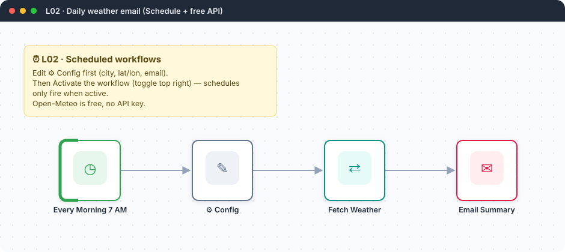</a> <b>L02</b> · Daily weather email</td>
</tr>
<tr>
<td width="50%" align="center" valign="top"><a href="workflows/L03-job-search-api/README.md">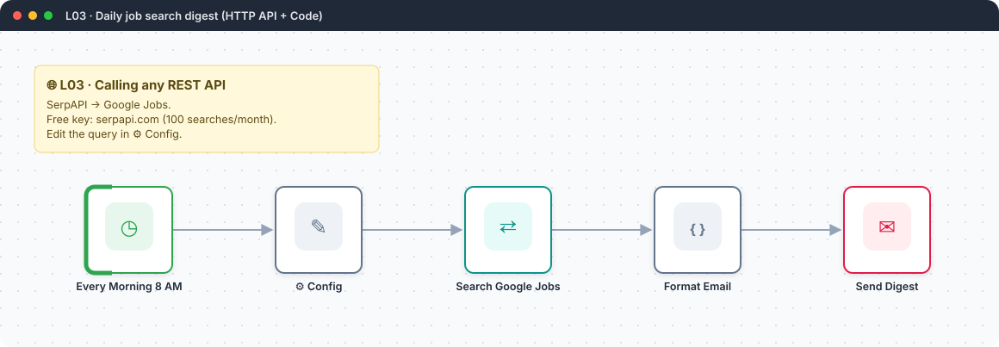</a> <b>L03</b> · Daily job search digest</td>
<td width="50%" align="center" valign="top"> <b>L04</b> · Currency rate alert</td>
</tr>
<tr>
<td width="50%" align="center" valign="top"> <b>L05</b> · Tech news digest with the Code node</td>
<td width="50%" align="center" valign="top"> <b>L06</b> · Gmail PDF attachments → Google Drive</td>
</tr>
<tr>
<td width="50%" align="center" valign="top"> <b>L07</b> · Lead capture form → Sheets → welcome email</td>
<td width="50%" align="center" valign="top"><a href="workflows/L08-jira-stale-stories/README.md">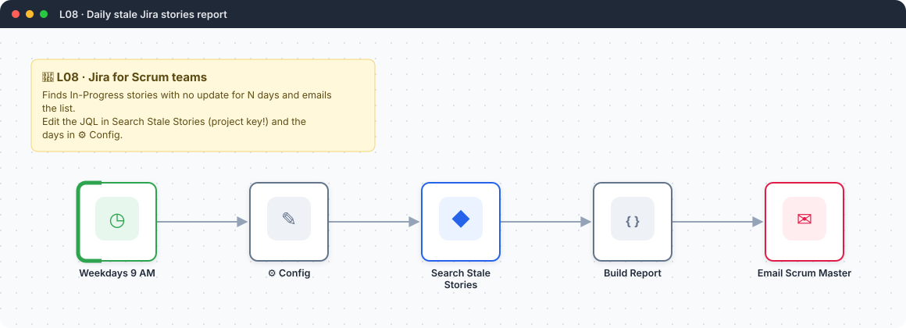</a> <b>L08</b> · Daily stale Jira stories report</td>
</tr>
<tr>
<td width="50%" align="center" valign="top"> <b>L09</b> · Expense logger API with Webhook</td>
<td width="50%" align="center" valign="top"> <b>L10</b> · Bug report form → Jira issue</td>
</tr>
<tr>
<td width="50%" align="center" valign="top"> <b>L11</b> · AI news briefing with a Basic LLM Chain</td>
<td width="50%" align="center" valign="top"><a href="workflows/L12-meeting-transcript-raid-log/README.md">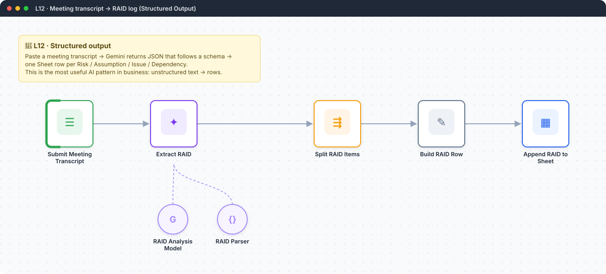</a> <b>L12</b> · Meeting transcript → RAID log</td>
</tr>
<tr>
<td width="50%" align="center" valign="top"> <b>L13</b> · HR policy chatbot with RAG</td>
<td width="50%" align="center" valign="top"> <b>L14</b> · Personal assistant agent with tools</td>
</tr>
<tr>
<td width="50%" align="center" valign="top"> <b>L15</b> · Retrospective → AI action items → human approval → Jira</td>
<td width="50%" align="center" valign="top"> <b>L16</b> · Sprint progress report with 4 cooperating agents</td>
</tr>
<tr>
<td width="50%" align="center" valign="top"> <b>L17</b> · Customer complaint handler (5 agents)</td>
<td width="50%" align="center" valign="top"> <b>L18</b> · Resume ↔ job fit analyser</td>
</tr>
<tr>
<td width="50%" align="center" valign="top"> <b>L19</b> · Global error handler</td>
<td width="50%" align="center" valign="top"> <b>L20</b> · Sub-workflows: reusable building blocks</td>
</tr>
<tr>
<td width="50%" align="center" valign="top"> <b>L21</b> · Website & API uptime monitor</td>
<td width="50%" align="center" valign="top"> <b>L22</b> · AI lead qualifier & router (capstone)</td>
</tr>
<tr>
<td width="50%" align="center" valign="top"><a href="workflows/Q01-daily-agenda-calendar/README.md">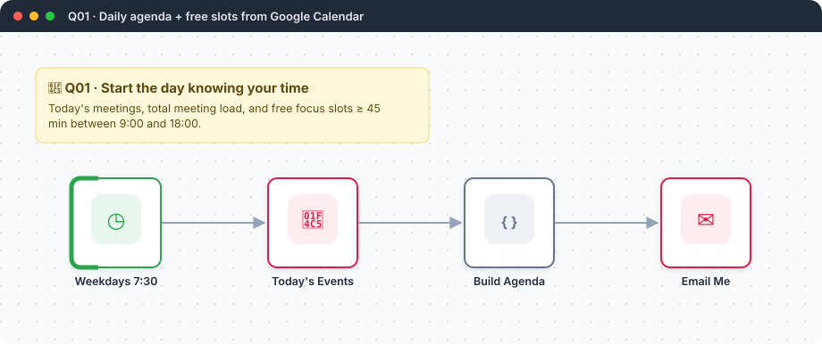</a> <b>Q01</b> · Daily agenda + free focus slots</td>
<td width="50%" align="center" valign="top"><a href="workflows/Q02-price-drop-tracker/README.md">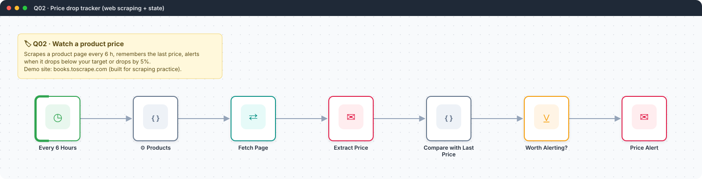</a> <b>Q02</b> · Price drop tracker</td>
</tr>
<tr>
<td width="50%" align="center" valign="top"><a href="workflows/Q03-telegram-capture-bot/README.md">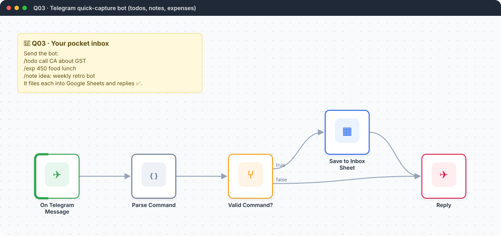</a> <b>Q03</b> · Telegram quick-capture bot</td>
<td width="50%" align="center" valign="top"> <b>Q04</b> · Stale pull-request reminder</td>
</tr>
<tr>
<td width="50%" align="center" valign="top"><a href="workflows/Q05-weekly-kpi-chart-email/README.md">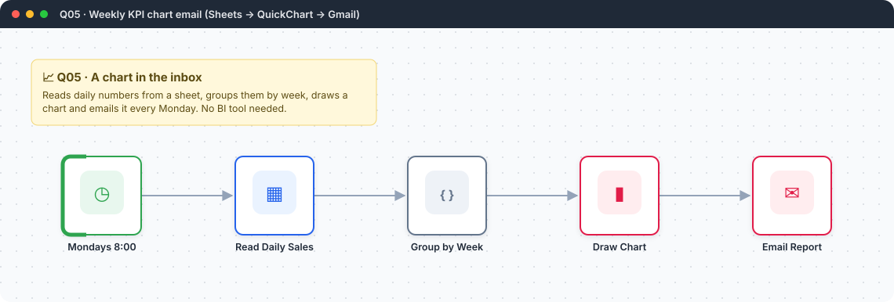</a> <b>Q05</b> · Weekly KPI chart email</td>
<td width="50%" align="center" valign="top"> <b>Q06</b> · Invoice due & overdue reminders</td>
</tr>
<tr>
<td width="50%" align="center" valign="top"> <b>Q07</b> · Gmail AI auto-labeler</td>
<td width="50%" align="center" valign="top"> <b>Q08</b> · RSS → Telegram channel with dedupe across runs</td>
</tr>
<tr>
<td width="50%" align="center" valign="top"> <b>P01</b> · Accounts-payable invoice pipeline</td>
<td width="50%" align="center" valign="top"> <b>P02</b> · Support inbox copilot</td>
</tr>
<tr>
<td width="50%" align="center" valign="top"> <b>P03</b> · Incident response orchestrator</td>
<td width="50%" align="center" valign="top"><a href="workflows/P04-sales-followup-sequence/README.md">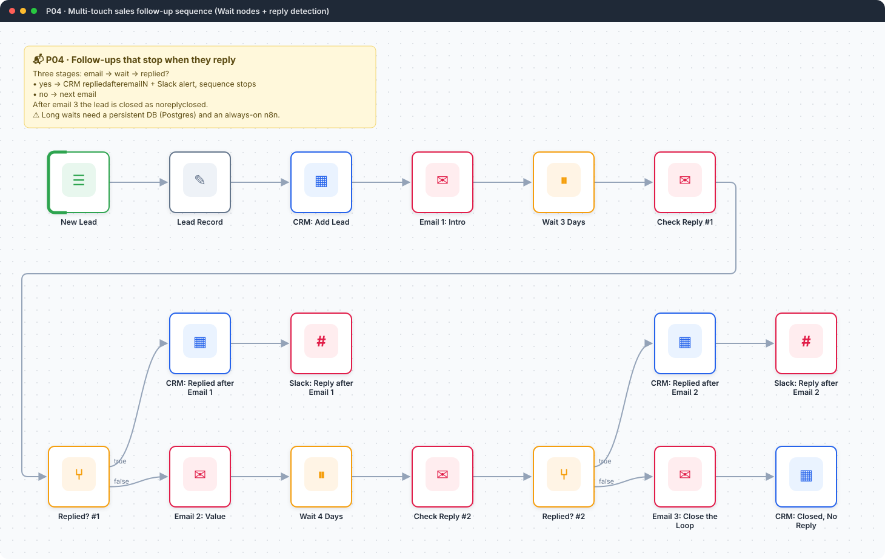</a> <b>P04</b> · Multi-touch sales follow-up sequence</td>
</tr>
<tr>
<td width="50%" align="center" valign="top"> <b>P05</b> · Bulk AI enrichment with batches and checkpoints</td>
<td width="50%" align="center" valign="top"><a href="workflows/P06-purchase-approval-multilevel/README.md">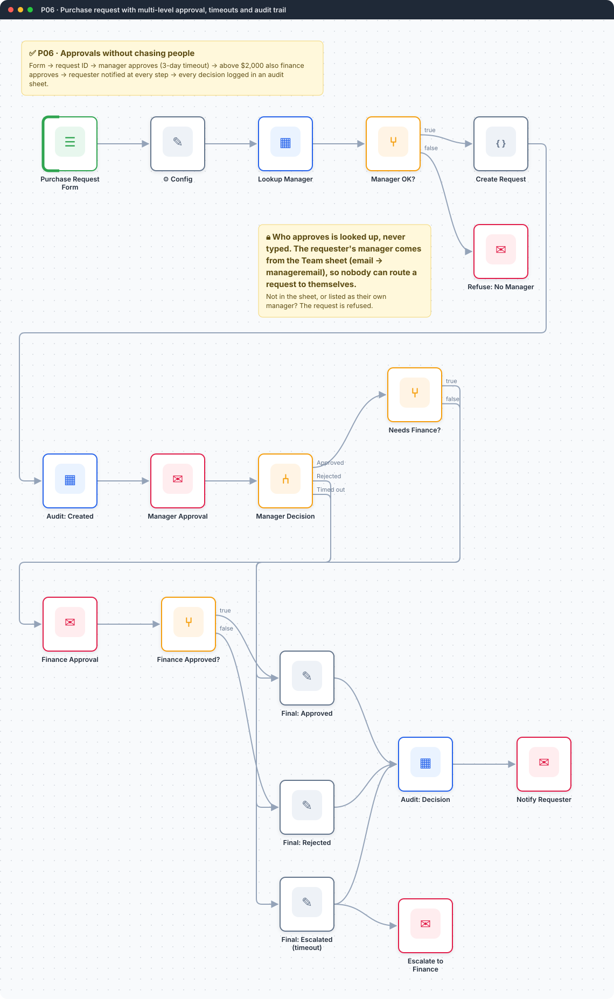</a> <b>P06</b> · Purchase request with multi-level approval</td>
</tr>
<tr>
<td width="50%" align="center" valign="top"><a href="workflows/P07-employee-onboarding-orchestrator/README.md">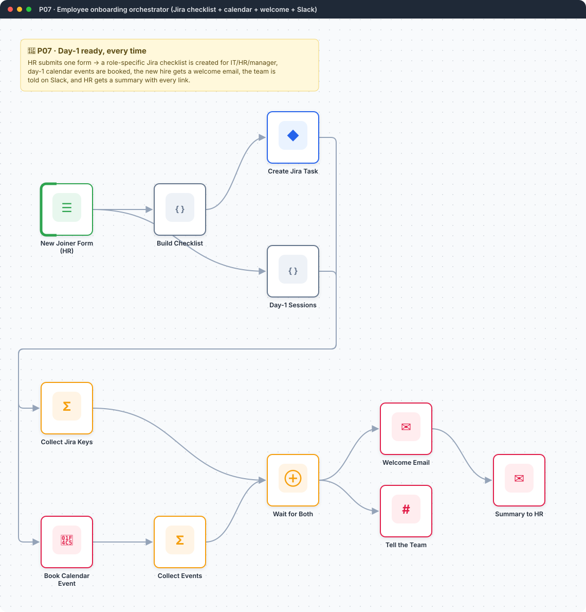</a> <b>P07</b> · Employee onboarding orchestrator</td>
<td width="50%" align="center" valign="top"><a href="workflows/P08-sheets-jira-sync-hashing/README.md">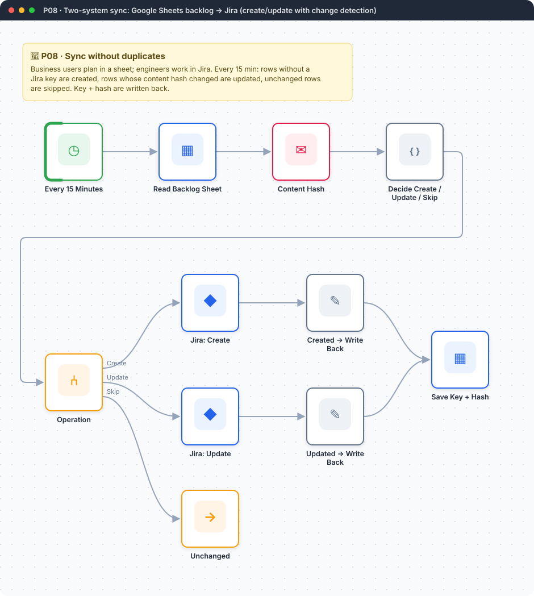</a> <b>P08</b> · Sheets → Jira sync with change detection</td>
</tr>
<tr>
<td width="50%" align="center" valign="top"><a href="workflows/P09-deep-research-agent/README.md">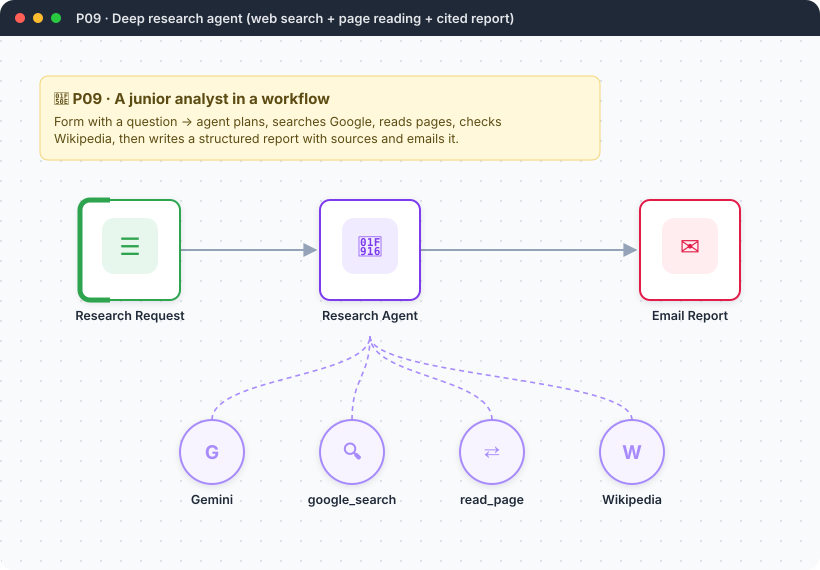</a> <b>P09</b> · Deep research agent</td>
<td width="50%" align="center" valign="top"> <b>P10</b> · MCP server for company tools</td>
</tr>
<tr>
<td width="50%" align="center" valign="top"><a href="workflows/P11-pii-safe-ai-gateway/README.md">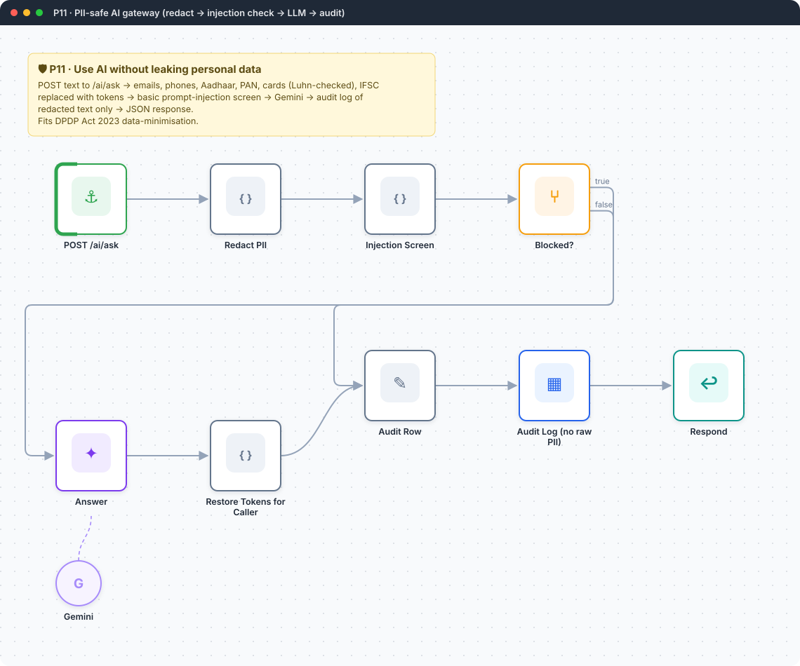</a> <b>P11</b> · PII-safe AI gateway</td>
<td width="50%" align="center" valign="top"><a href="workflows/P12-weekly-exec-kpi-report/README.md">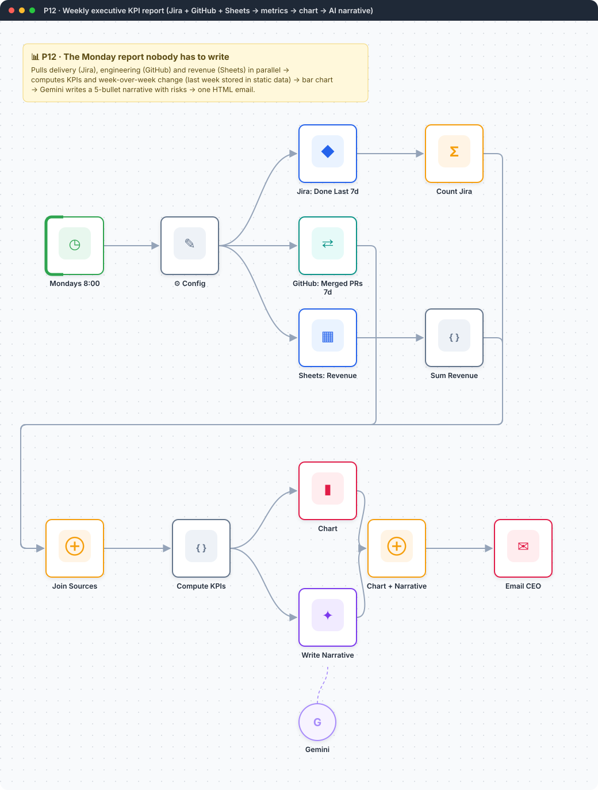</a> <b>P12</b> · Weekly executive KPI report</td>
</tr>
<tr>
<td width="50%" align="center" valign="top"><a href="workflows/X01-debug-order-report/README.md">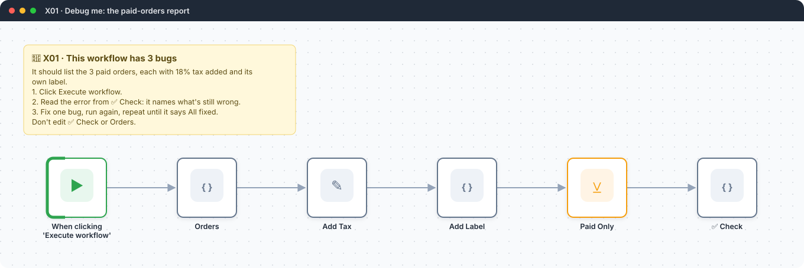</a> <b>X01</b> · Debug me: the paid-orders report</td>
<td width="50%" align="center" valign="top"><a href="workflows/X02-debug-top-leads/README.md">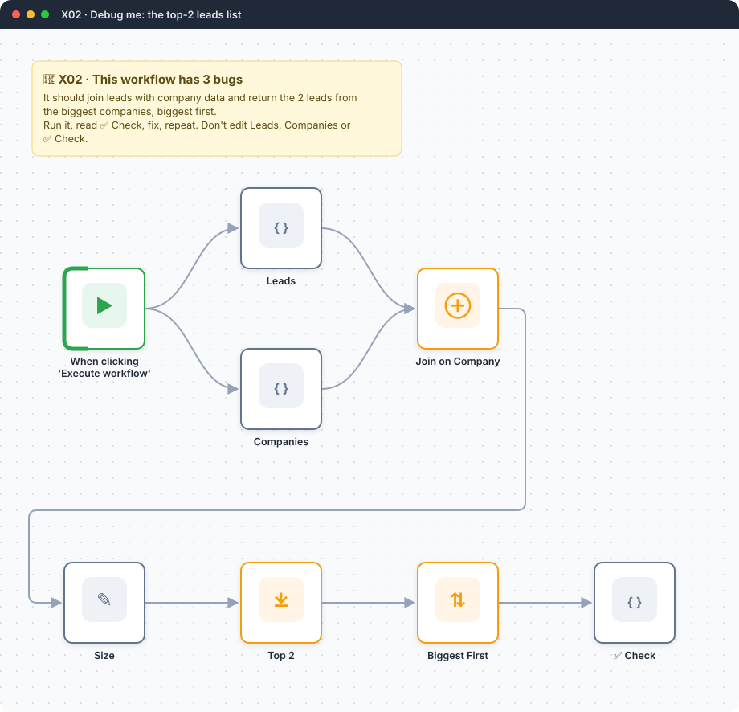</a> <b>X02</b> · Debug me: the top-2 leads list</td>
</tr>
</table>

<a href="README.md">← Back to the learning path</a>

