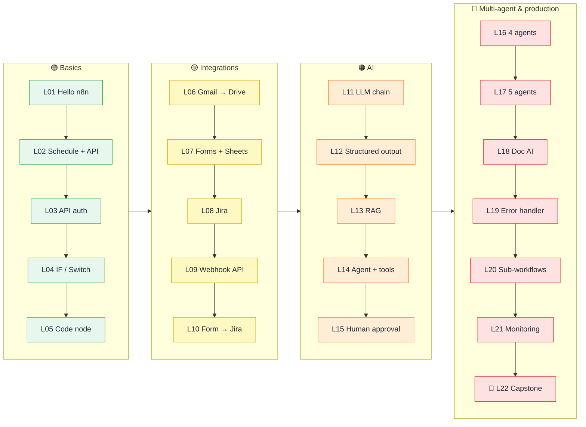

<div align="center">


<br/>


**Learn n8n automation by building real workflows: one new concept at a time, from your first node to multi-agent AI.**

[🚀 Start](#-start-in-3-steps) · [🗺️ Learning path](#-the-learning-path) · [🖼️ Gallery](#-gallery) · [🏗️ Architecture](docs/architecture.md) · [🧯 Mistakes](docs/common-mistakes.md) · [🧪 Testing](docs/testing.md) · [🤝 Contribute](CONTRIBUTING.md)

</div>

---

## ✨ Why this repo

<table>
<tr>
<td width="33%" valign="top">

### 🪜 Structured path
4 levels, 22 lessons. Each adds **one or two concepts** on top of the last, so there's no guessing what to learn next.

</td>
<td width="33%" valign="top">

### 🏢 Real problems
Job alerts, RAID logs, retros, lead scoring, complaint handling, uptime monitoring: things people **actually automate at work**.

</td>
<td width="33%" valign="top">

### 🛡️ Production habits
Retries, guards, idempotency, human approval, a global error handler. You learn good habits from lesson 2.

</td>
</tr>
<tr>
<td valign="top">

### 📖 Build it yourself
Every lesson has step-by-step build instructions, a test checklist and troubleshooting, not just a JSON to import.

</td>
<td valign="top">

### 🆓 Free to run
Google Gemini free tier, free public APIs and free tiers of Google, Jira and GitHub. No credit card needed.

</td>
<td valign="top">

### ✅ Verified
Every workflow is checked against a real n8n install, and CI blocks credentials and personal data.

</td>
</tr>
</table>

---

## 🚀 Start in 3 steps

| | Step | Guide |
|:-:|---|---|
| **1** | Run n8n (Cloud trial, `npx n8n`, or Docker) | [getting-started.md](docs/getting-started.md) |
| **2** | Add credentials once: Gemini key, Google, Jira | [credentials.md](docs/credentials.md) |
| **3** | Open **L01** and work down the list | [L01 · Hello n8n](workflows/L01-hello-n8n/README.md) |

> [!TIP]
> **Importing:** open any `workflow.json` → *Raw* → copy → click an empty n8n canvas → `Ctrl/Cmd + V`.

---

## 🗺️ The learning path



<!-- LESSONS:START -->
### 🟢 Level 1 · Basics

| # | Lesson | Domain | Key concepts | Time |
|:-:|---|---|---|:-:|
| **L01** | [Hello n8n — your first workflow](workflows/L01-hello-n8n/README.md) | General | Manual Trigger · Set node | 10 min |
| **L02** | [Daily weather email](workflows/L02-daily-weather-email/README.md) | Personal productivity | Schedule Trigger and activating workflows · A Config node pattern | 15 min |
| **L03** | [Daily job search digest](workflows/L03-job-search-api/README.md) | Career / HR | HTTP Request with a predefined credential · Reading nested API JSON | 20 min |
| **L04** | [Currency rate alert](workflows/L04-currency-alert-switch/README.md) | Finance / personal | IF node · Switch node with named outputs plus a fallback | 20 min |
| **L05** | [Tech news digest with the Code node](workflows/L05-rss-news-code-node/README.md) | Learning / research | RSS Read node · Merge node with 3 inputs | 25 min |

### 🟡 Level 2 · Integrations

| # | Lesson | Domain | Key concepts | Time |
|:-:|---|---|---|:-:|
| **L06** | [Gmail PDF attachments → Google Drive](workflows/L06-gmail-pdf-to-drive/README.md) | Admin / finance | Gmail Trigger · Working with binary data | 20 min |
| **L07** | [Lead capture form → Sheets → welcome email](workflows/L07-lead-capture-sheets/README.md) | Sales / marketing | n8n Form Trigger · Cleaning input | 20 min |
| **L08** | [Daily stale Jira stories report](workflows/L08-jira-stale-stories/README.md) | Agile / Scrum | Jira Software node + JQL queries · Cron expression for weekdays only | 20 min |
| **L09** | [Expense logger API with Webhook](workflows/L09-webhook-expense-api/README.md) | Finance / developer | Webhook node · Respond to Webhook for custom status codes | 25 min |
| **L10** | [Bug report form → Jira issue](workflows/L10-form-bug-report-jira/README.md) | Agile / product support | Form fields with dropdowns and validation · Mapping business language to system values | 20 min |

### 🟠 Level 3 · AI

| # | Lesson | Domain | Key concepts | Time |
|:-:|---|---|---|:-:|
| **L11** | [AI news briefing with a Basic LLM Chain](workflows/L11-ai-news-digest-llm-chain/README.md) | Learning / research | Basic LLM Chain node · Connecting a Chat Model sub-node | 20 min |
| **L12** | [Meeting transcript → RAID log](workflows/L12-meeting-transcript-raid-log/README.md) | Project management | Structured Output Parser · hasOutputParser on the LLM Chain | 30 min |
| **L13** | [HR policy chatbot with RAG](workflows/L13-rag-policy-chatbot/README.md) | HR / internal support | The RAG idea · Embeddings with Gemini | 35 min |
| **L14** | [Personal assistant agent with tools](workflows/L14-ai-agent-with-tools/README.md) | Personal productivity | AI Agent node · Built-in tools | 30 min |
| **L15** | [Retrospective → AI action items → human approval → Jira](workflows/L15-retro-ai-approval-jira/README.md) | Agile / Scrum | Send and Wait for Response · Wait time limits | 35 min |

### 🔴 Level 4 · Multi-agent & production

| # | Lesson | Domain | Key concepts | Time |
|:-:|---|---|---|:-:|
| **L16** | [Sprint progress report with 4 cooperating agents](workflows/L16-sprint-report-multi-agent/README.md) | Agile / engineering management | GitHub GraphQL API via HTTP Request · Computing metrics in code before the LLM sees them | 45 min |
| **L17** | [Customer complaint handler (5 agents)](workflows/L17-complaint-handler-multi-agent/README.md) | Customer support | Chained agents, each with its own schema · Auto-fixing output parser | 45 min |
| **L18** | [Resume ↔ job fit analyser](workflows/L18-resume-job-fit-multi-agent/README.md) | Career / HR / recruiting | Extract From File · Specialist agents with narrow, focused prompts | 35 min |
| **L19** | [Global error handler](workflows/L19-global-error-handler/README.md) | Operations / reliability | Error Trigger and the Error workflow setting · Error payload | 20 min |
| **L20** | [Sub-workflows: reusable building blocks](workflows/L20-subworkflows-caller/README.md) <sub>+ [L20a](workflows/L20a-subworkflow-send-branded-email/README.md)</sub> | HR / team culture | Execute Workflow Trigger with typed inputs · Execute Workflow node | 30 min |
| **L21** | [Website & API uptime monitor](workflows/L21-website-uptime-monitor/README.md) | DevOps / IT | HTTP Request with Full Response + Never Error · Workflow static data | 30 min |
| **L22** | [AI lead qualifier & router (capstone)](workflows/L22-ai-lead-qualifier-router/README.md) | Sales | Combines everything · AI as a decision-maker with explicit, auditable reasons | 40 min |

<!-- LESSONS:END -->

---

## 🖼️ Gallery

<!-- GALLERY:START -->
<table>
<tr>
<td width="50%" align="center" valign="top"><a href="workflows/L01-hello-n8n/README.md"></a><br/><b>L01</b> · Hello n8n — your first workflow</td>
<td width="50%" align="center" valign="top"><a href="workflows/L02-daily-weather-email/README.md"></a><br/><b>L02</b> · Daily weather email</td>
</tr>
<tr>
<td width="50%" align="center" valign="top"><a href="workflows/L03-job-search-api/README.md"></a><br/><b>L03</b> · Daily job search digest</td>
<td width="50%" align="center" valign="top"><a href="workflows/L04-currency-alert-switch/README.md"></a><br/><b>L04</b> · Currency rate alert</td>
</tr>
<tr>
<td width="50%" align="center" valign="top"><a href="workflows/L05-rss-news-code-node/README.md"></a><br/><b>L05</b> · Tech news digest with the Code node</td>
<td width="50%" align="center" valign="top"><a href="workflows/L06-gmail-pdf-to-drive/README.md"></a><br/><b>L06</b> · Gmail PDF attachments → Google Drive</td>
</tr>
<tr>
<td width="50%" align="center" valign="top"><a href="workflows/L07-lead-capture-sheets/README.md"></a><br/><b>L07</b> · Lead capture form → Sheets → welcome email</td>
<td width="50%" align="center" valign="top"><a href="workflows/L08-jira-stale-stories/README.md"></a><br/><b>L08</b> · Daily stale Jira stories report</td>
</tr>
<tr>
<td width="50%" align="center" valign="top"><a href="workflows/L09-webhook-expense-api/README.md"></a><br/><b>L09</b> · Expense logger API with Webhook</td>
<td width="50%" align="center" valign="top"><a href="workflows/L10-form-bug-report-jira/README.md"></a><br/><b>L10</b> · Bug report form → Jira issue</td>
</tr>
<tr>
<td width="50%" align="center" valign="top"><a href="workflows/L11-ai-news-digest-llm-chain/README.md"></a><br/><b>L11</b> · AI news briefing with a Basic LLM Chain</td>
<td width="50%" align="center" valign="top"><a href="workflows/L12-meeting-transcript-raid-log/README.md"></a><br/><b>L12</b> · Meeting transcript → RAID log</td>
</tr>
<tr>
<td width="50%" align="center" valign="top"><a href="workflows/L13-rag-policy-chatbot/README.md"></a><br/><b>L13</b> · HR policy chatbot with RAG</td>
<td width="50%" align="center" valign="top"><a href="workflows/L14-ai-agent-with-tools/README.md"></a><br/><b>L14</b> · Personal assistant agent with tools</td>
</tr>
<tr>
<td width="50%" align="center" valign="top"><a href="workflows/L15-retro-ai-approval-jira/README.md"></a><br/><b>L15</b> · Retrospective → AI action items → human approval → Jira</td>
<td width="50%" align="center" valign="top"><a href="workflows/L16-sprint-report-multi-agent/README.md"></a><br/><b>L16</b> · Sprint progress report with 4 cooperating agents</td>
</tr>
<tr>
<td width="50%" align="center" valign="top"><a href="workflows/L17-complaint-handler-multi-agent/README.md"></a><br/><b>L17</b> · Customer complaint handler (5 agents)</td>
<td width="50%" align="center" valign="top"><a href="workflows/L18-resume-job-fit-multi-agent/README.md"></a><br/><b>L18</b> · Resume ↔ job fit analyser</td>
</tr>
<tr>
<td width="50%" align="center" valign="top"><a href="workflows/L19-global-error-handler/README.md"></a><br/><b>L19</b> · Global error handler</td>
<td width="50%" align="center" valign="top"><a href="workflows/L20-subworkflows-caller/README.md"></a><br/><b>L20</b> · Sub-workflows: reusable building blocks</td>
</tr>
<tr>
<td width="50%" align="center" valign="top"><a href="workflows/L21-website-uptime-monitor/README.md"></a><br/><b>L21</b> · Website & API uptime monitor</td>
<td width="50%" align="center" valign="top"><a href="workflows/L22-ai-lead-qualifier-router/README.md"></a><br/><b>L22</b> · AI lead qualifier & router (capstone)</td>
</tr>
</table>
<!-- GALLERY:END -->

---

## 🆚 How this compares

| | Template collections<br/><sub>(280 to 4,000 JSONs)</sub> | Video courses | **n8n Knowledge** |
|---|:-:|:-:|:-:|
| Order to learn in | ❌ | ✅ | ✅ 4 levels |
| Explains *why* | ❌ | ✅ in video | ✅ written + on canvas |
| Build-it-yourself steps | ❌ | ✅ | ✅ |
| Architecture diagram per workflow | ❌ | ❌ | ✅ |
| Test data + test checklist | ❌ | sometimes | ✅ |
| Troubleshooting per workflow | ❌ | ❌ | ✅ |
| Production practices | rarely | rarely | ✅ |
| Verified against real n8n | ❌ | n/a | ✅ |

If you want *any* template for a niche app, the big collections are great. This repo is for **learning to design workflows yourself**.

---

## 📚 Docs

| | |
|---|---|
| 🚀 [Getting started](docs/getting-started.md) | Install, import, the 5 core ideas |
| 🔑 [Credentials](docs/credentials.md) | Gemini, Google, Jira, SerpAPI, GitHub |
| 🏗️ [Architecture](docs/architecture.md) | Platform, AI blocks, RAG, multi-agent, reliability, deployment |
| 🧬 [Workflow anatomy](docs/workflow-anatomy.md) | Every property inside a workflow.json, plus an expressions cheat sheet |
| 🧯 [Common mistakes](docs/common-mistakes.md) | 40+ mistakes with fixes, a debugging flowchart and a pre-flight checklist |
| 🧪 [Testing](docs/testing.md) | Test in the editor, validate, check against real n8n |
| 🧾 [Sample data](docs/sample-data.md) | Made-up inputs for every AI lesson |

<details>
<summary><b>📁 Repo layout</b></summary>

```
workflows/Lxx-name/
  workflow.json   import into n8n
  canvas.svg      snapshot (generated)
  README.md       problem · architecture · placeholders · build steps · node reference · tests · troubleshooting
docs/             guides
assets/           images
tools/            build.py · render.py · validate.py · check-nodes.js
```
</details>

---

<div align="center">

**Found it useful? ⭐ Star the repo so others can find it.**

[Contribute a workflow](CONTRIBUTING.md) · [MIT License](LICENSE)

</div>
