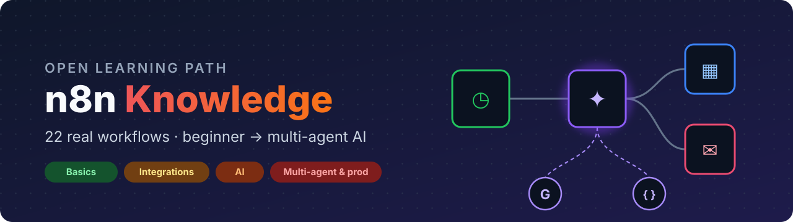
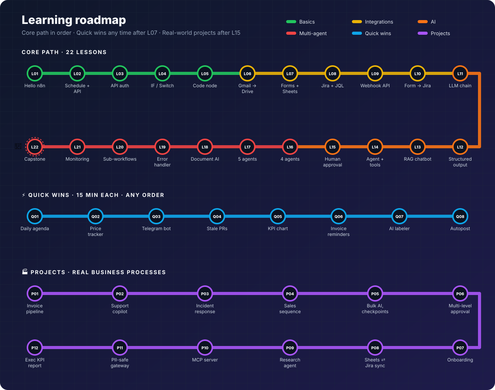

<div align="center">



<br/>


[](https://github.com/callme-siva/n8n-knowledge/actions/workflows/validate.yml)


**Learn n8n by building 42 workflows, from your first node to multi-agent AI: a 22-lesson core path, 8 quick wins and 12 real business processes. Each one comes with a guide, a canvas snapshot and a CI run.**

<sub>Examples use India defaults (INR, GSTIN, Asia/Kolkata). Change them in each ⚙️ Config node.</sub>

[🚀 Start](#-start-in-3-steps) · [🗺️ Learning path](#-the-learning-path) · [🖼️ Gallery](#-gallery) · [🏗️ Architecture](docs/architecture.md) · [🧯 Mistakes](docs/common-mistakes.md) · [🧪 Testing](docs/testing.md) · [🤝 Contribute](CONTRIBUTING.md)

**No n8n yet?** → **[Start a free n8n Cloud trial](https://app.n8n.cloud/register)** (no card, 14 days) or run `npx n8n` locally — either way, [L01](workflows/L01-hello-n8n/README.md) takes 10 minutes. Don't wait to have it all figured out; open L01 and go.

</div>

---

## ✨ Why this repo

<table>
<tr>
<td width="33%" valign="top">

### 🪜 Three tracks
A **22-lesson core path** (one new concept at a time), **8 quick wins** you can use today, and **12 real-world projects** for production.

</td>
<td width="33%" valign="top">

### 🏢 Real problems
Invoice processing, support copilots, incident response, approvals, onboarding, data sync, MCP servers, PII-safe AI: what companies **actually automate**.

</td>
<td width="33%" valign="top">

### 🛡️ Built to fail safely
Config nodes, retries on every external call, empty-result guards, human approval and an error workflow (L19). The projects add idempotency, checkpoints and audit logs.

</td>
</tr>
<tr>
<td valign="top">

### 📖 Learn by doing
Every lesson: **concept first**, build steps, **84 practice challenges** with hints and solutions, a quiz, and ready-made sheet templates.

</td>
<td valign="top">

### 🆓 Free to learn
Runs on self-hosted n8n with the Gemini free tier, free public APIs and free tiers of Google, Jira and GitHub. 24/7 schedules need n8n Cloud (paid after the trial) or a small server.

</td>
<td valign="top">

### ✅ Executed in CI
Every push imports all 46 workflows into n8n 2.40.5 and **runs 45 of them** (P10 is an MCP server, so it's structure-checked). Logic, code, branching, loops and public APIs run for real; credentialed and AI nodes are replaced with fixtures. 95 behaviour checks across 43 workflows.

</td>
</tr>
</table>

---

## 🚀 Start in 3 steps

| | Step | Guide |
|:-:|---|---|
| **1** | Run n8n: [free Cloud trial](https://app.n8n.cloud/register) (no install), `npx n8n`, or Docker | [getting-started.md](docs/getting-started.md) |
| **2** | Add credentials once: Gemini key, Google, Jira | [credentials.md](docs/credentials.md) |
| **3** | Open **L01** and work down the list | [L01 · Hello n8n](workflows/L01-hello-n8n/README.md) |

> [!TIP]
> **Importing:** open any `workflow.json` → *Raw* → copy → click an empty n8n canvas → `Ctrl/Cmd + V`.

---

## 🗺️ The learning path

<p align="center"></p>

> [!TIP]
> **New to n8n?** Follow the core path in order. **Know the basics?** Pick any ⚡ quick win. **Building for a company?** Go to the 🏭 real-world projects. Each one models a real business process: approvals, checkpoints, dedupe and audit logs. Read its credentials and troubleshooting sections before running it for real. **After L05 and L07**, try the 🐞 debug challenges: broken workflows you fix until their ✅ Check node passes.

<!-- LESSONS:START -->
### 🟢 Level 1 · Basics

| # | Lesson | Domain | Key concepts | Time |
|:-:|---|---|---|:-:|
| **L01** | [Hello n8n — your first workflow](workflows/L01-hello-n8n/README.md) | General | Manual Trigger · Set node | 10 min |
| **L02** | [Daily weather email](workflows/L02-daily-weather-email/README.md) | Personal productivity | Schedule Trigger and activating workflows · A Config node pattern | 15 min |
| **L03** | [Daily job search digest](workflows/L03-job-search-api/README.md) | Career / HR | HTTP Request with a predefined credential · Reading nested API JSON | 20 min |
| **L04** | [Currency rate alert](workflows/L04-currency-alert-switch/README.md) | Finance / personal | IF node · Switch node with named outputs plus a fallback | 20 min |
| **L05** | [Tech news digest with the Code node](workflows/L05-rss-news-code-node/README.md) | Learning / research | RSS Read node · Merge node with 3 inputs | 25 min |

### 🟡 Level 2 · Integrations

| # | Lesson | Domain | Key concepts | Time |
|:-:|---|---|---|:-:|
| **L06** | [Gmail PDF attachments → Google Drive](workflows/L06-gmail-pdf-to-drive/README.md) | Admin / finance | Gmail Trigger · Working with binary data | 20 min |
| **L07** | [Lead capture form → Sheets → welcome email](workflows/L07-lead-capture-sheets/README.md) | Sales / marketing | n8n Form Trigger · Cleaning input | 20 min |
| **L08** | [Daily stale Jira stories report](workflows/L08-jira-stale-stories/README.md) | Agile / Scrum | Jira Software node + JQL queries · Cron expression for weekdays only | 20 min |
| **L09** | [Expense logger API with Webhook](workflows/L09-webhook-expense-api/README.md) | Finance / developer | Webhook node · Header Auth | 25 min |
| **L10** | [Bug report form → Jira issue](workflows/L10-form-bug-report-jira/README.md) | Agile / product support | Form fields with dropdowns and validation · Mapping business language to system values | 20 min |

### 🟠 Level 3 · AI

| # | Lesson | Domain | Key concepts | Time |
|:-:|---|---|---|:-:|
| **L11** | [AI news briefing with a Basic LLM Chain](workflows/L11-ai-news-digest-llm-chain/README.md) | Learning / research | Basic LLM Chain node · Connecting a Chat Model sub-node | 20 min |
| **L12** | [Meeting transcript → RAID log](workflows/L12-meeting-transcript-raid-log/README.md) | Project management | Structured Output Parser · hasOutputParser on the LLM Chain | 30 min |
| **L13** | [HR policy chatbot with RAG](workflows/L13-rag-policy-chatbot/README.md) | HR / internal support | The RAG idea · Embeddings with Gemini | 35 min |
| **L14** | [Personal assistant agent with tools](workflows/L14-ai-agent-with-tools/README.md) | Personal productivity | AI Agent node · Built-in tools | 30 min |
| **L15** | [Retrospective → AI action items → human approval → Jira](workflows/L15-retro-ai-approval-jira/README.md) | Agile / Scrum | Send and Wait for Response · Wait time limits | 35 min |

### 🔴 Level 4 · Multi-agent & production

| # | Lesson | Domain | Key concepts | Time |
|:-:|---|---|---|:-:|
| **L16** | [Sprint progress report with 4 cooperating agents](workflows/L16-sprint-report-multi-agent/README.md) | Agile / engineering management | GitHub GraphQL API via HTTP Request · Computing metrics in code before the LLM sees them | 45 min |
| **L17** | [Customer complaint handler (5 agents)](workflows/L17-complaint-handler-multi-agent/README.md) | Customer support | Chained agents, each with its own schema · Auto-fixing output parser | 45 min |
| **L18** | [Resume ↔ job fit analyser](workflows/L18-resume-job-fit-multi-agent/README.md) | Career / HR / recruiting | Extract From File · Specialist agents with narrow, focused prompts | 35 min |
| **L19** | [Global error handler](workflows/L19-global-error-handler/README.md) | Operations / reliability | Error Trigger and the Error workflow setting · Error payload | 20 min |
| **L20** | [Sub-workflows: reusable building blocks](workflows/L20-subworkflows-caller/README.md) <sub>+ [L20a](workflows/L20a-subworkflow-send-branded-email/README.md)</sub> | HR / team culture | Execute Workflow Trigger with typed inputs · Execute Workflow node | 30 min |
| **L21** | [Website & API uptime monitor](workflows/L21-website-uptime-monitor/README.md) | DevOps / IT | HTTP Request with Full Response + Never Error · Workflow static data | 30 min |
| **L22** | [AI lead qualifier & router (capstone)](workflows/L22-ai-lead-qualifier-router/README.md) | Sales | Combines everything · AI as a decision-maker with explicit, auditable reasons | 40 min |

### ⚡ Quick wins: useful in 15 minutes

| # | Lesson | Domain | Key concepts | Time |
|:-:|---|---|---|:-:|
| **Q01** | [Daily agenda + free focus slots](workflows/Q01-daily-agenda-calendar/README.md) | Personal productivity | Google Calendar Get many events with a time window · $today and Luxon date maths | 15 min |
| **Q02** | [Price drop tracker](workflows/Q02-price-drop-tracker/README.md) | Shopping / e-commerce ops | HTTP Request returning raw HTML text · HTML node | 20 min |
| **Q03** | [Telegram quick-capture bot](workflows/Q03-telegram-capture-bot/README.md) | Personal productivity / finance | Telegram Trigger · Parsing simple commands in Code | 20 min |
| **Q04** | [Stale pull-request reminder](workflows/Q04-github-stale-pr-reminder/README.md) | Engineering / DevOps | GitHub REST API with a predefined credential · Filtering by age and draft status | 15 min |
| **Q05** | [Weekly KPI chart email](workflows/Q05-weekly-kpi-chart-email/README.md) | Management / sales | Google Sheets read rows · Grouping by ISO week in Code | 20 min |
| **Q06** | [Invoice due & overdue reminders](workflows/Q06-invoice-due-reminders/README.md) | Finance / freelancers / SMB | Date maths for due in N days / N days overdue · Switch routing to different email tones | 25 min |
| **Q07** | [Gmail AI auto-labeler](workflows/Q07-gmail-ai-auto-labeler/README.md) | Productivity / support | Text Classifier node · Category descriptions are the prompt, so write them carefully | 20 min |
| **Q08** | [RSS → Telegram channel with dedupe across runs](workflows/Q08-rss-to-telegram-dedupe/README.md) | Marketing / community | Remove Duplicates → Remove items seen in previous executions · History size and what happens when it fills | 15 min |

### 🏭 Projects: real business processes

| # | Lesson | Domain | Key concepts | Time |
|:-:|---|---|---|:-:|
| **P01** | [Accounts-payable invoice pipeline](workflows/P01-invoice-processing-pipeline/README.md) | Finance / accounts payable | Information Extractor · Never trust AI numbers | 60 min |
| **P02** | [Support inbox copilot](workflows/P02-support-inbox-copilot/README.md) | Customer support | Two-stage AI · Grounding in a Google Sheet FAQ | 50 min |
| **P03** | [Incident response orchestrator](workflows/P03-incident-response-orchestrator/README.md) | SRE / DevOps / IT ops | Receiving real monitoring webhooks · Split Out a batch payload into items | 60 min |
| **P04** | [Multi-touch sales follow-up sequence](workflows/P04-sales-followup-sequence/README.md) | Sales | Wait node · Reply detection with a Gmail search | 45 min |
| **P05** | [Bulk AI enrichment with batches and checkpoints](workflows/P05-bulk-ai-enrichment-checkpointed/README.md) | Sales ops / data | Loop Over Items · Checkpointing | 45 min |
| **P06** | [Purchase request with multi-level approval](workflows/P06-purchase-approval-multilevel/README.md) | Finance / operations / HR | Chained Send and Wait approvals with time limits · A 3-way Switch on approved / rejected / timed out | 50 min |
| **P07** | [Employee onboarding orchestrator](workflows/P07-employee-onboarding-orchestrator/README.md) | HR / people ops / IT | Fan-out / fan-in · Role-specific checklists generated from data | 50 min |
| **P08** | [Sheets → Jira sync with change detection](workflows/P08-sheets-jira-sync-hashing/README.md) | Agile / product ops | Idempotent sync design · Crypto → SHA-256 content hash as a cheap change detector | 45 min |
| **P09** | [Deep research agent](workflows/P09-deep-research-agent/README.md) | Strategy / consulting / product | Agent planning via the system prompt · SerpAPI tool for live Google results | 35 min |
| **P10** | [MCP server for company tools](workflows/P10-mcp-server-business-tools/README.md) <sub>+ [P10a](workflows/P10a-tool-lookup-customer/README.md)</sub> | AI platform / internal tools | MCP Server Trigger with bearer authentication · Sub-workflows as tools | 30 min |
| **P11** | [PII-safe AI gateway](workflows/P11-pii-safe-ai-gateway/README.md) | Security / compliance / platform | Redaction with reversible tokens · Validating matches | 45 min |
| **P12** | [Weekly executive KPI report](workflows/P12-weekly-exec-kpi-report/README.md) | Leadership / PMO / chief of staff | Parallel fan-out to three sources, joined with a 3-input Merge · Aggregating counts in n8n vs in code | 60 min |

### 🐞 Debug challenges: fix a broken workflow

| # | Lesson | Domain | Key concepts | Time |
|:-:|---|---|---|:-:|
| **X01** | [Debug me: the paid-orders report](workflows/X01-debug-order-report/README.md) | Any | Reading the INPUT / OUTPUT panels to find where data first goes wrong · Expression typos that silently give undefined | 20 min |
| **X02** | [Debug me: the top-2 leads list](workflows/X02-debug-top-leads/README.md) | Sales / any | Merge → Combine by matching fields, and what happens when keys differ · Why types matter | 25 min |

<!-- LESSONS:END -->

---

## 🖼️ Gallery

<!-- GALLERY:START -->
<table>
<tr>
<td width="50%" align="center" valign="top"><a href="workflows/L01-hello-n8n/README.md"></a><br/><b>L01</b> · Hello n8n — your first workflow</td>
<td width="50%" align="center" valign="top"><a href="workflows/L02-daily-weather-email/README.md"></a><br/><b>L02</b> · Daily weather email</td>
</tr>
<tr>
<td width="50%" align="center" valign="top"><a href="workflows/L03-job-search-api/README.md"></a><br/><b>L03</b> · Daily job search digest</td>
<td width="50%" align="center" valign="top"><a href="workflows/L04-currency-alert-switch/README.md"></a><br/><b>L04</b> · Currency rate alert</td>
</tr>
<tr>
<td width="50%" align="center" valign="top"><a href="workflows/L05-rss-news-code-node/README.md"></a><br/><b>L05</b> · Tech news digest with the Code node</td>
<td width="50%" align="center" valign="top"><a href="workflows/L06-gmail-pdf-to-drive/README.md"></a><br/><b>L06</b> · Gmail PDF attachments → Google Drive</td>
</tr>
<tr>
<td width="50%" align="center" valign="top"><a href="workflows/L07-lead-capture-sheets/README.md"></a><br/><b>L07</b> · Lead capture form → Sheets → welcome email</td>
<td width="50%" align="center" valign="top"><a href="workflows/L08-jira-stale-stories/README.md"></a><br/><b>L08</b> · Daily stale Jira stories report</td>
</tr>
<tr>
<td width="50%" align="center" valign="top"><a href="workflows/L09-webhook-expense-api/README.md"></a><br/><b>L09</b> · Expense logger API with Webhook</td>
<td width="50%" align="center" valign="top"><a href="workflows/L10-form-bug-report-jira/README.md"></a><br/><b>L10</b> · Bug report form → Jira issue</td>
</tr>
<tr>
<td width="50%" align="center" valign="top"><a href="workflows/L11-ai-news-digest-llm-chain/README.md"></a><br/><b>L11</b> · AI news briefing with a Basic LLM Chain</td>
<td width="50%" align="center" valign="top"><a href="workflows/L12-meeting-transcript-raid-log/README.md"></a><br/><b>L12</b> · Meeting transcript → RAID log</td>
</tr>
<tr>
<td width="50%" align="center" valign="top"><a href="workflows/L13-rag-policy-chatbot/README.md"></a><br/><b>L13</b> · HR policy chatbot with RAG</td>
<td width="50%" align="center" valign="top"><a href="workflows/L14-ai-agent-with-tools/README.md"></a><br/><b>L14</b> · Personal assistant agent with tools</td>
</tr>
<tr>
<td width="50%" align="center" valign="top"><a href="workflows/L15-retro-ai-approval-jira/README.md"></a><br/><b>L15</b> · Retrospective → AI action items → human approval → Jira</td>
<td width="50%" align="center" valign="top"><a href="workflows/L16-sprint-report-multi-agent/README.md"></a><br/><b>L16</b> · Sprint progress report with 4 cooperating agents</td>
</tr>
<tr>
<td width="50%" align="center" valign="top"><a href="workflows/L17-complaint-handler-multi-agent/README.md"></a><br/><b>L17</b> · Customer complaint handler (5 agents)</td>
<td width="50%" align="center" valign="top"><a href="workflows/L18-resume-job-fit-multi-agent/README.md"></a><br/><b>L18</b> · Resume ↔ job fit analyser</td>
</tr>
<tr>
<td width="50%" align="center" valign="top"><a href="workflows/L19-global-error-handler/README.md"></a><br/><b>L19</b> · Global error handler</td>
<td width="50%" align="center" valign="top"><a href="workflows/L20-subworkflows-caller/README.md"></a><br/><b>L20</b> · Sub-workflows: reusable building blocks</td>
</tr>
<tr>
<td width="50%" align="center" valign="top"><a href="workflows/L21-website-uptime-monitor/README.md"></a><br/><b>L21</b> · Website & API uptime monitor</td>
<td width="50%" align="center" valign="top"><a href="workflows/L22-ai-lead-qualifier-router/README.md"></a><br/><b>L22</b> · AI lead qualifier & router (capstone)</td>
</tr>
<tr>
<td width="50%" align="center" valign="top"><a href="workflows/Q01-daily-agenda-calendar/README.md"></a><br/><b>Q01</b> · Daily agenda + free focus slots</td>
<td width="50%" align="center" valign="top"><a href="workflows/Q02-price-drop-tracker/README.md"></a><br/><b>Q02</b> · Price drop tracker</td>
</tr>
<tr>
<td width="50%" align="center" valign="top"><a href="workflows/Q03-telegram-capture-bot/README.md"></a><br/><b>Q03</b> · Telegram quick-capture bot</td>
<td width="50%" align="center" valign="top"><a href="workflows/Q04-github-stale-pr-reminder/README.md"></a><br/><b>Q04</b> · Stale pull-request reminder</td>
</tr>
<tr>
<td width="50%" align="center" valign="top"><a href="workflows/Q05-weekly-kpi-chart-email/README.md"></a><br/><b>Q05</b> · Weekly KPI chart email</td>
<td width="50%" align="center" valign="top"><a href="workflows/Q06-invoice-due-reminders/README.md"></a><br/><b>Q06</b> · Invoice due & overdue reminders</td>
</tr>
<tr>
<td width="50%" align="center" valign="top"><a href="workflows/Q07-gmail-ai-auto-labeler/README.md"></a><br/><b>Q07</b> · Gmail AI auto-labeler</td>
<td width="50%" align="center" valign="top"><a href="workflows/Q08-rss-to-telegram-dedupe/README.md"></a><br/><b>Q08</b> · RSS → Telegram channel with dedupe across runs</td>
</tr>
<tr>
<td width="50%" align="center" valign="top"><a href="workflows/P01-invoice-processing-pipeline/README.md"></a><br/><b>P01</b> · Accounts-payable invoice pipeline</td>
<td width="50%" align="center" valign="top"><a href="workflows/P02-support-inbox-copilot/README.md"></a><br/><b>P02</b> · Support inbox copilot</td>
</tr>
<tr>
<td width="50%" align="center" valign="top"><a href="workflows/P03-incident-response-orchestrator/README.md"></a><br/><b>P03</b> · Incident response orchestrator</td>
<td width="50%" align="center" valign="top"><a href="workflows/P04-sales-followup-sequence/README.md"></a><br/><b>P04</b> · Multi-touch sales follow-up sequence</td>
</tr>
<tr>
<td width="50%" align="center" valign="top"><a href="workflows/P05-bulk-ai-enrichment-checkpointed/README.md"></a><br/><b>P05</b> · Bulk AI enrichment with batches and checkpoints</td>
<td width="50%" align="center" valign="top"><a href="workflows/P06-purchase-approval-multilevel/README.md"></a><br/><b>P06</b> · Purchase request with multi-level approval</td>
</tr>
<tr>
<td width="50%" align="center" valign="top"><a href="workflows/P07-employee-onboarding-orchestrator/README.md"></a><br/><b>P07</b> · Employee onboarding orchestrator</td>
<td width="50%" align="center" valign="top"><a href="workflows/P08-sheets-jira-sync-hashing/README.md"></a><br/><b>P08</b> · Sheets → Jira sync with change detection</td>
</tr>
<tr>
<td width="50%" align="center" valign="top"><a href="workflows/P09-deep-research-agent/README.md"></a><br/><b>P09</b> · Deep research agent</td>
<td width="50%" align="center" valign="top"><a href="workflows/P10-mcp-server-business-tools/README.md"></a><br/><b>P10</b> · MCP server for company tools</td>
</tr>
<tr>
<td width="50%" align="center" valign="top"><a href="workflows/P11-pii-safe-ai-gateway/README.md"></a><br/><b>P11</b> · PII-safe AI gateway</td>
<td width="50%" align="center" valign="top"><a href="workflows/P12-weekly-exec-kpi-report/README.md"></a><br/><b>P12</b> · Weekly executive KPI report</td>
</tr>
<tr>
<td width="50%" align="center" valign="top"><a href="workflows/X01-debug-order-report/README.md"></a><br/><b>X01</b> · Debug me: the paid-orders report</td>
<td width="50%" align="center" valign="top"><a href="workflows/X02-debug-top-leads/README.md"></a><br/><b>X02</b> · Debug me: the top-2 leads list</td>
</tr>
</table>
<!-- GALLERY:END -->

---

## 🆚 How this compares

| | Template collections | Video courses | **n8n Knowledge** |
|---|:-:|:-:|:-:|
| Order to learn in | ❌ | ✅ | ✅ core path + 2 tracks |
| Real business-process projects | a few | rarely | ✅ 12 (approvals, sync, incidents, MCP, PII) |
| Explains *why* | ❌ | ✅ in video | ✅ written + on canvas |
| Build-it-yourself steps | ❌ | ✅ | ✅ |
| Concept-first + system-context architecture per workflow | ❌ | ❌ | ✅ |
| Design decisions & trade-offs | ❌ | rarely | ✅ all 12 projects |
| Test data, sheet templates, sample PDFs | ❌ | sometimes | ✅ |
| Practice challenges with solutions | ❌ | sometimes | ✅ 84 + 30-question quiz |
| Troubleshooting per workflow | ❌ | ❌ | ✅ |
| Production practices | rarely | rarely | ✅ |
| Every workflow executed in CI | ❌ | n/a | ✅ 45 run · 95 behaviour checks · AI and credentialed nodes mocked |

If you want *any* template for a niche app, the big collections are great. This repo is for **learning to design workflows yourself**.

---

## 📚 Docs

| | |
|---|---|
| 🚀 [Getting started](docs/getting-started.md) | Install, import, the 5 core ideas |
| 🔑 [Credentials](docs/credentials.md) | Gemini, Google, Jira, SerpAPI, GitHub |
| 🏢 [Real-world automation guide](docs/real-world-guide.md) | What to automate first, ROI, build vs buy, and how automation projects fail |
| 🏗️ [Architecture](docs/architecture.md) | Platform, AI blocks, RAG, multi-agent, reliability, deployment |
| 🧬 [Workflow anatomy](docs/workflow-anatomy.md) | Every property inside a workflow.json, plus an expressions cheat sheet |
| 🧯 [Common mistakes](docs/common-mistakes.md) | 40+ mistakes with fixes, a debugging flowchart and a pre-flight checklist |
| 🧪 [Testing](docs/testing.md) · [E2E tests](tests/README.md) | Test in the editor, validate, and the automated end-to-end harness |
| 🧾 [Sample data](docs/sample-data.md) · [📥 Templates](templates/) | Made-up inputs, **CSV templates for every sheet**, sample invoice / resume / policy PDFs |
| 🧠 [Self-check quiz](docs/quiz.md) | 30 questions across all tracks, with answers |

<details>
<summary><b>📁 Repo layout</b></summary>

```
workflows/Lxx-name/
  workflow.json   import into n8n
  canvas.svg      snapshot (generated)
  README.md       problem · architecture · placeholders · build steps · node reference · tests · troubleshooting
docs/             guides
assets/           images
tools/            build.py · render.py · validate.py · check-nodes.js
```
</details>

---

<div align="center">

**Found it useful? ⭐ Star the repo so others can find it.**

[Contribute a workflow](CONTRIBUTING.md) · [MIT License](LICENSE)

</div>
