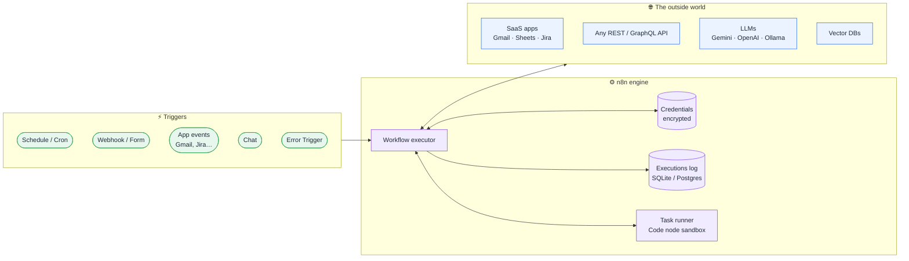
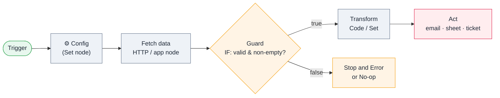
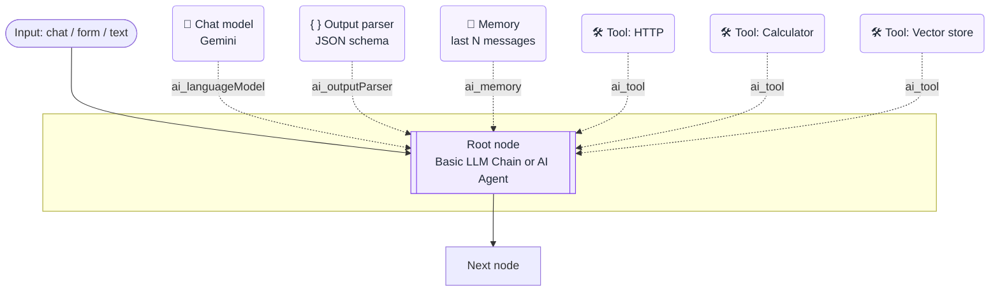
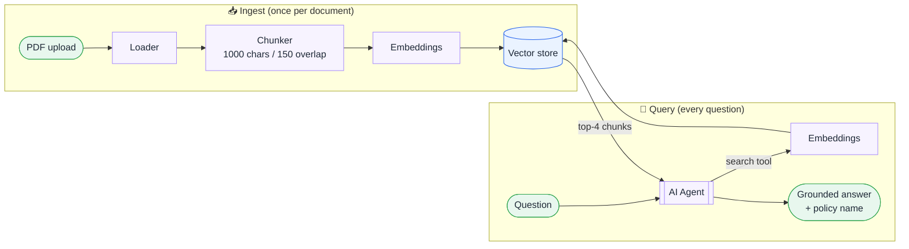
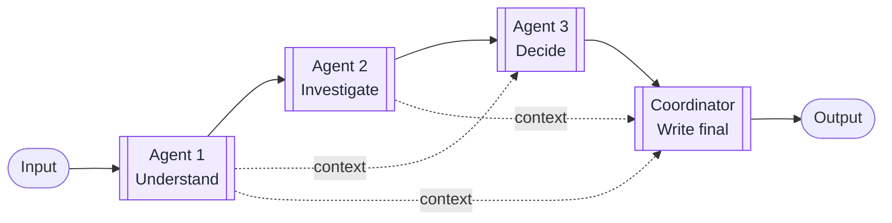
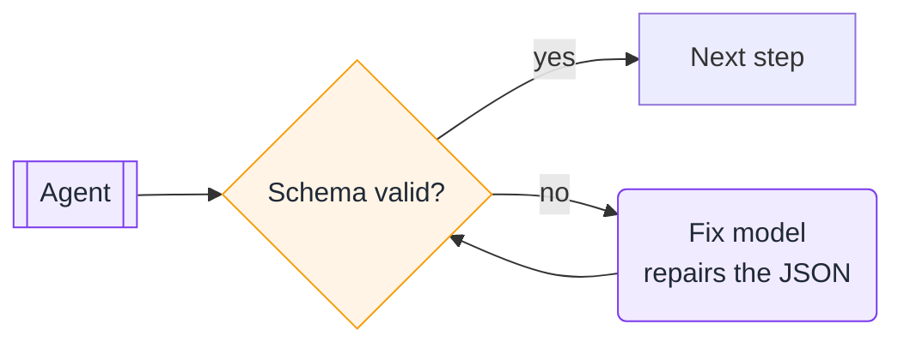
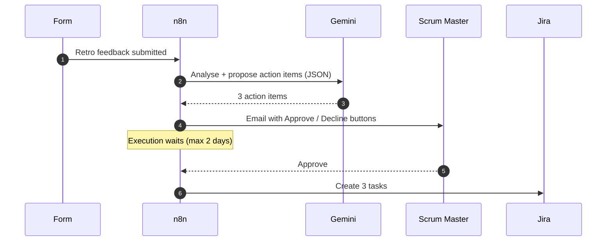
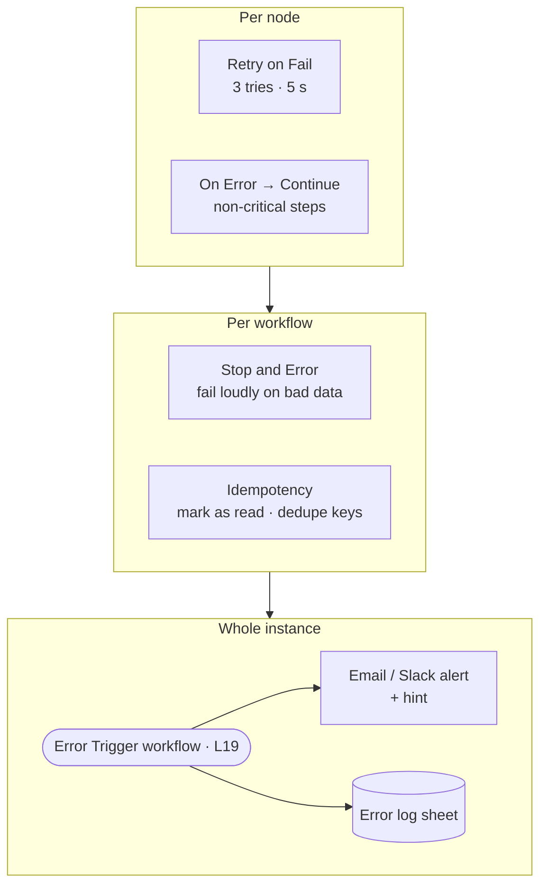
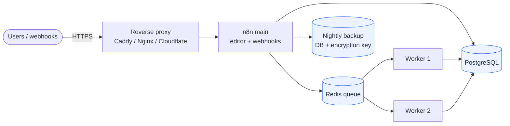

# 🏗️ Architecture guide

**How n8n works under the hood, and the design patterns used across all 43 workflows.**

> [!NOTE]
> Every diagram here uses Mermaid, so GitHub draws it for you. Each lesson README also has its own architecture diagram, generated from its `workflow.json`.

**Contents:** [1. n8n platform](#1-the-n8n-platform) · [2. Anatomy of a workflow](#2-anatomy-of-a-workflow) · [3. AI building blocks](#3-ai-building-blocks) · [4. RAG](#4-rag-retrieval-augmented-generation) · [5. Multi-agent patterns](#5-multi-agent-patterns) · [6. Human in the loop](#6-human-in-the-loop) · [7. Reliability](#7-reliability-and-error-handling) · [8. Production deployment](#8-production-deployment) · [9. Pattern index](#9-pattern--lesson-index)

---

## 1. The n8n platform

| Part | What it does | Where you meet it |
|---|---|---|
| **Trigger** | Starts an execution: time, HTTP call, form, app event, chat, another workflow's error | Every lesson |
| **Executor** | Runs nodes in order and passes **items** (JSON + optional binary) between them | L01 |
| **Credentials store** | Encrypted secrets. Workflows only reference them by name, so exported JSON is safe to share | L02+ |
| **Executions log** | Every run with the input and output of every node, which is how you debug | L19 |
| **Task runner** | Isolated sandbox for Code nodes | L05 |

---

## 2. Anatomy of a workflow

This **Trigger → Config → Fetch → Guard → Transform → Act** shape appears in almost every lesson.

- **Config node first.** Every setting (email, thresholds, IDs) lives in one Set node. Change it once, and nobody has to hunt through ten nodes.
- **Guard before acting.** Check that the API succeeded and that there's something to send (L04, L05).
- **Items are lists.** Most nodes run once per item. The Code node can turn *many → one* (a digest) or *one → many* (one item per PDF, L06).

---

## 3. AI building blocks

n8n's AI nodes are a **root node** with **sub-nodes** plugged in underneath. The dashed lines on the canvas are these connections.

| Choose | When | Lessons |
|---|---|---|
| **Basic LLM Chain** | One prompt in, one answer out. Predictable and cheap | L11, L12, L15, L22 |
| **LLM Chain + Output Parser** | You need **rows, fields or decisions**, not prose | L12, L15, L22 |
| **AI Agent + tools** | The model must *decide* what to look up or calculate | L13, L14, L17 |
| **Agent + memory** | Multi-turn chat | L13, L14 |

> [!TIP]
> Start with a chain. Move to an agent only when the model needs to choose actions. Agents are slower, cost more and are harder to test.

---

## 4. RAG (Retrieval-Augmented Generation)

Used in **L13**. Two flows share one vector store.

**Rules that make RAG trustworthy:**
1. Use the **same embedding model** for ingest and query.
2. The system prompt says *"answer only from the tool; otherwise say you don't know."*
3. Chunk overlap stops answers being cut in half at chunk boundaries.
4. In-memory storage is for learning. For production, switch to Postgres/pgvector, Qdrant, Pinecone or Supabase.

---

## 5. Multi-agent patterns

### Sequential specialists (L16, L17, L18)

Each agent has a **narrow prompt** and a **strict JSON schema**. Later agents read all earlier outputs with `$('Agent name').item.json.output`.

### Self-healing output (L17)

> [!TIP]
> **Do the maths in code, the judgement in the LLM.** L16 computes sprint metrics in a Code node *before* any agent sees them. That's cheaper and avoids arithmetic mistakes.

---

## 6. Human in the loop

Used in **L15**. The AI proposes, a human decides, and the execution **pauses** until they respond.

Use this whenever AI output **leaves your organisation** (customer emails, L17) or **creates work for people** (tickets, L15).

---

## 7. Reliability and error handling

| Layer | Tool | Lesson |
|---|---|---|
| Flaky API | Retry on Fail | L02, L03, L06 |
| One bad input among many | On Error → Continue | L05 (RSS feeds) |
| Data you must not trust | IF guard + Stop and Error | L04 |
| Never process twice | Mark as read / static-data state | L06, L21 |
| Know when *anything* fails | Global error workflow | L19 |
| Don't spam alerts | Alert only when state changes | L21 |

---

## 8. Production deployment

| Stage | Setup |
|---|---|
| Learning | `npx n8n` on a laptop, SQLite |
| Team (under 5k runs/day) | Docker on a small VPS + Postgres + HTTPS proxy |
| Scale | **Queue mode**: main + Redis + N workers |

**Checklist:** set `WEBHOOK_URL` · `GENERIC_TIMEZONE` · back up `N8N_ENCRYPTION_KEY` (without it your credentials can't be decrypted) · use Postgres, not SQLite · set an error workflow on everything · prune old executions (`EXECUTIONS_DATA_MAX_AGE`).

---

## 9. Pattern → lesson index

| Pattern | Lessons |
|---|---|
| Config node | L02, L03, L04, L08 |
| Many → one digest | L03, L05, L08, L11 |
| One → many split | L06, L12, L15 |
| Branching (IF / Switch) | L04, L05, L09, L15, L22 |
| Your own API (Webhook + Respond) | L09 |
| Structured AI output | L12, L15, L17, L22 |
| RAG | L13 |
| Tools agent | L14 |
| Human approval | L15 |
| Multi-agent | L16, L17, L18 |
| Error workflow | L19 |
| Sub-workflows | L20 |
| Stateful monitoring | L21 |
| Long waits between steps (Wait node) | P04 |
| Batches + checkpoints + resume | P05 |
| Multi-level approval with timeouts | P06, P01 |
| Fan-out / fan-in (Merge) | P07, P12 |
| Change detection with hashes | P08 |
| Dedupe across executions | Q08, P01, P03 |
| Research agent (search + read + cite) | P09 |
| MCP server (tools for AI assistants) | P10 |
| PII redaction + AI gateway | P11 |
| Text Classifier / Information Extractor | Q07, P01, P02, P05 |

<a href="../README.md">← Back to the learning path</a>

