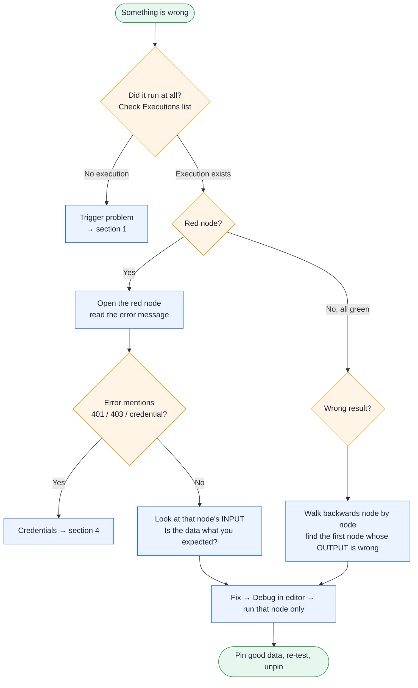

<div align="center">

# 🧯 Common mistakes and how to fix the flow

**The mistakes almost everyone makes in n8n, how to spot them, and a checklist so they don't reach production.**

</div>

---

**Contents:** [Debugging method](#-how-to-debug-any-workflow) · [Triggers](#1-triggers--activation) · [Data & expressions](#2-data--expressions) · [Items & flow](#3-items--flow-control) · [APIs & credentials](#4-apis--credentials) · [AI nodes](#5-ai-nodes) · [Reliability](#6-reliability) · [Sharing](#7-exporting--sharing) · [Pre-flight checklist](#-pre-flight-checklist-before-you-activate)

## 🔎 How to debug any workflow



> [!TIP]
> **The golden rule:** the bug is almost always at the **first node whose OUTPUT doesn't look right**. Don't guess; open nodes from left to right until you find it. In *Executions*, click **Debug in editor** to load a failed run's data into the canvas.

---

## 1. Triggers & activation

| # | Mistake | Symptom | Fix |
|:-:|---|---|---|
| 1.1 | Workflow not **activated** | Schedule / Gmail / webhook never fires | Toggle **Active** (top right). *Execute workflow* is only a test |
| 1.2 | Using the **Test URL** in production | Webhook or form works only while the editor is open | Share the **Production URL** (`/webhook/…`, not `/webhook-test/…`) |
| 1.3 | Wrong **timezone** | Runs at 1:30 PM instead of 7 AM | *⋯ → Settings → Timezone*, or set `GENERIC_TIMEZONE` |
| 1.4 | n8n not running 24/7 | Schedules missed overnight | Laptop asleep. Use n8n Cloud or a VPS |
| 1.5 | Webhook not reachable | External service gets a timeout | Localhost isn't public. Use a tunnel or domain and set `WEBHOOK_URL` |
| 1.6 | Gmail trigger re-processes the same mail | Duplicates every poll | Mark as read or label processed emails, and filter on that (L06) |

## 2. Data & expressions

| # | Mistake | Symptom | Fix |
|:-:|---|---|---|
| 2.1 | Field name typo or wrong case | Value is empty / `undefined` | Drag the field from the INPUT panel instead of typing |
| 2.2 | Field with spaces written as `$json.Work email` | Expression error | Use brackets: `$json['Work email']` |
| 2.3 | Forgot the `=` / `{{ }}` | Literal text `{{ $json.name }}` appears in the email | Switch the field to **Expression** mode |
| 2.4 | Number stored as a string | `"9" > "10"` is true; Switch goes the wrong way | Set the Set-node field type to **Number**, or `Number($json.x)` |
| 2.5 | Referencing a node that didn't run | `Referenced node is unexecuted` | That branch didn't run (IF false). Reference a node on the same path |
| 2.6 | `$('Node').item` after a node that changes the item count | Data from the wrong item, or an error | Use `.first()` when there's one summary item, or keep needed fields on the current item |
| 2.7 | Renamed a node that a Code node references | `Node 'X' not found` | Expressions auto-update; **Code node strings don't**. Search the code for the old name |
| 2.8 | Nested data without a safety check | `Cannot read properties of undefined` | Use optional chaining `a?.b?.[0]` and a default `?? ''` |

## 3. Items & flow control

| # | Mistake | Symptom | Fix |
|:-:|---|---|---|
| 3.1 | Expecting one run but getting one per item | 25 emails instead of 1 digest | Combine first: Code (*run once for all items*), **Aggregate**, or node setting *Execute Once* |
| 3.2 | Code node returns the wrong shape | `Code doesn't return items properly` | Return `[{ json: {...} }]` (all items mode) or `{ json: {...} }` (each item mode) |
| 3.3 | A node returns 0 items | Everything after it silently stops | Turn on **Always Output Data**, then check with an IF |
| 3.4 | Merge never continues | Workflow ends at Merge | Every Merge input must receive data. Check the input numbers on the connection |
| 3.5 | IF branches swapped | Alerts go out when all is fine | Output 0 = **true**, output 1 = **false**. Read the labels on the canvas |
| 3.6 | Switch without a fallback | Unmatched items vanish | Options → *Fallback output* → **Extra output** (L04) |
| 3.7 | Loop never ends / huge executions | Memory errors | Avoid manual loops; most nodes already run per item. Use *Loop Over Items* with a batch size only when needed |

## 4. APIs & credentials

| # | Mistake | Symptom | Fix |
|:-:|---|---|---|
| 4.1 | Expired or wrong credential | `401` / `403` / `invalid_grant` | Re-open the credential and reconnect. Google OAuth test apps expire every 7 days, so publish the app or re-auth |
| 4.2 | Missing Google API enabled | `API has not been used in project` | Enable Gmail / Sheets / Drive API in Google Cloud Console |
| 4.3 | Rate limit | `429 Too Many Requests` | Retry on Fail with 5 s+ waits; slow the schedule; batch requests |
| 4.4 | API error treated as success | Next node reads `undefined` | Check the response in an IF (L04) or use *Never error + Full response* (L21) |
| 4.5 | Sheet columns don't map | Empty cells | Header names must match the field names **exactly**, including case and spaces |
| 4.6 | Hard-coded secrets in parameters | Keys leak when sharing | Always use Credentials or `$env`, never paste keys into nodes |

## 5. AI nodes

| # | Mistake | Symptom | Fix |
|:-:|---|---|---|
| 5.1 | No model attached | `No language model connected` | Click **+ Chat Model** under the chain or agent |
| 5.2 | Asking for JSON in the prompt only | Parsing fails randomly | Use a **Structured Output Parser** (L12) with temperature 0–0.2 |
| 5.3 | Agent ignores tools | Makes up facts | Write specific tool descriptions and say "ALWAYS use X for Y" in the system prompt (L14) |
| 5.4 | Maths done by the LLM | Wrong totals | Compute in a Code node or give it a Calculator tool (L16) |
| 5.5 | Different embedding models for insert and search | RAG finds nothing | Use the **same** embeddings model on both sides (L13) |
| 5.6 | In-memory vector store in production | Knowledge vanishes after restart | Switch to a persistent vector DB |
| 5.7 | AI output sent straight to customers | Embarrassing or wrong emails | Add a **human approval** step (L15) |
| 5.8 | Huge inputs | Token-limit or cost blow-up | Trim with Code first, and use *Optimize Response* on HTTP tools |

## 6. Reliability

| # | Mistake | Symptom | Fix |
|:-:|---|---|---|
| 6.1 | No error workflow | Failures go unnoticed for days | Set **L19** as the error workflow everywhere |
| 6.2 | No retries on external calls | Random failures at night | *Retry on Fail* for every HTTP / app node |
| 6.3 | One bad input stops everything | Whole digest missing because one feed was down | *On Error → Continue* on non-critical nodes (L05) |
| 6.4 | Alerting on every check | Alert fatigue; people ignore alerts | Alert on **state change** only (L21) |
| 6.5 | SQLite + large volume | Slow editor, DB locks | Use Postgres; prune executions |
| 6.6 | Lost encryption key | All credentials unreadable after migrating | Back up `N8N_ENCRYPTION_KEY` with the database |

## 7. Exporting & sharing

| # | Mistake | Risk | Fix |
|:-:|---|---|---|
| 7.1 | Pinned data left in | Real emails and customer data in the JSON | Unpin everything before download (CI blocks it) |
| 7.2 | Real addresses, sheet IDs, folder IDs | Privacy leak | Replace with `you@example.com`, `PASTE_YOUR_…`, `REPLACE_…` |
| 7.3 | Screenshots with data | Same leak, in images | Use sample data from [sample-data.md](sample-data.md) |

---

## ✅ Pre-flight checklist (before you activate)

Copy this into your PR or run through it yourself:

```markdown
### Correctness
- [ ] Ran end-to-end with realistic data (docs/sample-data.md)
- [ ] Tested the unhappy path: empty result, bad input, API down
- [ ] IF / Switch branches go where expected (checked the labels)
- [ ] Number fields are typed as numbers

### Reliability
- [ ] Error workflow set (⋯ → Settings → Error workflow → L19)
- [ ] Retry on Fail on every external call
- [ ] Guard against 0 items (Always Output Data + IF) where it matters
- [ ] Won't process the same thing twice (mark as read / dedupe key / state)
- [ ] Timezone set

### Safety
- [ ] No secrets in parameters; credentials used everywhere
- [ ] AI output that reaches people outside the team is approved by a human
- [ ] Test recipients replaced with real ones only at the end

### Sharing
- [ ] No pinned data
- [ ] Placeholders instead of personal emails / IDs
- [ ] python3 tools/validate.py passes
```

---

<p align="center"><a href="../README.md">← Back to the learning path</a> · <a href="workflow-anatomy.md">🧬 Workflow anatomy</a> · <a href="testing.md">🧪 Testing</a></p>
