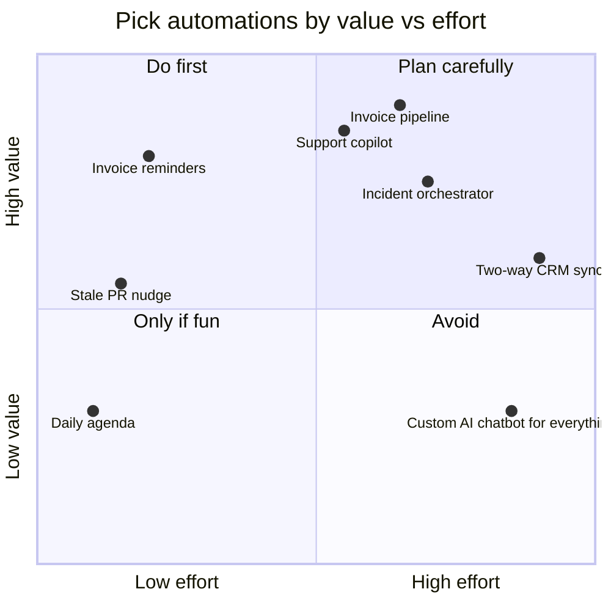
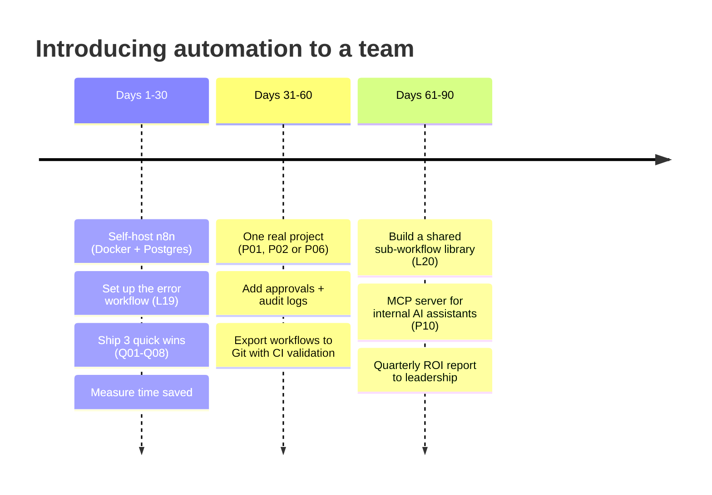

# 🏢 Real-world automation guide

**What building workflows is actually like inside a company: what to automate first, how to prove the value, where AI helps (and where it hurts), and why most automation projects fail.**

---

**Contents:** [What to automate first](#1-what-to-automate-first) · [ROI in one table](#2-proving-the-value-roi) · [Build vs buy](#3-n8n-vs-zapier-vs-make-vs-code) · [AI in production](#4-ai-in-production-the-rules-that-matter) · [Why automations fail](#5-why-automations-fail-in-companies) · [Governance](#6-governance-that-doesnt-slow-you-down) · [30-60-90 rollout](#7-a-30-60-90-day-rollout-plan) · [Careers](#8-automation-as-a-career)

## 1. What to automate first

Don't start with the most exciting idea. Start with the **most boring, frequent, rule-based** task.

**Score each candidate (1–5) and multiply:**

| Question | Why it matters |
|---|---|
| How **often** does it happen? | Daily beats monthly: savings compound |
| How **long** does it take by hand? | 10 min × 20/day = 3+ hours/day |
| How **rule-based** is it? | Clear rules suit code; judgement needs AI plus human review |
| How costly is a **mistake**? | High-cost mistakes need approvals (P06) and validation (P01) |
| How many **systems** does it touch? | More systems means more value, but also more failure points |

> [!TIP]
> Ask each team one question: *"What do you copy-paste between two tools every week?"* That list is your automation backlog.

**Automations that pay back in almost every company** (and their lesson here):

| Area | Automation | Typical time saved | Lesson |
|---|---|---|---|
| Finance | Invoice data capture + approval | 5–10 min per invoice | P01 |
| Finance | Payment reminders | Days of DSO (days sales outstanding) | Q06 |
| Support | Triage + draft replies | 30–50% of first-response time | P02, Q07 |
| Sales | Lead capture → CRM → follow-ups | Leads no longer forgotten | L07, L22, P04 |
| HR | Onboarding checklist | 3–5 h per joiner, better day 1 | P07 |
| Ops | Approvals with audit trail | No more chasing email threads | P06 |
| Engineering | Alert dedupe → incident → postmortem | Less on-call noise | P03 |
| Leadership | Weekly KPI report | 2–3 h every Monday | P12 |

---

## 2. Proving the value (ROI)

Managers fund what they can measure. Use this before building, and again 30 days after launch.

| Input | Example (invoice pipeline, P01) |
|---|---|
| Volume per month | 400 invoices |
| Minutes saved per item | 6 min |
| Hours saved per month | 400 × 6 / 60 = **40 h** |
| Loaded cost per hour | ₹600 |
| **Monthly saving** | **₹24,000** |
| Error cost avoided | 1 duplicate payment of ₹45,000 per year → **₹3,750/month** |
| Running cost | n8n VPS ₹800 + Gemini ~₹300 → **₹1,100/month** |
| Build + maintain | 16 h build + 2 h/month upkeep |
| **Payback** | Under 1 month |

> [!IMPORTANT]
> Log every execution's outcome (like P01's Ledger and Exceptions sheets, or P11's audit log). "The pipeline processed 1,284 invoices and caught 9 duplicates this quarter" wins budget; "it works" doesn't.

---

## 3. n8n vs Zapier vs Make vs code

| | **n8n** | Zapier | Make | Power Automate | Custom code |
|---|---|---|---|---|---|
| Best for | Technical teams, AI, self-hosting | Non-technical users, fastest start | Visual power users | Microsoft 365 shops | Core product logic |
| Pricing model | Per execution (Cloud) or **free self-hosted** | Per task (gets expensive) | Per operation | Per user / flow | Engineering time |
| Code when needed | ✅ JS/Python nodes | Limited | Limited | Limited | ✅ |
| Self-host / data residency | ✅ | ❌ | ❌ | ❌ (tenant) | ✅ |
| AI agents, RAG, MCP | ✅ native | Basic | Basic | Copilot Studio | ✅ (you build it) |
| Git / version control | Export JSON (this repo's approach) | ❌ | ❌ | Solutions | ✅ |

**Rule of thumb:** use n8n for **glue between systems and AI-assisted operations**. Keep **customer-facing product logic** in your application code. Use Zapier when non-technical people must own the flow with zero help.

---

## 4. AI in production: the rules that matter

The projects in this repo follow these on purpose:

1. **AI extracts, code validates, humans approve.** P01 re-checks `subtotal + tax = total` in code, because the model's arithmetic isn't trusted.
2. **Draft, don't send.** P02 creates Gmail *drafts*. Auto-send only after weeks of measured accuracy on one narrow category.
3. **Structured output always.** Free text can't drive an IF node; JSON can (L12, L22).
4. **Ground it.** Answer from an FAQ or documents (P02, L13), not from the model's memory.
5. **Confidence plus an escape hatch.** Route to a human when unsure (P02's two-condition IF).
6. **Minimise data.** Redact personal data before it reaches the model (P11). India's **DPDP Act 2023** and GDPR both require data minimisation.
7. **Cap cost and loops.** Use `maxIterations` on agents, `Limit` on batches, and waits for rate limits (P05, P09).
8. **Log what the AI decided and why.** Keep the `reason` fields (L22, P05). You'll need them when someone asks "why did it do that?"

> [!CAUTION]
> Prompt-injection screens (P11) catch only obvious attacks. Never give an AI agent that reads untrusted text (emails, web pages, tickets) a tool that can **send, pay, delete or change permissions** without a human approval step.

---

## 5. Why automations fail in companies

| Failure | What it looks like | Prevention |
|---|---|---|
| **No owner** | The builder leaves and nobody understands the flow | Name an owner in the workflow description; use sticky notes |
| **Silent failure** | Reports stop and nobody notices for 3 weeks | Global error workflow (L19) + daily heartbeat |
| **Duplicate processing** | Customers get the same email 4 times | Idempotency: mark as read, dedupe keys, status columns (L06, Q08, P05, P08) |
| **Credential expiry** | Google OAuth test apps expire every 7 days | Publish the OAuth app; use service accounts where possible |
| **Brittle scraping** | A site redesign breaks the flow | Prefer APIs; alert when extraction returns empty (Q02) |
| **Automating a broken process** | Faster chaos | Fix the process on paper first, then automate |
| **Big-bang launch** | 40-step flow, never finished | Ship the smallest useful version in a week, then iterate |
| **Shadow IT panic** | Security blocks everything | Involve IT early: self-hosting, audit logs, least-privilege credentials |

---

## 6. Governance that doesn't slow you down

- **Naming:** `[Team] Verb object (trigger)`, e.g. `[Finance] Process invoices (Gmail)`.
- **Environments:** separate *dev* and *prod* n8n instances, or at least separate credentials. Test with `you@example.com`, never real customers.
- **Version control:** export workflows to Git (this repo is the pattern). Review changes like code; `tools/validate.py` blocks leaked data in CI.
- **Least privilege:** read-only credentials where possible; a separate Jira bot user; scoped Slack bot tokens.
- **Webhook security:** header auth or HMAC signatures on every public webhook (L09, P11).
- **Data retention:** prune execution data (`EXECUTIONS_DATA_MAX_AGE`), because executions store the payloads, including personal data.
- **Runbook per critical flow:** what it does, owner, how to pause it, how to replay failed items.

---

## 7. A 30-60-90 day rollout plan

---

## 8. Automation as a career

Companies now hire for **automation engineer**, **AI operations**, **RevOps / FinOps engineer** and **internal tools** roles. What hiring managers look for:

| Skill | Proof you can show | Lessons |
|---|---|---|
| APIs, JSON, webhooks | A working webhook API with validation | L03, L09 |
| Reliable design | Error handling, idempotency, retries | L19, P05, P08 |
| AI with guardrails | Structured output, grounding, approvals, PII redaction | L12, L15, P02, P11 |
| Business thinking | An ROI table like section 2 for each project | this page |
| Communication | Clean README + architecture diagram per workflow | every lesson |

> [!TIP]
> **Portfolio idea:** fork this repo, adapt three projects to a real problem (your company, a local business, a nonprofit), and write up the before/after numbers. That beats any certificate.

---

<a href="../README.md">← Back to the learning path</a> · <a href="architecture.md">🏗️ Architecture</a> · <a href="common-mistakes.md">🧯 Common mistakes</a>

