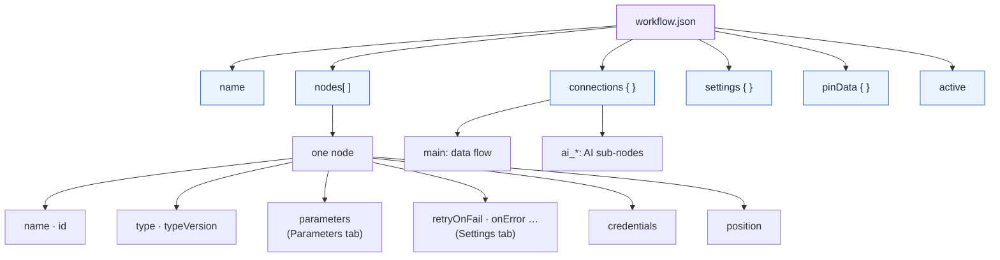

<div align="center">

# 🧬 Workflow anatomy

**Every property inside a `workflow.json`, what it does, and when you'd change it.**

</div>

---

> [!NOTE]
> You rarely edit JSON by hand; the n8n editor writes it for you. But knowing what's inside helps you **debug imports, review changes in Git, and understand why something behaves the way it does**.

**Contents:** [Big picture](#-the-big-picture) · [Top level](#1-top-level-properties) · [Nodes](#2-node-properties) · [Connections](#3-connections) · [Settings](#4-workflow-settings) · [Expressions](#5-expressions-cheat-sheet) · [Annotated example](#6-annotated-example-l02)

## 🗺 The big picture



---

## 1. Top-level properties

| Property | Type | What it is | Notes |
|---|---|---|---|
| `name` | string | Workflow title in the editor | Free text; shown in error alerts (L19) |
| `nodes` | array | Every node on the canvas, **including sticky notes** | Order doesn't matter; connections define the flow |
| `connections` | object | Which node feeds which | Keyed by **node name**. Rename a node and n8n updates this for you |
| `settings` | object | Workflow-level options (error workflow, timezone…) | See [section 4](#4-workflow-settings) |
| `active` | boolean | Whether triggers fire automatically | Always `false` in this repo; you activate after connecting credentials |
| `pinData` | object | Frozen node outputs used while testing | ⚠️ Often contains real data. **Must be empty before sharing** (CI checks this) |
| `tags` | array | Labels for organising workflows | Optional |
| `id`, `versionId`, `meta` | string / object | Instance-specific IDs | Created on import; safe to leave out |

---

## 2. Node properties

### Identity
| Property | Example | Meaning |
|---|---|---|
| `name` | `"Fetch Weather"` | **Unique** within the workflow. Used by connections and by expressions like `$('Fetch Weather')` |
| `id` | UUID | Internal ID. Stable across renames |
| `type` | `n8n-nodes-base.httpRequest` | Which node. `n8n-nodes-base.*` = core and app nodes, `@n8n/n8n-nodes-langchain.*` = AI nodes |
| `typeVersion` | `4.2` | The node's version. Parameters differ between versions, so **never change this by hand** |
| `position` | `[440, 0]` | x, y on the canvas. Purely visual |

### `parameters`: the Parameters tab
Everything you set in the node's main panel. Its shape depends on the node type. Common patterns:

| Pattern | Looks like | Meaning |
|---|---|---|
| Plain value | `"url": "https://…"` | Fixed value |
| **Expression** | `"url": "=https://…/{{ $json.base }}"` | Starts with **`=`**, evaluated at run time |
| Resource locator | `{"__rl": true, "mode": "url", "value": "…"}` | A picker that accepts *From list / By URL / By ID* |
| Collection | `"options": { "timeout": 15000 }` | The *Add option* section. Missing keys use defaults |
| Fixed collection | `"queryParameters": { "parameters": [ {name, value} ] }` | Repeating rows you add with *Add parameter* |
| Conditions | `{"conditions": [ {leftValue, operator, rightValue} ], "combinator": "and"}` | IF / Switch / Filter rules |

Every lesson README has a **🔍 Node-by-node reference** listing these for each node.

### Node settings: the Settings tab
| Property | Default | What it does | Use it when |
|---|---|---|---|
| `retryOnFail` | off | Re-runs the node if it errors | Calling any external API |
| `maxTries` | 3 | Attempts when retrying | Raise for flaky APIs |
| `waitBetweenTries` | 1000 ms | Pause between retries | Rate-limited APIs: use 5000+ |
| `onError` | `stopWorkflow` | `continueRegularOutput` keeps going with the error as data; `continueErrorOutput` adds a red **error branch** | Non-critical steps (logging, one of several feeds) |
| `alwaysOutputData` | off | Emits an empty item even when the node returns nothing | So "0 results" still reaches the next node (L08) |
| `executeOnce` | off | Runs once using only the first item | Sending one summary even though many items arrive |
| `disabled` | false | Skips the node; data passes through | Temporarily bypassing a step while testing |
| `notes` | — | Text shown under the node | Explaining non-obvious choices |

### `credentials`
```json
"credentials": { "gmailOAuth2": { "id": "12", "name": "My Gmail" } }
```
Only a **reference**. The secret itself stays encrypted in n8n's database. This repo strips the block entirely, so you pick your own credential after import.

---

## 3. Connections

```json
"connections": {
  "API OK?": {
    "main": [
      [ { "node": "Extract Rate", "type": "main", "index": 0 } ],
      [ { "node": "API Failed — log it", "type": "main", "index": 0 } ]
    ]
  },
  "Gemini": {
    "ai_languageModel": [
      [ { "node": "Write Briefing", "type": "ai_languageModel", "index": 0 } ]
    ]
  }
}
```

| Part | Meaning |
|---|---|
| Key (`"API OK?"`) | The **source** node name |
| `main` | Normal data flow. The **outer array index = output number**: for IF, `[0]` is *true* and `[1]` is *false*; for Switch, one per rule plus fallback |
| Inner array | Everything that output connects to (one output can feed many nodes) |
| `index` | Which **input** of the target. Matters for Merge (input 0, 1, 2…) |
| `ai_languageModel`, `ai_tool`, `ai_memory`, `ai_outputParser`, `ai_embedding`, `ai_document`, `ai_textSplitter` | Sub-node links: the dashed lines under AI nodes |

---

## 4. Workflow settings

Set in the editor under **⋯ → Settings**.

| Property | What it does | Recommended |
|---|---|---|
| `executionOrder` | `v1` runs each branch to completion before the next | Keep `v1` |
| `errorWorkflow` | Workflow ID to run when this one fails | Point everything at **L19** |
| `timezone` | Timezone for schedules and `$now` | e.g. `Asia/Kolkata` |
| `saveDataErrorExecution` / `saveDataSuccessExecution` | Whether to store execution data | Save errors always; successes can be `none` for high-volume flows |
| `saveManualExecutions` | Keep manual test runs | On while learning |
| `executionTimeout` | Kill runs longer than N seconds | Set for anything calling slow APIs or AI |
| `callerPolicy` | Which workflows may call this one as a sub-workflow | Restrict for sensitive sub-workflows (L20a) |

---

## 5. Expressions cheat sheet

| You want | Write |
|---|---|
| Field of the current item | `{{ $json.email }}` |
| Field with spaces or symbols | `{{ $json['Work email'] }}` |
| Field from an earlier node (same item) | `{{ $('⚙️ Config').item.json.city }}` |
| First item of an earlier node | `{{ $('Build Report').first().json.subject }}` |
| All items of an earlier node (Code) | `$('Sites to Watch').all()` |
| Now / today, formatted | `{{ $now.toFormat('dd LLL yyyy') }}` |
| Default if missing | `{{ $json.company \|\| '-' }}` |
| Condition inline | `{{ $json.rain > 50 ? '☔' : '' }}` |
| Safe nested access | `{{ $json.apply_options?.[0]?.link }}` |
| Object for a JSON body | `{{ { ok: true, id: $json.id } }}` |
| Environment variable | `{{ $env.MY_VAR }}` |
| Data kept between runs (Code) | `$getWorkflowStaticData('global')` |

> [!TIP]
> Drag a field from the **INPUT** panel into any parameter and n8n writes the expression for you. Then look at what it wrote. That's the fastest way to learn the syntax.

---

## 6. Annotated example (L02)

```jsonc
{
  "name": "L02 · Daily weather email (Schedule + free API)",
  "nodes": [
    {
      "name": "Every Morning 7 AM",
      "type": "n8n-nodes-base.scheduleTrigger",   // what kind of node
      "typeVersion": 1.2,                          // don't edit by hand
      "position": [0, 0],                          // canvas only
      "parameters": { "rule": { "interval": [ { "triggerAtHour": 7 } ] } }
    },
    {
      "name": "⚙️ Config",                          // all settings live here
      "type": "n8n-nodes-base.set",
      "parameters": { "assignments": { "assignments": [
        { "name": "city", "value": "Chennai", "type": "string" },
        { "name": "email_to", "value": "you@example.com", "type": "string" }
      ] } }
    },
    {
      "name": "Fetch Weather",
      "type": "n8n-nodes-base.httpRequest",
      "retryOnFail": true, "maxTries": 3,          // ← Settings tab
      "parameters": {
        "url": "https://api.open-meteo.com/v1/forecast",
        "queryParameters": { "parameters": [
          { "name": "latitude", "value": "={{ $json.latitude }}" }   // "=" → expression
        ] }
      }
    }
  ],
  "connections": {
    "Every Morning 7 AM": { "main": [ [ { "node": "⚙️ Config", "type": "main", "index": 0 } ] ] },
    "⚙️ Config":         { "main": [ [ { "node": "Fetch Weather", "type": "main", "index": 0 } ] ] }
  },
  "settings": { "executionOrder": "v1" },
  "active": false,
  "pinData": {}                                    // must be empty when shared
}
```

---

<p align="center"><a href="../README.md">← Back to the learning path</a> · <a href="common-mistakes.md">🧯 Common mistakes</a> · <a href="architecture.md">🏗️ Architecture</a></p>
