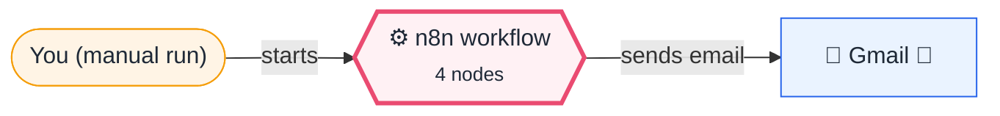
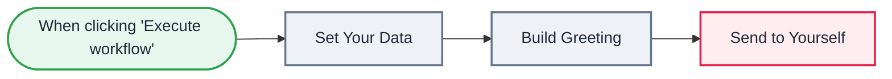

<div align="center">

# L01 · Hello n8n — your first workflow

    [](https://github.com/callme-siva/n8n-knowledge/actions/workflows/validate.yml)


</div>

> [!NOTE]
> **The real-world problem.** Everyone starts here. Before automating anything real, you need to understand how data moves between nodes. This workflow takes some values, builds a message and emails it to you.

## 💡 Concept first

**📌 Key idea:** A workflow is a pipeline of nodes; each node receives a **list of items** (JSON objects) and returns a list of items.

**🧠 Mental model:** An assembly line: each station (node) takes the trays (items) coming in, does one job, and passes trays on.

**🚫 When *not* to use it:** This lesson uses a Code node so you can see items directly. In real workflows, prefer Set, IF and Filter when they can do the job: visual nodes are easier for the next person to read.

## 🎯 What you'll learn

- Manual Trigger: run a workflow on demand
- Set node: create data without code
- Code node: transform items with JavaScript
- Expressions: `{{ $json.field }}`
- Reading the INPUT and OUTPUT panels

## 🏗️ Architecture

**System context:** who and what this workflow talks to, and what crosses each boundary. 🔑 = needs a credential · 🧑 = a human decides.



<details><summary><b>Node-level flow</b> (every node and branch)</summary>



</details>

<details><summary>Plain-text flow</summary>

```
Manual Trigger → Set Your Data → Build Greeting (Code) → Send to Yourself (Gmail)
```

</details>

## 🔑 Credentials

| You need | Where to get it |
|---|---|
| Gmail OAuth2 — see [docs/credentials.md](../../docs/credentials.md#gmail). *Optional* | delete the Gmail node and the workflow still teaches everything. |

## 📝 Before you run it

Replace these placeholder values with your own:

| Node | Field | Placeholder |
|---|---|---|
| Send to Yourself | `sendTo` | `you@example.com` |

Nodes that need a credential selected after import: **Gmail**.

## 🛠️ Build it step by step

> [!TIP]
> In a hurry? Import [`workflow.json`](workflow.json) (copy → paste on the n8n canvas). Learning? Build it yourself using the steps below, then compare.

1. Create a new workflow and name it `L01 · Hello n8n`.
2. Add a **Manual Trigger** node.
3. Add an **Edit Fields (Set)** node with three fields: `name` (string), `city` (string), `tasks_done` (number).
4. Add a **Code** node and type the code shown in the *Node-by-node reference* below. `...item.json` keeps the old fields, and `greeting` is the new one. (A Set node could build this string too; Code is here so you see what a node does with items.)
5. Click **Execute workflow** and open *Build Greeting* → **OUTPUT**. If you see your greeting, you've finished the lesson.
6. *Optional, needs Gmail:* add a **Gmail → Send message** node ([set up Gmail first](../../docs/credentials.md#gmail), about 10 minutes the first time). In *To*, put your own email. In *Message*, drag `greeting` from the INPUT panel. Run it again.

## 🔍 Node-by-node reference

Every node in this workflow and every setting inside it, generated from [`workflow.json`](workflow.json). Click a node to expand it.

<details><summary><b>1. When clicking 'Execute workflow'</b> · <code>Manual Trigger</code> v1</summary>

> Starts the workflow when you click *Execute workflow*. For testing only.

*No settings. This node works with its defaults.*

</details>

<details><summary><b>2. Set Your Data</b> · <code>Edit Fields (Set)</code> v3.4</summary>

> Creates, renames or overwrites fields without code.

| Property | Value |
|---|---|
| `name` | Learner |
| `city` | Chennai |
| `tasks_done` | 3 |

</details>

<details><summary><b>3. Build Greeting</b> · <code>Code</code> v2</summary>

> Runs JavaScript. *Run once for all items* sees every item; *for each item* sees one at a time.

| Property | Value |
|---|---|
| `jsCode` | (JavaScript, 8 lines, shown below) |

**Code:**

```javascript
// Every node receives items and returns items.
return $input.all().map(item => ({
  json: {
    ...item.json,
    greeting: `Hello ${item.json.name} from ${item.json.city}! You finished ${item.json.tasks_done} tasks today.`,
    generated_at: $now.toISO(),   // $now uses your n8n timezone; new Date() is always UTC
  }
}));
```

</details>

<details><summary><b>4. Send to Yourself</b> · <code>Gmail</code> v2.1</summary>

> Sends, reads or labels email. `sendAndWait` pauses the workflow for a human reply.

| Property | Value |
|---|---|
| `sendTo` | you@example.com |
| `subject` | My first n8n workflow 🎉 |
| `emailType` | html |
| `message` | `<p>{{ $json.greeting }}</p><p><small>Sent at {{ $json.generated_at }}</small></p>` |
| `appendAttribution` | off |
| `⚙️ Retry on fail` | ✅ on |
| `⚙️ Max tries` | 3 |
| `⚙️ Wait between tries (ms)` | 3000 |

</details>

> [!TIP]
> ⚙️ rows come from each node's **Settings** tab, not its Parameters tab. `{{ … }}` values are **expressions** evaluated at run time. See [workflow anatomy](../../docs/workflow-anatomy.md) for what every property means.

## ✅ Test it

> [!TIP]
> **Automated end-to-end test: passed.** 4/4 nodes executed in real n8n (1 credentialed or AI nodes replaced by fixtures, so AI output itself isn't tested), 2 behaviour checks. See [tests/](../../tests/README.md).

- [ ] Click each node and open the **OUTPUT** tab: Table, JSON and Schema views show the same data in different shapes.
- [ ] Change `tasks_done` to 10 and run again.

## 🧯 Troubleshooting

Problems specific to this workflow are below. For general ones (expressions, items, triggers, AI), see [common mistakes](../../docs/common-mistakes.md).

<details><summary><b>Credentials not found on Gmail</b></summary>

Open the node → Credential → *Create new* and sign in with Google.

</details>

<details><summary><b>Code node: Cannot read properties of undefined</b></summary>

Check the field name spelling — JSON keys are case-sensitive.

</details>

## 🏋️ Practice

Try each challenge **before** opening the hint. Solutions show the exact expressions and code.

**⭐ Challenge 1:** Send the greeting for **three people** instead of one.

<details><summary>💡 Hint</summary>

The Set node emits one item. What if the Code node returned three?

</details>
<details><summary>✅ Solution</summary>

In **Build Greeting**, replace the code with:
```javascript
const people = [['Asha', 'Chennai'], ['Ravi', 'Pune'], ['Meera', 'Delhi']];
return people.map(([name, city]) => ({ json: { name, city, greeting: `Hello ${name} from ${city}!` } }));
```
Gmail now runs **three times**, once per item. That's the core n8n idea: nodes run once per item.

</details>

**⭐⭐ Challenge 2:** Put all three greetings into **one** email instead of three.

<details><summary>💡 Hint</summary>

You need *many → one*. Either a Code node in *Run once for all items* mode, or the **Aggregate** node.

</details>
<details><summary>✅ Solution</summary>

Add an **Aggregate** node after Build Greeting: *Individual fields* → field `greeting`. In Gmail, set Message to `{{ $json.greeting.join('<br>') }}`. One item goes in, so one email goes out.

</details>

## 🚀 Ideas to extend it

- Return two items from the Code node and watch Gmail send two emails (see practice challenge ⭐ below).
- Replace Gmail with Telegram or Slack.

---

<p align="center"> &nbsp;·&nbsp; <a href="../../README.md#-the-learning-path">📚 All lessons</a> &nbsp;·&nbsp; <a href="../L02-daily-weather-email/README.md">L02 · Daily weather email →</a></p>
