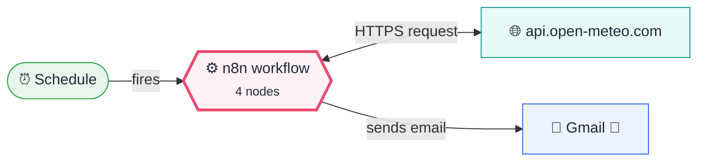
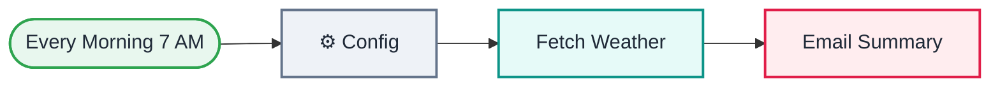

<div align="center">

# L02 · Daily weather email

    [](https://github.com/callme-siva/n8n-knowledge/actions/workflows/validate.yml)


</div>

> [!NOTE]
> **The real-world problem.** You want a short weather summary in your inbox every morning, before you leave home. This is the "hello world" of scheduled automation, and it calls a real public API.

## 💡 Concept first

**📌 Key idea:** Triggers decide **when** a workflow runs; a Config node decides **with what settings**.

**🧠 Mental model:** An alarm clock (Schedule) wakes a worker who first reads the sticky note on the fridge (Config) before starting the day.

**🚫 When *not* to use it:** Don't schedule every minute "just in case". Choose the slowest schedule the business can live with, since APIs rate-limit and executions cost money.

## 🎯 What you'll learn

- Schedule Trigger and activating workflows
- A **Config node** pattern: keep every setting in one place
- HTTP Request with query parameters
- Referencing an earlier node: `$('⚙️ Config').item.json.city`
- Retry on fail (node Settings tab)
- Inline JavaScript in expressions (`? :` ternary)

## 🏗️ Architecture

**System context:** who and what this workflow talks to, and what crosses each boundary. 🔑 = needs a credential · 🧑 = a human decides.



<details><summary><b>Node-level flow</b> (every node and branch)</summary>



</details>

## 🔑 Credentials

| You need | Where to get it |
|---|---|
| Gmail OAuth2 | [docs/credentials.md](../../docs/credentials.md) |

## 📝 Before you run it

Replace these placeholder values with your own:

| Node | Field | Placeholder |
|---|---|---|
| ⚙️ Config | `email_to` | `you@example.com` |

Nodes that need a credential selected after import: **Gmail**.

## 🛠️ Build it step by step

> [!TIP]
> In a hurry? Import [`workflow.json`](workflow.json) (copy → paste on the n8n canvas). Learning? Build it yourself using the steps below, then compare.

1. Add a **Schedule Trigger** → *Days*, hour 7.
2. Add a **Set** node named `⚙️ Config` with city, latitude, longitude, timezone and email_to. Get the coordinates from Google Maps (right-click → copy coordinates).
3. Add an **HTTP Request** node: GET `https://api.open-meteo.com/v1/forecast`, turn on *Send Query Parameters* and map them from Config.
4. In the HTTP node **Settings** tab, turn on *Retry On Fail* (3 tries, 5000 ms). Public APIs fail sometimes.
5. Add **Gmail**. Build the HTML body by dragging fields from the INPUT panel.
6. Run it once manually, then **Activate** it.

## 🔍 Node-by-node reference

Every node in this workflow and every setting inside it, generated from [`workflow.json`](workflow.json). Click a node to expand it.

<details><summary><b>1. Every Morning 7 AM</b> · <code>Schedule Trigger</code> v1.2</summary>

> Starts the workflow on a timer or cron expression. Only fires when the workflow is **active**.

| Property | Value |
|---|---|
| `rule.interval.triggerAtHour` | 7 |

</details>

<details><summary><b>2. ⚙️ Config</b> · <code>Edit Fields (Set)</code> v3.4</summary>

> Creates, renames or overwrites fields without code.

| Property | Value |
|---|---|
| `city` | Chennai |
| `latitude` | 13.0827 |
| `longitude` | 80.2707 |
| `timezone` | Asia/Kolkata |
| `email_to` | you@example.com |

</details>

<details><summary><b>3. Fetch Weather</b> · <code>HTTP Request</code> v4.2</summary>

> Calls any REST API. Use it whenever there's no dedicated node.

| Property | Value |
|---|---|
| `url` | https://api.open-meteo.com/v1/forecast |
| `sendQuery` | ✅ on |
| `queryParameters.latitude` | `{{ $json.latitude }}` |
| `queryParameters.longitude` | `{{ $json.longitude }}` |
| `queryParameters.current` | temperature_2m,relative_humidity_2m,wind_speed_10m |
| `queryParameters.daily` | temperature_2m_max,temperature_2m_min,precipitation_probability_max |
| `queryParameters.timezone` | `{{ $json.timezone }}` |
| `queryParameters.forecast_days` | 1 |
| `timeout` | 15000 |
| `⚙️ Retry on fail` | ✅ on |
| `⚙️ Max tries` | 3 |
| `⚙️ Wait between tries (ms)` | 5000 |

</details>

<details><summary><b>4. Email Summary</b> · <code>Gmail</code> v2.1</summary>

> Sends, reads or labels email. `sendAndWait` pauses the workflow for a human reply.

| Property | Value |
|---|---|
| `sendTo` | `{{ $('⚙️ Config').item.json.email_to }}` |
| `subject` | `{{ $('⚙️ Config').item.json.city }} weather — {{ $now.toFormat('dd LLL yyyy') }}` |
| `emailType` | html |
| `message` | `<h2>{{ $('⚙️ Config').item.json.city }} today</h2><ul><li>Now: {{ $json.current.temperature_2m }}°C, humidity {{ $json.current.relative_humidity_2m }}%, wind {{ $json.current.wind_speed_10m }} km/h</li><li>High / Low: {{ $json.daily.temperature_2m_max[0] }}°C / {{ $json.daily.temperature_2m_min[0] }}°C</li><li>Chance of rain: {{ $json.daily.precipitation_probability_max[0] }}% {{ $json.daily.precipitation_probability_max[0] > 50 ? '☔ carry an umbrella' : '' }}</li></ul>` |
| `appendAttribution` | off |
| `⚙️ Retry on fail` | ✅ on |
| `⚙️ Max tries` | 3 |
| `⚙️ Wait between tries (ms)` | 3000 |

</details>

> [!TIP]
> ⚙️ rows come from each node's **Settings** tab, not its Parameters tab. `{{ … }}` values are **expressions** evaluated at run time. See [workflow anatomy](../../docs/workflow-anatomy.md) for what every property means.

## ✅ Test it

> [!TIP]
> **Automated end-to-end test: passed.** 4/4 nodes executed in real n8n (1 credentialed or AI nodes replaced by fixtures, so AI output itself isn't tested), 2 behaviour checks. See [tests/](../../tests/README.md).

- [ ] Click *Execute workflow*. A schedule workflow can always be run manually for testing.
- [ ] Check **Executions** (left sidebar) the next morning to see the automatic run.

## 🧯 Troubleshooting

Problems specific to this workflow are below. For general ones (expressions, items, triggers, AI), see [common mistakes](../../docs/common-mistakes.md).

<details><summary><b>Workflow never runs automatically</b></summary>

It isn't **Active**, or your n8n instance was asleep (for example a laptop that was closed). Use n8n Cloud or a VPS for 24/7.

</details>

<details><summary><b>Wrong hour</b></summary>

Set the timezone in *Workflow settings → Timezone*.

</details>

## 🏋️ Practice

Try each challenge **before** opening the hint. Solutions show the exact expressions and code.

**⭐ Challenge 1:** Send the email only when it's likely to rain (> 50%).

<details><summary>💡 Hint</summary>

Add a node between *Fetch Weather* and *Email Summary* that can stop items.

</details>
<details><summary>✅ Solution</summary>

Add an **IF** (or **Filter**) node: `{{ $json.daily.precipitation_probability_max[0] }}` *is greater than* `50`. Connect only the **true** output to Gmail.

</details>

**⭐⭐ Challenge 2:** Report the weather for **3 cities** in one email.

<details><summary>💡 Hint</summary>

Make Config emit 3 items (Code node), let HTTP run per item, then combine.

</details>
<details><summary>✅ Solution</summary>

Replace ⚙️ Config with a Code node returning 3 items `{city, latitude, longitude, timezone}`. HTTP Request runs once per city automatically. Add a Code node (*all items*) that builds one HTML table:
```javascript
const cfg = $('⚙️ Config').all();
const rows = $input.all().map((it, i) => `<tr><td>${cfg[i].json.city}</td><td>${it.json.daily.temperature_2m_max[0]}°C</td><td>${it.json.daily.precipitation_probability_max[0]}%</td></tr>`).join('');
return [{ json: { html: `<table>${rows}</table>` } }];
```

</details>

## 🚀 Ideas to extend it

- Add an **IF** node: send only if the rain chance is above 50% (this previews L04).
- Loop over 3 cities by making Config return 3 items.

---

<p align="center"><a href="../L01-hello-n8n/README.md">← L01 · Hello n8n — your first workflow</a> &nbsp;·&nbsp; <a href="../../README.md#-the-learning-path">📚 All lessons</a> &nbsp;·&nbsp; <a href="../L03-job-search-api/README.md">L03 · Daily job search digest →</a></p>
