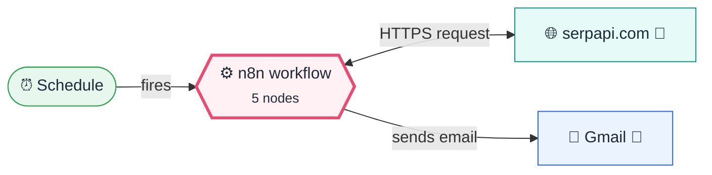

```mermaid
flowchart LR
  n0(["Every Morning 8 AM"]):::trigger
  n1["⚙️ Config"]:::code
  n2["Search Google Jobs"]:::http
  n3["Format Email"]:::code
  n4["Send Digest"]:::msg
  n0 --> n1
  n1 --> n2
  n2 --> n3
  n3 --> n4
  classDef trigger fill:#E8F7EE,stroke:#2EA44F,stroke-width:2px,color:#1F2937
  classDef ai fill:#F1EBFF,stroke:#7C3AED,stroke-width:2px,color:#1F2937
  classDef sub fill:#F7F3FF,stroke:#A78BFA,stroke-width:2px,color:#1F2937
  classDef logic fill:#FFF4E5,stroke:#F59E0B,stroke-width:2px,color:#1F2937
  classDef code fill:#EEF2F7,stroke:#64748B,stroke-width:2px,color:#1F2937
  classDef data fill:#EAF3FF,stroke:#2563EB,stroke-width:2px,color:#1F2937
  classDef http fill:#E6FAF8,stroke:#0D9488,stroke-width:2px,color:#1F2937
  classDef msg fill:#FFEDEF,stroke:#E11D48,stroke-width:2px,color:#1F2937
```

<div align="center">

# L03 · Daily job search digest

    


</div>

> [!NOTE]
> **The real-world problem.** Job hunting means checking portals every day. This workflow searches Google Jobs every morning and emails you one clean table of today's postings.

## 💡 Concept first

**📌 Key idea:** Every API is just a URL + method + auth + parameters; the hard part is **reading the JSON it returns**.

**🧠 Mental model:** Ordering from a restaurant menu: the endpoint is the dish, the query parameters are your customisations, the credential is your membership card.

**🚫 When *not* to use it:** Don't scrape a site when it has an official API. APIs are stable, legal and structured.

## 🎯 What you'll learn

- HTTP Request with a **predefined credential** (SerpAPI)
- Reading nested API JSON (`jobs_results[].apply_options[0].link`)
- Code node that turns many items into one HTML email
- Optional chaining `?.` so missing fields don't crash the code
- Escaping HTML so a job title can't break your email

## 🏗️ Architecture

**System context:** who and what this workflow talks to, and what crosses each boundary. 🔑 = needs a credential · 🧑 = a human decides.



<details><summary><b>Node-level flow</b> (every node and branch)</summary>



</details>

<details><summary>Plain-text flow</summary>

```
Schedule → ⚙️ Config → HTTP (SerpAPI google_jobs) → Code (HTML table) → Gmail
```

</details>

## 🔑 Credentials

| You need | Where to get it |
|---|---|
| SerpAPI key | free at serpapi.com. In n8n: Credentials → *SerpAPI* |
| Gmail OAuth2 | [docs/credentials.md](../../docs/credentials.md) |

## 📝 Before you run it

Replace these placeholder values with your own:

| Node | Field | Placeholder |
|---|---|---|
| ⚙️ Config | `email_to` | `you@example.com` |

Nodes that need a credential selected after import: **Gmail**, **HTTP Request**.

## 🛠️ Build it step by step

> [!TIP]
> In a hurry? Import [`workflow.json`](workflow.json) (copy → paste on the n8n canvas). Learning? Build it yourself using the steps below, then compare.

1. Sign up at serpapi.com and copy your API key. In n8n, create a **SerpApi** credential.
2. Build the Schedule → Config chain as in L02.
3. Add an **HTTP Request** node: Authentication = *Predefined credential type → SerpApi*; query `engine=google_jobs`, `q`, `location`, `chips=date_posted:today`.
4. Run it and **study the output JSON**. Find `jobs_results`. This is the most important skill with any API.
5. Add a **Code** node that loops over jobs and builds an HTML table (copy it from workflow.json).
6. Add **Gmail** with subject/body = `{{ $json.subject }}` / `{{ $json.html }}`.

## 🔍 Node-by-node reference

Every node in this workflow and every setting inside it, generated from [`workflow.json`](workflow.json). Click a node to expand it.

<details><summary><b>1. Every Morning 8 AM</b> · <code>Schedule Trigger</code> v1.2</summary>

> Starts the workflow on a timer or cron expression. Only fires when the workflow is **active**.

| Property | Value |
|---|---|
| `rule.interval.triggerAtHour` | 8 |

</details>

<details><summary><b>2. ⚙️ Config</b> · <code>Edit Fields (Set)</code> v3.4</summary>

> Creates, renames or overwrites fields without code.

| Property | Value |
|---|---|
| `query` | Scrum Master OR Agile Coach |
| `location` | India |
| `email_to` | you@example.com |
| `max_jobs` | 15 |

</details>

<details><summary><b>3. Search Google Jobs</b> · <code>HTTP Request</code> v4.2</summary>

> Calls any REST API. Use it whenever there's no dedicated node.

| Property | Value |
|---|---|
| `url` | https://serpapi.com/search.json |
| `authentication` | predefinedCredentialType |
| `nodeCredentialType` | serpApi |
| `sendQuery` | ✅ on |
| `queryParameters.engine` | google_jobs |
| `queryParameters.q` | `{{ $json.query }}` |
| `queryParameters.location` | `{{ $json.location }}` |
| `queryParameters.chips` | date_posted:today |
| `⚙️ Retry on fail` | ✅ on |
| `⚙️ Max tries` | 2 |

</details>

<details><summary><b>4. Format Email</b> · <code>Code</code> v2</summary>

> Runs JavaScript. *Run once for all items* sees every item; *for each item* sees one at a time.

| Property | Value |
|---|---|
| `jsCode` | (JavaScript, 12 lines, shown below) |

**Code:**

```javascript
const cfg = $('⚙️ Config').first().json;
const jobs = ($input.first().json.jobs_results || []).slice(0, cfg.max_jobs);
const today = new Date().toLocaleDateString('en-IN', { day: 'numeric', month: 'long', year: 'numeric' });
const esc = s => String(s ?? '').replace(/[&<>]/g, c => ({'&':'&amp;','<':'&lt;','>':'&gt;'}[c]));
const rows = jobs.map(j => {
  const link = j.apply_options?.[0]?.link || j.share_link || '#';
  return `<tr><td><a href="${link}">${esc(j.title)}</a></td><td>${esc(j.company_name)}</td><td>${esc(j.location)}</td><td>${esc(j.detected_extensions?.posted_at || '')}</td></tr>`;
}).join('');
const html = jobs.length
  ? `<h2>${jobs.length} new jobs · ${today}</h2><table border="1" cellpadding="6" style="border-collapse:collapse"><tr><th>Role</th><th>Company</th><th>Location</th><th>Posted</th></tr>${rows}</table>`
  : `<p>No new jobs today for <b>${esc(cfg.query)}</b>. Try widening the query.</p>`;
return [{ json: { subject: `Job digest: ${jobs.length} × ${cfg.query} (${today})`, html, count: jobs.length } }];
```

</details>

<details><summary><b>5. Send Digest</b> · <code>Gmail</code> v2.1</summary>

> Sends, reads or labels email. `sendAndWait` pauses the workflow for a human reply.

| Property | Value |
|---|---|
| `sendTo` | `{{ $('⚙️ Config').item.json.email_to }}` |
| `subject` | `{{ $json.subject }}` |
| `emailType` | html |
| `message` | `{{ $json.html }}` |
| `appendAttribution` | off |

</details>

> [!TIP]
> ⚙️ rows come from each node's **Settings** tab, not its Parameters tab. `{{ … }}` values are **expressions** evaluated at run time. See [workflow anatomy](../../docs/workflow-anatomy.md) for what every property means.

## ✅ Test it

> [!TIP]
> **Automated end-to-end test: passed.** 5/5 nodes executed in real n8n (2 credentialed nodes replaced by realistic mocks), 0 behaviour checks. See [tests/](../../tests/README.md).

- [ ] Change `query` to your own role and run it manually.
- [ ] Set `location` to a city (for example `Bengaluru, Karnataka, India`).

## 🧯 Troubleshooting

Problems specific to this workflow are below. For general ones (expressions, items, triggers, AI), see [common mistakes](../../docs/common-mistakes.md).

<details><summary><b>401 / Invalid API key</b></summary>

Re-create the SerpApi credential.

</details>

<details><summary><b>Email says 0 jobs</b></summary>

`date_posted:today` is strict. Remove the `chips` parameter to test.

</details>

<details><summary><b>Monthly quota used up</b></summary>

The free tier gives 100 searches a month. A daily run uses about 30.

</details>

## 🚀 Level up

- Save jobs to Google Sheets and skip ones you've already seen (dedupe by `job_id`).
- Add Gemini to score each job against your resume (see L18).

---

<p align="center"><a href="../L02-daily-weather-email/README.md">← L02 · Daily weather email</a> &nbsp;·&nbsp; <a href="../../README.md#-the-learning-path">📚 All lessons</a> &nbsp;·&nbsp; <a href="../L04-currency-alert-switch/README.md">L04 · Currency rate alert →</a></p>
