<div align="center">

# L03 · Daily job search digest

   


</div>

> [!NOTE]
> **The real-world problem.** Job hunting means checking portals every day. This workflow searches Google Jobs every morning and emails you one clean table of today's postings.

## 🎯 What you'll learn

- HTTP Request with a **predefined credential** (SerpAPI)
- Reading nested API JSON (`jobs_results[].apply_options[0].link`)
- Code node that turns many items into one HTML email
- Optional chaining `?.` so missing fields don't crash the code
- Escaping HTML so a job title can't break your email

## 🏗️ Architecture

```mermaid
flowchart LR
  n0(["Every Morning 8 AM"]):::trigger
  n1["⚙️ Config"]:::code
  n2["Search Google Jobs"]:::http
  n3["Format Email"]:::code
  n4["Send Digest"]:::msg
  n0 --> n1
  n1 --> n2
  n2 --> n3
  n3 --> n4
  classDef trigger fill:#E8F7EE,stroke:#2EA44F,stroke-width:2px,color:#1F2937
  classDef ai fill:#F1EBFF,stroke:#7C3AED,stroke-width:2px,color:#1F2937
  classDef sub fill:#F7F3FF,stroke:#A78BFA,stroke-width:2px,color:#1F2937
  classDef logic fill:#FFF4E5,stroke:#F59E0B,stroke-width:2px,color:#1F2937
  classDef code fill:#EEF2F7,stroke:#64748B,stroke-width:2px,color:#1F2937
  classDef data fill:#EAF3FF,stroke:#2563EB,stroke-width:2px,color:#1F2937
  classDef http fill:#E6FAF8,stroke:#0D9488,stroke-width:2px,color:#1F2937
  classDef msg fill:#FFEDEF,stroke:#E11D48,stroke-width:2px,color:#1F2937
```



<details><summary>Plain-text flow</summary>

```
Schedule → ⚙️ Config → HTTP (SerpAPI google_jobs) → Code (HTML table) → Gmail
```

</details>

## 🔑 Credentials

| You need | Where to get it |
|---|---|
| SerpAPI key | free at serpapi.com. In n8n: Credentials → *SerpAPI* |
| Gmail OAuth2 | [docs/credentials.md](../../docs/credentials.md) |

## 🛠️ Build it step by step

> [!TIP]
> In a hurry? Import [`workflow.json`](workflow.json) (copy → paste on the n8n canvas). Learning? Build it yourself using the steps below, then compare.

1. Sign up at serpapi.com and copy your API key. In n8n, create a **SerpApi** credential.
2. Build the Schedule → Config chain as in L02.
3. Add an **HTTP Request** node: Authentication = *Predefined credential type → SerpApi*; query `engine=google_jobs`, `q`, `location`, `chips=date_posted:today`.
4. Run it and **study the output JSON**. Find `jobs_results`. This is the most important skill with any API.
5. Add a **Code** node that loops over jobs and builds an HTML table (copy it from workflow.json).
6. Add **Gmail** with subject/body = `{{ $json.subject }}` / `{{ $json.html }}`.

## ✅ Test it

- [ ] Change `query` to your own role and run it manually.
- [ ] Set `location` to a city (for example `Bengaluru, Karnataka, India`).

## 🧯 Troubleshooting

<details><summary><b>401 / Invalid API key</b></summary>

Re-create the SerpApi credential.

</details>

<details><summary><b>Email says 0 jobs</b></summary>

`date_posted:today` is strict. Remove the `chips` parameter to test.

</details>

<details><summary><b>Monthly quota used up</b></summary>

The free tier gives 100 searches a month. A daily run uses about 30.

</details>

## 🚀 Level up

- Save jobs to Google Sheets and skip ones you've already seen (dedupe by `job_id`).
- Add Gemini to score each job against your resume (see L18).

---

<p align="center"><a href="../L02-daily-weather-email/README.md">← L02 · Daily weather email</a> &nbsp;·&nbsp; <a href="../../README.md#-the-learning-path">📚 All lessons</a> &nbsp;·&nbsp; <a href="../L04-currency-alert-switch/README.md">L04 · Currency rate alert →</a></p>
