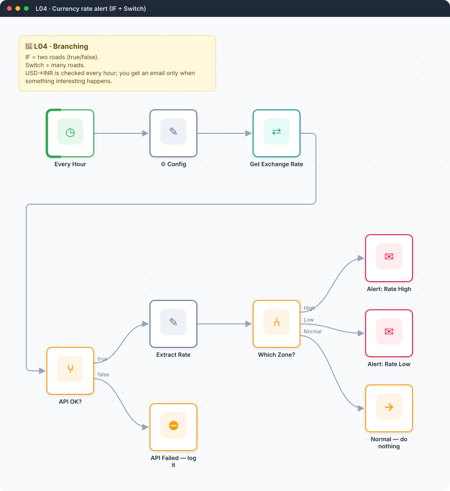
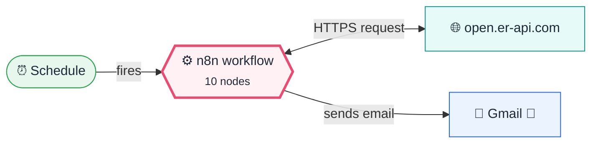

<div align="center">

# L04 · Currency rate alert

    [](https://github.com/callme-siva/n8n-knowledge/actions/workflows/validate.yml)



</div>

> [!NOTE]
> **The real-world problem.** If you send money abroad, pay overseas freelancers or invoice in USD, the exchange rate matters. You don't want to check it by hand, and you don't want an email every hour either. You want one only when the rate crosses a threshold.

## 💡 Concept first

**📌 Key idea:** Branching sends items down different paths based on rules; **IF** has two roads, **Switch** has many, and there's always a road for "none of the above".

**🧠 Mental model:** Railway points: each train (item) is switched onto a track by a rule, and a siding (fallback) catches the rest.

**🚫 When *not* to use it:** Don't nest five IFs. When you have three or more outcomes, one Switch with named outputs is clearer.

## 🎯 What you'll learn

- **IF** node: validate an API response before trusting it
- **Switch** node with named outputs plus a fallback
- Comparing numbers against Config values
- `$json` vs `$('Node').item` vs `$('Node').first()`
- **Stop and Error**: fail loudly so your error workflow (L19) catches it
- Dynamic URLs: `https://…/latest/{{ $json.base }}`

## 🏗️ Architecture

**System context:** who and what this workflow talks to, and what crosses each boundary. 🔑 = needs a credential · 🧑 = a human decides.



<details><summary><b>Node-level flow</b> (every node and branch)</summary>


</details>

## 🔑 Credentials

| You need | Where to get it |
|---|---|
| Gmail OAuth2 | open.er-api.com needs no key |

## 📝 Before you run it

Replace these placeholder values with your own:

| Node | Field | Placeholder |
|---|---|---|
| ⚙️ Config | `email_to` | `you@example.com` |

Nodes that need a credential selected after import: **Gmail**.

## 🛠️ Build it step by step

> [!TIP]
> In a hurry? Import [`workflow.json`](workflow.json) (copy → paste on the n8n canvas). Learning? Build it yourself using the steps below, then compare.

1. Schedule Trigger → *Hours*, every 1.
2. Config: base, target, high, low, email_to.
3. HTTP GET `https://open.er-api.com/v6/latest/{{ $json.base }}`.
4. **IF**: `{{ $json.result }}` *is equal to* `success`.
5. On true, add a **Set** node that extracts `rate = {{ $json.rates[$('⚙️ Config').item.json.target] }}` as a *Number*.

   **`.item` vs `.first()` vs `$json`:** `$json` is the item *this* node is working on. `$('Node').item` is the item from an earlier node that **this item came from** (n8n tracks the link, called *paired items*). `$('Node').first()` is simply that node's first item, whichever item you're on. With one Config item they give the same answer; once several items flow (3 currencies, 50 rows), `.item` keeps each one with its own settings, while `.first()` gives them all the first item's.
6. Add a **Switch** in *Rules* mode. Rule 1: rate ≥ high, rename the output to `High`. Rule 2: rate ≤ low, `Low`. Options → *Fallback output* → Extra output, named `Normal`.
7. Connect a Gmail node to High and to Low, and a **No Operation** to Normal.
8. On IF false, add **Stop and Error**.

## 🔍 Node-by-node reference

Every node in this workflow and every setting inside it, generated from [`workflow.json`](workflow.json). Click a node to expand it.

<details><summary><b>1. Every Hour</b> · <code>Schedule Trigger</code> v1.2</summary>

> Starts the workflow on a timer or cron expression. Only fires when the workflow is **active**.

| Property | Value |
|---|---|
| `rule.interval.field` | hours |
| `rule.interval.hoursInterval` | 1 |

</details>

<details><summary><b>2. ⚙️ Config</b> · <code>Edit Fields (Set)</code> v3.4</summary>

> Creates, renames or overwrites fields without code.

| Property | Value |
|---|---|
| `base` | USD |
| `target` | EUR |
| `high` | 0.95 |
| `low` | 0.85 |
| `email_to` | you@example.com |

</details>

<details><summary><b>3. Get Exchange Rate</b> · <code>HTTP Request</code> v4.2</summary>

> Calls any REST API. Use it whenever there's no dedicated node.

| Property | Value |
|---|---|
| `url` | `https://open.er-api.com/v6/latest/{{ $json.base }}` |
| `⚙️ Retry on fail` | ✅ on |

</details>

<details><summary><b>4. API OK?</b> · <code>If</code> v2.2</summary>

> Splits items into a **true** and a **false** branch.

| Property | Value |
|---|---|
| `condition` | `{{ $json.result }} = success` |

</details>

<details><summary><b>5. Extract Rate</b> · <code>Edit Fields (Set)</code> v3.4</summary>

> Creates, renames or overwrites fields without code.

| Property | Value |
|---|---|
| `rate` | `{{ $json.rates[$('⚙️ Config').item.json.target] }}` |
| `updated` | `{{ $json.time_last_update_utc }}` |

</details>

<details><summary><b>6. Which Zone?</b> · <code>Switch</code> v3.2</summary>

> Routes items to one of many named outputs.

| Property | Value |
|---|---|
| `rule 1.condition` | `{{ $json.rate }} ≥ {{ $('⚙️ Config').item.json.high }}` |
| `rule 1.renameOutput` | ✅ on |
| `rule 1.outputKey` | High |
| `rule 2.condition` | `{{ $json.rate }} ≤ {{ $('⚙️ Config').item.json.low }}` |
| `rule 2.renameOutput` | ✅ on |
| `rule 2.outputKey` | Low |
| `fallbackOutput` | extra |
| `renameFallbackOutput` | Normal |

</details>

<details><summary><b>7. Alert: Rate High</b> · <code>Gmail</code> v2.1</summary>

> Sends, reads or labels email. `sendAndWait` pauses the workflow for a human reply.

| Property | Value |
|---|---|
| `sendTo` | `{{ $('⚙️ Config').item.json.email_to }}` |
| `subject` | `📈 {{ $('⚙️ Config').item.json.base }}→{{ $('⚙️ Config').item.json.target }} is HIGH: {{ $json.rate }}` |
| `emailType` | html |
| `message` | `<p>Rate is <b>{{ $json.rate }}</b>, above your threshold. Good time to send money home.</p><p>Updated: {{ $json.updated }}</p>` |
| `appendAttribution` | off |
| `⚙️ Retry on fail` | ✅ on |
| `⚙️ Max tries` | 3 |
| `⚙️ Wait between tries (ms)` | 3000 |

</details>

<details><summary><b>8. Alert: Rate Low</b> · <code>Gmail</code> v2.1</summary>

> Sends, reads or labels email. `sendAndWait` pauses the workflow for a human reply.

| Property | Value |
|---|---|
| `sendTo` | `{{ $('⚙️ Config').item.json.email_to }}` |
| `subject` | `📉 {{ $('⚙️ Config').item.json.base }}→{{ $('⚙️ Config').item.json.target }} is LOW: {{ $json.rate }}` |
| `emailType` | html |
| `message` | `<p>Rate is <b>{{ $json.rate }}</b>, below your threshold. Good time to buy USD.</p><p>Updated: {{ $json.updated }}</p>` |
| `appendAttribution` | off |
| `⚙️ Retry on fail` | ✅ on |
| `⚙️ Max tries` | 3 |
| `⚙️ Wait between tries (ms)` | 3000 |

</details>

<details><summary><b>9. Normal — do nothing</b> · <code>No Operation</code> v1</summary>

> Does nothing. Marks a branch that intentionally ends.

*No settings. This node works with its defaults.*

</details>

<details><summary><b>10. API Failed — log it</b> · <code>Stop and Error</code> v1</summary>

> Fails the execution on purpose with your message, which triggers the error workflow.

| Property | Value |
|---|---|
| `errorMessage` | `Exchange-rate API returned: {{ $json['error-type'] \|\| 'unknown error' }}` |

</details>

> [!TIP]
> ⚙️ rows come from each node's **Settings** tab, not its Parameters tab. `{{ … }}` values are **expressions** evaluated at run time. See [workflow anatomy](../../docs/workflow-anatomy.md) for what every property means.

## ✅ Test it

> [!TIP]
> **Automated end-to-end test: passed.** 7/10 nodes executed in real n8n (2 credentialed or AI nodes replaced by fixtures, so AI output itself isn't tested), 1 behaviour checks. See [tests/](../../tests/README.md).

- [ ] Set `high` to 1 and run it. You should get the HIGH email.
- [ ] Set `base` to `XYZ` and run it. You should hit the Stop and Error branch.

## 🧯 Troubleshooting

Problems specific to this workflow are below. For general ones (expressions, items, triggers, AI), see [common mistakes](../../docs/common-mistakes.md).

<details><summary><b>Switch always goes to Normal</b></summary>

The rate was saved as a string. Set its type to *Number* in the Set node.

</details>

<details><summary><b>Too many emails</b></summary>

Add a cooldown: store the last alert time with `$getWorkflowStaticData` (see L21).

</details>

## 🏋️ Practice

Try each challenge **before** opening the hint. Solutions show the exact expressions and code.

**⭐ Challenge 1:** Add a third zone: **Watch** when the rate is within 0.5 of either threshold.

<details><summary>💡 Hint</summary>

Switch rules are evaluated in order; the first match wins (unless *Send data to all matching outputs* is on).

</details>
<details><summary>✅ Solution</summary>

Add a rule *before* the fallback: `{{ Math.min(Math.abs($json.rate - $('⚙️ Config').item.json.high), Math.abs($json.rate - $('⚙️ Config').item.json.low)) }}` *is less than* `0.5`, renamed `Watch`, connected to a gentle email.

</details>

**⭐⭐ Challenge 2:** Stop the hourly spam: alert at most **once per day per zone**.

<details><summary>💡 Hint</summary>

Remember when you last alerted with `$getWorkflowStaticData`.

</details>
<details><summary>✅ Solution</summary>

Before each alert, add a Code node:
```javascript
const s = $getWorkflowStaticData('global');
const key = 'High:' + $today.toISODate();
if (s[key]) return [];      // already alerted today → drop the item
s[key] = true;
return $input.all();
```
Static data only persists in **active** executions (see L21).

</details>

## 🚀 Ideas to extend it

- Track 3 currencies at once (Config returns 3 items).
- Log every reading to Google Sheets and chart it.

---

<p align="center"><a href="../L03-job-search-api/README.md">← L03 · Daily job search digest</a> &nbsp;·&nbsp; <a href="../../README.md#-the-learning-path">📚 All lessons</a> &nbsp;·&nbsp; <a href="../L05-rss-news-code-node/README.md">L05 · Tech news digest →</a></p>
