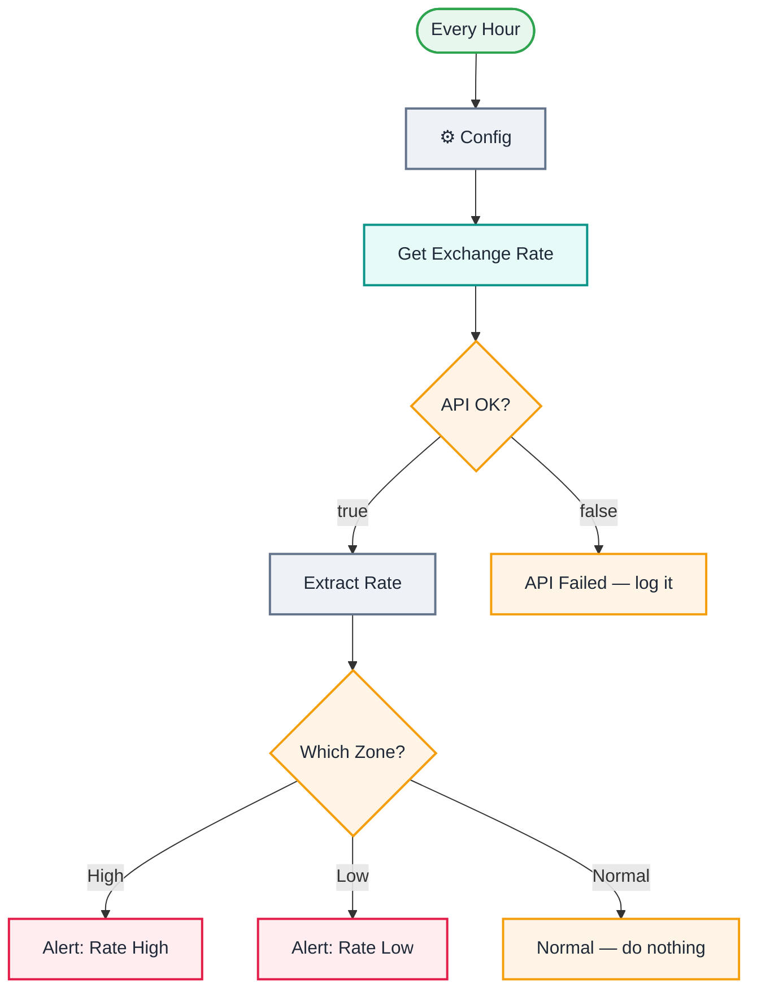

<div align="center">

# L04 · Currency rate alert

   


</div>

> [!NOTE]
> **The real-world problem.** If you send money abroad, pay overseas freelancers or invoice in USD, the exchange rate matters. You don't want to check it by hand, and you don't want an email every hour either. You want one only when the rate crosses a threshold.

## 🎯 What you'll learn

- **IF** node: validate an API response before trusting it
- **Switch** node with named outputs plus a fallback
- Comparing numbers against Config values
- **Stop and Error**: fail loudly so your error workflow (L19) catches it
- Dynamic URLs: `https://…/latest/{{ $json.base }}`

## 🏗️ Architecture



<details><summary>Plain-text flow</summary>

```
Schedule (hourly) → Config → HTTP → IF ok?
   ├─ true → Extract Rate → Switch ─ High → Gmail
   │                               ├ Low  → Gmail
   │                               └ Normal → (nothing)
   └─ false → Stop and Error
```

</details>

## 🔑 Credentials

| You need | Where to get it |
|---|---|
| Gmail OAuth2 (open.er-api.com needs no key) | [docs/credentials.md](../../docs/credentials.md) |

## 🛠️ Build it step by step

> [!TIP]
> In a hurry? Import [`workflow.json`](workflow.json) (copy → paste on the n8n canvas). Learning? Build it yourself using the steps below, then compare.

1. Schedule Trigger → *Hours*, every 1.
2. Config: base, target, high, low, email_to.
3. HTTP GET `https://open.er-api.com/v6/latest/{{ $json.base }}`.
4. **IF**: `{{ $json.result }}` *is equal to* `success`.
5. On true, add a **Set** node that extracts `rate = {{ $json.rates[$('⚙️ Config').item.json.target] }}` as a *Number*.
6. Add a **Switch** in *Rules* mode. Rule 1: rate ≥ high, rename the output to `High`. Rule 2: rate ≤ low, `Low`. Options → *Fallback output* → Extra output, named `Normal`.
7. Connect a Gmail node to High and to Low, and a **No Operation** to Normal.
8. On IF false, add **Stop and Error**.

## ✅ Test it

- [ ] Set `high` to 1 and run it. You should get the HIGH email.
- [ ] Set `base` to `XYZ` and run it. You should hit the Stop and Error branch.

## 🧯 Troubleshooting

<details><summary><b>Switch always goes to Normal</b></summary>

The rate was saved as a string. Set its type to *Number* in the Set node.

</details>

<details><summary><b>Too many emails</b></summary>

Add a cooldown: store the last alert time with `$getWorkflowStaticData` (see L21).

</details>

## 🚀 Level up

- Track 3 currencies at once (Config returns 3 items).
- Log every reading to Google Sheets and chart it.

---

<p align="center"><a href="../L03-job-search-api/README.md">← L03 · Daily job search digest</a> &nbsp;·&nbsp; <a href="../../README.md#-the-learning-path">📚 All lessons</a> &nbsp;·&nbsp; <a href="../L05-rss-news-code-node/README.md">L05 · Tech news digest →</a></p>
