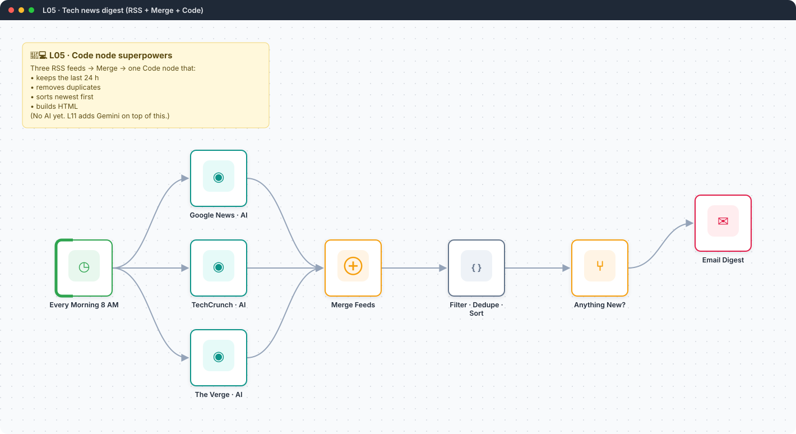
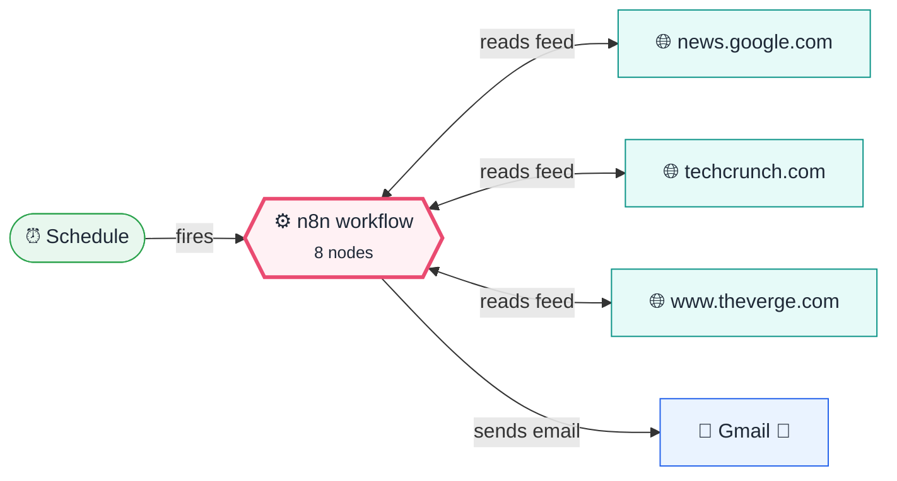
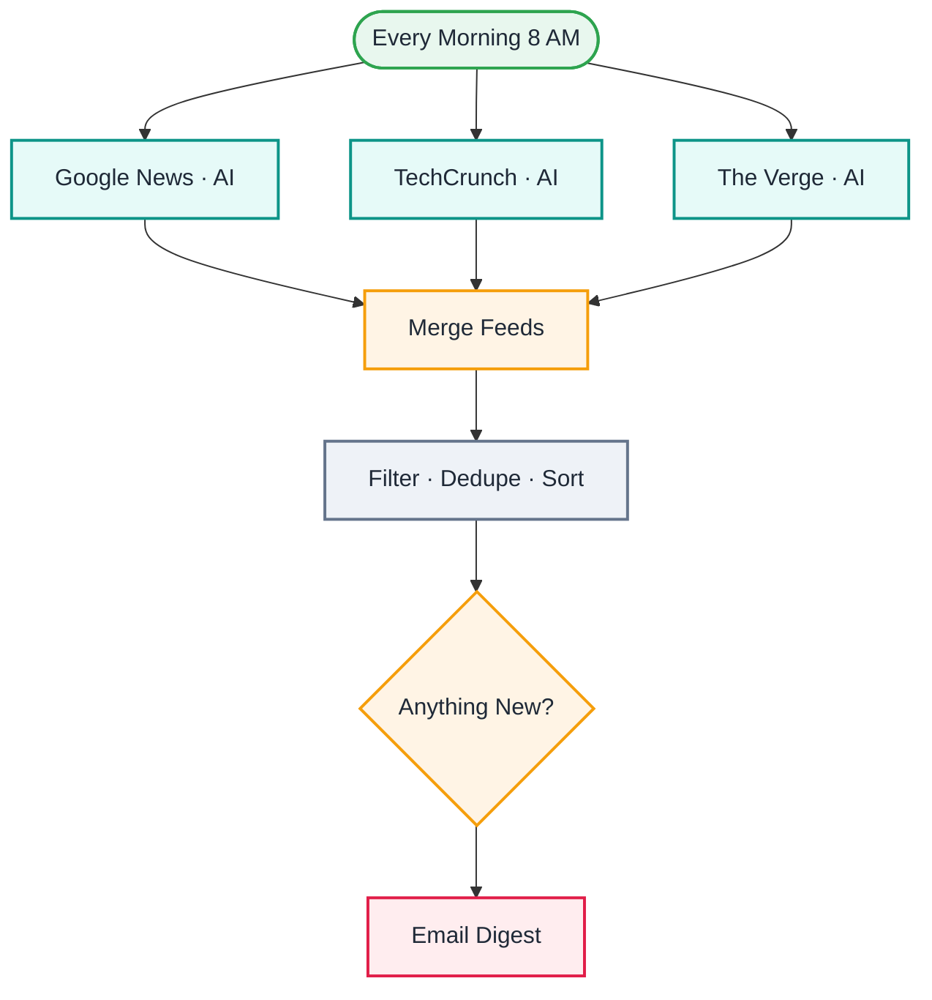

<div align="center">

# L05 · Tech news digest with the Code node

    



</div>

> [!NOTE]
> **The real-world problem.** You follow 3 news sites and see the same story three times. This merges the feeds, removes duplicates and sends one clean list.

## 💡 Concept first

**📌 Key idea:** The Code node is for **reshaping many items at once**: filter, dedupe, sort, group, and many→one.

**🧠 Mental model:** A spreadsheet formula column plus a pivot table, written in a few lines of JavaScript.

**🚫 When *not* to use it:** Don't hide business rules in 80 lines of code. If a non-developer must change it, use Set/IF/Switch or a Config node.

## 🎯 What you'll learn

- RSS Read node
- **Merge** node with 3 inputs (append mode)
- Code node: filter / map / sort / dedupe / reduce many items into one
- *On Error → Continue*: one broken feed shouldn't kill the run
- An IF guard so you don't get empty emails

## 🏗️ Architecture

**System context:** who and what this workflow talks to, and what crosses each boundary. 🔑 = needs a credential · 🧑 = a human decides.



<details><summary><b>Node-level flow</b> (every node and branch)</summary>



</details>

<details><summary>Plain-text flow</summary>

```
Schedule ─┬─ RSS Google News ─┐
          ├─ RSS TechCrunch  ─┼─ Merge → Code (filter/dedupe/sort) → IF count>0 → Gmail
          └─ RSS The Verge   ─┘
```

</details>

## 🔑 Credentials

| You need | Where to get it |
|---|---|
| Gmail OAuth2 | [docs/credentials.md](../../docs/credentials.md) |

## 📝 Before you run it

Replace these placeholder values with your own:

| Node | Field | Placeholder |
|---|---|---|
| Email Digest | `sendTo` | `you@example.com` |

Nodes that need a credential selected after import: **Gmail**.

## 🛠️ Build it step by step

> [!TIP]
> In a hurry? Import [`workflow.json`](workflow.json) (copy → paste on the n8n canvas). Learning? Build it yourself using the steps below, then compare.

1. Add a Schedule Trigger and 3 **RSS Read** nodes, each connected to the trigger.
2. On each RSS node: Settings → *On Error* → **Continue**.
3. Add **Merge** → *Number of inputs* 3, and wire each feed to its own input.
4. Add a **Code** node (*Run once for all items*) and paste the code. Read it line by line; each `.filter` / `.map` is one idea.
5. Add an **IF** node: `count > 0`.
6. Add Gmail on the true branch.

## 🔍 Node-by-node reference

Every node in this workflow and every setting inside it, generated from [`workflow.json`](workflow.json). Click a node to expand it.

<details><summary><b>1. Every Morning 8 AM</b> · <code>Schedule Trigger</code> v1.2</summary>

> Starts the workflow on a timer or cron expression. Only fires when the workflow is **active**.

| Property | Value |
|---|---|
| `rule.interval.triggerAtHour` | 8 |

</details>

<details><summary><b>2. Merge Feeds</b> · <code>Merge</code> v3</summary>

> Waits for several inputs and combines them into one stream.

| Property | Value |
|---|---|
| `numberInputs` | 3 |

</details>

<details><summary><b>3. Google News · AI</b> · <code>RSS Read</code> v1.1</summary>

> Reads an RSS/Atom feed; outputs one item per article.

| Property | Value |
|---|---|
| `url` | https://news.google.com/rss/search?q=artificial+intelligence+when:1d&hl=en-IN&gl=IN&cei… |
| `⚙️ On error` | Continue (regular output) |

</details>

<details><summary><b>4. TechCrunch · AI</b> · <code>RSS Read</code> v1.1</summary>

> Reads an RSS/Atom feed; outputs one item per article.

| Property | Value |
|---|---|
| `url` | https://techcrunch.com/category/artificial-intelligence/feed/ |
| `⚙️ On error` | Continue (regular output) |

</details>

<details><summary><b>5. The Verge · AI</b> · <code>RSS Read</code> v1.1</summary>

> Reads an RSS/Atom feed; outputs one item per article.

| Property | Value |
|---|---|
| `url` | https://www.theverge.com/rss/ai-artificial-intelligence/index.xml |
| `⚙️ On error` | Continue (regular output) |

</details>

<details><summary><b>6. Filter · Dedupe · Sort</b> · <code>Code</code> v2</summary>

> Runs JavaScript. *Run once for all items* sees every item; *for each item* sees one at a time.

| Property | Value |
|---|---|
| `jsCode` | (JavaScript, 13 lines, shown below) |

**Code:**

```javascript
const cutoff = Date.now() - 24 * 3600 * 1000;
const seen = new Set();
const norm = t => String(t || '').toLowerCase().replace(/[^a-z0-9 ]/g, '').slice(0, 60);
const articles = $input.all().map(i => i.json)
  .filter(a => a.title && a.link)
  .map(a => ({ title: a.title.trim(), link: a.link, source: a.creator || (a.link.match(/https?:\/\/(?:www\.)?([^/]+)/) || [])[1] || 'unknown', ts: Date.parse(a.isoDate || a.pubDate || '') || 0 }))
  .filter(a => a.ts >= cutoff)
  .filter(a => { const k = norm(a.title); if (seen.has(k)) return false; seen.add(k); return true; })
  .sort((a, b) => b.ts - a.ts)
  .slice(0, 25);
const li = articles.map(a => `<li><a href="${a.link}">${a.title}</a> <small>(${a.source})</small></li>`).join('');
const listText = articles.map((a, i) => `${i + 1}. ${a.title} — ${a.link}`).join('\n');
return [{ json: { count: articles.length, html: `<ol>${li}</ol>`, listText } }];
```

</details>

<details><summary><b>7. Anything New?</b> · <code>If</code> v2.2</summary>

> Splits items into a **true** and a **false** branch.

| Property | Value |
|---|---|
| `condition` | `{{ $json.count }} > 0` |

</details>

<details><summary><b>8. Email Digest</b> · <code>Gmail</code> v2.1</summary>

> Sends, reads or labels email. `sendAndWait` pauses the workflow for a human reply.

| Property | Value |
|---|---|
| `sendTo` | you@example.com |
| `subject` | `Tech news · {{ $json.count }} stories · {{ $now.toFormat('dd LLL') }}` |
| `emailType` | html |
| `message` | `<h2>Last 24 hours in AI</h2>{{ $json.html }}` |
| `appendAttribution` | off |

</details>

> [!TIP]
> ⚙️ rows come from each node's **Settings** tab, not its Parameters tab. `{{ … }}` values are **expressions** evaluated at run time. See [workflow anatomy](../../docs/workflow-anatomy.md) for what every property means.

## ✅ Test it

> [!TIP]
> **Automated end-to-end test: passed.** 8/8 nodes executed in real n8n (1 credentialed nodes replaced by realistic mocks), 1 behaviour checks. See [tests/](../../tests/README.md).

- [ ] Run it and open the Code node output. `listText` is prepared for the AI version in L11.
- [ ] Replace one feed URL with a broken one. The workflow should still finish.

## 🧯 Troubleshooting

Problems specific to this workflow are below. For general ones (expressions, items, triggers, AI), see [common mistakes](../../docs/common-mistakes.md).

<details><summary><b>Merge waits forever or outputs nothing</b></summary>

Every input must be connected. Check the numbered input dots on Merge.

</details>

<details><summary><b>All articles filtered out</b></summary>

Some feeds use `pubDate` and not `isoDate`. The code handles both, so check your feed's field names.

</details>

## 🚀 Level up

- Add your own feeds (company blog, Hacker News `https://hnrss.org/frontpage`).
- Continue to **L11** to have Gemini summarise this.

---

<p align="center"><a href="../L04-currency-alert-switch/README.md">← L04 · Currency rate alert</a> &nbsp;·&nbsp; <a href="../../README.md#-the-learning-path">📚 All lessons</a> &nbsp;·&nbsp; <a href="../L06-gmail-pdf-to-drive/README.md">L06 · Save Gmail PDF attachments to Google Drive →</a></p>
