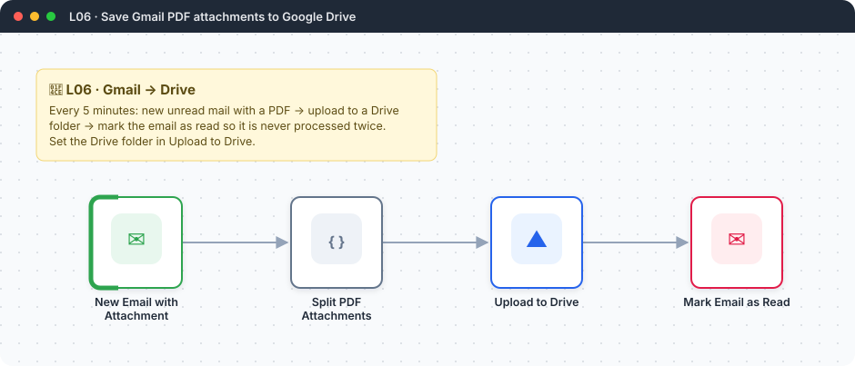
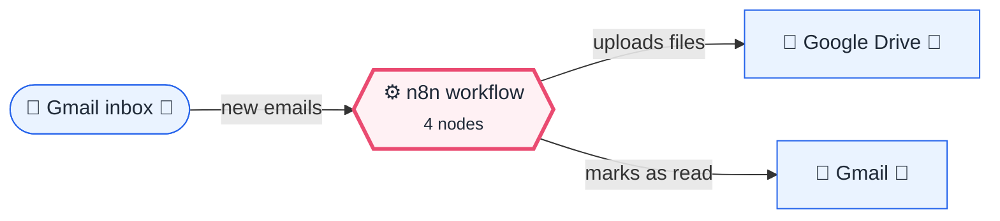

```mermaid
flowchart LR
  n0(["New Email with Attachment"]):::trigger
  n1["Split PDF Attachments"]:::code
  n2["Upload to Drive"]:::data
  n3["Mark Email as Read"]:::msg
  n0 --> n1
  n1 --> n2
  n2 --> n3
  classDef trigger fill:#E8F7EE,stroke:#2EA44F,stroke-width:2px,color:#1F2937
  classDef ai fill:#F1EBFF,stroke:#7C3AED,stroke-width:2px,color:#1F2937
  classDef sub fill:#F7F3FF,stroke:#A78BFA,stroke-width:2px,color:#1F2937
  classDef logic fill:#FFF4E5,stroke:#F59E0B,stroke-width:2px,color:#1F2937
  classDef code fill:#EEF2F7,stroke:#64748B,stroke-width:2px,color:#1F2937
  classDef data fill:#EAF3FF,stroke:#2563EB,stroke-width:2px,color:#1F2937
  classDef http fill:#E6FAF8,stroke:#0D9488,stroke-width:2px,color:#1F2937
  classDef msg fill:#FFEDEF,stroke:#E11D48,stroke-width:2px,color:#1F2937
```

<div align="center">

# L06 · Gmail PDF attachments → Google Drive

    [](https://github.com/callme-siva/n8n-knowledge/actions/workflows/validate.yml)



</div>

> [!NOTE]
> **The real-world problem.** Invoices, bills, payslips and statements arrive as PDFs in email and get lost. This workflow files every PDF into one Drive folder with a date prefix, so you can find them at tax time.

## 💡 Concept first

**📌 Key idea:** Files travel as **binary data** next to the JSON; and every polling workflow must mark what it has processed (**idempotency**).

**🧠 Mental model:** A parcel (binary) with a delivery note (JSON) attached. The postman must stamp "delivered" or he'll deliver it again tomorrow.

**🚫 When *not* to use it:** Don't poll every minute for things that can push events to you (webhooks). Polling costs API quota.

## 🎯 What you'll learn

- Gmail Trigger (polling) with Gmail search filters
- Working with **binary data** (files) in n8n
- Splitting one email into many file items
- **Idempotency**: mark as read so the same email is never processed twice
- Google Drive upload into a folder

## 🏗️ Architecture

**System context:** who and what this workflow talks to, and what crosses each boundary. 🔑 = needs a credential · 🧑 = a human decides.



<details><summary><b>Node-level flow</b> (every node and branch)</summary>



</details>

<details><summary>Plain-text flow</summary>

```
Gmail Trigger (every 5 min, unread + PDF) → Code (1 item per PDF) → Drive upload → Gmail mark as read
```

</details>

## 🔑 Credentials

| You need | Where to get it |
|---|---|
| Gmail OAuth2 | [docs/credentials.md](../../docs/credentials.md) |
| Google Drive OAuth2 (the same Google Cloud project works, see docs/credentials.md) | [docs/credentials.md](../../docs/credentials.md) |

## 📝 Before you run it

Replace these placeholder values with your own:

| Node | Field | Placeholder |
|---|---|---|
| Upload to Drive | `folderId` | `PASTE_YOUR_DRIVE_FOLDER_URL` |

Nodes that need a credential selected after import: **Gmail**, **Gmail Trigger**, **Google Drive**.

### 📥 Starter files

Sample files: [invoice-valid.pdf](../../templates/files/invoice-valid.pdf) (email it to yourself as an attachment)

## 🛠️ Build it step by step

> [!TIP]
> In a hurry? Import [`workflow.json`](workflow.json) (copy → paste on the n8n canvas). Learning? Build it yourself using the steps below, then compare.

1. Add **Gmail Trigger**: poll every 5 minutes. Turn *Simplify* off. Filters: search `has:attachment filename:pdf`, read status *Unread*. Options: *Download attachments* on.
2. Send yourself a test email with a PDF, then click *Fetch test event*. Look at the **Binary** tab of the output.
3. Add the **Code** node: it loops over `item.binary` and emits one item per PDF.
4. Add **Google Drive → Upload file**. Folder: paste your folder URL. File name: `{{ $json.fileName }}`.
5. Add **Gmail → Mark as read** with `messageId` from the Code node.
6. Activate it.

## 🔍 Node-by-node reference

Every node in this workflow and every setting inside it, generated from [`workflow.json`](workflow.json). Click a node to expand it.

<details><summary><b>1. New Email with Attachment</b> · <code>Gmail Trigger</code> v1.2</summary>

> Polls Gmail on an interval and starts once per matching email.

| Property | Value |
|---|---|
| `pollTimes.item.mode` | everyX |
| `pollTimes.item.value` | 5 |
| `pollTimes.item.unit` | minutes |
| `simple` | off |
| `filters.q` | has:attachment filename:pdf |
| `filters.readStatus` | unread |
| `downloadAttachments` | ✅ on |
| `dataPropertyAttachmentsPrefixName` | attachment_ |

</details>

<details><summary><b>2. Split PDF Attachments</b> · <code>Code</code> v2</summary>

> Runs JavaScript. *Run once for all items* sees every item; *for each item* sees one at a time.

| Property | Value |
|---|---|
| `jsCode` | (JavaScript, 12 lines, shown below) |

**Code:**

```javascript
// One email can carry many files. Output one item per PDF.
const out = [];
for (const item of $input.all()) {
  for (const [key, bin] of Object.entries(item.binary || {})) {
    const name = bin.fileName || key;
    if (bin.mimeType === 'application/pdf' || name.toLowerCase().endsWith('.pdf')) {
      const date = (item.json.date ? DateTime.fromISO(new Date(item.json.date).toISOString()) : $now).setZone($now.zoneName).toISODate();
      out.push({ json: { fileName: `${date}_${name}`, from: item.json.from?.text || '', subject: item.json.subject || '', messageId: item.json.id }, binary: { data: bin } });
    }
  }
}
return out;
```

</details>

<details><summary><b>3. Upload to Drive</b> · <code>Google Drive</code> v3</summary>

> Uploads, downloads or moves files in Drive.

| Property | Value |
|---|---|
| `name` | `{{ $json.fileName }}` |
| `driveId` | My Drive |
| `folderId` | PASTE_YOUR_DRIVE_FOLDER_URL |
| `⚙️ Retry on fail` | ✅ on |

</details>

<details><summary><b>4. Mark Email as Read</b> · <code>Gmail</code> v2.1</summary>

> Sends, reads or labels email. `sendAndWait` pauses the workflow for a human reply.

| Property | Value |
|---|---|
| `operation` | markAsRead |
| `messageId` | `{{ $('Split PDF Attachments').item.json.messageId }}` |
| `⚙️ Retry on fail` | ✅ on |
| `⚙️ Max tries` | 3 |
| `⚙️ Wait between tries (ms)` | 3000 |

</details>

> [!TIP]
> ⚙️ rows come from each node's **Settings** tab, not its Parameters tab. `{{ … }}` values are **expressions** evaluated at run time. See [workflow anatomy](../../docs/workflow-anatomy.md) for what every property means.

## ✅ Test it

> [!TIP]
> **Automated end-to-end test: passed.** 4/4 nodes executed in real n8n (3 credentialed or AI nodes replaced by fixtures, so AI output itself isn't tested), 2 behaviour checks. See [tests/](../../tests/README.md).

- [ ] Email yourself 2 PDFs and 1 image. Exactly 2 files should appear in Drive.
- [ ] Check that the email is now read and that the next poll doesn't re-upload it.

## 🧯 Troubleshooting

Problems specific to this workflow are below. For general ones (expressions, items, triggers, AI), see [common mistakes](../../docs/common-mistakes.md).

<details><summary><b>Same file uploaded again and again</b></summary>

This was the bug in the original version: nothing marked the email as read. Keep the last node.

</details>

<details><summary><b>No binary data</b></summary>

*Download attachments* is off, or *Simplify* is on.

</details>

<details><summary><b>Drive 404 folder</b></summary>

Use the folder URL, and make sure your Google account owns the folder.

</details>

## 🏋️ Practice

Try each challenge **before** opening the hint. Solutions show the exact expressions and code.

**⭐ Challenge 1:** Save PDFs into a sub-folder **per sender domain** (e.g. `/airtel.com`).

<details><summary>💡 Hint</summary>

You can build the file name, or use a Drive *Create folder* step first.

</details>
<details><summary>✅ Solution</summary>

Quick version: prefix the name. In *Split PDF Attachments*, add `const domain = (item.json.from?.text || '').split('@')[1]?.replace('>', '') || 'unknown';` and use `` fileName: `${domain}/${date}_${name}` ``. Proper version: *Drive → Search folder by name*, create it if missing (IF), then upload into its ID.

</details>

**⭐⭐ Challenge 2:** Skip files you already saved, even if the same PDF arrives in a new email.

<details><summary>💡 Hint</summary>

Hash the file content; the Crypto node can hash binary data.

</details>
<details><summary>✅ Solution</summary>

After the split, add **Crypto → Hash → SHA256** with *Binary file* on (property `data`), output `sha`. Then **Remove Duplicates → previous executions** on `{{ $json.sha }}`. Same bytes, same hash, so the file is skipped.

</details>

## 🚀 Ideas to extend it

- Route by sender: bank → /Bank, employer → /Payslips (use Switch).
- Use Gemini to read the PDF and rename it `2026-09 Airtel bill ₹799.pdf` (see L12).

---

<p align="center"><a href="../L05-rss-news-code-node/README.md">← L05 · Tech news digest</a> &nbsp;·&nbsp; <a href="../../README.md#-the-learning-path">📚 All lessons</a> &nbsp;·&nbsp; <a href="../L07-lead-capture-sheets/README.md">L07 · Lead capture form → Google Sheets + welcome email →</a></p>
