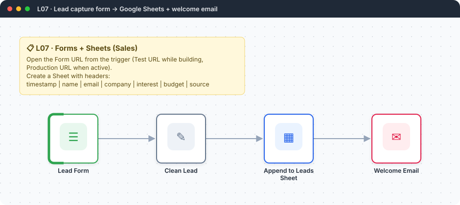
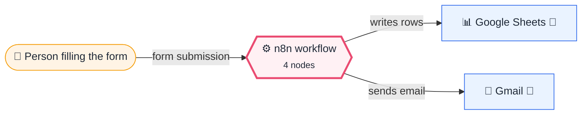
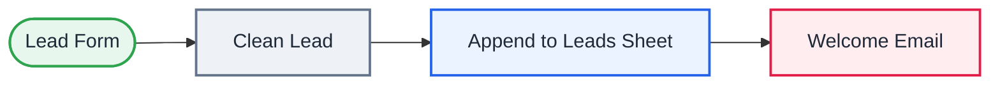

# L07 · Lead capture form → Sheets → welcome email

    

> [!NOTE]
> **The real-world problem.** A small business or freelancer needs a *Contact us* form that stores the lead somewhere useful and replies instantly. No Typeform, no CRM subscription.

## 💡 Concept first

**📌 Key idea:** A form + a sheet is the simplest possible **system of record**: capture, clean, store, acknowledge.

**🧠 Mental model:** A reception desk: take the visitor's details, write them neatly in the register, hand them a receipt.

**🚫 When *not* to use it:** Don't use Sheets as a database beyond a few thousand rows or with several writers at once. Move to Airtable, Postgres or a CRM.

## 🎯 What you'll learn

- n8n **Form Trigger**: a hosted form with no web developer needed
- Cleaning input (trim, lowercase) in a Set node
- Google Sheets **Append row** with auto-mapped columns
- Sending a personalised email to the submitter

## 🏗️ Architecture

**System context:** who and what this workflow talks to, and what crosses each boundary. 🔑 = needs a credential · 🧑 = a human decides.

<b>Node-level flow</b> (every node and branch)

## 🔑 Credentials

| You need | Where to get it |
|---|---|
| Google Sheets OAuth2 | [docs/credentials.md](../../docs/credentials.md) |
| Gmail OAuth2 | [docs/credentials.md](../../docs/credentials.md) |

## 📝 Before you run it

Replace these placeholder values with your own:

| Node | Field | Placeholder |
|---|---|---|
| Append to Leads Sheet | `documentId` | `PASTE_YOUR_GOOGLE_SHEET_URL` |

Nodes that need a credential selected after import: **Gmail**, **Google Sheets**.

### 📥 Starter files

Create each tab from its template, so column names match exactly: **Google Sheets → File → Import → Upload** the CSV → *Insert new sheet(s)*. The tab takes the file's name.

| Tab | Template | Columns |
|---|---|---|
| `Leads` | [Leads.csv](../../templates/L07-lead-capture-sheets/Leads.csv) | `timestamp`, `email`, `name`, `company`, `budget`, `interest`, `source` |

Columns are generated from what this workflow actually reads and writes in the automated test, so they can't drift from the workflow.

## 🛠️ Build it step by step

> [!TIP]
> In a hurry? Import [`workflow.json`](workflow.json) (copy → paste on the n8n canvas). Learning? Build it yourself using the steps below, then compare.

1. Create a Google Sheet named *Leads* with header row: `timestamp, name, email, company, interest, budget, source`.
2. Add **n8n Form Trigger** with the 5 fields (Email field type = *Email*).
3. Open the **Test URL**, submit once, and look at the output keys: they are the field labels.
4. Add a **Set** node that renames and cleans the fields so they match your sheet headers exactly.
5. Add **Google Sheets → Append row**. Paste the sheet URL, pick the tab, *Map automatically*.
6. Add Gmail to `{{ $('Clean Lead').item.json.email }}`.

## 🔍 Node-by-node reference

Every node in this workflow and every setting inside it, generated from [`workflow.json`](workflow.json). Click a node to expand it.

<b>1. Lead Form</b> · <code>n8n Form Trigger</code> v2.2

> Hosts a web form; each submission starts one execution. Field labels become JSON keys.

| Property | Value |
|---|---|
| `formTitle` | Book a free demo |
| `formDescription` | Tell us a little about you. We reply within one business day. |
| `formFields.values` | Name *, Email *, Company, Interested in *, Monthly budget (INR) |
| `respondWithOptions.formSubmittedText` | Thanks! Check your inbox for a confirmation. |

<b>2. Clean Lead</b> · <code>Edit Fields (Set)</code> v3.4

> Creates, renames or overwrites fields without code.

| Property | Value |
|---|---|
| `timestamp` | `{{ $now.toISO() }}` |
| `name` | `{{ $json.Name.trim() }}` |
| `email` | `{{ $json.Email.trim().toLowerCase() }}` |
| `company` | `{{ $json.Company \|\| '-' }}` |
| `interest` | `{{ $json['Interested in'] }}` |
| `budget` | `{{ $json['Monthly budget (INR)'] \|\| 'not given' }}` |
| `source` | web-form |

<b>3. Append to Leads Sheet</b> · <code>Google Sheets</code> v4.5

> Reads, appends or updates rows in a spreadsheet.

| Property | Value |
|---|---|
| `operation` | append |
| `documentId` | PASTE_YOUR_GOOGLE_SHEET_URL |
| `sheetName` | Leads |
| `columns.mappingMode` | autoMapInputData |
| `⚙️ Retry on fail` | ✅ on |
| `⚙️ Max tries` | 3 |
| `⚙️ Wait between tries (ms)` | 3000 |

<b>4. Welcome Email</b> · <code>Gmail</code> v2.1

> Sends, reads or labels email. `sendAndWait` pauses the workflow for a human reply.

| Property | Value |
|---|---|
| `sendTo` | `{{ $('Clean Lead').item.json.email }}` |
| `subject` | `Thanks {{ $('Clean Lead').item.json.name }} — your demo request` |
| `emailType` | html |
| `message` | `
Hi {{ $('Clean Lead').item.json.name }},

Thanks for your interest in <b>{{ $('Clean Lead').item.json.interest }}</b>. We'll reply within one business day with a few slots.

— Team
` |
| `appendAttribution` | off |
| `⚙️ Retry on fail` | ✅ on |
| `⚙️ Max tries` | 3 |
| `⚙️ Wait between tries (ms)` | 3000 |

> [!TIP]
> ⚙️ rows come from each node's **Settings** tab, not its Parameters tab. `{{ … }}` values are **expressions** evaluated at run time. See [workflow anatomy](../../docs/workflow-anatomy.md) for what every property means.

## ✅ Test it

> [!TIP]
> **Automated end-to-end test: passed.** 4/4 nodes executed in real n8n (3 credentialed or AI nodes replaced by fixtures, so AI output itself isn't tested), 2 behaviour checks. See [tests/](../../tests/README.md).

- [ ] Submit the form 3 times with different data. You should see 3 rows and 3 emails.
- [ ] Activate it and share the **Production URL**.

## 🧯 Troubleshooting

Problems specific to this workflow are below. For general ones (expressions, items, triggers, AI), see [common mistakes](../../docs/common-mistakes.md).

<b>Columns are empty in the sheet</b>

The header names don't exactly match the Set field names. Spaces and case matter.

<b>The Test URL stops working</b>

Test URLs listen only while you click *Execute*. Use the Production URL once the workflow is active.

## 🏋️ Practice

Try each challenge **before** opening the hint. Solutions show the exact expressions and code.

**⭐ Challenge 1:** Reject personal email domains (gmail, yahoo, hotmail) with a polite message.

💡 Hint

Add an IF after *Clean Lead*.

✅ Solution

IF `{{ /@(gmail|yahoo|hotmail|outlook)\./i.test($json.email) }}` *is true*: send a "please use your work email" reply and stop. On false, continue to Sheets.

**⭐⭐ Challenge 2:** Don't store duplicate leads. Update the existing row instead.

💡 Hint

Sheets has an *Append or Update* operation with a matching column.

✅ Solution

Change the Sheets operation to **Append or Update Row**, matching column `email`. Resubmitting the form now updates the same row (like Q06 and P04).

## 🚀 Ideas to extend it

- Add a duplicate check: *Sheets → Get rows* filtered by email before appending.
- Score the lead with AI and route hot leads to Slack (see **L22**).

---

<a href="../L06-gmail-pdf-to-drive/README.md">← L06 · Save Gmail PDF attachments to Google Drive</a> &nbsp;·&nbsp; <a href="../../README.md#-the-learning-path">📚 All lessons</a> &nbsp;·&nbsp; <a href="../L08-jira-stale-stories/README.md">L08 · Daily stale Jira stories report →</a>

