<div align="center">

# L08 · Daily stale Jira stories report

   


</div>

> [!NOTE]
> **The real-world problem.** Stories sit "In Progress" for days without anyone saying so at stand-up. A Scrum Master wants a list every weekday morning of what's stuck and who owns it, so the stand-up can start with it.

## 🎯 What you'll learn

- Jira Software node + **JQL** queries
- Cron expression for weekdays only (`0 9 * * 1-5`)
- `alwaysOutputData`: still send the ✅ email when Jira returns nothing
- Grouping and counting with `reduce`
- Conditional styling in HTML (red if more than 7 days)

## 🏗️ Architecture

```mermaid
flowchart LR
  n0(["Weekdays 9 AM"]):::trigger
  n1["⚙️ Config"]:::code
  n2["Search Stale Stories"]:::data
  n3["Build Report"]:::code
  n4["Email Scrum Master"]:::msg
  n0 --> n1
  n1 --> n2
  n2 --> n3
  n3 --> n4
  classDef trigger fill:#E8F7EE,stroke:#2EA44F,stroke-width:2px,color:#1F2937
  classDef ai fill:#F1EBFF,stroke:#7C3AED,stroke-width:2px,color:#1F2937
  classDef sub fill:#F7F3FF,stroke:#A78BFA,stroke-width:2px,color:#1F2937
  classDef logic fill:#FFF4E5,stroke:#F59E0B,stroke-width:2px,color:#1F2937
  classDef code fill:#EEF2F7,stroke:#64748B,stroke-width:2px,color:#1F2937
  classDef data fill:#EAF3FF,stroke:#2563EB,stroke-width:2px,color:#1F2937
  classDef http fill:#E6FAF8,stroke:#0D9488,stroke-width:2px,color:#1F2937
  classDef msg fill:#FFEDEF,stroke:#E11D48,stroke-width:2px,color:#1F2937
```



<details><summary>Plain-text flow</summary>

```
Schedule (Mon–Fri 9 AM) → Config → Jira search (JQL) → Code (table + per-person count) → Gmail
```

</details>

## 🔑 Credentials

| You need | Where to get it |
|---|---|
| Jira Software Cloud | email + API token from id.atlassian.com → Security → API tokens |
| Gmail OAuth2 | [docs/credentials.md](../../docs/credentials.md) |

## 🛠️ Build it step by step

> [!TIP]
> In a hurry? Import [`workflow.json`](workflow.json) (copy → paste on the n8n canvas). Learning? Build it yourself using the steps below, then compare.

1. Create an API token at https://id.atlassian.com/manage-profile/security/api-tokens and add a **Jira SW Cloud API** credential (domain + email + token).
2. Schedule Trigger → *Custom (cron)* → `0 9 * * 1-5`.
3. Config: project_key, stale_days, email_to, jira_base_url.
4. **Jira → Issue → Get many**, Return all, Options → JQL. Test your JQL in Jira's own search first!
5. Node Settings → **Always Output Data** on (so an empty result still continues).
6. Code node builds the report, then Gmail.

## ✅ Test it

- [ ] Set `stale_days` to 0 so you see every in-progress story.
- [ ] Use a project key that doesn't exist. You should get a clear Jira error.

## 🧯 Troubleshooting

<details><summary><b>JQL: field 'statusCategory' does not exist</b></summary>

On older Jira Server, use `status = "In Progress"`.

</details>

<details><summary><b>No email when there are no stale stories</b></summary>

Turn on *Always Output Data* on the Jira node.

</details>

## 🚀 Level up

- Post it to the team Slack/Teams channel instead of email.
- Also comment on each stale issue: "Any blockers? 🙂".

---

<p align="center"><a href="../L07-lead-capture-sheets/README.md">← L07 · Lead capture form → Google Sheets + welcome email</a> &nbsp;·&nbsp; <a href="../../README.md#-the-learning-path">📚 All lessons</a> &nbsp;·&nbsp; <a href="../L09-webhook-expense-api/README.md">L09 · Expense logger API →</a></p>
