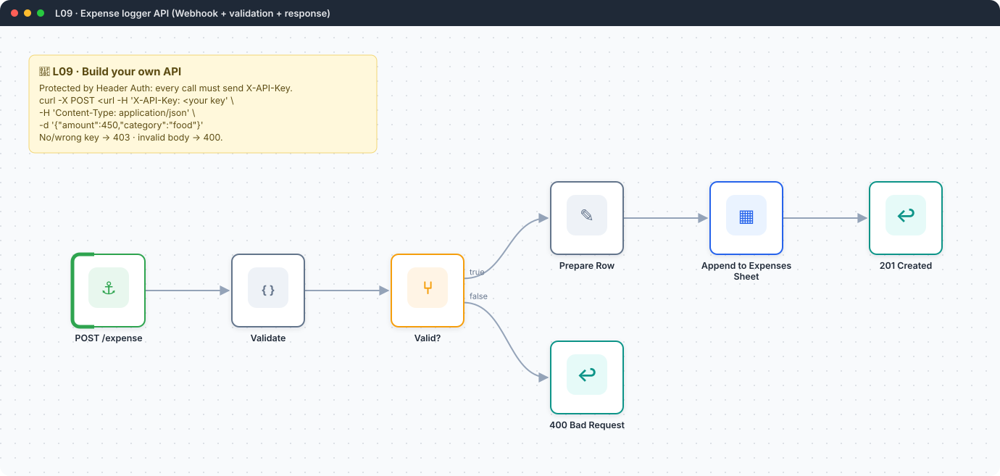
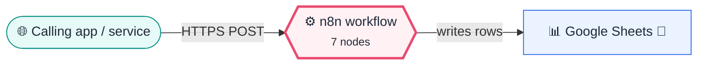

<div align="center">

# L09 · Expense logger API with Webhook

    



</div>

> [!NOTE]
> **The real-world problem.** You want to log expenses from anywhere: an iPhone Shortcut, a Telegram bot, a Google Form or another app. A webhook turns n8n into your own small API with validation and proper HTTP status codes.

## 💡 Concept first

**📌 Key idea:** A webhook turns a workflow into **your own API**: validate input, authenticate the caller, return honest status codes.

**🧠 Mental model:** A shop counter with a guard (auth), a checker (validation) and a receipt printer (201 / 400).

**🚫 When *not* to use it:** Don't expose a webhook without authentication, and don't do slow work before responding if the caller has a timeout. Respond first, then process.

## 🎯 What you'll learn

- **Webhook** node (POST, JSON body in `$json.body`)
- **Header Auth**: never expose an unauthenticated webhook to the internet
- *Respond to Webhook* for custom status codes (201 / 400)
- Input validation in Code (*Run once for each item*)
- Set node in raw JSON mode
- Test URL and Production URL

## 🏗️ Architecture

**System context:** who and what this workflow talks to, and what crosses each boundary. 🔑 = needs a credential · 🧑 = a human decides.



<details><summary><b>Node-level flow</b> (every node and branch)</summary>


</details>

<details><summary>Plain-text flow</summary>

```
Webhook POST /expense → Code validate → IF valid
  ├─ true  → Set row → Sheets append → Respond 201
  └─ false → Respond 400 {errors}
```

</details>

## 🔑 Credentials

| You need | Where to get it |
|---|---|
| Google Sheets OAuth2 | [docs/credentials.md](../../docs/credentials.md) |
| Header Auth credential | name `X-API-Key`, value = a long random string (e.g. `openssl rand -hex 24`) |

## 📝 Before you run it

Replace these placeholder values with your own:

| Node | Field | Placeholder |
|---|---|---|
| Append to Expenses Sheet | `documentId` | `PASTE_YOUR_GOOGLE_SHEET_URL` |

Nodes that need a credential selected after import: **Google Sheets**.

### 📥 Starter files

Create each tab from its template, so column names match exactly: **Google Sheets → File → Import → Upload** the CSV → *Insert new sheet(s)*. The tab takes the file's name.

| Tab | Template | Columns |
|---|---|---|
| `Expenses` | [Expenses.csv](../../templates/L09-webhook-expense-api/Expenses.csv) | `date`, `amount`, `category`, `note`, `submitted_by` |

<sub>Columns are generated from what this workflow actually reads and writes in the automated test, so they can't drift from the workflow.</sub>

## 🛠️ Build it step by step

> [!TIP]
> In a hurry? Import [`workflow.json`](workflow.json) (copy → paste on the n8n canvas). Learning? Build it yourself using the steps below, then compare.

1. Create a sheet tab *Expenses* with headers `date, amount, category, note, submitted_by`.
2. Add **Webhook**: method POST, path `expense`, Respond = *Using 'Respond to Webhook' node*.
3. Webhook → Authentication → **Header Auth** → create the credential (`X-API-Key` + random value). Unauthenticated calls are rejected with 403 before your workflow even runs.
4. Click *Listen for test event*, then run the curl command from the sticky note using the **Test URL**.
5. Add the **Validate** Code node (mode: *Run once for each item*).
6. Add **IF** `valid is true`, then on the true branch Set (raw JSON) → Sheets append → **Respond to Webhook** (201).
7. On the false branch, **Respond to Webhook** with 400.

## 🔍 Node-by-node reference

Every node in this workflow and every setting inside it, generated from [`workflow.json`](workflow.json). Click a node to expand it.

<details><summary><b>1. POST /expense</b> · <code>Webhook</code> v2</summary>

> Gives the workflow its own URL. Any HTTP call to it starts an execution.

| Property | Value |
|---|---|
| `httpMethod` | POST |
| `path` | expense |
| `authentication` | headerAuth |
| `responseMode` | responseNode |

</details>

<details><summary><b>2. Validate</b> · <code>Code</code> v2</summary>

> Runs JavaScript. *Run once for all items* sees every item; *for each item* sees one at a time.

| Property | Value |
|---|---|
| `mode` | runOnceForEachItem |
| `jsCode` | (JavaScript, 8 lines, shown below) |

**Code:**

```javascript
const b = $json.body || {};
const allowed = ['food', 'travel', 'office', 'software', 'other'];
const errors = [];
const amount = Number(b.amount);
if (!Number.isFinite(amount) || amount <= 0) errors.push('amount must be a positive number');
if (!allowed.includes(String(b.category || '').toLowerCase())) errors.push(`category must be one of ${allowed.join(', ')}`);
return { json: { valid: errors.length === 0, errors,
  row: { date: b.date || $today.toISODate(), amount, category: String(b.category || '').toLowerCase(), note: b.note || '', submitted_by: b.user || 'api' } } };
```

</details>

<details><summary><b>3. Valid?</b> · <code>If</code> v2.2</summary>

> Splits items into a **true** and a **false** branch.

| Property | Value |
|---|---|
| `condition` | `{{ $json.valid }} is true` |

</details>

<details><summary><b>4. Prepare Row</b> · <code>Edit Fields (Set)</code> v3.4</summary>

> Creates, renames or overwrites fields without code.

| Property | Value |
|---|---|
| `mode` | raw |
| `jsonOutput` | `{{ JSON.stringify($json.row) }}` |

</details>

<details><summary><b>5. Append to Expenses Sheet</b> · <code>Google Sheets</code> v4.5</summary>

> Reads, appends or updates rows in a spreadsheet.

| Property | Value |
|---|---|
| `operation` | append |
| `documentId` | PASTE_YOUR_GOOGLE_SHEET_URL |
| `sheetName` | Expenses |
| `columns.mappingMode` | autoMapInputData |

</details>

<details><summary><b>6. 201 Created</b> · <code>Respond to Webhook</code> v1.1</summary>

> Sends the HTTP response (status code and body) back to the webhook caller.

| Property | Value |
|---|---|
| `respondWith` | json |
| `responseBody` | `{{ { ok: true, saved: $('Validate').item.json.row } }}` |
| `responseCode` | 201 |

</details>

<details><summary><b>7. 400 Bad Request</b> · <code>Respond to Webhook</code> v1.1</summary>

> Sends the HTTP response (status code and body) back to the webhook caller.

| Property | Value |
|---|---|
| `respondWith` | json |
| `responseBody` | `{{ { ok: false, errors: $json.errors } }}` |
| `responseCode` | 400 |

</details>

> [!TIP]
> ⚙️ rows come from each node's **Settings** tab, not its Parameters tab. `{{ … }}` values are **expressions** evaluated at run time. See [workflow anatomy](../../docs/workflow-anatomy.md) for what every property means.

## ✅ Test it

> [!TIP]
> **Automated end-to-end test: passed.** 6/7 nodes executed in real n8n (2 credentialed nodes replaced by realistic mocks), 2 behaviour checks. See [tests/](../../tests/README.md).

- [ ] `curl ... -H 'X-API-Key: <key>' -d '{"amount":450,"category":"food"}'` should return 201.
- [ ] `curl ... -H 'X-API-Key: <key>' -d '{"amount":-5,"category":"pizza"}'` should return 400 with 2 errors.
- [ ] The same call **without** the header should return 403.
- [ ] iPhone: Shortcuts app → *Get contents of URL* → POST JSON. That gives you a one-tap expense logger.

## 🧯 Troubleshooting

Problems specific to this workflow are below. For general ones (expressions, items, triggers, AI), see [common mistakes](../../docs/common-mistakes.md).

<details><summary><b>Webhook node not correctly configured</b></summary>

Respond mode must be *Using Respond to Webhook node* when you use that node.

</details>

<details><summary><b>404 on the production URL</b></summary>

The workflow isn't active. Test URLs use `/webhook-test/`, production uses `/webhook/`.

</details>

<details><summary><b>403 Forbidden</b></summary>

The header name or value doesn't match the credential exactly (names are case-insensitive, values are not).

</details>

## 🏋️ Practice

Try each challenge **before** opening the hint. Solutions show the exact expressions and code.

**⭐ Challenge 1:** Add an optional `date` field that must be a real date **not in the future**.

<details><summary>💡 Hint</summary>

Luxon: `DateTime.fromISO(x).isValid`.

</details>
<details><summary>✅ Solution</summary>

In *Validate*:
```javascript
if (b.date) {
  const d = DateTime.fromISO(b.date);
  if (!d.isValid) errors.push('date must be YYYY-MM-DD');
  else if (d > $now) errors.push('date cannot be in the future');
}
```

</details>

**⭐⭐ Challenge 2:** Return **200 with the existing row** if the same expense is posted twice within a minute (idempotency).

<details><summary>💡 Hint</summary>

Clients retry on timeouts. Accept an `Idempotency-Key` header and remember recent keys.

</details>
<details><summary>✅ Solution</summary>

In *Validate*, read `$json.headers['idempotency-key']`, keep recent keys in `$getWorkflowStaticData('global').keys` (key → row, with a timestamp), and if it was seen less than 60 s ago, route to a *Respond 200* with the saved row instead of appending. This is how payment APIs (Stripe) avoid double charges.

</details>

## 🚀 Ideas to extend it

- Rotate the key: create a second credential, update clients, then delete the old one.
- Add a daily 9 PM summary: *Sheets get rows* → sum by category → email.

---

<p align="center"><a href="../L08-jira-stale-stories/README.md">← L08 · Daily stale Jira stories report</a> &nbsp;·&nbsp; <a href="../../README.md#-the-learning-path">📚 All lessons</a> &nbsp;·&nbsp; <a href="../L10-form-bug-report-jira/README.md">L10 · Bug report form → Jira issue + reporter confirmation →</a></p>
