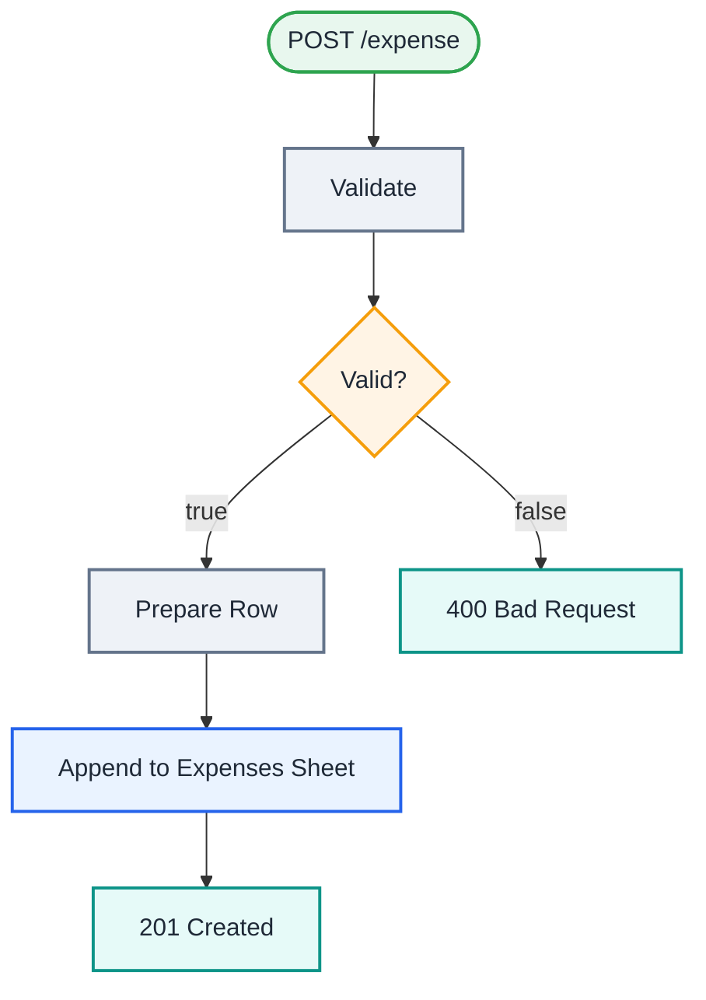

<div align="center">

# L09 · Expense logger API with Webhook

   


</div>

> [!NOTE]
> **The real-world problem.** You want to log expenses from anywhere: an iPhone Shortcut, a Telegram bot, a Google Form or another app. A webhook turns n8n into your own small API with validation and proper HTTP status codes.

## 🎯 What you'll learn

- **Webhook** node (POST, JSON body in `$json.body`)
- *Respond to Webhook* for custom status codes (201 / 400)
- Input validation in Code (*Run once for each item*)
- Set node in raw JSON mode
- Test URL and Production URL

## 🏗️ Architecture



<details><summary>Plain-text flow</summary>

```
Webhook POST /expense → Code validate → IF valid
  ├─ true  → Set row → Sheets append → Respond 201
  └─ false → Respond 400 {errors}
```

</details>

## 🔑 Credentials

| You need | Where to get it |
|---|---|
| Google Sheets OAuth2 | [docs/credentials.md](../../docs/credentials.md) |

## 🛠️ Build it step by step

> [!TIP]
> In a hurry? Import [`workflow.json`](workflow.json) (copy → paste on the n8n canvas). Learning? Build it yourself using the steps below, then compare.

1. Create a sheet tab *Expenses* with headers `date, amount, category, note, submitted_by`.
2. Add **Webhook**: method POST, path `expense`, Respond = *Using 'Respond to Webhook' node*.
3. Click *Listen for test event*, then run the curl command from the sticky note using the **Test URL**.
4. Add the **Validate** Code node (mode: *Run once for each item*).
5. Add **IF** `valid is true`, then on the true branch Set (raw JSON) → Sheets append → **Respond to Webhook** (201).
6. On the false branch, **Respond to Webhook** with 400.

## ✅ Test it

- [ ] `curl ... -d '{"amount":450,"category":"food"}'` should return 201.
- [ ] `curl ... -d '{"amount":-5,"category":"pizza"}'` should return 400 with 2 errors.
- [ ] iPhone: Shortcuts app → *Get contents of URL* → POST JSON. That gives you a one-tap expense logger.

## 🧯 Troubleshooting

<details><summary><b>Webhook node not correctly configured</b></summary>

Respond mode must be *Using Respond to Webhook node* when you use that node.

</details>

<details><summary><b>404 on the production URL</b></summary>

The workflow isn't active. Test URLs use `/webhook-test/`, production uses `/webhook/`.

</details>

<details><summary><b>Anyone can post to my webhook</b></summary>

Add *Header Auth* in the Webhook authentication option.

</details>

## 🚀 Level up

- Add Header Auth with a secret token.
- Add a daily 9 PM summary: *Sheets get rows* → sum by category → email.

---

<p align="center"><a href="../L08-jira-stale-stories/README.md">← L08 · Daily stale Jira stories report</a> &nbsp;·&nbsp; <a href="../../README.md#-the-learning-path">📚 All lessons</a> &nbsp;·&nbsp; <a href="../L10-form-bug-report-jira/README.md">L10 · Bug report form → Jira issue + reporter confirmation →</a></p>
