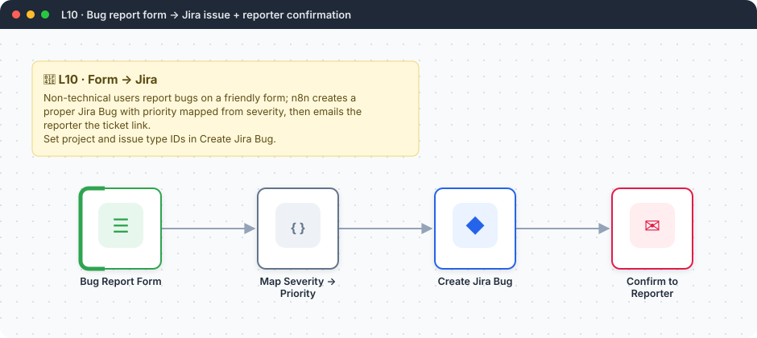

<div align="center">

# L10 · Bug report form → Jira issue

   



</div>

> [!NOTE]
> **The real-world problem.** Users, testers and business teams report bugs in chat and email, and half the details are missing. A structured form creates a proper Jira Bug with priority set, and the reporter gets the ticket number straight away.

## 🎯 What you'll learn

- Form fields with dropdowns and validation
- Mapping business language to system values (Severity → Priority)
- Jira **Create issue** with labels
- Using the output of a *create* call (`$json.key`) in the next step

## 🏗️ Architecture


<details><summary>Plain-text flow</summary>

```
Form → Code (map severity, build summary) → Jira create Bug → Gmail confirmation with ticket key
```

</details>

## 🔑 Credentials

| You need | Where to get it |
|---|---|
| Jira Software Cloud API token | [docs/credentials.md](../../docs/credentials.md) |
| Gmail OAuth2 | [docs/credentials.md](../../docs/credentials.md) |

## 🛠️ Build it step by step

> [!TIP]
> In a hurry? Import [`workflow.json`](workflow.json) (copy → paste on the n8n canvas). Learning? Build it yourself using the steps below, then compare.

1. Find your project ID and Bug issue type ID. In the Jira node, switch the fields to *From list* and pick them, which fills the IDs.
2. Build the form with 5 fields.
3. Add a Code node (*for each item*) that builds `summary`, `description` and `priority`.
4. Add **Jira → Issue → Create**. Add labels `from-form`. (Priority needs your Jira priority IDs; add it under *Additional fields* once you know them.)
5. Add Gmail using `{{ $json.key }}` from the Jira output.

## ✅ Test it

- [ ] Submit a Blocker bug. Check that the Jira issue exists and that the email shows the key.

## 🧯 Troubleshooting

<details><summary><b>issuetype: Specify a valid issue type</b></summary>

Team-managed and company-managed projects use different issue-type IDs. Pick them from the list.

</details>

<details><summary><b>Description formatting looks odd</b></summary>

Jira Cloud v3 uses ADF, and n8n converts plain text. Keep it simple, or use the Jira REST API via HTTP for rich text.

</details>

## 🚀 Level up

- Accept a screenshot upload (form *File* field) and attach it to the issue.
- Let AI detect duplicates before creating the issue (L14 agent + Jira search tool).

---

<p align="center"><a href="../L09-webhook-expense-api/README.md">← L09 · Expense logger API</a> &nbsp;·&nbsp; <a href="../../README.md#-the-learning-path">📚 All lessons</a> &nbsp;·&nbsp; <a href="../L11-ai-news-digest-llm-chain/README.md">L11 · AI news briefing →</a></p>
