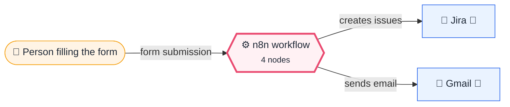
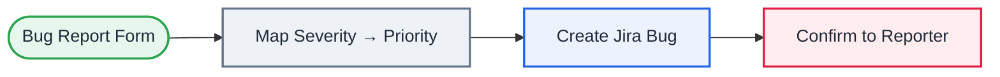

<div align="center">

# L10 · Bug report form → Jira issue

    [](https://github.com/callme-siva/n8n-knowledge/actions/workflows/validate.yml)


</div>

> [!NOTE]
> **The real-world problem.** Users, testers and business teams report bugs in chat and email, and half the details are missing. A structured form creates a proper Jira Bug with priority set, and the reporter gets the ticket number straight away.

## 💡 Concept first

**📌 Key idea:** Translate the **user's language** into the **system's language** at the boundary (Severity → Priority).

**🧠 Mental model:** An interpreter at the front desk: the customer says "it's broken", the ticket says "Highest, Auth module".

**🚫 When *not* to use it:** Don't let free-text forms create tickets without structure. Required fields and dropdowns save hours of triage.

## 🎯 What you'll learn

- Form fields with dropdowns and validation
- Mapping business language to system values (Severity → Priority)
- Jira **Create issue** with labels
- Using the output of a *create* call (`$json.key`) in the next step

## 🏗️ Architecture

**System context:** who and what this workflow talks to, and what crosses each boundary. 🔑 = needs a credential · 🧑 = a human decides.



<details><summary><b>Node-level flow</b> (every node and branch)</summary>



</details>

## 🔑 Credentials

| You need | Where to get it |
|---|---|
| Jira Software Cloud API token | [docs/credentials.md](../../docs/credentials.md) |
| Gmail OAuth2 | [docs/credentials.md](../../docs/credentials.md) |

## 📝 Before you run it

Replace these placeholder values with your own:

| Node | Field | Placeholder |
|---|---|---|
| Create Jira Bug | `project` | `REPLACE_PROJECT_ID` |
| Create Jira Bug | `issueType` | `REPLACE_BUG_ISSUE_TYPE_ID` |

Nodes that need a credential selected after import: **Gmail**, **Jira Software**.

## 🛠️ Build it step by step

> [!TIP]
> In a hurry? Import [`workflow.json`](workflow.json) (copy → paste on the n8n canvas). Learning? Build it yourself using the steps below, then compare.

1. Find your project ID and Bug issue type ID. In the Jira node, switch the fields to *From list* and pick them, which fills the IDs.
2. Build the form with 5 fields.
3. Add a Code node (*for each item*) that builds `summary`, `description` and `priority`.
4. Add **Jira → Issue → Create**. Add labels `from-form`. (Priority needs your Jira priority IDs; add it under *Additional fields* once you know them.)
5. Add Gmail using `{{ $json.key }}` from the Jira output.

## 🔍 Node-by-node reference

Every node in this workflow and every setting inside it, generated from [`workflow.json`](workflow.json). Click a node to expand it.

<details><summary><b>1. Bug Report Form</b> · <code>n8n Form Trigger</code> v2.2</summary>

> Hosts a web form; each submission starts one execution. Field labels become JSON keys.

| Property | Value |
|---|---|
| `formTitle` | Report a problem |
| `formDescription` | Found something broken? Tell us and we will track it. |
| `formFields.values` | Your email *, What is broken? *, Steps to reproduce *, Severity *, Page / module |

</details>

<details><summary><b>2. Map Severity → Priority</b> · <code>Code</code> v2</summary>

> Runs JavaScript. *Run once for all items* sees every item; *for each item* sees one at a time.

| Property | Value |
|---|---|
| `mode` | runOnceForEachItem |
| `jsCode` | (JavaScript, 5 lines, shown below) |

**Code:**

```javascript
const sev = $json['Severity'] || '';
const priority = sev.startsWith('Blocker') ? 'Highest' : sev.startsWith('Major') ? 'High' : 'Low';
return { json: { ...$json, priority,
  summary: `[${$json['Page / module'] || 'General'}] ${$json['What is broken?']}`.slice(0, 250),
  description: `*Reported by:* ${$json['Your email']}\n*Severity:* ${sev}\n\n*Steps to reproduce:*\n${$json['Steps to reproduce']}\n\n_Created automatically by n8n_` } };
```

</details>

<details><summary><b>3. Create Jira Bug</b> · <code>Jira Software</code> v1</summary>

> Creates, searches or updates Jira issues.

| Property | Value |
|---|---|
| `project` | REPLACE_PROJECT_ID |
| `issueType` | REPLACE_BUG_ISSUE_TYPE_ID |
| `summary` | `{{ $json.summary }}` |
| `additionalFields.description` | `{{ $json.description }}` |
| `additionalFields.labels` | from-form |
| `⚙️ Retry on fail` | ✅ on |
| `⚙️ Max tries` | 3 |
| `⚙️ Wait between tries (ms)` | 3000 |

</details>

<details><summary><b>4. Confirm to Reporter</b> · <code>Gmail</code> v2.1</summary>

> Sends, reads or labels email. `sendAndWait` pauses the workflow for a human reply.

| Property | Value |
|---|---|
| `sendTo` | `{{ $('Map Severity → Priority').item.json['Your email'] }}` |
| `subject` | `We logged your report: {{ $json.key }}` |
| `emailType` | html |
| `message` | `<p>Thanks! Your report is now ticket <b>{{ $json.key }}</b> with priority {{ $('Map Severity → Priority').item.json.priority }}.</p><p>We'll update you when it's fixed.</p>` |
| `appendAttribution` | off |
| `⚙️ Retry on fail` | ✅ on |
| `⚙️ Max tries` | 3 |
| `⚙️ Wait between tries (ms)` | 3000 |

</details>

> [!TIP]
> ⚙️ rows come from each node's **Settings** tab, not its Parameters tab. `{{ … }}` values are **expressions** evaluated at run time. See [workflow anatomy](../../docs/workflow-anatomy.md) for what every property means.

## ✅ Test it

> [!TIP]
> **Automated end-to-end test: passed.** 4/4 nodes executed in real n8n (3 credentialed or AI nodes replaced by fixtures, so AI output itself isn't tested), 1 behaviour checks. See [tests/](../../tests/README.md).

- [ ] Submit a Blocker bug. Check that the Jira issue exists and that the email shows the key.

## 🧯 Troubleshooting

Problems specific to this workflow are below. For general ones (expressions, items, triggers, AI), see [common mistakes](../../docs/common-mistakes.md).

<details><summary><b>issuetype: Specify a valid issue type</b></summary>

Team-managed and company-managed projects use different issue-type IDs. Pick them from the list.

</details>

<details><summary><b>Description formatting looks odd</b></summary>

Jira Cloud v3 uses ADF, and n8n converts plain text. Keep it simple, or use the Jira REST API via HTTP for rich text.

</details>

## 🏋️ Practice

Try each challenge **before** opening the hint. Solutions show the exact expressions and code.

**⭐ Challenge 1:** Add a **Screenshot** file field and attach it to the Jira issue.

<details><summary>💡 Hint</summary>

The Form Trigger has a *File* field type; the Jira node can add attachments.

</details>
<details><summary>✅ Solution</summary>

Add a form field *File* named `Screenshot`. After *Create Jira Bug*, add **Jira → Issue Attachment → Add** with issue key `{{ $json.key }}` and binary property `Screenshot`.

</details>

**⭐⭐ Challenge 2:** Detect probable duplicates before creating a new bug.

<details><summary>💡 Hint</summary>

Search Jira for open bugs with similar words first.

</details>
<details><summary>✅ Solution</summary>

Before creating the bug, run **Jira → Get many** with JQL `project = X AND statusCategory != Done AND text ~ "{{ $json['What is broken?'] }}"`. IF there are results, comment on the top one instead of creating a new issue, and tell the reporter the existing key.

</details>

## 🚀 Ideas to extend it

- Accept a screenshot upload (form *File* field) and attach it to the issue.
- Let AI detect duplicates before creating the issue (L14 agent + Jira search tool).

---

<p align="center"><a href="../L09-webhook-expense-api/README.md">← L09 · Expense logger API</a> &nbsp;·&nbsp; <a href="../../README.md#-the-learning-path">📚 All lessons</a> &nbsp;·&nbsp; <a href="../L11-ai-news-digest-llm-chain/README.md">L11 · AI news briefing →</a></p>
