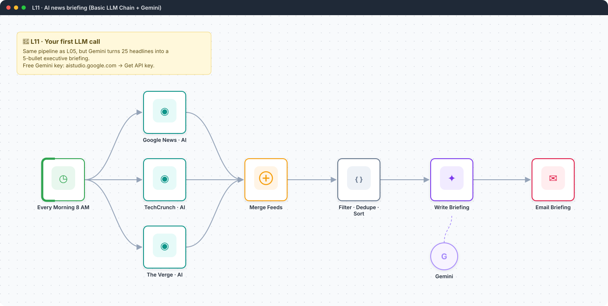
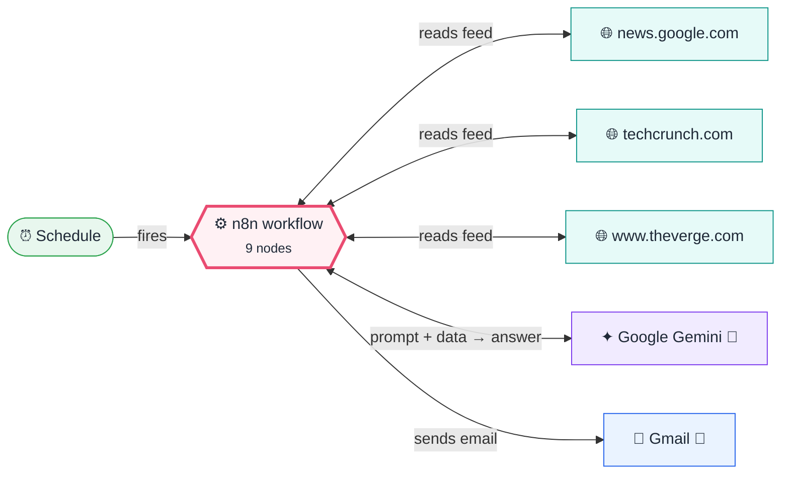

<div align="center">

# L11 · AI news briefing with a Basic LLM Chain

    [](https://github.com/callme-siva/n8n-knowledge/actions/workflows/validate.yml)



</div>

> [!NOTE]
> **The real-world problem.** 25 headlines is still too many to read. An LLM can turn them into 5 bullets that say *why each story matters*, which is what a good executive briefing does.

## 💡 Concept first

**📌 Key idea:** An LLM chain is a **function**: prompt + data in, text out. Control it with a clear system prompt and a low temperature.

**🧠 Mental model:** A very fast intern: great at summarising, needs precise instructions, and should never be trusted with facts it wasn't given.

**🚫 When *not* to use it:** Don't use an LLM for things code does exactly (sums, dates, filters). It's slower, costs money and can be wrong.

## 🎯 What you'll learn

- Basic LLM Chain node: prompt in, text out
- Connecting a **Chat Model sub-node** (Gemini)
- Writing a system prompt with rules and an output format
- Temperature: 0.3 for factual summaries
- Keeping the raw data in the email as a fallback, so the AI never hides the source

## 🏗️ Architecture

**System context:** who and what this workflow talks to, and what crosses each boundary. 🔑 = needs a credential · 🧑 = a human decides.



<details><summary><b>Node-level flow</b> (every node and branch)</summary>


</details>

## 🔑 Credentials

| You need | Where to get it |
|---|---|
| Google Gemini (PaLM) API key | free at https://aistudio.google.com/app/apikey |
| Gmail OAuth2 | [docs/credentials.md](../../docs/credentials.md) |

## 📝 Before you run it

Replace these placeholder values with your own:

| Node | Field | Placeholder |
|---|---|---|
| Email Briefing | `sendTo` | `you@example.com` |

Nodes that need a credential selected after import: **Gmail**, **Google Gemini Chat Model**.

## 🛠️ Build it step by step

> [!TIP]
> In a hurry? Import [`workflow.json`](workflow.json) (copy → paste on the n8n canvas). Learning? Build it yourself using the steps below, then compare.

1. Start from your finished **L05** (duplicate it).
2. Get a Gemini API key from AI Studio. In n8n, create a *Google Gemini(PaLM) Api* credential (host is the default).
3. Between Code and Gmail, add **Basic LLM Chain**. Prompt = *Define below*, and put `{{ $json.listText }}` in the prompt.
4. Click **+ Chat Model** under the chain and choose **Google Gemini Chat Model** → `gemini-2.5-flash`.
5. Add a *System* message (Chat Messages → System) with the editor rules.
6. Gmail body = `{{ $json.text }}`.

## 🔍 Node-by-node reference

Every node in this workflow and every setting inside it, generated from [`workflow.json`](workflow.json). Click a node to expand it.

<details><summary><b>1. Every Morning 8 AM</b> · <code>Schedule Trigger</code> v1.2</summary>

> Starts the workflow on a timer or cron expression. Only fires when the workflow is **active**.

| Property | Value |
|---|---|
| `rule.interval.triggerAtHour` | 8 |

</details>

<details><summary><b>2. Merge Feeds</b> · <code>Merge</code> v3</summary>

> Waits for several inputs and combines them into one stream.

| Property | Value |
|---|---|
| `numberInputs` | 3 |

</details>

<details><summary><b>3. Google News · AI</b> · <code>RSS Read</code> v1.1</summary>

> Reads an RSS/Atom feed; outputs one item per article.

| Property | Value |
|---|---|
| `url` | https://news.google.com/rss/search?q=artificial+intelligence+when:1d&hl=en-US&gl=US&cei… |
| `⚙️ On error` | Continue (regular output) |

</details>

<details><summary><b>4. TechCrunch · AI</b> · <code>RSS Read</code> v1.1</summary>

> Reads an RSS/Atom feed; outputs one item per article.

| Property | Value |
|---|---|
| `url` | https://techcrunch.com/category/artificial-intelligence/feed/ |
| `⚙️ On error` | Continue (regular output) |

</details>

<details><summary><b>5. The Verge · AI</b> · <code>RSS Read</code> v1.1</summary>

> Reads an RSS/Atom feed; outputs one item per article.

| Property | Value |
|---|---|
| `url` | https://www.theverge.com/rss/ai-artificial-intelligence/index.xml |
| `⚙️ On error` | Continue (regular output) |

</details>

<details><summary><b>6. Filter · Dedupe · Sort</b> · <code>Code</code> v2</summary>

> Runs JavaScript. *Run once for all items* sees every item; *for each item* sees one at a time.

| Property | Value |
|---|---|
| `jsCode` | (JavaScript, 13 lines, shown below) |

**Code:**

```javascript
const cutoff = Date.now() - 24 * 3600 * 1000;
const seen = new Set();
const norm = t => String(t || '').toLowerCase().replace(/[^a-z0-9 ]/g, '').slice(0, 60);
const articles = $input.all().map(i => i.json)
  .filter(a => a.title && a.link)
  .map(a => ({ title: a.title.trim(), link: a.link, source: a.creator || (a.link.match(/https?:\/\/(?:www\.)?([^/]+)/) || [])[1] || 'unknown', ts: Date.parse(a.isoDate || a.pubDate || '') || 0 }))
  .filter(a => a.ts >= cutoff)
  .filter(a => { const k = norm(a.title); if (seen.has(k)) return false; seen.add(k); return true; })
  .sort((a, b) => b.ts - a.ts)
  .slice(0, 25);
const li = articles.map(a => `<li><a href="${a.link}">${a.title}</a> <small>(${a.source})</small></li>`).join('');
const listText = articles.map((a, i) => `${i + 1}. ${a.title} — ${a.link}`).join('\n');
return [{ json: { count: articles.length, html: `<ol>${li}</ol>`, listText } }];
```

</details>

<details><summary><b>7. Write Briefing</b> · <code>Basic LLM Chain</code> v1.5</summary>

> Sends one prompt to a model and returns the answer. Simplest AI node.

| Property | Value |
|---|---|
| `promptType` | define |
| `text` | `Here are today's AI news headlines ({{ $json.count }} items):  {{ $json.listText }}` |
| `messages.message` | You are a news editor writing for busy professionals in India. From the headlines, write: 1. **Top 5 stories**: one bullet each, max 2 sentences: what happened + why it matters. Include the link. 2. **One-line trend of the day.** Rules: merge duplicates, skip clickbait, never invent facts beyond the headline. Output clean HTML (&lt;h3&gt;, &lt;ul&gt;, &lt;li&gt;, &lt;a&gt;), no markdown. |

</details>

<details><summary><b>8. Gemini</b> · <code>Google Gemini Chat Model</code> v1</summary>

> The language model plugged into a chain or agent.

| Property | Value |
|---|---|
| `modelName` | models/gemini-2.5-flash |
| `temperature` | 0.3 |

</details>

<details><summary><b>9. Email Briefing</b> · <code>Gmail</code> v2.1</summary>

> Sends, reads or labels email. `sendAndWait` pauses the workflow for a human reply.

| Property | Value |
|---|---|
| `sendTo` | you@example.com |
| `subject` | `☕ AI briefing · {{ $now.toFormat('dd LLL yyyy') }}` |
| `emailType` | html |
| `message` | `{{ $json.text }}<hr><details><summary>All {{ $('Filter · Dedupe · Sort').item.json.count }} headlines</summary>{{ $('Filter · Dedupe · Sort').item.json.html }}</details>` |
| `appendAttribution` | off |
| `⚙️ Retry on fail` | ✅ on |
| `⚙️ Max tries` | 3 |
| `⚙️ Wait between tries (ms)` | 3000 |

</details>

> [!TIP]
> ⚙️ rows come from each node's **Settings** tab, not its Parameters tab. `{{ … }}` values are **expressions** evaluated at run time. See [workflow anatomy](../../docs/workflow-anatomy.md) for what every property means.

## ✅ Test it

> [!TIP]
> **Automated end-to-end test: passed.** 8/8 nodes executed in real n8n (2 credentialed or AI nodes replaced by fixtures, so AI output itself isn't tested), 2 behaviour checks. See [tests/](../../tests/README.md).

- [ ] Run it and compare the briefing to the raw headlines. Did the model invent anything?
- [ ] Change the system prompt to *Explain like I'm a school student* and run it again.

## 🧯 Troubleshooting

Problems specific to this workflow are below. For general ones (expressions, items, triggers, AI), see [common mistakes](../../docs/common-mistakes.md).

<details><summary><b>429 / quota exceeded</b></summary>

The free tier has per-minute limits. Wait a minute, or use `gemini-2.5-flash-lite`.

</details>

<details><summary><b>Output shows html fences</b></summary>

Add "no code fences" to the prompt, or strip them with `.replace(/```html|```/g,'')`.

</details>

## 🏋️ Practice

Try each challenge **before** opening the hint. Solutions show the exact expressions and code.

**⭐ Challenge 1:** Make the briefing **5 bullets max, in simple English for a school student**.

<details><summary>💡 Hint</summary>

Change only the system message; keep the data the same.

</details>
<details><summary>✅ Solution</summary>

Edit the system message: *"…write for a 14-year-old. Max 5 bullets, max 20 words each. No jargon."* Compare outputs. Prompts are code: version them.

</details>

**⭐⭐ Challenge 2:** Return **JSON** and render your own HTML template (no HTML from the model).

<details><summary>💡 Hint</summary>

Turn on *Require specific output format* and attach a Structured Output Parser.

</details>
<details><summary>✅ Solution</summary>

Parser example: `{"stories":[{"title":"","why_it_matters":"","link":""}],"trend":""}`. Then a Code node renders the HTML. The model can no longer break your layout.

</details>

## 🚀 Ideas to extend it

- Ask for JSON and render your own template (this previews L12).
- Send it to Telegram as a morning message.

---

<p align="center"><a href="../L10-form-bug-report-jira/README.md">← L10 · Bug report form → Jira issue + reporter confirmation</a> &nbsp;·&nbsp; <a href="../../README.md#-the-learning-path">📚 All lessons</a> &nbsp;·&nbsp; <a href="../L12-meeting-transcript-raid-log/README.md">L12 · Meeting transcript → RAID log →</a></p>
