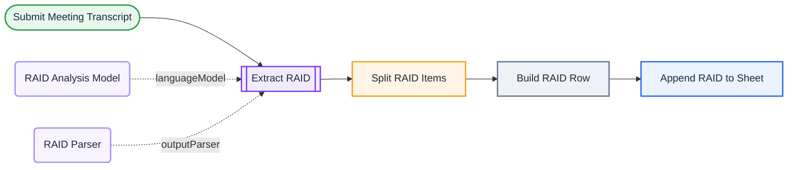

<div align="center">

# L12 · Meeting transcript → RAID log

   


</div>

> [!NOTE]
> **The real-world problem.** After a steering committee or status meeting, someone should update the RAID log. Usually nobody does. Paste the transcript (from Teams, Zoom or Meet) and every risk, assumption, issue and dependency lands in a sheet with owner, impact and due date.

## 🎯 What you'll learn

- **Structured Output Parser**: force the LLM to follow a JSON schema
- `hasOutputParser` on the LLM Chain
- **Split Out**: one AI answer → many items
- Mapping AI fields to spreadsheet columns

## 🏗️ Architecture



<details><summary>Plain-text flow</summary>

```
Form (transcript) → LLM Chain ⇐ Gemini, ⇐ Structured Parser → Split Out items → Set row → Sheets append
```

</details>

## 🔑 Credentials

| You need | Where to get it |
|---|---|
| Google Gemini API key | [docs/credentials.md](../../docs/credentials.md) |
| Google Sheets OAuth2 | [docs/credentials.md](../../docs/credentials.md) |

## 🛠️ Build it step by step

> [!TIP]
> In a hurry? Import [`workflow.json`](workflow.json) (copy → paste on the n8n canvas). Learning? Build it yourself using the steps below, then compare.

1. Create a Sheet tab **RAID** whose headers match the fields in *Build RAID Row*.
2. Form Trigger: meeting title, date, transcript (textarea).
3. **Basic LLM Chain** → turn on *Require Specific Output Format* → attach a **Structured Output Parser** and paste an example JSON (`items: [{category, description, owner, impact, ...}]`).
4. Attach the Gemini model.
5. **Split Out** on `output.items`.
6. **Set** the row columns, then **Sheets → Append**.

## ✅ Test it

- [ ] Paste a sample transcript from [docs/sample-data.md](../../docs/sample-data.md#meeting-transcript).
- [ ] Check that every row has a category from Risk/Assumption/Issue/Dependency and nothing else.

## 🧯 Troubleshooting

<details><summary><b>Model output doesn't fit required format</b></summary>

Lower the temperature to 0, simplify the schema example, or turn on auto-fix (L17 shows this).

</details>

<details><summary><b>Only one row appears</b></summary>

Split Out must point to the array path, `output.items`.

</details>

## 🚀 Level up

- Email the owner of each high-impact risk.
- Run it over every transcript file dropped in a Drive folder.

---

<p align="center"><a href="../L11-ai-news-digest-llm-chain/README.md">← L11 · AI news briefing</a> &nbsp;·&nbsp; <a href="../../README.md#-the-learning-path">📚 All lessons</a> &nbsp;·&nbsp; <a href="../L13-rag-policy-chatbot/README.md">L13 · HR policy chatbot →</a></p>
