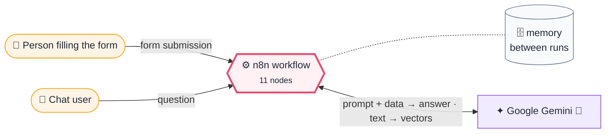
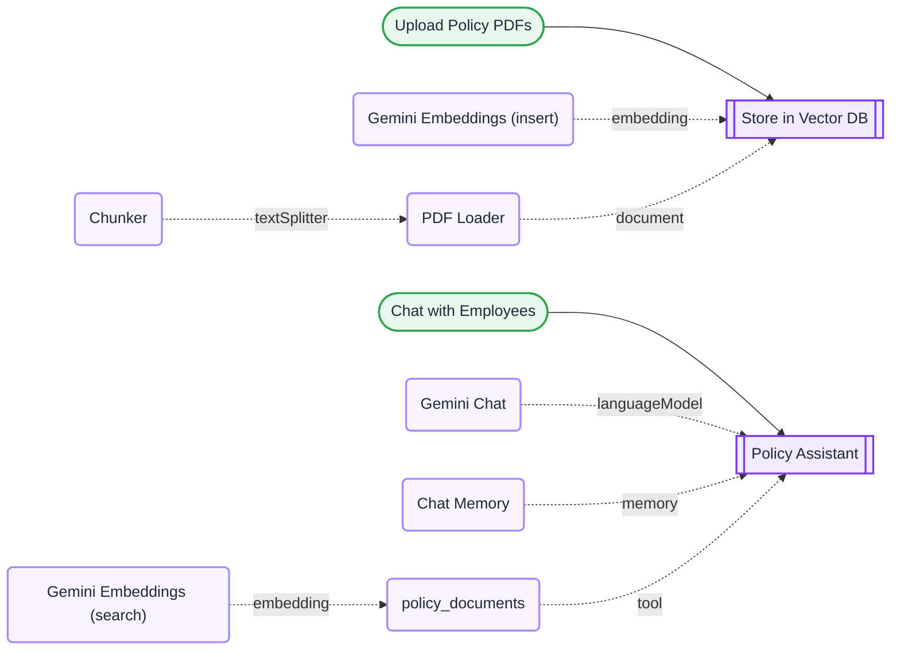

# L13 · HR policy chatbot with RAG

    

> [!NOTE]
> **The real-world problem.** Employees keep asking HR the same questions ("How many casual leaves do I get?", "Is my broadband reimbursed?") when the answer is already in a 40-page PDF. RAG lets a chatbot answer from *your* documents, not from what the model remembers from the internet.

## 💡 Concept first

**📌 Key idea:** **RAG** answers from *your* documents: chunk → embed → store → retrieve → answer with sources.

**🧠 Mental model:** An open-book exam: the model may answer only from the pages it was handed, and must say which page.

**🚫 When *not* to use it:** Don't use RAG when the answer is in one short document. Just paste it into the prompt. RAG earns its keep with large or changing document sets.

## 🎯 What you'll learn

- The RAG idea: **chunk → embed → store → retrieve → answer**
- Embeddings with Gemini (`gemini-embedding-001`)
- Vector store *insert* mode vs *retrieve-as-tool* mode
- AI Agent + tool + memory
- Grounding prompts that stop the model from guessing

## 🏗️ Architecture

**System context:** who and what this workflow talks to, and what crosses each boundary. 🔑 = needs a credential · 🧑 = a human decides.

<b>Node-level flow</b> (every node and branch)

## 🔑 Credentials

| You need | Where to get it |
|---|---|
| Google Gemini API key (used for chat and embeddings) | [docs/credentials.md](../../docs/credentials.md) |

## 📝 Before you run it

No placeholder values. It runs as-is once the credentials are connected.

Nodes that need a credential selected after import: **Gemini Embeddings**, **Google Gemini Chat Model**.

### 📥 Starter files

Sample files: [hr-policy.pdf](../../templates/files/hr-policy.pdf) (upload it in the form)

## 🛠️ Build it step by step

> [!TIP]
> In a hurry? Import [`workflow.json`](workflow.json) (copy → paste on the n8n canvas). Learning? Build it yourself using the steps below, then compare.

1. **Part A**: Form Trigger with a *File* field (accept `.pdf`).
2. Add **In-Memory Vector Store**, mode *Insert Documents*, memory key `hr_policies`.
3. Attach **Embeddings Google Gemini** + **Default Data Loader** (type *Binary*) + **Recursive Character Text Splitter** (1000 / 150).
4. Open the form, upload a policy PDF, and check how many chunks were inserted.
5. **Part B**: add a **Chat Trigger** → **AI Agent**. Attach Gemini, **Window Buffer Memory**, and a second **In-Memory Vector Store** in *Retrieve documents (as tool)* mode with the **same memory key** and its own embeddings node.
6. Write the strict system prompt (see workflow.json).
7. Click **Open chat** and ask a question.

## 🔍 Node-by-node reference

Every node in this workflow and every setting inside it, generated from [`workflow.json`](workflow.json). Click a node to expand it.

<b>1. Upload Policy PDFs</b> · <code>n8n Form Trigger</code> v2.2

> Hosts a web form; each submission starts one execution. Field labels become JSON keys.

| Property | Value |
|---|---|
| `formTitle` | Upload policy documents |
| `formDescription` | PDFs only. They will be indexed for the chatbot. |
| `formFields.values` | Documents * |

<b>2. Store in Vector DB</b> · <code>In-Memory Vector Store</code> v1.1

> Stores embeddings (insert mode) or searches them (retrieve mode).

| Property | Value |
|---|---|
| `mode` | insert |
| `memoryKey` | hr_policies |

<b>3. Gemini Embeddings (insert)</b> · <code>Gemini Embeddings</code> v1

> Turns text into vectors for semantic search.

| Property | Value |
|---|---|
| `modelName` | models/gemini-embedding-001 |

<b>4. PDF Loader</b> · <code>Default Data Loader</code> v1

> Loads binary or JSON data as documents for a vector store.

| Property | Value |
|---|---|
| `dataType` | binary |

<b>5. Chunker</b> · <code>Recursive Text Splitter</code> v1

> Cuts documents into overlapping chunks.

| Property | Value |
|---|---|
| `chunkSize` | 1000 |
| `chunkOverlap` | 150 |

<b>6. Chat with Employees</b> · <code>Chat Trigger</code> v1.1

> Opens a chat window; each message starts an execution with `chatInput` and a `sessionId`.

*No settings. This node works with its defaults.*

<b>7. Policy Assistant</b> · <code>AI Agent</code> v2.2

> An LLM that can call tools, use memory and loop until it has an answer.

| Property | Value |
|---|---|
| `systemMessage` | You are the HR policy assistant. ALWAYS search the policy_documents tool before answering. Answer only from what the tool returns; quote the policy name. If the documents don't cover it, say "I couldn't find that in our policies — please contact HR" — never guess. Keep answers under 120 words. |

<b>8. Gemini Chat</b> · <code>Google Gemini Chat Model</code> v1

> The language model plugged into a chain or agent.

| Property | Value |
|---|---|
| `modelName` | models/gemini-2.5-flash |
| `temperature` | 0.1 |

<b>9. Chat Memory</b> · <code>Simple Memory</code> v1.3

> Remembers the last N chat messages per session.

| Property | Value |
|---|---|
| `contextWindowLength` | 8 |

<b>10. policy_documents</b> · <code>In-Memory Vector Store</code> v1.1

> Stores embeddings (insert mode) or searches them (retrieve mode).

| Property | Value |
|---|---|
| `mode` | retrieve-as-tool |
| `toolName` | policy_documents |
| `toolDescription` | Search the company HR policy documents (leave, WFH, travel, reimbursement, code of conduct). |
| `memoryKey` | hr_policies |
| `topK` | 4 |

<b>11. Gemini Embeddings (search)</b> · <code>Gemini Embeddings</code> v1

> Turns text into vectors for semantic search.

| Property | Value |
|---|---|
| `modelName` | models/gemini-embedding-001 |

> [!TIP]
> ⚙️ rows come from each node's **Settings** tab, not its Parameters tab. `{{ … }}` values are **expressions** evaluated at run time. See [workflow anatomy](../../docs/workflow-anatomy.md) for what every property means.

## ✅ Test it

> [!TIP]
> **Automated end-to-end test: passed.** 2/4 nodes executed in real n8n (4 credentialed or AI nodes replaced by fixtures, so AI output itself isn't tested), 1 behaviour checks. See [tests/](../../tests/README.md).

- [ ] Use the sample policy in [docs/sample-data.md](../../docs/sample-data.md#hr-policy) (save it as a PDF).
- [ ] Ask something that *isn't* in the policy ("What's the CEO's salary?"). It must refuse.
- [ ] Open the agent's execution log to see which chunks were retrieved.

## 🧯 Troubleshooting

Problems specific to this workflow are below. For general ones (expressions, items, triggers, AI), see [common mistakes](../../docs/common-mistakes.md).

<b>The agent answers without searching</b>

Make the tool description specific and say "ALWAYS search" in the system prompt.

<b>Nothing found after restarting n8n</b>

In-memory storage is wiped on restart. Re-upload, or move to a persistent vector DB.

<b>Embedding dimension mismatch</b>

Use the *same* embedding model for insert and search.

## 🏋️ Practice

Try each challenge **before** opening the hint. Solutions show the exact expressions and code.

**⭐ Challenge 1:** Make the bot cite the **policy section number** in every answer.

💡 Hint

It's a prompt change plus good chunking.

✅ Solution

System message: *"End every answer with 'Source: <document> §<section>'."* Keep sections intact by making chunks slightly larger (e.g. 1500 characters) so a section isn't split.

**⭐⭐ Challenge 2:** Move from in-memory to a **persistent** vector store.

💡 Hint

Swap both vector store nodes; embeddings stay the same.

✅ Solution

Replace both In-Memory Vector Store nodes with **Supabase** / **Qdrant** / **PGVector** (same insert and retrieve-as-tool modes, same embeddings). Documents now survive restarts, and several workflows can share the knowledge base.

## 🚀 Ideas to extend it

- Swap in Supabase / Qdrant / Pinecone for persistent storage.
- Serve it inside Slack or Teams instead of n8n chat.
- Add a Google Drive trigger so new policies index themselves.

---

<a href="../L12-meeting-transcript-raid-log/README.md">← L12 · Meeting transcript → RAID log</a> &nbsp;·&nbsp; <a href="../../README.md#-the-learning-path">📚 All lessons</a> &nbsp;·&nbsp; <a href="../L14-ai-agent-with-tools/README.md">L14 · Personal assistant agent →</a>

