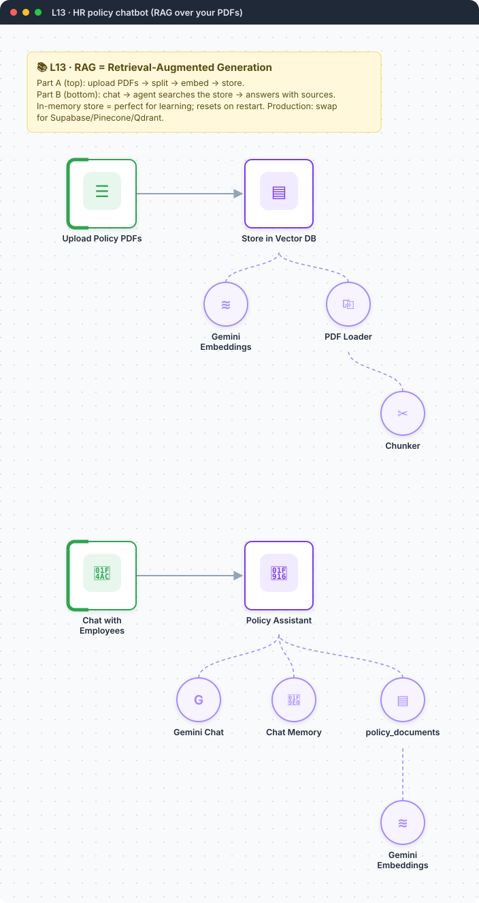

<div align="center">

# L13 · HR policy chatbot with RAG

   



</div>

> [!NOTE]
> **The real-world problem.** Employees keep asking HR the same questions ("How many casual leaves do I get?", "Is my broadband reimbursed?") when the answer is already in a 40-page PDF. RAG lets a chatbot answer from *your* documents, not from what the model remembers from the internet.

## 🎯 What you'll learn

- The RAG idea: **chunk → embed → store → retrieve → answer**
- Embeddings with Gemini (`gemini-embedding-001`)
- Vector store *insert* mode vs *retrieve-as-tool* mode
- AI Agent + tool + memory
- Grounding prompts that stop the model from guessing

## 🏗️ Architecture


<details><summary>Plain-text flow</summary>

```
PART A  Form (PDF upload) → Vector Store insert ⇐ Embeddings, ⇐ Loader ⇐ Chunker
PART B  Chat Trigger → AI Agent ⇐ Gemini, ⇐ Memory, ⇐ Tool: Vector Store (retrieve) ⇐ Embeddings
```

</details>

## 🔑 Credentials

| You need | Where to get it |
|---|---|
| Google Gemini API key (used for chat and embeddings) | [docs/credentials.md](../../docs/credentials.md) |

## 🛠️ Build it step by step

> [!TIP]
> In a hurry? Import [`workflow.json`](workflow.json) (copy → paste on the n8n canvas). Learning? Build it yourself using the steps below, then compare.

1. **Part A**: Form Trigger with a *File* field (accept `.pdf`).
2. Add **In-Memory Vector Store**, mode *Insert Documents*, memory key `hr_policies`.
3. Attach **Embeddings Google Gemini** + **Default Data Loader** (type *Binary*) + **Recursive Character Text Splitter** (1000 / 150).
4. Open the form, upload a policy PDF, and check how many chunks were inserted.
5. **Part B**: add a **Chat Trigger** → **AI Agent**. Attach Gemini, **Window Buffer Memory**, and a second **In-Memory Vector Store** in *Retrieve documents (as tool)* mode with the **same memory key** and its own embeddings node.
6. Write the strict system prompt (see workflow.json).
7. Click **Open chat** and ask a question.

## ✅ Test it

- [ ] Use the sample policy in [docs/sample-data.md](../../docs/sample-data.md#hr-policy) (save it as a PDF).
- [ ] Ask something that *isn't* in the policy ("What's the CEO's salary?"). It must refuse.
- [ ] Open the agent's execution log to see which chunks were retrieved.

## 🧯 Troubleshooting

<details><summary><b>The agent answers without searching</b></summary>

Make the tool description specific and say "ALWAYS search" in the system prompt.

</details>

<details><summary><b>Nothing found after restarting n8n</b></summary>

In-memory storage is wiped on restart. Re-upload, or move to a persistent vector DB.

</details>

<details><summary><b>Embedding dimension mismatch</b></summary>

Use the *same* embedding model for insert and search.

</details>

## 🚀 Level up

- Swap in Supabase / Qdrant / Pinecone for persistent storage.
- Serve it inside Slack or Teams instead of n8n chat.
- Add a Google Drive trigger so new policies index themselves.

---

<p align="center"><a href="../L12-meeting-transcript-raid-log/README.md">← L12 · Meeting transcript → RAID log</a> &nbsp;·&nbsp; <a href="../../README.md#-the-learning-path">📚 All lessons</a> &nbsp;·&nbsp; <a href="../L14-ai-agent-with-tools/README.md">L14 · Personal assistant agent →</a></p>
