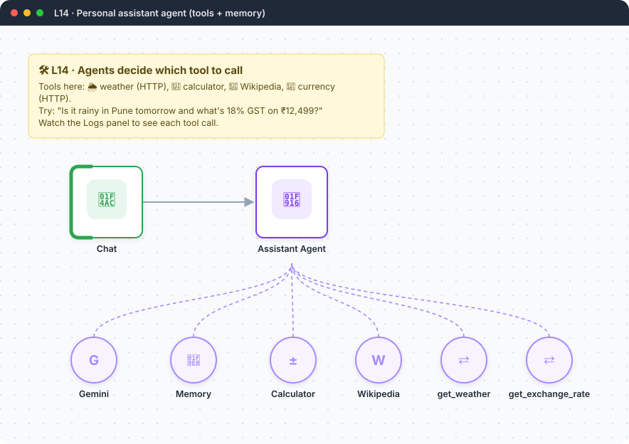
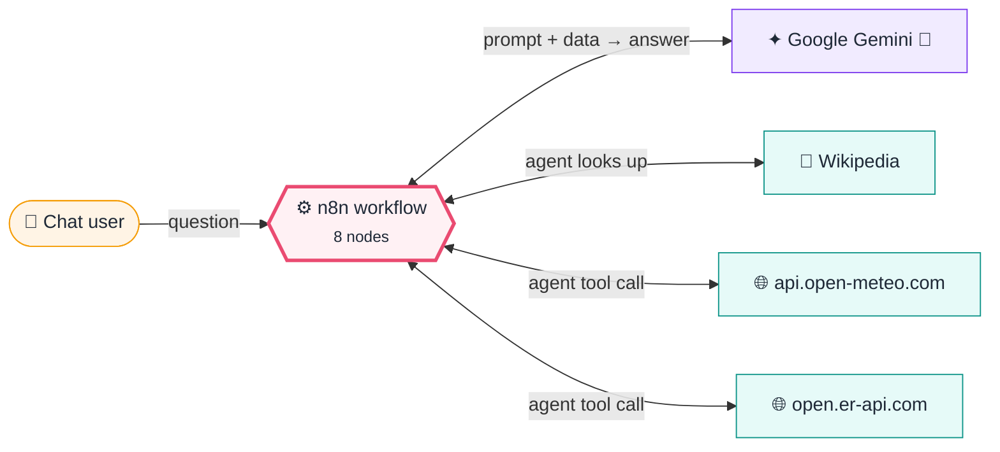

<div align="center">

# L14 · Personal assistant agent with tools

    



</div>

> [!NOTE]
> **The real-world problem.** A plain LLM can't know today's weather and often gets arithmetic wrong. An **agent** can call tools. It reads the question, picks the right tool, calls it, and writes the answer from the result.

## 💡 Concept first

**📌 Key idea:** An **agent** decides which tools to call and in what order; tool descriptions are the agent's user manual.

**🧠 Mental model:** A capable assistant with a phone (HTTP), a calculator and an encyclopedia, who chooses which to use for each question.

**🚫 When *not* to use it:** Don't use an agent for a fixed sequence of steps. A normal workflow is faster, cheaper and predictable.

## 🎯 What you'll learn

- AI Agent node (tools agent)
- Built-in tools: Calculator, Wikipedia
- **HTTP Request Tool** with `{placeholders}` the model fills in
- Window Buffer Memory for multi-turn chat
- Tool descriptions are prompts: write them carefully
- Max iterations as a safety limit

## 🏗️ Architecture

**System context:** who and what this workflow talks to, and what crosses each boundary. 🔑 = needs a credential · 🧑 = a human decides.



<details><summary><b>Node-level flow</b> (every node and branch)</summary>


</details>

<details><summary>Plain-text flow</summary>

```
Chat → AI Agent ⇐ Gemini, ⇐ Memory, ⇐ Calculator, ⇐ Wikipedia, ⇐ get_weather (HTTP), ⇐ get_exchange_rate (HTTP)
```

</details>

## 🔑 Credentials

| You need | Where to get it |
|---|---|
| Google Gemini API key (all tools used here are free and keyless) | [docs/credentials.md](../../docs/credentials.md) |

## 📝 Before you run it

No placeholder values. It runs as-is once the credentials are connected.

Nodes that need a credential selected after import: **Google Gemini Chat Model**.

## 🛠️ Build it step by step

> [!TIP]
> In a hurry? Import [`workflow.json`](workflow.json) (copy → paste on the n8n canvas). Learning? Build it yourself using the steps below, then compare.

1. Chat Trigger → **AI Agent**.
2. Attach Gemini + Window Buffer Memory.
3. Attach **Calculator** and **Wikipedia** tools.
4. Attach **HTTP Request Tool**: name `get_weather`, URL with `{lat}` and `{lon}` placeholders, and define both placeholders.
5. Attach a second HTTP tool, `get_exchange_rate`, with a `{base}` placeholder.
6. Write a system prompt that tells the agent *when* to use tools.

## 🔍 Node-by-node reference

Every node in this workflow and every setting inside it, generated from [`workflow.json`](workflow.json). Click a node to expand it.

<details><summary><b>1. Chat</b> · <code>Chat Trigger</code> v1.1</summary>

> Opens a chat window; each message starts an execution with `chatInput` and a `sessionId`.

*No settings. This node works with its defaults.*

</details>

<details><summary><b>2. Assistant Agent</b> · <code>AI Agent</code> v2.2</summary>

> An LLM that can call tools, use memory and loop until it has an answer.

| Property | Value |
|---|---|
| `systemMessage` | `You are a helpful personal assistant for a user in India. Today is {{ $now.toFormat('cccc, dd LLL yyyy') }}. Use tools for any fact that can change (weather, exchange rates) and the calculator for ANY arithmetic. For weather you need latitude/longitude — use your own knowledge of city coordinates. Be concise.` |
| `maxIterations` | 8 |

</details>

<details><summary><b>3. Gemini</b> · <code>Google Gemini Chat Model</code> v1</summary>

> The language model plugged into a chain or agent.

| Property | Value |
|---|---|
| `modelName` | models/gemini-2.5-flash |
| `temperature` | 0.2 |

</details>

<details><summary><b>4. Memory</b> · <code>Simple Memory</code> v1.3</summary>

> Remembers the last N chat messages per session.

| Property | Value |
|---|---|
| `contextWindowLength` | 10 |

</details>

<details><summary><b>5. Calculator</b> · <code>Calculator Tool</code> v1</summary>

> Lets an agent do exact arithmetic.

*No settings. This node works with its defaults.*

</details>

<details><summary><b>6. Wikipedia</b> · <code>Wikipedia Tool</code> v1</summary>

> Lets an agent look things up on Wikipedia.

*No settings. This node works with its defaults.*

</details>

<details><summary><b>7. get_weather</b> · <code>HTTP Request Tool</code> v1.1</summary>

> Lets an agent call an API. `{placeholders}` in the URL are filled in by the model.

| Property | Value |
|---|---|
| `toolDescription` | Get current weather and 3-day forecast for a location. Needs latitude and longitude. |
| `url` | https://api.open-meteo.com/v1/forecast?latitude={lat}&longitude={lon}&current=temperatu… |
| `placeholderDefinitions.1.name` | lat |
| `placeholderDefinitions.1.description` | latitude in decimal degrees |
| `placeholderDefinitions.1.type` | number |
| `placeholderDefinitions.2.name` | lon |
| `placeholderDefinitions.2.description` | longitude in decimal degrees |
| `placeholderDefinitions.2.type` | number |
| `optimizeResponse` | ✅ on |

</details>

<details><summary><b>8. get_exchange_rate</b> · <code>HTTP Request Tool</code> v1.1</summary>

> Lets an agent call an API. `{placeholders}` in the URL are filled in by the model.

| Property | Value |
|---|---|
| `toolDescription` | Get latest exchange rates for a base currency code like USD, EUR, INR. |
| `url` | https://open.er-api.com/v6/latest/{base} |
| `placeholderDefinitions.name` | base |
| `placeholderDefinitions.description` | 3-letter ISO currency code |
| `placeholderDefinitions.type` | string |
| `optimizeResponse` | ✅ on |
| `dataField` | rates |
| `fieldsToInclude` | all |

</details>

> [!TIP]
> ⚙️ rows come from each node's **Settings** tab, not its Parameters tab. `{{ … }}` values are **expressions** evaluated at run time. See [workflow anatomy](../../docs/workflow-anatomy.md) for what every property means.

## ✅ Test it

> [!TIP]
> **Automated end-to-end test: passed.** 2/2 nodes executed in real n8n (2 credentialed nodes replaced by realistic mocks), 0 behaviour checks. See [tests/](../../tests/README.md).

- [ ] "What's 17.5% of 84,999?" should use Calculator.
- [ ] "Weather in Bengaluru?" should use get_weather with about 12.97, 77.59.
- [ ] "Who founded Infosys?" should use Wikipedia.
- [ ] Follow-up: "and in USD?" tests memory and the currency tool.

## 🧯 Troubleshooting

Problems specific to this workflow are below. For general ones (expressions, items, triggers, AI), see [common mistakes](../../docs/common-mistakes.md).

<details><summary><b>The agent answers from memory and skips tools</b></summary>

Make the system prompt stricter ("ALWAYS use…") and set a lower temperature.

</details>

<details><summary><b>Too many iterations</b></summary>

The tool keeps failing. Open the Logs panel to see the tool error.

</details>

<details><summary><b>Huge tool responses / token errors</b></summary>

Turn on *Optimize Response* on HTTP tools and pick only the fields you need.

</details>

## 🏋️ Practice

Try each challenge **before** opening the hint. Solutions show the exact expressions and code.

**⭐ Challenge 1:** Add a **time-in-city** tool.

<details><summary>💡 Hint</summary>

Another HTTP Request Tool with a placeholder.

</details>
<details><summary>✅ Solution</summary>

HTTP Request Tool `get_time`: URL `https://timeapi.io/api/Time/current/zone?timeZone={tz}`, placeholder `tz` ("IANA timezone like Asia/Kolkata"). Ask: *"What time is it in Tokyo?"*

</details>

**⭐⭐ Challenge 2:** Cap the cost: refuse questions unrelated to weather, currency, maths or general knowledge.

<details><summary>💡 Hint</summary>

Guard **before** the agent runs.

</details>
<details><summary>✅ Solution</summary>

Add a **Text Classifier** before the agent (categories: supported / unsupported). Route unsupported to a fixed reply. Cheap guards in front of expensive agents are a common production pattern.

</details>

## 🚀 Ideas to extend it

- Add a Google Calendar tool ("what's on my calendar tomorrow?").
- Add a Gmail tool, but put an approval step in front of it (L15).

---

<p align="center"><a href="../L13-rag-policy-chatbot/README.md">← L13 · HR policy chatbot</a> &nbsp;·&nbsp; <a href="../../README.md#-the-learning-path">📚 All lessons</a> &nbsp;·&nbsp; <a href="../L15-retro-ai-approval-jira/README.md">L15 · Retrospective → AI action items → human approval → Jira →</a></p>
