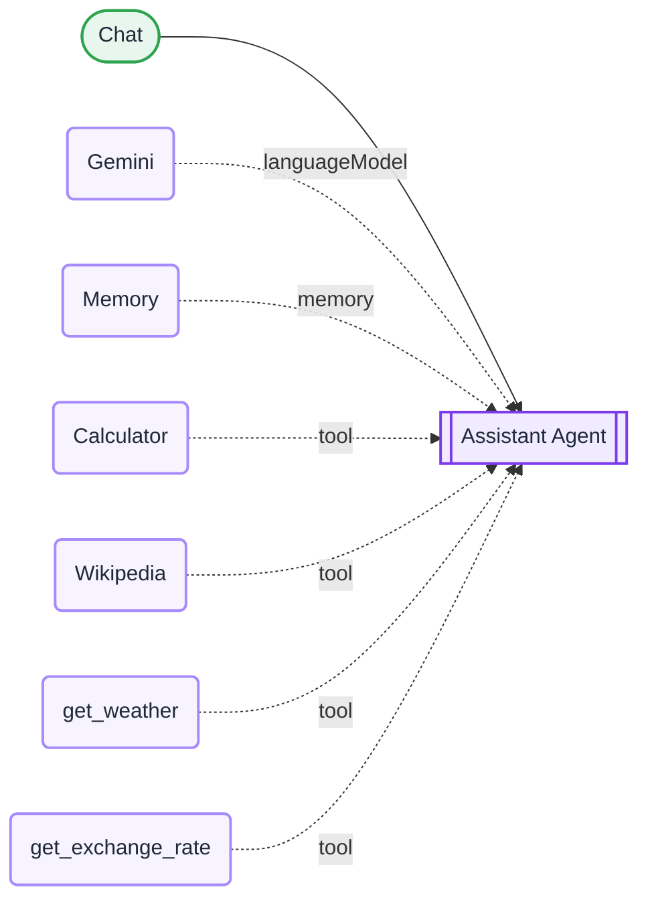

<div align="center">

# L14 · Personal assistant agent with tools

   


</div>

> [!NOTE]
> **The real-world problem.** A plain LLM can't know today's weather and often gets arithmetic wrong. An **agent** can call tools. It reads the question, picks the right tool, calls it, and writes the answer from the result.

## 🎯 What you'll learn

- AI Agent node (tools agent)
- Built-in tools: Calculator, Wikipedia
- **HTTP Request Tool** with `{placeholders}` the model fills in
- Window Buffer Memory for multi-turn chat
- Tool descriptions are prompts: write them carefully
- Max iterations as a safety limit

## 🏗️ Architecture



<details><summary>Plain-text flow</summary>

```
Chat → AI Agent ⇐ Gemini, ⇐ Memory, ⇐ Calculator, ⇐ Wikipedia, ⇐ get_weather (HTTP), ⇐ get_exchange_rate (HTTP)
```

</details>

## 🔑 Credentials

| You need | Where to get it |
|---|---|
| Google Gemini API key (all tools used here are free and keyless) | [docs/credentials.md](../../docs/credentials.md) |

## 🛠️ Build it step by step

> [!TIP]
> In a hurry? Import [`workflow.json`](workflow.json) (copy → paste on the n8n canvas). Learning? Build it yourself using the steps below, then compare.

1. Chat Trigger → **AI Agent**.
2. Attach Gemini + Window Buffer Memory.
3. Attach **Calculator** and **Wikipedia** tools.
4. Attach **HTTP Request Tool**: name `get_weather`, URL with `{lat}` and `{lon}` placeholders, and define both placeholders.
5. Attach a second HTTP tool, `get_exchange_rate`, with a `{base}` placeholder.
6. Write a system prompt that tells the agent *when* to use tools.

## ✅ Test it

- [ ] "What's 17.5% of 84,999?" should use Calculator.
- [ ] "Weather in Bengaluru?" should use get_weather with about 12.97, 77.59.
- [ ] "Who founded Infosys?" should use Wikipedia.
- [ ] Follow-up: "and in USD?" tests memory and the currency tool.

## 🧯 Troubleshooting

<details><summary><b>The agent answers from memory and skips tools</b></summary>

Make the system prompt stricter ("ALWAYS use…") and set a lower temperature.

</details>

<details><summary><b>Too many iterations</b></summary>

The tool keeps failing. Open the Logs panel to see the tool error.

</details>

<details><summary><b>Huge tool responses / token errors</b></summary>

Turn on *Optimize Response* on HTTP tools and pick only the fields you need.

</details>

## 🚀 Level up

- Add a Google Calendar tool ("what's on my calendar tomorrow?").
- Add a Gmail tool, but put an approval step in front of it (L15).

---

<p align="center"><a href="../L13-rag-policy-chatbot/README.md">← L13 · HR policy chatbot</a> &nbsp;·&nbsp; <a href="../../README.md#-the-learning-path">📚 All lessons</a> &nbsp;·&nbsp; <a href="../L15-retro-ai-approval-jira/README.md">L15 · Retrospective → AI action items → human approval → Jira →</a></p>
