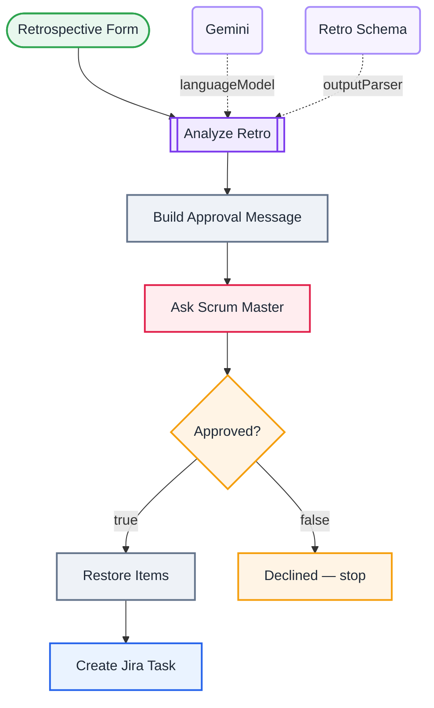

<div align="center">

# L15 · Retrospective → AI action items → human approval → Jira

   


</div>

> [!NOTE]
> **The real-world problem.** AI is good at turning messy retro notes into clear action items. But you don't want it filling Jira with junk tickets on its own. The Scrum Master gets an email with the proposal and clicks **Approve** or **Decline**, and only approved items become tasks.

## 🎯 What you'll learn

- **Send and Wait for Response**: pause a workflow for a human decision
- Wait time limits (auto-timeout after 2 days)
- Structured output for a list of action items
- Keeping data across a pause: `$('Node').first()`
- Responsible-AI design: the AI proposes and a human decides

## 🏗️ Architecture



<details><summary>Plain-text flow</summary>

```
Form → LLM Chain ⇐ Gemini, ⇐ Schema → Code (HTML) → Gmail send-and-wait ⏸ → IF approved
   ├─ yes → one item per action → Jira create task
   └─ no  → stop
```

</details>

## 🔑 Credentials

| You need | Where to get it |
|---|---|
| Google Gemini API key | [docs/credentials.md](../../docs/credentials.md) |
| Gmail OAuth2 | [docs/credentials.md](../../docs/credentials.md) |
| Jira Software Cloud API token | [docs/credentials.md](../../docs/credentials.md) |

## 🛠️ Build it step by step

> [!TIP]
> In a hurry? Import [`workflow.json`](workflow.json) (copy → paste on the n8n canvas). Learning? Build it yourself using the steps below, then compare.

1. Build the form (sprint, 3 textareas, morale dropdown).
2. **Basic LLM Chain** + Gemini + **Structured Output Parser** with the example JSON.
3. Code: build an HTML summary for the approver.
4. **Gmail → Send and Wait for Response**, response type *Approval*, *Approve and Disapprove* buttons. Limit the wait to 2 days.
5. **IF** `{{ $json.data.approved }}` is true.
6. Code: turn `action_items` back into items, then **Jira → Create issue** for each one.

## ✅ Test it

- [ ] Submit a retro from [docs/sample-data.md](../../docs/sample-data.md#retro-feedback). You should get an approval email and see the execution *Waiting*.
- [ ] Click **Approve**: 1–3 Jira tasks should appear. Try again and click **Decline**: no tasks.

## 🧯 Troubleshooting

<details><summary><b>Approval link opens an error page</b></summary>

Your n8n must be reachable from where you click. Set `WEBHOOK_URL` if you self-host behind a tunnel or domain.

</details>

<details><summary><b>approved is undefined</b></summary>

Check the output of the Gmail node. The decision lives in `data.approved`.

</details>

## 🚀 Level up

- Collect retros from the whole team for a week, then analyse all of them together (Aggregate node).
- Post the approval to Slack instead (the Slack node also has *Send and Wait*).

---

<p align="center"><a href="../L14-ai-agent-with-tools/README.md">← L14 · Personal assistant agent</a> &nbsp;·&nbsp; <a href="../../README.md#-the-learning-path">📚 All lessons</a> &nbsp;·&nbsp; <a href="../L16-sprint-report-multi-agent/README.md">L16 · Sprint progress report →</a></p>
