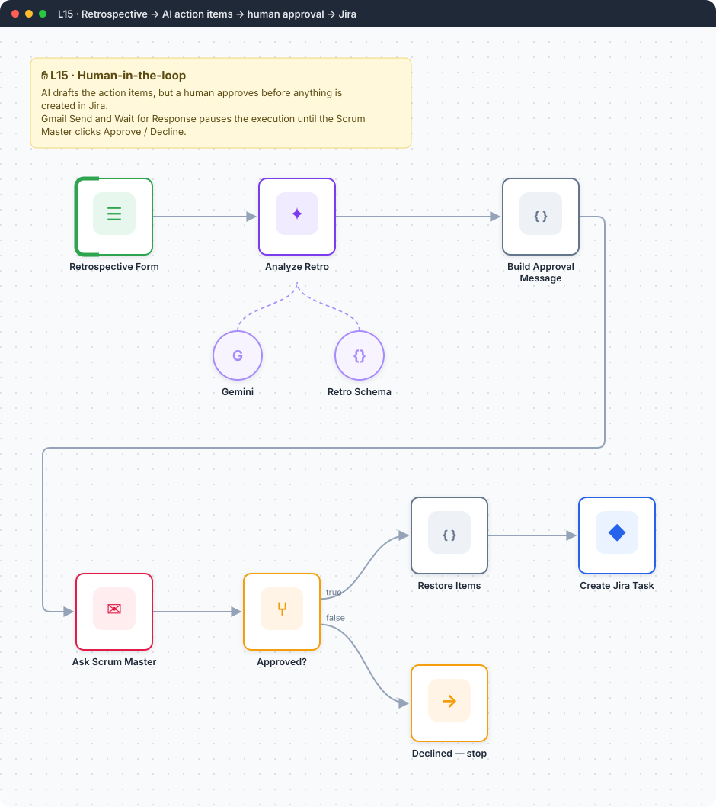
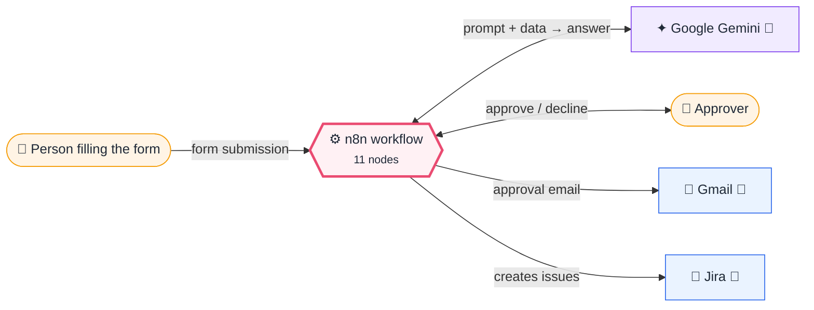
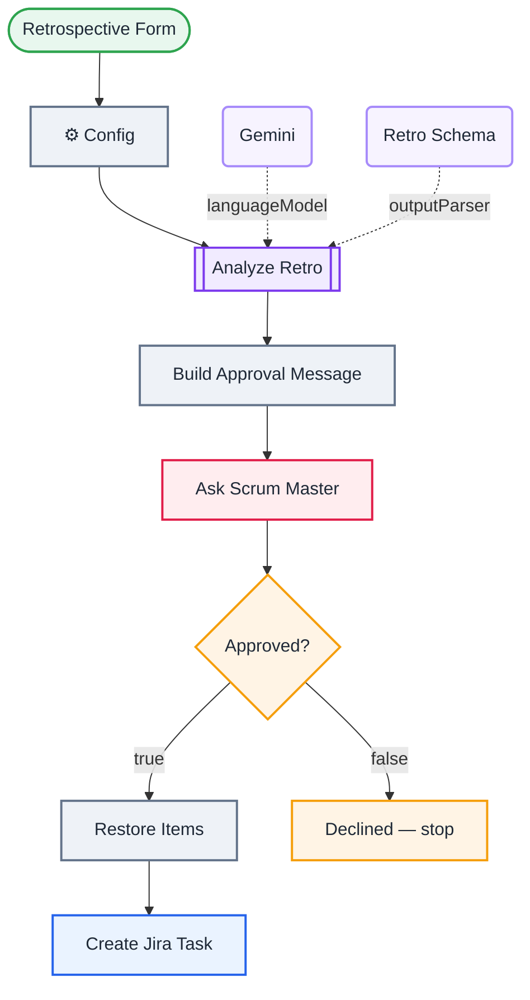

<div align="center">

# L15 · Retrospective → AI action items → human approval → Jira

    [](https://github.com/callme-siva/n8n-knowledge/actions/workflows/validate.yml)



</div>

> [!NOTE]
> **The real-world problem.** AI is good at turning messy retro notes into clear action items. But you don't want it filling Jira with junk tickets on its own. The Scrum Master gets an email with the proposal and clicks **Approve** or **Decline**, and only approved items become tasks.

## 💡 Concept first

**📌 Key idea:** **Human-in-the-loop**: the AI proposes, a person approves, and the execution pauses until they decide.

**🧠 Mental model:** A junior drafts, the manager signs. Nothing leaves the building without a signature.

**🚫 When *not* to use it:** Don't add approvals to low-risk, high-volume steps. You'll create a bottleneck and people will approve blindly.

## 🎯 What you'll learn

- **Send and Wait for Response**: pause a workflow for a human decision
- Wait time limits (auto-timeout after 2 days)
- Structured output for a list of action items
- Keeping data across a pause: `$('Node').first()`
- Responsible-AI design: the AI proposes and a human decides

## 🏗️ Architecture

**System context:** who and what this workflow talks to, and what crosses each boundary. 🔑 = needs a credential · 🧑 = a human decides.



<details><summary><b>Node-level flow</b> (every node and branch)</summary>



</details>

## 🔑 Credentials

| You need | Where to get it |
|---|---|
| Google Gemini API key | [docs/credentials.md](../../docs/credentials.md) |
| Gmail OAuth2 | [docs/credentials.md](../../docs/credentials.md) |
| Jira Software Cloud API token | [docs/credentials.md](../../docs/credentials.md) |

## 📝 Before you run it

Replace these placeholder values with your own:

| Node | Field | Placeholder |
|---|---|---|
| ⚙️ Config | `scrum_master_email` | `you@example.com` |
| Create Jira Task | `project` | `REPLACE_PROJECT_ID` |
| Create Jira Task | `issueType` | `REPLACE_TASK_ISSUE_TYPE_ID` |

Nodes that need a credential selected after import: **Gmail**, **Google Gemini Chat Model**, **Jira Software**.

## 🛠️ Build it step by step

> [!TIP]
> In a hurry? Import [`workflow.json`](workflow.json) (copy → paste on the n8n canvas). Learning? Build it yourself using the steps below, then compare.

1. Build the form (sprint, 3 textareas, morale dropdown).
2. **Basic LLM Chain** + Gemini + **Structured Output Parser** with the example JSON.
3. Code: build an HTML summary for the approver.
4. **Gmail → Send and Wait for Response**, response type *Approval*, *Approve and Disapprove* buttons. Limit the wait to 2 days.
5. **IF** `{{ $json.data.approved }}` is true.
6. Code: turn `action_items` back into items, then **Jira → Create issue** for each one.

## 🔍 Node-by-node reference

Every node in this workflow and every setting inside it, generated from [`workflow.json`](workflow.json). Click a node to expand it.

<details><summary><b>1. Retrospective Form</b> · <code>n8n Form Trigger</code> v2.2</summary>

> Hosts a web form; each submission starts one execution. Field labels become JSON keys.

| Property | Value |
|---|---|
| `formTitle` | Sprint Retrospective |
| `formDescription` | Honest, blameless feedback. Takes 2 minutes. |
| `formFields.values` | Sprint *, What went well?, What didn't go well?, Suggestions, Team morale * |

</details>

<details><summary><b>2. ⚙️ Config</b> · <code>Edit Fields (Set)</code> v3.4</summary>

> Creates, renames or overwrites fields without code.

| Property | Value |
|---|---|
| `scrum_master_email` | you@example.com |
| `includeOtherFields` | ✅ on |
| `include` | all |

</details>

<details><summary><b>3. Analyze Retro</b> · <code>Basic LLM Chain</code> v1.5</summary>

> Sends one prompt to a model and returns the answer. Simplest AI node.

| Property | Value |
|---|---|
| `promptType` | define |
| `hasOutputParser` | ✅ on |
| `text` | `Sprint: {{ $json.Sprint }} Morale: {{ $json['Team morale'] }}  Went well: {{ $json['What went well?'] }}  Didn't go well: {{ $json["What didn't go well?"] }}  Suggestions: {{ $json.Suggestions }}` |
| `messages.message` | You are an experienced agile coach. Summarise the feedback, rate sentiment, and propose at most 3 SMART action items (specific, owner role, measurable). Only include items the team can act on next sprint. |

</details>

<details><summary><b>4. Gemini</b> · <code>Google Gemini Chat Model</code> v1</summary>

> The language model plugged into a chain or agent.

| Property | Value |
|---|---|
| `modelName` | models/gemini-2.5-flash |
| `temperature` | 0.2 |

</details>

<details><summary><b>5. Retro Schema</b> · <code>Structured Output Parser</code> v1.2</summary>

> Forces the model's answer into JSON matching your schema.

| Property | Value |
|---|---|
| `jsonSchemaExample` | (JSON schema, 12 lines, shown below) |

**Schema example:**

```json
{
  "sentiment": "mixed",
  "summary": "Delivery was good but too many unplanned requests.",
  "action_items": [
    {
      "title": "Limit mid-sprint scope changes",
      "description": "PO to route new requests to the backlog; SM tracks count.",
      "priority": "High",
      "owner_role": "Product Owner"
    }
  ]
}
```

</details>

<details><summary><b>6. Build Approval Message</b> · <code>Code</code> v2</summary>

> Runs JavaScript. *Run once for all items* sees every item; *for each item* sees one at a time.

| Property | Value |
|---|---|
| `jsCode` | (JavaScript, 4 lines, shown below) |

**Code:**

```javascript
const o = $input.first().json.output;
const li = (o.action_items || []).map((a, i) => `<li><b>${i + 1}. ${a.title}</b> (${a.priority}, ${a.owner_role})<br>${a.description}</li>`).join('');
return [{ json: { ...o, sprint: $('Retrospective Form').first().json.Sprint,
  html: `<p><b>Sentiment:</b> ${o.sentiment}</p><p>${o.summary}</p><p>Proposed Jira tasks:</p><ol>${li}</ol><p>Approve to create them in Jira.</p>` } }];
```

</details>

<details><summary><b>7. Ask Scrum Master</b> · <code>Gmail</code> v2.1</summary>

> Sends, reads or labels email. `sendAndWait` pauses the workflow for a human reply.

| Property | Value |
|---|---|
| `operation` | sendAndWait |
| `sendTo` | `{{ $('⚙️ Config').first().json.scrum_master_email }}` |
| `subject` | `Approve retro action items for {{ $json.sprint }}?` |
| `message` | `{{ $json.html }}` |
| `approvalOptions.approvalType` | double |
| `limitWaitTime.limitType` | afterTimeInterval |
| `limitWaitTime.resumeAmount` | 2 |
| `limitWaitTime.resumeUnit` | days |

</details>

<details><summary><b>8. Approved?</b> · <code>If</code> v2.2</summary>

> Splits items into a **true** and a **false** branch.

| Property | Value |
|---|---|
| `condition` | `{{ $json.data.approved }} is true` |

</details>

<details><summary><b>9. Restore Items</b> · <code>Code</code> v2</summary>

> Runs JavaScript. *Run once for all items* sees every item; *for each item* sees one at a time.

| Property | Value |
|---|---|
| `jsCode` | (JavaScript, 1 lines, shown below) |

**Code:**

```javascript
return $('Build Approval Message').first().json.action_items.map(a => ({ json: { ...a, sprint: $('Build Approval Message').first().json.sprint } }));
```

</details>

<details><summary><b>10. Create Jira Task</b> · <code>Jira Software</code> v1</summary>

> Creates, searches or updates Jira issues.

| Property | Value |
|---|---|
| `project` | REPLACE_PROJECT_ID |
| `issueType` | REPLACE_TASK_ISSUE_TYPE_ID |
| `summary` | `[Retro {{ $json.sprint }}] {{ $json.title }}` |
| `additionalFields.description` | `{{ $json.description }}  Owner role: {{ $json.owner_role }} Priority suggested by AI: {…` |
| `additionalFields.labels` | retro-action |
| `⚙️ Retry on fail` | ✅ on |
| `⚙️ Max tries` | 3 |
| `⚙️ Wait between tries (ms)` | 3000 |

</details>

<details><summary><b>11. Declined — stop</b> · <code>No Operation</code> v1</summary>

> Does nothing. Marks a branch that intentionally ends.

*No settings. This node works with its defaults.*

</details>

> [!TIP]
> ⚙️ rows come from each node's **Settings** tab, not its Parameters tab. `{{ … }}` values are **expressions** evaluated at run time. See [workflow anatomy](../../docs/workflow-anatomy.md) for what every property means.

## ✅ Test it

> [!TIP]
> **Automated end-to-end test: passed.** 8/9 nodes executed in real n8n (4 credentialed or AI nodes replaced by fixtures, so AI output itself isn't tested), 2 behaviour checks. See [tests/](../../tests/README.md).

- [ ] Submit a retro from [docs/sample-data.md](../../docs/sample-data.md#retro-feedback). You should get an approval email and see the execution *Waiting*.
- [ ] Click **Approve**: 1–3 Jira tasks should appear. Try again and click **Decline**: no tasks.

## 🧯 Troubleshooting

Problems specific to this workflow are below. For general ones (expressions, items, triggers, AI), see [common mistakes](../../docs/common-mistakes.md).

<details><summary><b>Approval link opens an error page</b></summary>

Your n8n must be reachable from where you click. Set `WEBHOOK_URL` if you self-host behind a tunnel or domain.

</details>

<details><summary><b>approved is undefined</b></summary>

Check the output of the Gmail node. The decision lives in `data.approved`.

</details>

## 🏋️ Practice

Try each challenge **before** opening the hint. Solutions show the exact expressions and code.

**⭐ Challenge 1:** Let the Scrum Master **edit** the action items, not just approve them.

<details><summary>💡 Hint</summary>

Send and Wait has a *Free text* and a *Custom form* response type.

</details>
<details><summary>✅ Solution</summary>

Change the approval to **Response type: Custom form** with a textarea prefilled with the items. Parse the edited text into items before creating Jira tasks.

</details>

**⭐⭐ Challenge 2:** Collect retros from the **whole team for a week**, then analyse them together.

<details><summary>💡 Hint</summary>

Store submissions, then run the analysis on a schedule.

</details>
<details><summary>✅ Solution</summary>

Form → Sheets append (one row per person). A second workflow: Schedule (Friday) → Sheets read this sprint's rows → Aggregate → the same LLM + approval flow. Themes across 8 people are much stronger than 1.

</details>

## 🚀 Ideas to extend it

- Collect retros from the whole team for a week, then analyse all of them together (Aggregate node).
- Post the approval to Slack instead (the Slack node also has *Send and Wait*).

---

<p align="center"><a href="../L14-ai-agent-with-tools/README.md">← L14 · Personal assistant agent</a> &nbsp;·&nbsp; <a href="../../README.md#-the-learning-path">📚 All lessons</a> &nbsp;·&nbsp; <a href="../L16-sprint-report-multi-agent/README.md">L16 · Sprint progress report →</a></p>
