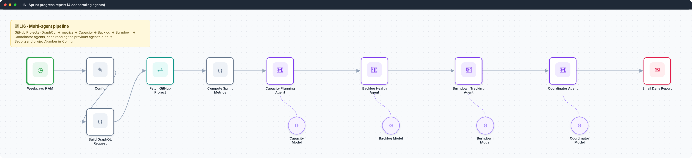
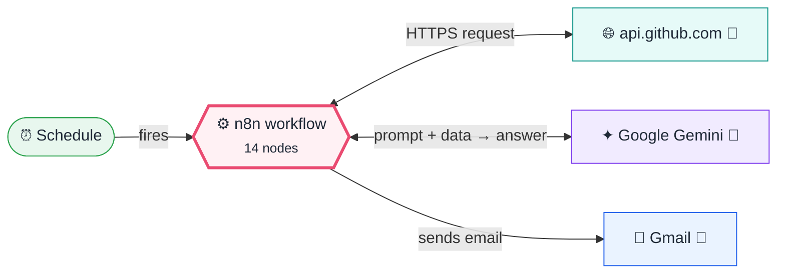
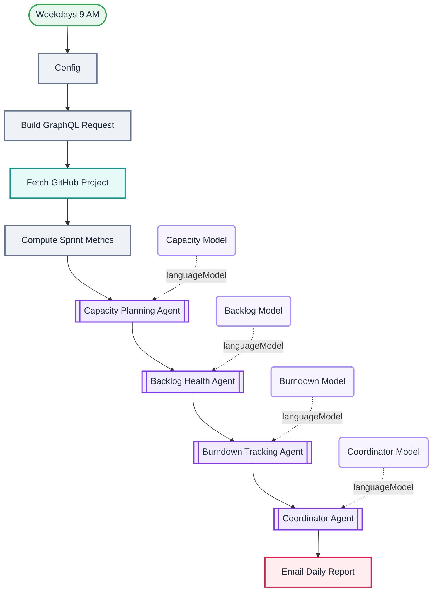

<div align="center">

# L16 · Sprint progress report with 4 cooperating agents

    



</div>

> [!NOTE]
> **The real-world problem.** A delivery lead needs one daily email: is the sprint on track, who is overloaded, is the backlog healthy? Each question needs a different lens, so one specialist agent handles each lens and a coordinator writes the final report.

## 💡 Concept first

**📌 Key idea:** **Sequential specialists**: several narrow agents, each building on the previous one's output, plus a coordinator.

**🧠 Mental model:** A newsroom: a reporter per beat, and an editor who writes the front page from their notes.

**🚫 When *not* to use it:** Don't split into many agents when one good prompt works. Each agent adds cost, latency and another place to be wrong.

## 🎯 What you'll learn

- GitHub **GraphQL** API via HTTP Request
- Computing metrics in code *before* the LLM sees them (cheaper, and no maths mistakes)
- **Sequential multi-agent** pattern: each agent reads the metrics plus the earlier agents' notes
- A coordinator agent that merges the specialists' output into one report

## 🏗️ Architecture

**System context:** who and what this workflow talks to, and what crosses each boundary. 🔑 = needs a credential · 🧑 = a human decides.



<details><summary><b>Node-level flow</b> (every node and branch)</summary>



</details>

<details><summary>Plain-text flow</summary>

```
Schedule → Config → Code (GraphQL query) → HTTP POST api.github.com/graphql → Code (metrics)
 → Capacity agent → Backlog agent → Burndown agent → Coordinator agent → Gmail
```

</details>

## 🔑 Credentials

| You need | Where to get it |
|---|---|
| GitHub API token (classic PAT with `read:project`, `repo`) | [docs/credentials.md](../../docs/credentials.md) |
| Google Gemini API key | [docs/credentials.md](../../docs/credentials.md) |
| Gmail OAuth2 | [docs/credentials.md](../../docs/credentials.md) |

## 📝 Before you run it

Replace these placeholder values with your own:

| Node | Field | Placeholder |
|---|---|---|
| Config | `org` | `https://github.com/YOUR_GITHUB_USER_OR_ORG` |
| Email Daily Report | `sendTo` | `you@example.com` |

Nodes that need a credential selected after import: **Gmail**, **Google Gemini Chat Model**, **HTTP Request**.

## 🛠️ Build it step by step

> [!TIP]
> In a hurry? Import [`workflow.json`](workflow.json) (copy → paste on the n8n canvas). Learning? Build it yourself using the steps below, then compare.

1. Create a GitHub Project (v2) with Status, Estimate and Iteration fields, and add some issues.
2. Create a GitHub credential with a PAT.
3. Config: `org` (your user/org URL), `projectNumber`, recipient email.
4. Import this workflow and run it up to *Compute Sprint Metrics*. Read the metrics JSON before any AI step runs.
5. Run the full chain and read each agent's output in order.

## 🔍 Node-by-node reference

Every node in this workflow and every setting inside it, generated from [`workflow.json`](workflow.json). Click a node to expand it.

<details><summary><b>1. Config</b> · <code>Edit Fields (Set)</code> v3.4</summary>

> Creates, renames or overwrites fields without code.

| Property | Value |
|---|---|
| `org` | https://github.com/YOUR_GITHUB_USER_OR_ORG |
| `projectNumber` | 3 |

</details>

<details><summary><b>2. Build GraphQL Request</b> · <code>Code</code> v2</summary>

> Runs JavaScript. *Run once for all items* sees every item; *for each item* sees one at a time.

| Property | Value |
|---|---|
| `jsCode` | (JavaScript, 7 lines, shown below) |

**Code:**

```javascript
const cfg = $('Config').first().json;
let login = String(cfg.org || '').trim();
// Accept a full URL, an @handle, or a bare login and reduce to the bare login
login = login.replace(/^https?:\/\/github\.com\//i, '').replace(/^@/, '').split('/')[0].trim();
const number = parseInt(String(cfg.projectNumber || '').trim(), 10);
const query = 'query($login:String!,$number:Int!){ repositoryOwner(login:$login){ ... on ProjectV2Owner { projectV2(number:$number){ title items(first:100){ nodes{ content{ ... on Issue{title state} ... on PullRequest{title state} } fieldValues(first:20){ nodes{ ... on ProjectV2ItemFieldSingleSelectValue{name field{... on ProjectV2FieldCommon{name}}} ... on ProjectV2ItemFieldNumberValue{number field{... on ProjectV2FieldCommon{name}}} ... on ProjectV2ItemFieldIterationValue{title startDate duration field{... on ProjectV2FieldCommon{name}}} } } } } } } } }';
return [{ json: { body: JSON.stringify({ query, variables: { login, number } }) } }];
```

</details>

<details><summary><b>3. Fetch GitHub Project</b> · <code>HTTP Request</code> v4.5</summary>

> Calls any REST API. Use it whenever there's no dedicated node.

| Property | Value |
|---|---|
| `method` | POST |
| `url` | https://api.github.com/graphql |
| `authentication` | predefinedCredentialType |
| `nodeCredentialType` | githubApi |
| `sendBody` | ✅ on |
| `contentType` | raw |
| `rawContentType` | application/json |
| `body` | `{{ $json.body }}` |

</details>

<details><summary><b>4. Compute Sprint Metrics</b> · <code>Code</code> v2</summary>

> Runs JavaScript. *Run once for all items* sees every item; *for each item* sees one at a time.

| Property | Value |
|---|---|
| `jsCode` | (JavaScript, 33 lines, shown below) |

**Code:**

```javascript
const resp = $input.first().json;
const owner = resp && resp.data && (resp.data.repositoryOwner || resp.data.organization);
const project = (owner && owner.projectV2) || {};
const nodes = (project.items && project.items.nodes) || [];
let totalItems = 0, done = 0, inProgress = 0, todo = 0;
let totalPoints = 0, donePoints = 0, iterationTitle = '', iterationStart = '', iterationDuration = 0;
for (const it of nodes) {
  totalItems++;
  let status = '';
  let points = 0;
  const fvs = (it.fieldValues && it.fieldValues.nodes) || [];
  for (const fv of fvs) {
    const fname = fv && fv.field && fv.field.name ? String(fv.field.name).toLowerCase() : '';
    if (fv && typeof fv.name === 'string' && fname === 'status') status = fv.name;
    if (fv && typeof fv.number === 'number' && (fname.includes('point') || fname.includes('estimate') || fname.includes('size'))) points = fv.number;
    if (fv && typeof fv.title === 'string' && fv.startDate) { iterationTitle = fv.title; iterationStart = fv.startDate; iterationDuration = fv.duration || 0; }
  }
  const s = status.toLowerCase();
  totalPoints += points;
  if (s.includes('done') || s.includes('closed')) { done++; donePoints += points; }
  else if (s.includes('progress') || s.includes('review')) { inProgress++; }
  else { todo++; }
}
const remainingPoints = totalPoints - donePoints;
const pctComplete = totalPoints > 0 ? Math.round((donePoints / totalPoints) * 100) : (totalItems > 0 ? Math.round((done / totalItems) * 100) : 0);
let dayOfSprint = 0, sprintLength = iterationDuration;
if (iterationStart) {
  const start = new Date(iterationStart);
  const now = new Date();
  dayOfSprint = Math.max(0, Math.round((now - start) / 86400000));
}
const timeElapsedPct = sprintLength > 0 ? Math.round((dayOfSprint / sprintLength) * 100) : 0;
return [{ json: { projectTitle: project.title || '', iteration: iterationTitle, iterationStart, sprintLength, dayOfSprint, timeElapsedPct, totalItems, todo, inProgress, done, totalPoints, donePoints, remainingPoints, pctComplete, reportDate: $now.toFormat('yyyy-MM-dd') } }];
```

</details>

<details><summary><b>5. Capacity Planning Agent</b> · <code>AI Agent</code> v3.1</summary>

> An LLM that can call tools, use memory and loop until it has an answer.

| Property | Value |
|---|---|
| `promptType` | define |
| `text` | `Analyze this sprint's team capacity. Sprint metrics (JSON): {{ JSON.stringify($('Compute Sprint Metrics').item.json) }}` |
| `systemMessage` | You are the Capacity Planning Agent in a team of three sprint analysts. Given sprint metrics (total story points, remaining points, day of sprint, time elapsed %, item counts), assess whether the committed scope fits the remaining team capacity. State if the team is over-committed, on-track, or under-committed, with a one-line rationale using the numbers. Keep it under 120 words. End with "Capacity signal: GOOD \| MODERATE \| BAD". |

</details>

<details><summary><b>6. Capacity Model</b> · <code>Google Gemini Chat Model</code> v1</summary>

> The language model plugged into a chain or agent.

| Property | Value |
|---|---|
| `modelName` | models/gemini-2.5-flash |

</details>

<details><summary><b>7. Backlog Health Agent</b> · <code>AI Agent</code> v3.1</summary>

> An LLM that can call tools, use memory and loop until it has an answer.

| Property | Value |
|---|---|
| `promptType` | define |
| `text` | `Assess backlog health. Sprint metrics (JSON): {{ JSON.stringify($('Compute Sprint Metrics').item.json) }}. The Capacity Planning Agent reported: {{ $('Capacity Planning Agent').item.json.output }}` |
| `systemMessage` | You are the Backlog Health Agent, working with a Capacity Planning Agent and a Burndown Agent. Evaluate backlog health from the metrics: ratio of Todo vs In Progress vs Done items, whether too much work is unstarted late in the sprint, and whether WIP looks unhealthy. Reference and build on the Capacity Agent's finding you were given. Keep it under 120 words. End with "Backlog signal: GOOD \| MODERATE \| BAD". |

</details>

<details><summary><b>8. Backlog Model</b> · <code>Google Gemini Chat Model</code> v1</summary>

> The language model plugged into a chain or agent.

| Property | Value |
|---|---|
| `modelName` | models/gemini-2.5-flash |

</details>

<details><summary><b>9. Burndown Tracking Agent</b> · <code>AI Agent</code> v3.1</summary>

> An LLM that can call tools, use memory and loop until it has an answer.

| Property | Value |
|---|---|
| `promptType` | define |
| `text` | `Track the burndown. Sprint metrics (JSON): {{ JSON.stringify($('Compute Sprint Metrics').item.json) }}. Capacity Agent said: {{ $('Capacity Planning Agent').item.json.output }}. Backlog Agent said: {{ $('Backlog Health Agent').item.json.output }}` |
| `systemMessage` | You are the Burndown Tracking Agent, the third analyst. Compare completion progress (donePoints / totalPoints, pctComplete) against time elapsed (timeElapsedPct, dayOfSprint / sprintLength). If completion trails time elapsed, the team is behind the ideal burndown; if ahead, they are ahead. Reference the Capacity and Backlog agents' findings you were given. Keep it under 120 words. End with "Burndown signal: GOOD \| MODERATE \| BAD". |

</details>

<details><summary><b>10. Burndown Model</b> · <code>Google Gemini Chat Model</code> v1</summary>

> The language model plugged into a chain or agent.

| Property | Value |
|---|---|
| `modelName` | models/gemini-2.5-flash |

</details>

<details><summary><b>11. Coordinator Agent</b> · <code>AI Agent</code> v3.1</summary>

> An LLM that can call tools, use memory and loop until it has an answer.

| Property | Value |
|---|---|
| `promptType` | define |
| `text` | `Produce the daily team progress report for {{ $('Compute Sprint Metrics').item.json.reportDate }}. Metrics (JSON): {{ JSON.stringify($('Compute Sprint Metrics').item.json) }}. Capacity Agent: {{ $('Capacity Planning Agent').item.json.output }}. Backlog Agent: {{ $('Backlog Health Agent').item.json.output }}. Burndown Agent: {{ $('Burndown Tracking Agent').item.json.output }}` |
| `systemMessage` | You are the Coordinator. You receive findings from the Capacity Planning, Backlog Health, and Burndown Tracking agents plus the raw metrics. Reconcile the three signals into ONE overall verdict. Output a clean plain-text email report with exactly this structure: Line 1: "Overall team progress: GOOD" or "MODERATE" or "BAD" (worst-weighted: any BAD with another non-GOOD =&gt; BAD; mixed =&gt; MODERATE; all GOOD =&gt; GOOD). Then "Snapshot:" with 2-3 bullet metric lines (points done/total, % complete vs % time elapsed, item counts). Then "Capacity:", "Backlog:", "Burndown:" each with a one-line summary of that agent's finding. Then "Recommended focus today:" with 1-2 concrete actions. Be concise and … |

</details>

<details><summary><b>12. Coordinator Model</b> · <code>Google Gemini Chat Model</code> v1</summary>

> The language model plugged into a chain or agent.

| Property | Value |
|---|---|
| `modelName` | models/gemini-2.5-flash |

</details>

<details><summary><b>13. Email Daily Report</b> · <code>Gmail</code> v2.2</summary>

> Sends, reads or labels email. `sendAndWait` pauses the workflow for a human reply.

| Property | Value |
|---|---|
| `sendTo` | you@example.com |
| `subject` | `Daily Sprint Progress Report - {{ $('Compute Sprint Metrics').item.json.reportDate }}` |
| `emailType` | text |
| `message` | `{{ $json.output }}` |

</details>

<details><summary><b>14. Weekdays 9 AM</b> · <code>Schedule Trigger</code> v1.4</summary>

> Starts the workflow on a timer or cron expression. Only fires when the workflow is **active**.

| Property | Value |
|---|---|
| `rule.interval.field` | cronExpression |
| `rule.interval.expression` | 0 9 * * 1-5 |

</details>

> [!TIP]
> ⚙️ rows come from each node's **Settings** tab, not its Parameters tab. `{{ … }}` values are **expressions** evaluated at run time. See [workflow anatomy](../../docs/workflow-anatomy.md) for what every property means.

## ✅ Test it

> [!TIP]
> **Automated end-to-end test: passed.** 10/10 nodes executed in real n8n (6 credentialed nodes replaced by realistic mocks), 0 behaviour checks. See [tests/](../../tests/README.md).

- [ ] Change a few issue statuses in GitHub, run it again, and compare the burndown text.

## 🧯 Troubleshooting

Problems specific to this workflow are below. For general ones (expressions, items, triggers, AI), see [common mistakes](../../docs/common-mistakes.md).

<details><summary><b>GraphQL Could not resolve to a ProjectV2</b></summary>

Wrong project number, or it's a user project and the query expects an org. The code handles both, so check `org`.

</details>

<details><summary><b>The report contradicts the metrics</b></summary>

Lower the temperature, and tell agents to quote the numbers from the JSON.

</details>

## 🚀 Level up

- Swap GitHub for Jira (Jira node, sprint JQL).
- Run the three specialist agents in **parallel** and merge them, which is faster.

---

<p align="center"><a href="../L15-retro-ai-approval-jira/README.md">← L15 · Retrospective → AI action items → human approval → Jira</a> &nbsp;·&nbsp; <a href="../../README.md#-the-learning-path">📚 All lessons</a> &nbsp;·&nbsp; <a href="../L17-complaint-handler-multi-agent/README.md">L17 · Customer complaint handler →</a></p>
