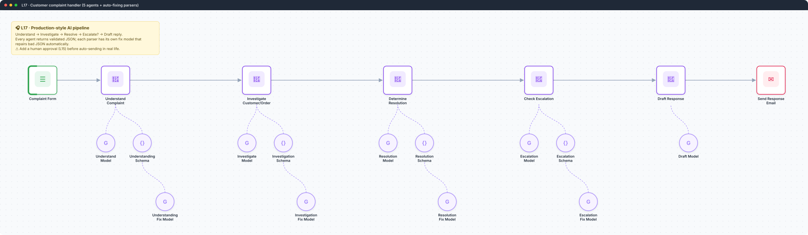
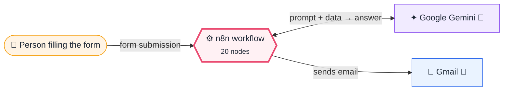
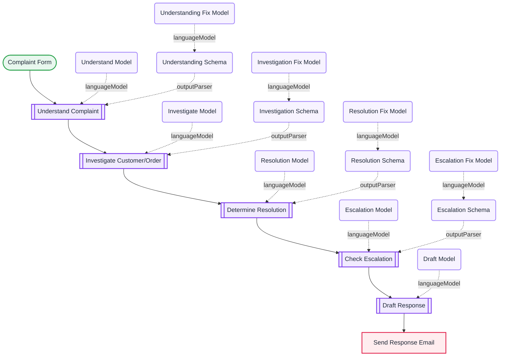

<div align="center">

# L17 · Customer complaint handler (5 agents)

    



</div>

> [!NOTE]
> **The real-world problem.** Support teams spend the first 10 minutes of every complaint just working out what it is. This pipeline classifies it (category, urgency, sentiment), investigates, proposes a resolution and a goodwill gesture, decides whether to escalate, and drafts an empathetic reply.

## 💡 Concept first

**📌 Key idea:** Every agent step returns **validated JSON**, and a fix-model repairs malformed output automatically.

**🧠 Mental model:** A factory line with an inspector after every station, sending faulty parts back for rework.

**🚫 When *not* to use it:** Don't auto-send AI-written customer emails until you've measured accuracy. Add L15's approval step first.

## 🎯 What you'll learn

- Chained agents, each with its **own schema**
- **Auto-fixing output parser** (a second model repairs malformed JSON)
- Referencing any earlier step: `$('Understand Complaint').item.json.output`
- Designing escalation rules as explicit JSON (`escalate`, `priority`, `route_to`)

## 🏗️ Architecture

**System context:** who and what this workflow talks to, and what crosses each boundary. 🔑 = needs a credential · 🧑 = a human decides.



<details><summary><b>Node-level flow</b> (every node and branch)</summary>



</details>

<details><summary>Plain-text flow</summary>

```
Form → Understand ⇐(model, schema⇐fix model) → Investigate ⇐… → Resolve ⇐… → Escalate? ⇐… → Draft reply ⇐model → Gmail
```

</details>

## 🔑 Credentials

| You need | Where to get it |
|---|---|
| Google Gemini API key | [docs/credentials.md](../../docs/credentials.md) |
| Gmail OAuth2 | [docs/credentials.md](../../docs/credentials.md) |

## 📝 Before you run it

No placeholder values. It runs as-is once the credentials are connected.

Nodes that need a credential selected after import: **Gmail**, **Google Gemini Chat Model**.

## 🛠️ Build it step by step

> [!TIP]
> In a hurry? Import [`workflow.json`](workflow.json) (copy → paste on the n8n canvas). Learning? Build it yourself using the steps below, then compare.

1. Import it and connect the Gemini credential. There are 10 model nodes: select them all and set the credential once.
2. Open the form and submit a complaint from [docs/sample-data.md](../../docs/sample-data.md#customer-complaints).
3. Click each agent in the execution and read its `output`. Look at how context builds up.
4. Change the email node to send to **yourself** while testing.

## 🔍 Node-by-node reference

Every node in this workflow and every setting inside it, generated from [`workflow.json`](workflow.json). Click a node to expand it.

<details><summary><b>1. Complaint Form</b> · <code>n8n Form Trigger</code> v2.6</summary>

> Hosts a web form; each submission starts one execution. Field labels become JSON keys.

| Property | Value |
|---|---|
| `formTitle` | Customer Complaint |
| `formDescription` | Tell us what went wrong and we will get back to you. |
| `formFields.values` | Your email *, Order ID (if known), Describe your complaint * |
| `path` | customer-complaint |

</details>

<details><summary><b>2. Understand Complaint</b> · <code>AI Agent</code> v3.1</summary>

> An LLM that can call tools, use memory and loop until it has an answer.

| Property | Value |
|---|---|
| `promptType` | define |
| `text` | `Complaint from {{ $json.customer_email }} (order id: {{ $json.order_id }}):  {{ $json.complaint }}` |
| `hasOutputParser` | ✅ on |
| `systemMessage` | You are a complaint intake analyst. Read the customer complaint and extract a structured understanding of it: category (e.g. shipping, billing, product-quality, service, other), urgency (low/medium/high), sentiment, product, order_id, customer_email, and a one-sentence summary. If a value is unknown, use an empty string. |

</details>

<details><summary><b>3. Understand Model</b> · <code>Google Gemini Chat Model</code> v1</summary>

> The language model plugged into a chain or agent.

| Property | Value |
|---|---|
| `modelName` | models/gemini-2.5-flash |
| `temperature` | 0.2 |

</details>

<details><summary><b>4. Understanding Schema</b> · <code>Structured Output Parser</code> v1.3</summary>

> Forces the model's answer into JSON matching your schema.

| Property | Value |
|---|---|
| `jsonSchemaExample` | (JSON schema, 1 lines, shown below) |
| `autoFix` | ✅ on |

**Schema example:**

```json
{
  "category": "shipping",
  "urgency": "high",
  "sentiment": "negative",
  "product": "Wireless Headphones",
  "order_id": "ORD-1234",
  "customer_email": "customer@example.com",
  "summary": "Order arrived damaged and late."
}
```

</details>

<details><summary><b>5. Understanding Fix Model</b> · <code>Google Gemini Chat Model</code> v1</summary>

> The language model plugged into a chain or agent.

| Property | Value |
|---|---|
| `modelName` | models/gemini-2.5-flash |
| `temperature` | 0 |

</details>

<details><summary><b>6. Investigate Customer/Order</b> · <code>AI Agent</code> v3.1</summary>

> An LLM that can call tools, use memory and loop until it has an answer.

| Property | Value |
|---|---|
| `promptType` | define |
| `text` | `Structured complaint understanding: {{ JSON.stringify($json.output) }}  Original complaint text: {{ $("Complaint Form").item.json.complaint }}` |
| `hasOutputParser` | ✅ on |
| `systemMessage` | You are a support investigator. Based on the complaint understanding and available information, organize what is known about the customer and their order, list the information that is missing and would be needed to resolve the case, and suggest the specific lookups (e.g. CRM/order-management queries) that should be performed. Do not invent facts you were not given. For known_facts, missing_info, and recommended_lookups, return each as a single string with items separated by semicolons. |

</details>

<details><summary><b>7. Investigate Model</b> · <code>Google Gemini Chat Model</code> v1</summary>

> The language model plugged into a chain or agent.

| Property | Value |
|---|---|
| `modelName` | models/gemini-2.5-flash |
| `temperature` | 0.2 |

</details>

<details><summary><b>8. Investigation Schema</b> · <code>Structured Output Parser</code> v1.3</summary>

> Forces the model's answer into JSON matching your schema.

| Property | Value |
|---|---|
| `schemaType` | manual |
| `inputSchema` | (JSON schema, 1 lines, shown below) |
| `autoFix` | ✅ on |

**JSON schema:**

```json
{
  "type": "object",
  "properties": {
    "known_facts": {
      "type": "string"
    },
    "missing_info": {
      "type": "string"
    },
    "recommended_lookups": {
      "type": "string"
    },
    "confidence": {
      "type": "string"
    }
  },
  "required": [
    "known_facts",
    "missing_info",
    "recommended_lookups",
    "confidence"
  ]
}
```

</details>

<details><summary><b>9. Investigation Fix Model</b> · <code>Google Gemini Chat Model</code> v1</summary>

> The language model plugged into a chain or agent.

| Property | Value |
|---|---|
| `modelName` | models/gemini-2.5-flash |
| `temperature` | 0 |

</details>

<details><summary><b>10. Determine Resolution</b> · <code>AI Agent</code> v3.1</summary>

> An LLM that can call tools, use memory and loop until it has an answer.

| Property | Value |
|---|---|
| `promptType` | define |
| `text` | `Complaint understanding: {{ JSON.stringify($("Understand Complaint").item.json.output) }}  Investigation findings: {{ JSON.stringify($json.output) }}` |
| `hasOutputParser` | ✅ on |
| `systemMessage` | You are a resolution strategist. Given the complaint and investigation, choose the most appropriate resolution workflow (e.g. refund-or-replacement, reship, billing-adjustment, technical-support, goodwill-gesture, information-request) and lay out the concrete steps to resolve it, with any relevant policy notes. Return steps as a single string with each step separated by semicolons. |

</details>

<details><summary><b>11. Resolution Model</b> · <code>Google Gemini Chat Model</code> v1</summary>

> The language model plugged into a chain or agent.

| Property | Value |
|---|---|
| `modelName` | models/gemini-2.5-flash |
| `temperature` | 0.2 |

</details>

<details><summary><b>12. Resolution Schema</b> · <code>Structured Output Parser</code> v1.3</summary>

> Forces the model's answer into JSON matching your schema.

| Property | Value |
|---|---|
| `schemaType` | manual |
| `inputSchema` | (JSON schema, 1 lines, shown below) |
| `autoFix` | ✅ on |

**JSON schema:**

```json
{
  "type": "object",
  "properties": {
    "resolution_workflow": {
      "type": "string"
    },
    "steps": {
      "type": "string"
    },
    "policy_notes": {
      "type": "string"
    }
  },
  "required": [
    "resolution_workflow",
    "steps",
    "policy_notes"
  ]
}
```

</details>

<details><summary><b>13. Resolution Fix Model</b> · <code>Google Gemini Chat Model</code> v1</summary>

> The language model plugged into a chain or agent.

| Property | Value |
|---|---|
| `modelName` | models/gemini-2.5-flash |
| `temperature` | 0 |

</details>

<details><summary><b>14. Check Escalation</b> · <code>AI Agent</code> v3.1</summary>

> An LLM that can call tools, use memory and loop until it has an answer.

| Property | Value |
|---|---|
| `promptType` | define |
| `text` | `Complaint understanding: {{ JSON.stringify($("Understand Complaint").item.json.output) }}  Resolution plan: {{ JSON.stringify($json.output) }}` |
| `hasOutputParser` | ✅ on |
| `systemMessage` | You are an escalation reviewer. Decide whether this complaint requires human escalation. Consider urgency, sentiment, legal/safety risk, repeat issues, and high monetary value. Return escalate (boolean), priority (low/medium/high), a short reason, and route_to (which team, or empty if no escalation). |

</details>

<details><summary><b>15. Escalation Model</b> · <code>Google Gemini Chat Model</code> v1</summary>

> The language model plugged into a chain or agent.

| Property | Value |
|---|---|
| `modelName` | models/gemini-2.5-flash |
| `temperature` | 0.2 |

</details>

<details><summary><b>16. Escalation Schema</b> · <code>Structured Output Parser</code> v1.3</summary>

> Forces the model's answer into JSON matching your schema.

| Property | Value |
|---|---|
| `jsonSchemaExample` | (JSON schema, 1 lines, shown below) |
| `autoFix` | ✅ on |

**Schema example:**

```json
{
  "escalate": true,
  "priority": "high",
  "reason": "High-value order with damaged product and negative sentiment.",
  "route_to": "senior-support"
}
```

</details>

<details><summary><b>17. Escalation Fix Model</b> · <code>Google Gemini Chat Model</code> v1</summary>

> The language model plugged into a chain or agent.

| Property | Value |
|---|---|
| `modelName` | models/gemini-2.5-flash |
| `temperature` | 0 |

</details>

<details><summary><b>18. Draft Response</b> · <code>AI Agent</code> v3.1</summary>

> An LLM that can call tools, use memory and loop until it has an answer.

| Property | Value |
|---|---|
| `promptType` | define |
| `text` | `Write a customer response email.  Complaint understanding: {{ JSON.stringify($("Understand Complaint").item.json.output) }}  Resolution plan: {{ JSON.stringify($("Determine Resolution").item.json.output) }}  Escalation decision: {{ JSON.stringify($json.output) }}` |
| `systemMessage` | You are a customer support writer. Draft a warm, professional, empathetic email reply to the customer that acknowledges their complaint, explains the resolution being taken, and sets clear expectations for next steps. If the case was escalated, reassure them a specialist is handling it. Return only the email body text. |

</details>

<details><summary><b>19. Draft Model</b> · <code>Google Gemini Chat Model</code> v1</summary>

> The language model plugged into a chain or agent.

| Property | Value |
|---|---|
| `modelName` | models/gemini-2.5-flash |
| `temperature` | 0.3 |

</details>

<details><summary><b>20. Send Response Email</b> · <code>Gmail</code> v2.2</summary>

> Sends, reads or labels email. `sendAndWait` pauses the workflow for a human reply.

| Property | Value |
|---|---|
| `sendTo` | `{{ $("Complaint Form").item.json.customer_email }}` |
| `subject` | `Re: your complaint{{ $("Complaint Form").item.json.order_id ? " (Order " + $("Complaint Form").item.json.order_id + ")" : "" }}` |
| `emailType` | text |
| `message` | `{{ $json.output }}` |
| `appendAttribution` | off |

</details>

> [!TIP]
> ⚙️ rows come from each node's **Settings** tab, not its Parameters tab. `{{ … }}` values are **expressions** evaluated at run time. See [workflow anatomy](../../docs/workflow-anatomy.md) for what every property means.

## ✅ Test it

> [!TIP]
> **Automated end-to-end test: passed.** 7/7 nodes executed in real n8n (7 credentialed nodes replaced by realistic mocks), 0 behaviour checks. See [tests/](../../tests/README.md).

- [ ] Try an angry high-value complaint (it should escalate) and a mild one (it shouldn't).

## 🧯 Troubleshooting

Problems specific to this workflow are below. For general ones (expressions, items, triggers, AI), see [common mistakes](../../docs/common-mistakes.md).

<details><summary><b>Could not parse LLM output</b></summary>

The fix model is supposed to catch this. Check that each *Fix Model* is connected to its parser.

</details>

<details><summary><b>It emails real customers during testing</b></summary>

Put your own email in *Send Response Email* until you're ready.

</details>

## 🚀 Level up

- Add a real order lookup tool (Google Sheets or your DB) to the Investigate agent.
- Route escalations to a Slack channel and a Jira Service Management ticket.
- Insert an approval step (L15) before *Send Response Email*.

---

<p align="center"><a href="../L16-sprint-report-multi-agent/README.md">← L16 · Sprint progress report</a> &nbsp;·&nbsp; <a href="../../README.md#-the-learning-path">📚 All lessons</a> &nbsp;·&nbsp; <a href="../L18-resume-job-fit-multi-agent/README.md">L18 · Resume ↔ job fit analyser →</a></p>
