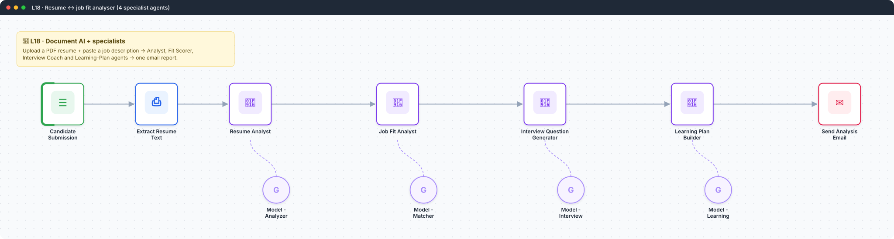
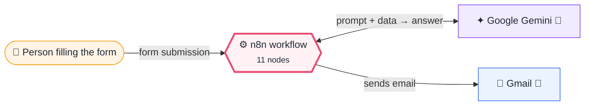
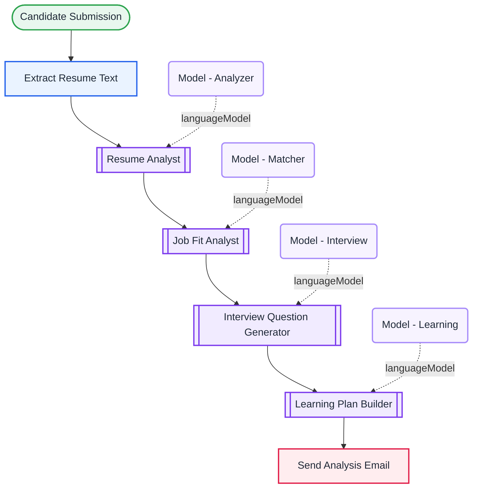

<div align="center">

# L18 · Resume ↔ job fit analyser

    



</div>

> [!NOTE]
> **The real-world problem.** Job seekers want to know *"Am I a fit, and what should I prepare?"*. Recruiters want a quick first screen. The same workflow answers both: it extracts the resume text, scores the fit, lists the gaps, drafts likely interview questions and builds a learning plan.

## 💡 Concept first

**📌 Key idea:** Document AI = **extract text first**, then let specialists analyse; the quality of step 1 limits everything after it.

**🧠 Mental model:** Photocopy the CV, then hand copies to four reviewers with different checklists.

**🚫 When *not* to use it:** Don't feed scanned images to a text extractor. Add OCR, or the AI analyses an empty page.

## 🎯 What you'll learn

- **Extract From File** (PDF → text)
- Specialist agents with narrow, focused prompts
- One consolidated HTML email built from 4 outputs
- Privacy: resumes are personal data, so don't log them to public places

## 🏗️ Architecture

**System context:** who and what this workflow talks to, and what crosses each boundary. 🔑 = needs a credential · 🧑 = a human decides.



<details><summary><b>Node-level flow</b> (every node and branch)</summary>



</details>

<details><summary>Plain-text flow</summary>

```
Form (PDF + JD) → Extract text → Resume Analyst → Job Fit Analyst → Interview Questions → Learning Plan → Gmail
```

</details>

## 🔑 Credentials

| You need | Where to get it |
|---|---|
| Google Gemini API key | [docs/credentials.md](../../docs/credentials.md) |
| Gmail OAuth2 | [docs/credentials.md](../../docs/credentials.md) |

## 📝 Before you run it

No placeholder values. It runs as-is once the credentials are connected.

Nodes that need a credential selected after import: **Gmail**, **Google Gemini Chat Model**.

## 🛠️ Build it step by step

> [!TIP]
> In a hurry? Import [`workflow.json`](workflow.json) (copy → paste on the n8n canvas). Learning? Build it yourself using the steps below, then compare.

1. Import it and connect the credentials.
2. Open the form, upload your resume, and paste a real JD from LinkedIn or Naukri.
3. Compare the fit score with your own judgement. Then tune the Job Fit prompt: add a scoring rubric (skills 40, experience 30, domain 20, extras 10).

## 🔍 Node-by-node reference

Every node in this workflow and every setting inside it, generated from [`workflow.json`](workflow.json). Click a node to expand it.

<details><summary><b>1. Candidate Submission</b> · <code>n8n Form Trigger</code> v2.6</summary>

> Hosts a web form; each submission starts one execution. Field labels become JSON keys.

| Property | Value |
|---|---|
| `formTitle` | Resume & Job Fit Analysis |
| `formDescription` | Upload your resume and paste one or more job descriptions to receive a personalized ana… |
| `formFields.values` | Candidate Name *, Email *, Resume *, Job Descriptions * |

</details>

<details><summary><b>2. Extract Resume Text</b> · <code>Extract From File</code> v1.1</summary>

> Pulls text or data out of a binary file (PDF, CSV, XLSX…).

| Property | Value |
|---|---|
| `operation` | pdf |
| `binaryPropertyName` | Resume |
| `joinPages` | ✅ on |

</details>

<details><summary><b>3. Resume Analyst</b> · <code>AI Agent</code> v3.1</summary>

> An LLM that can call tools, use memory and loop until it has an answer.

| Property | Value |
|---|---|
| `promptType` | define |
| `text` | `Analyze the following resume. Summarize the candidate's key skills, experience, notable achievements, strengths, and any gaps or weaknesses.  RESUME: {{ $json.text }}` |
| `systemMessage` | You are an expert technical recruiter and resume reviewer. Produce a clear, well-structured analysis using short headings and bullet points. |

</details>

<details><summary><b>4. Model - Analyzer</b> · <code>Google Gemini Chat Model</code> v1</summary>

> The language model plugged into a chain or agent.

| Property | Value |
|---|---|
| `modelName` | models/gemini-2.5-flash |
| `temperature` | 0.2 |

</details>

<details><summary><b>5. Job Fit Analyst</b> · <code>AI Agent</code> v3.1</summary>

> An LLM that can call tools, use memory and loop until it has an answer.

| Property | Value |
|---|---|
| `promptType` | define |
| `text` | `Compare the candidate's resume against the job description(s). For each role, give a fit score out of 100, list matched requirements, missing/weak requirements, and an overall recommendation.  RESUME: {{ $node["Extract Resume Text"].json.text }}  JOB DESCRIPTION(S): {{ $node["Candidate Submission"].json["Job Descriptions"] }}` |
| `systemMessage` | You are an expert hiring manager. Assess how well the candidate matches each job's requirements. Use clear headings per role and bullet points. |

</details>

<details><summary><b>6. Model - Matcher</b> · <code>Google Gemini Chat Model</code> v1</summary>

> The language model plugged into a chain or agent.

| Property | Value |
|---|---|
| `modelName` | models/gemini-2.5-flash |
| `temperature` | 0.2 |

</details>

<details><summary><b>7. Interview Question Generator</b> · <code>AI Agent</code> v3.1</summary>

> An LLM that can call tools, use memory and loop until it has an answer.

| Property | Value |
|---|---|
| `promptType` | define |
| `text` | `Based on the resume and the job description(s), prepare a tailored set of interview questions: technical, behavioral, and role-specific. Group them by category and note what a strong answer should cover.  RESUME: {{ $node["Extract Resume Text"].json.text }}  JOB DESCRIPTION(S): {{ $node["Candidate Submission"].json["Job Descriptions"] }}` |
| `systemMessage` | You are an experienced interviewer. Produce practical, tailored interview questions grouped by category. |

</details>

<details><summary><b>8. Model - Interview</b> · <code>Google Gemini Chat Model</code> v1</summary>

> The language model plugged into a chain or agent.

| Property | Value |
|---|---|
| `modelName` | models/gemini-2.5-flash |
| `temperature` | 0.2 |

</details>

<details><summary><b>9. Learning Plan Builder</b> · <code>AI Agent</code> v3.1</summary>

> An LLM that can call tools, use memory and loop until it has an answer.

| Property | Value |
|---|---|
| `promptType` | define |
| `text` | `Create a personalized learning plan to close the gaps between the candidate's resume and the job description(s). Include prioritized skills to learn, recommended resource types, and a suggested weekly timeline.  RESUME: {{ $node["Extract Resume Text"].json.text }}  JOB DESCRIPTION(S): {{ $node["Candidate Submission"].json["Job Descriptions"] }}` |
| `systemMessage` | You are a career coach. Build an actionable, prioritized learning plan with a realistic timeline. |

</details>

<details><summary><b>10. Model - Learning</b> · <code>Google Gemini Chat Model</code> v1</summary>

> The language model plugged into a chain or agent.

| Property | Value |
|---|---|
| `modelName` | models/gemini-2.5-flash |
| `temperature` | 0.2 |

</details>

<details><summary><b>11. Send Analysis Email</b> · <code>Gmail</code> v2.2</summary>

> Sends, reads or labels email. `sendAndWait` pauses the workflow for a human reply.

| Property | Value |
|---|---|
| `sendTo` | `{{ $node["Candidate Submission"].json.Email }}` |
| `subject` | `Your Resume & Job Fit Analysis, {{ $node["Candidate Submission"].json["Candidate Name"] }}` |
| `message` | `<h2>Hi {{ $node["Candidate Submission"].json["Candidate Name"] }},</h2><p>Here is your personalized resume and job fit analysis.</p><h3>1. Resume Analysis</h3><div style="white-space:pre-wrap">{{ $node["Resume Analyst"].json.output }}</div><h3>2. Job Fit &amp; Comparison</h3><div style="white-space:pre-wrap">{{ $node["Job Fit Analyst"].json.output }}</div><h3>3. Interview Questions</h3><div style="white-space:pre-wrap">{{ $node["Interview Question Generator"].json.output }}</div><h3>4. Personalized Learning Plan</h3><div style="white-space:pre-wrap">{{ $node["Learning Plan Builder"].json.output }}</div><p>Best of luck!</p>` |

</details>

> [!TIP]
> ⚙️ rows come from each node's **Settings** tab, not its Parameters tab. `{{ … }}` values are **expressions** evaluated at run time. See [workflow anatomy](../../docs/workflow-anatomy.md) for what every property means.

## ✅ Test it

> [!TIP]
> **Automated end-to-end test: passed.** 7/7 nodes executed in real n8n (7 credentialed nodes replaced by realistic mocks), 0 behaviour checks. See [tests/](../../tests/README.md).

- [ ] Try the same resume against 2 very different JDs. The scores should differ clearly.

## 🧯 Troubleshooting

Problems specific to this workflow are below. For general ones (expressions, items, triggers, AI), see [common mistakes](../../docs/common-mistakes.md).

<details><summary><b>Empty resume text</b></summary>

Scanned or image PDFs have no text layer. Add OCR, or ask for a text-based PDF.

</details>

<details><summary><b>Scores are always about 75</b></summary>

Add a rubric and examples of low and high scores to the prompt.

</details>

## 🚀 Level up

- Store results in Sheets to build a candidate pipeline.
- Loop over 20 resumes against one JD and rank them (see L20 sub-workflows).

---

<p align="center"><a href="../L17-complaint-handler-multi-agent/README.md">← L17 · Customer complaint handler</a> &nbsp;·&nbsp; <a href="../../README.md#-the-learning-path">📚 All lessons</a> &nbsp;·&nbsp; <a href="../L19-global-error-handler/README.md">L19 · Global error handler →</a></p>
