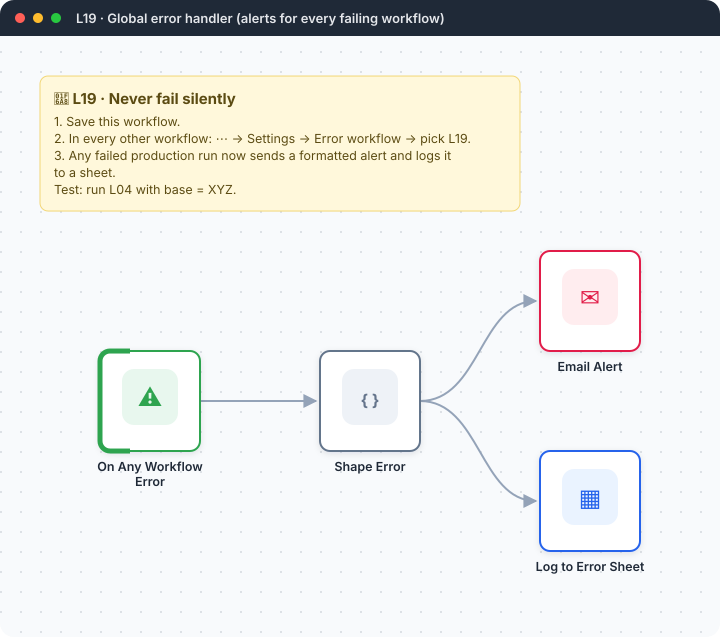
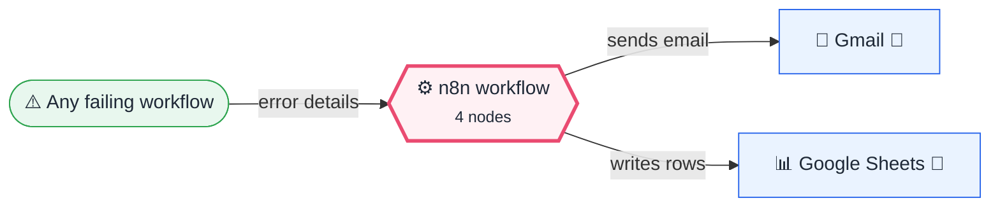
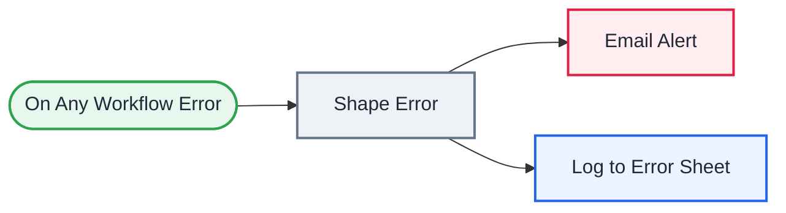

<div align="center">

# L19 · Global error handler

    [](https://github.com/callme-siva/n8n-knowledge/actions/workflows/validate.yml)



</div>

> [!NOTE]
> **The real-world problem.** Automation that fails silently is worse than none, because you think the reports are going out when they aren't. One error workflow can watch *all* your workflows, email you with a plain-English hint, and keep a log you can review every week.

## 💡 Concept first

**📌 Key idea:** One **error workflow** watches all others; failures become alerts with a human-readable hint.

**🧠 Mental model:** A smoke detector wired to every room, calling you with "kitchen, probably toast".

**🚫 When *not* to use it:** Don't alert on every retryable blip. Use Retry on Fail first, and alert when retries are exhausted.

## 🎯 What you'll learn

- **Error Trigger** and the *Error workflow* setting
- Error payload: `execution.error.message`, `lastNodeExecuted`, `execution.url`
- Pattern-matching errors into actionable hints
- Node-level *On Error: continue* so the alerting itself never crashes
- The full reliability toolkit: Retry on Fail · Continue on Error · Stop and Error · Error workflow

## 🏗️ Architecture

**System context:** who and what this workflow talks to, and what crosses each boundary. 🔑 = needs a credential · 🧑 = a human decides.



<details><summary><b>Node-level flow</b> (every node and branch)</summary>



</details>

## 🔑 Credentials

| You need | Where to get it |
|---|---|
| Gmail OAuth2 | [docs/credentials.md](../../docs/credentials.md) |
| Google Sheets OAuth2 | tab `Errors`: time, workflow, workflow_id, node, message, hint, url, mode |

## 📝 Before you run it

Replace these placeholder values with your own:

| Node | Field | Placeholder |
|---|---|---|
| Email Alert | `sendTo` | `you@example.com` |
| Log to Error Sheet | `documentId` | `PASTE_YOUR_GOOGLE_SHEET_URL` |

Nodes that need a credential selected after import: **Gmail**, **Google Sheets**.

### 📥 Starter files

Create each tab from its template, so column names match exactly: **Google Sheets → File → Import → Upload** the CSV → *Insert new sheet(s)*. The tab takes the file's name.

| Tab | Template | Columns |
|---|---|---|
| `Errors` | [Errors.csv](../../templates/L19-global-error-handler/Errors.csv) | `time`, `hint`, `message`, `mode`, `node`, `url`, `workflow`, `workflow_id` |

<sub>Columns are generated from what this workflow actually reads and writes in the automated test, so they can't drift from the workflow.</sub>

## 🛠️ Build it step by step

> [!TIP]
> In a hurry? Import [`workflow.json`](workflow.json) (copy → paste on the n8n canvas). Learning? Build it yourself using the steps below, then compare.

1. Add **Error Trigger** (this workflow never needs to be *active*).
2. Add the Code node to shape the error and generate a hint.
3. Add Gmail and Sheets in parallel, each with *On Error → Continue*.
4. Open **every** other workflow → *Settings* → **Error workflow** → choose this one.

## 🔍 Node-by-node reference

Every node in this workflow and every setting inside it, generated from [`workflow.json`](workflow.json). Click a node to expand it.

<details><summary><b>1. On Any Workflow Error</b> · <code>Error Trigger</code> v1</summary>

> Starts when *another* workflow that points here as its error workflow fails.

*No settings. This node works with its defaults.*

</details>

<details><summary><b>2. Shape Error</b> · <code>Code</code> v2</summary>

> Runs JavaScript. *Run once for all items* sees every item; *for each item* sees one at a time.

| Property | Value |
|---|---|
| `jsCode` | (JavaScript, 9 lines, shown below) |

**Code:**

```javascript
const e = $input.first().json;
const ex = e.execution || {}; const wf = e.workflow || {};
const msg = ex.error?.message || e.trigger?.error?.message || 'Unknown error';
const node = ex.lastNodeExecuted || 'trigger';
const hint = /401|403|credential|unauthori/i.test(msg) ? 'Check / reconnect the credential.'
  : /429|rate|quota/i.test(msg) ? 'Rate limit — add Retry on Fail or slow the schedule.'
  : /timeout|ETIMEDOUT|ECONNRESET/i.test(msg) ? 'Network/API timeout — enable retries.'
  : 'Open the execution to debug.';
return [{ json: { time: new Date().toISOString(), workflow: wf.name, workflow_id: wf.id, node, message: msg.slice(0, 500), hint, url: ex.url || '', mode: ex.mode || '' } }];
```

</details>

<details><summary><b>3. Email Alert</b> · <code>Gmail</code> v2.1</summary>

> Sends, reads or labels email. `sendAndWait` pauses the workflow for a human reply.

| Property | Value |
|---|---|
| `sendTo` | you@example.com |
| `subject` | `🚨 n8n failure: {{ $json.workflow }} → {{ $json.node }}` |
| `emailType` | html |
| `message` | `<p><b>Workflow:</b> {{ $json.workflow }}<br><b>Node:</b> {{ $json.node }}<br><b>Time:</b> {{ $json.time }}</p><pre>{{ $json.message }}</pre><p>💡 {{ $json.hint }}</p><p><a href="{{ $json.url }}">Open execution</a></p>` |
| `appendAttribution` | off |
| `⚙️ On error` | Continue (regular output) |

</details>

<details><summary><b>4. Log to Error Sheet</b> · <code>Google Sheets</code> v4.5</summary>

> Reads, appends or updates rows in a spreadsheet.

| Property | Value |
|---|---|
| `operation` | append |
| `documentId` | PASTE_YOUR_GOOGLE_SHEET_URL |
| `sheetName` | Errors |
| `columns.mappingMode` | autoMapInputData |
| `⚙️ On error` | Continue (regular output) |

</details>

> [!TIP]
> ⚙️ rows come from each node's **Settings** tab, not its Parameters tab. `{{ … }}` values are **expressions** evaluated at run time. See [workflow anatomy](../../docs/workflow-anatomy.md) for what every property means.

## ✅ Test it

> [!TIP]
> **Automated end-to-end test: passed.** 4/4 nodes executed in real n8n (3 credentialed or AI nodes replaced by fixtures, so AI output itself isn't tested), 1 behaviour checks. See [tests/](../../tests/README.md).

- [ ] Activate **L04** with `base = XYZ` (or disconnect a credential) and let it run. The alert should arrive within seconds.
- [ ] Note: error workflows fire for **production** executions, not manual test runs.

## 🧯 Troubleshooting

Problems specific to this workflow are below. For general ones (expressions, items, triggers, AI), see [common mistakes](../../docs/common-mistakes.md).

<details><summary><b>No alert when testing manually</b></summary>

That's expected. Only automatic (trigger or production) executions call the error workflow.

</details>

<details><summary><b>Alert loop</b></summary>

Never set L19 as its own error workflow.

</details>

## 🏋️ Practice

Try each challenge **before** opening the hint. Solutions show the exact expressions and code.

**⭐ Challenge 1:** Also send the alert to **Slack**.

<details><summary>💡 Hint</summary>

Add a parallel branch from *Shape Error*.

</details>
<details><summary>✅ Solution</summary>

Add a Slack *Send message* node connected to Shape Error, with *On Error → Continue* so a Slack outage never hides the email.

</details>

**⭐⭐ Challenge 2:** Send a **weekly error report** grouped by workflow.

<details><summary>💡 Hint</summary>

Read the Errors sheet on a schedule and aggregate.

</details>
<details><summary>✅ Solution</summary>

New workflow: Schedule (Monday) → Sheets read `Errors` → Code: filter the last 7 days, count by `workflow`, sort desc → email the top 5 with counts and the most common hint. Flaky workflows show up before users complain.

</details>

## 🚀 Ideas to extend it

- Add Slack / Telegram alerts.
- Weekly summary: read the Errors sheet → group by workflow → email the top offenders.

---

<p align="center"><a href="../L18-resume-job-fit-multi-agent/README.md">← L18 · Resume ↔ job fit analyser</a> &nbsp;·&nbsp; <a href="../../README.md#-the-learning-path">📚 All lessons</a> &nbsp;·&nbsp; <a href="../L20-subworkflows-caller/README.md">L20 · Sub-workflows — weekly birthday & anniversary wishes →</a></p>
