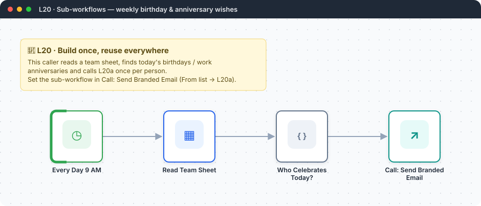

<div align="center">

# L20 · Sub-workflows: reusable building blocks

   



</div>

> [!NOTE]
> **The real-world problem.** After 10 workflows you'll have copy-pasted the same email template 10 times. Sub-workflows are functions for n8n: build *Send branded email* once and call it from anywhere. The example use is automatic birthday and work-anniversary wishes, which every HR and team lead wants.

## 🎯 What you'll learn

- **Execute Workflow Trigger** with typed inputs (the callee)
- **Execute Workflow** node (the caller) with mapped inputs
- Returning data from a sub-workflow
- Code that returns 0..N items (no one celebrating today means nothing runs)
- Designing for reuse: small, single-purpose workflows

## 🏗️ Architecture

```mermaid
flowchart LR
  n0(["Every Day 9 AM"]):::trigger
  n1["Read Team Sheet"]:::data
  n2["Who Celebrates Today?"]:::code
  n3["Call: Send Branded Email"]:::http
  n0 --> n1
  n1 --> n2
  n2 --> n3
  classDef trigger fill:#E8F7EE,stroke:#2EA44F,stroke-width:2px,color:#1F2937
  classDef ai fill:#F1EBFF,stroke:#7C3AED,stroke-width:2px,color:#1F2937
  classDef sub fill:#F7F3FF,stroke:#A78BFA,stroke-width:2px,color:#1F2937
  classDef logic fill:#FFF4E5,stroke:#F59E0B,stroke-width:2px,color:#1F2937
  classDef code fill:#EEF2F7,stroke:#64748B,stroke-width:2px,color:#1F2937
  classDef data fill:#EAF3FF,stroke:#2563EB,stroke-width:2px,color:#1F2937
  classDef http fill:#E6FAF8,stroke:#0D9488,stroke-width:2px,color:#1F2937
  classDef msg fill:#FFEDEF,stroke:#E11D48,stroke-width:2px,color:#1F2937
```



<details><summary>Plain-text flow</summary>

```
CALLER  Schedule → Sheets read → Code (filter today) → Execute Workflow(L20a)
CALLEE  Execute Workflow Trigger → Code (template) → Gmail → Set (return)
```

</details>

## 🔑 Credentials

| You need | Where to get it |
|---|---|
| Google Sheets OAuth2 | [docs/credentials.md](../../docs/credentials.md) |
| Gmail OAuth2 | [docs/credentials.md](../../docs/credentials.md) |

## 🛠️ Build it step by step

> [!TIP]
> In a hurry? Import [`workflow.json`](workflow.json) (copy → paste on the n8n canvas). Learning? Build it yourself using the steps below, then compare.

1. Import **L20a** first and save it. Copy its ID from the URL (`/workflow/<ID>`).
2. Create a sheet tab **Team** with `name, email, birthday, joined` (dates as YYYY-MM-DD). Put today's date in one row for testing.
3. Import **L20**. In *Call: Send Branded Email*, select L20a *From list* (or paste the ID).
4. Run it.

## ✅ Test it

- [ ] Look at the Execute Workflow output: it contains `sent: true` returned by the sub-workflow.
- [ ] Change the header colour in L20a and run again. Every caller gets the new look.

## 🧯 Troubleshooting

<details><summary><b>Workflow does not exist</b></summary>

Wrong ID, or L20a wasn't saved.

</details>

<details><summary><b>The sub-workflow receives empty fields</b></summary>

Input names must match exactly on both sides.

</details>

## 🚀 Level up

- Call L20a from L02, L08 and L19 to give every email the same branding.
- Make an L20b *Log to Sheet* sub-workflow for audit logs.

---

<p align="center"><a href="../L19-global-error-handler/README.md">← L19 · Global error handler</a> &nbsp;·&nbsp; <a href="../../README.md#-the-learning-path">📚 All lessons</a> &nbsp;·&nbsp; <a href="../L21-website-uptime-monitor/README.md">L21 · Website & API uptime monitor →</a></p>
