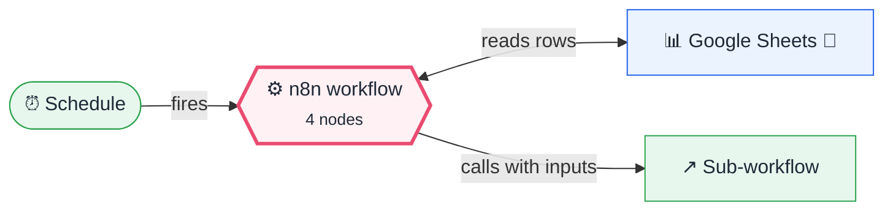

<div align="center">

# L20 · Sub-workflows: reusable building blocks

    


</div>

> [!NOTE]
> **The real-world problem.** After 10 workflows you'll have copy-pasted the same email template 10 times. Sub-workflows are functions for n8n: build *Send branded email* once and call it from anywhere. The example use is automatic birthday and work-anniversary wishes, which every HR and team lead wants.

## 💡 Concept first

**📌 Key idea:** **Sub-workflows are functions**: typed inputs, one job, a return value, reused everywhere.

**🧠 Mental model:** A company stamp: design it once, every department uses the same one.

**🚫 When *not* to use it:** Don't extract a sub-workflow used only once. Premature reuse makes debugging harder.

## 🎯 What you'll learn

- **Execute Workflow Trigger** with typed inputs (the callee)
- **Execute Workflow** node (the caller) with mapped inputs
- Returning data from a sub-workflow
- Code that returns 0..N items (no one celebrating today means nothing runs)
- Designing for reuse: small, single-purpose workflows

## 🏗️ Architecture

**System context:** who and what this workflow talks to, and what crosses each boundary. 🔑 = needs a credential · 🧑 = a human decides.



<details><summary><b>Node-level flow</b> (every node and branch)</summary>


</details>

<details><summary>Plain-text flow</summary>

```
CALLER  Schedule → Sheets read → Code (filter today) → Execute Workflow(L20a)
CALLEE  Execute Workflow Trigger → Code (template) → Gmail → Set (return)
```

</details>

## 🔑 Credentials

| You need | Where to get it |
|---|---|
| Google Sheets OAuth2 | [docs/credentials.md](../../docs/credentials.md) |
| Gmail OAuth2 | [docs/credentials.md](../../docs/credentials.md) |

## 📝 Before you run it

Replace these placeholder values with your own:

| Node | Field | Placeholder |
|---|---|---|
| Read Team Sheet | `documentId` | `PASTE_YOUR_GOOGLE_SHEET_URL` |
| Call: Send Branded Email | `workflowId` | `REPLACE_WITH_L20a_WORKFLOW_ID` |

Nodes that need a credential selected after import: **Google Sheets**.

## 🛠️ Build it step by step

> [!TIP]
> In a hurry? Import [`workflow.json`](workflow.json) (copy → paste on the n8n canvas). Learning? Build it yourself using the steps below, then compare.

1. Import **L20a** first and save it. Copy its ID from the URL (`/workflow/<ID>`).
2. Create a sheet tab **Team** with `name, email, birthday, joined` (dates as YYYY-MM-DD). Put today's date in one row for testing.
3. Import **L20**. In *Call: Send Branded Email*, select L20a *From list* (or paste the ID).
4. Run it.

## 🔍 Node-by-node reference

Every node in this workflow and every setting inside it, generated from [`workflow.json`](workflow.json). Click a node to expand it.

<details><summary><b>1. Every Day 9 AM</b> · <code>Schedule Trigger</code> v1.2</summary>

> Starts the workflow on a timer or cron expression. Only fires when the workflow is **active**.

| Property | Value |
|---|---|
| `rule.interval.triggerAtHour` | 9 |

</details>

<details><summary><b>2. Read Team Sheet</b> · <code>Google Sheets</code> v4.5</summary>

> Reads, appends or updates rows in a spreadsheet.

| Property | Value |
|---|---|
| `documentId` | PASTE_YOUR_GOOGLE_SHEET_URL |
| `sheetName` | Team |

</details>

<details><summary><b>3. Who Celebrates Today?</b> · <code>Code</code> v2</summary>

> Runs JavaScript. *Run once for all items* sees every item; *for each item* sees one at a time.

| Property | Value |
|---|---|
| `jsCode` | (JavaScript, 11 lines, shown below) |

**Code:**

```javascript
// Sheet columns: name | email | birthday (YYYY-MM-DD) | joined (YYYY-MM-DD)
// $today follows the workflow timezone (Settings → Timezone), unlike new Date() which is UTC-based.
const md = d => d && d.slice(5, 10);
const tmd = $today.toFormat('MM-dd');
const out = [];
for (const { json: p } of $input.all()) {
  if (md(p.birthday) === tmd) out.push({ json: { to: p.email, title: `Happy birthday, ${p.name}! 🎂`, body_html: `<p>Wishing you a fantastic year ahead, ${p.name}. Cake is on the team today!</p>`, cta_text: '', cta_url: '' } });
  if (md(p.joined) === tmd) { const yrs = $today.year - Number(p.joined.slice(0, 4));
    if (yrs > 0) out.push({ json: { to: p.email, title: `Happy ${yrs}-year work anniversary, ${p.name}! 🎉`, body_html: `<p>Thank you for ${yrs} great year${yrs > 1 ? 's' : ''} with us.</p>`, cta_text: '', cta_url: '' } }); }
}
return out;
```

</details>

<details><summary><b>4. Call: Send Branded Email</b> · <code>Execute Workflow</code> v1.2</summary>

> Calls another workflow (a sub-workflow) and waits for its result.

| Property | Value |
|---|---|
| `workflowId` | REPLACE_WITH_L20a_WORKFLOW_ID |
| `workflowInputs.mappingMode` | defineBelow |
| `workflowInputs.to` | `{{ $json.to }}` |
| `workflowInputs.title` | `{{ $json.title }}` |
| `workflowInputs.body_html` | `{{ $json.body_html }}` |
| `workflowInputs.cta_text` | `{{ $json.cta_text }}` |
| `workflowInputs.cta_url` | `{{ $json.cta_url }}` |
| `workflowInputs.schema.1.displayName` | to |
| `workflowInputs.schema.1.type` | string |
| `workflowInputs.schema.1.required` | off |
| `workflowInputs.schema.1.display` | ✅ on |
| `workflowInputs.schema.1.canBeUsedToMatch` | ✅ on |
| `workflowInputs.schema.1.defaultMatch` | off |
| `workflowInputs.schema.1.removed` | off |
| `workflowInputs.schema.2.displayName` | title |
| `workflowInputs.schema.2.type` | string |
| `workflowInputs.schema.2.required` | off |
| `workflowInputs.schema.2.display` | ✅ on |
| `workflowInputs.schema.2.canBeUsedToMatch` | ✅ on |
| `workflowInputs.schema.2.defaultMatch` | off |
| `workflowInputs.schema.2.removed` | off |
| `workflowInputs.schema.3.displayName` | body_html |
| `workflowInputs.schema.3.type` | string |
| `workflowInputs.schema.3.required` | off |
| … | 18 more in workflow.json |

</details>

> [!TIP]
> ⚙️ rows come from each node's **Settings** tab, not its Parameters tab. `{{ … }}` values are **expressions** evaluated at run time. See [workflow anatomy](../../docs/workflow-anatomy.md) for what every property means.

## ✅ Test it

> [!TIP]
> **Automated end-to-end test: passed.** 4/4 nodes executed in real n8n (2 credentialed nodes replaced by realistic mocks), 1 behaviour checks. See [tests/](../../tests/README.md).

- [ ] Look at the Execute Workflow output: it contains `sent: true` returned by the sub-workflow.
- [ ] Change the header colour in L20a and run again. Every caller gets the new look.

## 🧯 Troubleshooting

Problems specific to this workflow are below. For general ones (expressions, items, triggers, AI), see [common mistakes](../../docs/common-mistakes.md).

<details><summary><b>Workflow does not exist</b></summary>

Wrong ID, or L20a wasn't saved.

</details>

<details><summary><b>The sub-workflow receives empty fields</b></summary>

Input names must match exactly on both sides.

</details>

## 🚀 Level up

- Call L20a from L02, L08 and L19 to give every email the same branding.
- Make an L20b *Log to Sheet* sub-workflow for audit logs.

---

<p align="center"><a href="../L19-global-error-handler/README.md">← L19 · Global error handler</a> &nbsp;·&nbsp; <a href="../../README.md#-the-learning-path">📚 All lessons</a> &nbsp;·&nbsp; <a href="../L21-website-uptime-monitor/README.md">L21 · Website & API uptime monitor →</a></p>
