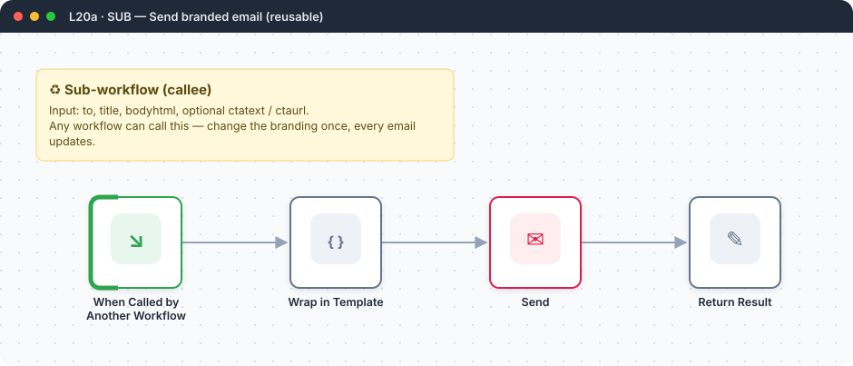
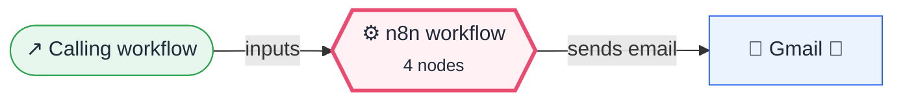
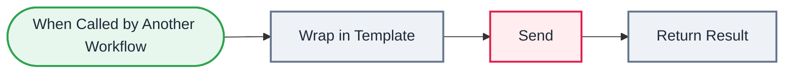

<div align="center">

# L20a · Sub-workflow: send branded email

    



</div>

> [!NOTE]
> **The real-world problem.** This is the **callee** used by [L20 · Sub-workflows](../L20-subworkflows-caller/README.md). It turns a title and body into a branded HTML email and sends it, so every workflow's emails look the same and the design lives in one place.

## 🎯 What you'll learn

- Execute Workflow Trigger with named inputs
- Wrapping content in an HTML template
- Returning a result to the caller

## 🏗️ Architecture

**System context:** who and what this workflow talks to, and what crosses each boundary. 🔑 = needs a credential · 🧑 = a human decides.



<details><summary><b>Node-level flow</b> (every node and branch)</summary>



</details>

<details><summary>Plain-text flow</summary>

```
Execute Workflow Trigger (to, title, body_html, cta_text, cta_url) → Code (template) → Gmail → Set (return sent=true)
```

</details>

## 🔑 Credentials

| You need | Where to get it |
|---|---|
| Gmail OAuth2 | [docs/credentials.md](../../docs/credentials.md) |

## 📝 Before you run it

No placeholder values. It runs as-is once the credentials are connected.

Nodes that need a credential selected after import: **Gmail**.

## 🛠️ Build it step by step

> [!TIP]
> In a hurry? Import [`workflow.json`](workflow.json) (copy → paste on the n8n canvas). Learning? Build it yourself using the steps below, then compare.

1. Import this workflow first and **save** it.
2. Copy its ID from the browser URL (`/workflow/<ID>`).
3. Paste that ID into *Call: Send Branded Email* in L20.

## 🔍 Node-by-node reference

Every node in this workflow and every setting inside it, generated from [`workflow.json`](workflow.json). Click a node to expand it.

<details><summary><b>1. When Called by Another Workflow</b> · <code>Execute Workflow Trigger</code> v1.1</summary>

> Makes this workflow callable from other workflows, like a function.

| Property | Value |
|---|---|
| `workflowInputs.1.name` | to |
| `workflowInputs.2.name` | title |
| `workflowInputs.3.name` | body_html |
| `workflowInputs.4.name` | cta_text |
| `workflowInputs.5.name` | cta_url |

</details>

<details><summary><b>2. Wrap in Template</b> · <code>Code</code> v2</summary>

> Runs JavaScript. *Run once for all items* sees every item; *for each item* sees one at a time.

| Property | Value |
|---|---|
| `mode` | runOnceForEachItem |
| `jsCode` | (JavaScript, 7 lines, shown below) |

**Code:**

```javascript
const j = $json;
const cta = j.cta_url ? `<p style="margin:24px 0"><a href="${j.cta_url}" style="background:#EA4B71;color:#fff;padding:10px 18px;border-radius:6px;text-decoration:none">${j.cta_text || 'Open'}</a></p>` : '';
const html = `<div style="font-family:Segoe UI,Arial;max-width:600px;margin:auto;border:1px solid #eee;border-radius:8px">
<div style="background:#1f2937;color:#fff;padding:16px 20px;font-size:18px">${j.title}</div>
<div style="padding:20px;color:#111">${j.body_html}${cta}</div>
<div style="padding:12px 20px;color:#888;font-size:12px;border-top:1px solid #eee">Sent by n8n automation · reply to this email if something looks wrong</div></div>`;
return { json: { ...j, html } };
```

</details>

<details><summary><b>3. Send</b> · <code>Gmail</code> v2.1</summary>

> Sends, reads or labels email. `sendAndWait` pauses the workflow for a human reply.

| Property | Value |
|---|---|
| `sendTo` | `{{ $json.to }}` |
| `subject` | `{{ $json.title }}` |
| `emailType` | html |
| `message` | `{{ $json.html }}` |
| `appendAttribution` | off |

</details>

<details><summary><b>4. Return Result</b> · <code>Edit Fields (Set)</code> v3.4</summary>

> Creates, renames or overwrites fields without code.

| Property | Value |
|---|---|
| `sent` | ✅ on |
| `to` | `{{ $('Wrap in Template').item.json.to }}` |
| `message_id` | `{{ $json.id }}` |

</details>

> [!TIP]
> ⚙️ rows come from each node's **Settings** tab, not its Parameters tab. `{{ … }}` values are **expressions** evaluated at run time. See [workflow anatomy](../../docs/workflow-anatomy.md) for what every property means.

## ✅ Test it

> [!TIP]
> **Automated end-to-end test: passed.** 4/4 nodes executed in real n8n (2 credentialed nodes replaced by realistic mocks), 0 behaviour checks. See [tests/](../../tests/README.md).

- [ ] Run L20 with a test row dated today. This workflow's execution should appear in *Executions* and return `sent: true`.

## 🧯 Troubleshooting

Problems specific to this workflow are below. For general ones (expressions, items, triggers, AI), see [common mistakes](../../docs/common-mistakes.md).

<details><summary><b>Workflow does not exist in the caller</b></summary>

Save this workflow and use its exact ID.

</details>

<details><summary><b>Fields arrive empty</b></summary>

Input names must match exactly on both sides.

</details>

## 🚀 Ideas to extend it

- Add a `reply_to` input.
- Switch Gmail for SMTP or SendGrid. Callers don't change.

---

<p align="center"><a href="../L20-subworkflows-caller/README.md">← Used by L20 · Sub-workflows</a> &nbsp;·&nbsp; <a href="../../README.md#-the-learning-path">📚 All lessons</a></p>
