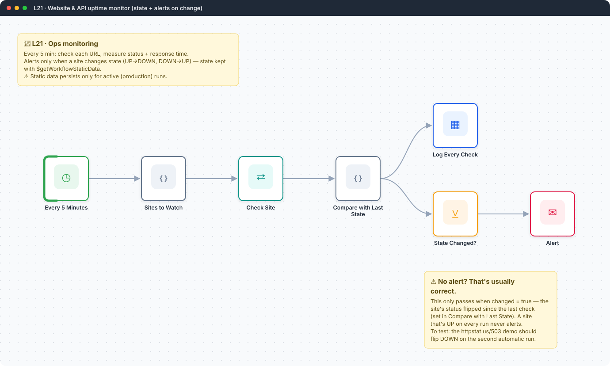
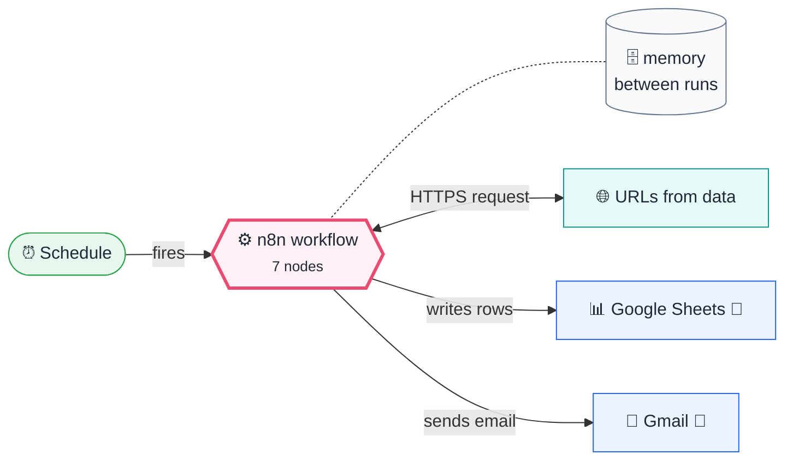

<div align="center">

# L21 · Website & API uptime monitor

    



</div>

> [!NOTE]
> **The real-world problem.** Paid uptime tools cost money, and simple ones spam you every 5 minutes while a site is down. This monitor checks your sites and APIs, logs response times, and alerts only when the state *changes*: once when a site goes down and once when it recovers.

## 💡 Concept first

**📌 Key idea:** **Alert on change, not on state**: remember the last state between runs and only speak when it changes.

**🧠 Mental model:** A doorbell that rings when someone arrives, not every five minutes while they stand there.

**🚫 When *not* to use it:** Don't rely on static data for critical state in multi-instance setups. Use a database table.

## 🎯 What you'll learn

- HTTP Request with **Full Response + Never Error** (read status codes instead of crashing)
- **Workflow static data**: memory that survives between executions
- Alert on *change* instead of on *state*, which avoids alert fatigue
- Filter node
- Fan-out: log everything, alert on some

## 🏗️ Architecture

**System context:** who and what this workflow talks to, and what crosses each boundary. 🔑 = needs a credential · 🧑 = a human decides.



<details><summary><b>Node-level flow</b> (every node and branch)</summary>


</details>

<details><summary>Plain-text flow</summary>

```
Schedule (5 min) → Code (site list) → HTTP (full response, never error) → Code (compare state)
   ├→ Sheets log (every check)
   └→ Filter changed → Gmail alert
```

</details>

## 🔑 Credentials

| You need | Where to get it |
|---|---|
| Gmail OAuth2 | [docs/credentials.md](../../docs/credentials.md) |
| Google Sheets OAuth2 (tab `Uptime` | time, name, url, status, code, ms, changed, since, error) |

## 📝 Before you run it

Replace these placeholder values with your own:

| Node | Field | Placeholder |
|---|---|---|
| Log Every Check | `documentId` | `PASTE_YOUR_GOOGLE_SHEET_URL` |
| Alert | `sendTo` | `you@example.com` |

Nodes that need a credential selected after import: **Gmail**, **Google Sheets**.

### 📥 Starter files

Create each tab from its template, so column names match exactly: **Google Sheets → File → Import → Upload** the CSV → *Insert new sheet(s)*. The tab takes the file's name.

| Tab | Template | Columns |
|---|---|---|
| `Uptime` | [Uptime.csv](../../templates/L21-website-uptime-monitor/Uptime.csv) | `time`, `name`, `changed`, `code`, `error`, `ms`, `since`, `status`, `url` |

<sub>Columns are generated from what this workflow actually reads and writes in the automated test, so they can't drift from the workflow.</sub>

## 🛠️ Build it step by step

> [!TIP]
> In a hurry? Import [`workflow.json`](workflow.json) (copy → paste on the n8n canvas). Learning? Build it yourself using the steps below, then compare.

1. Edit the site list in *Sites to Watch*.
2. HTTP Request: URL `{{ $json.url }}`, Options → *Response → Include full response* + *Never error*, timeout 10 s.
3. Code: read and update `$getWorkflowStaticData('global')`.
4. Filter `changed = true` → Gmail.
5. **Activate** it (static data isn't saved in manual runs).

## 🔍 Node-by-node reference

Every node in this workflow and every setting inside it, generated from [`workflow.json`](workflow.json). Click a node to expand it.

<details><summary><b>1. Every 5 Minutes</b> · <code>Schedule Trigger</code> v1.2</summary>

> Starts the workflow on a timer or cron expression. Only fires when the workflow is **active**.

| Property | Value |
|---|---|
| `rule.interval.field` | minutes |
| `rule.interval.minutesInterval` | 5 |

</details>

<details><summary><b>2. Sites to Watch</b> · <code>Code</code> v2</summary>

> Runs JavaScript. *Run once for all items* sees every item; *for each item* sees one at a time.

| Property | Value |
|---|---|
| `jsCode` | (JavaScript, 5 lines, shown below) |

**Code:**

```javascript
return [
  { url: 'https://n8n.io', name: 'n8n website' },
  { url: 'https://api.github.com', name: 'GitHub API' },
  { url: 'https://httpstat.us/503', name: 'Demo: always down' },
].map(s => ({ json: { ...s, started: Date.now() } }));
```

</details>

<details><summary><b>3. Check Site</b> · <code>HTTP Request</code> v4.2</summary>

> Calls any REST API. Use it whenever there's no dedicated node.

| Property | Value |
|---|---|
| `url` | `{{ $json.url }}` |
| `timeout` | 10000 |
| `response.response.fullResponse` | ✅ on |
| `response.response.neverError` | ✅ on |
| `⚙️ On error` | Continue (regular output) |

</details>

<details><summary><b>4. Compare with Last State</b> · <code>Code</code> v2</summary>

> Runs JavaScript. *Run once for all items* sees every item; *for each item* sees one at a time.

| Property | Value |
|---|---|
| `jsCode` | (JavaScript, 14 lines, shown below) |

**Code:**

```javascript
const state = $getWorkflowStaticData('global');
state.sites = state.sites || {};
const sites = $('Sites to Watch').all();
return $input.all().map((r, i) => {
  const site = sites[i].json;
  const code = r.json.statusCode || 0;
  const ms = Date.now() - site.started;
  const up = code >= 200 && code < 400;
  const prev = state.sites[site.url]?.up;
  const changed = prev !== undefined && prev !== up;
  const since = changed || prev === undefined ? new Date().toISOString() : state.sites[site.url].since;
  state.sites[site.url] = { up, since };
  return { json: { time: new Date().toISOString(), name: site.name, url: site.url, status: up ? 'UP' : 'DOWN', code, ms, changed, since, error: r.json.error?.message || '' } };
});
```

</details>

<details><summary><b>5. Log Every Check</b> · <code>Google Sheets</code> v4.5</summary>

> Reads, appends or updates rows in a spreadsheet.

| Property | Value |
|---|---|
| `operation` | append |
| `documentId` | PASTE_YOUR_GOOGLE_SHEET_URL |
| `sheetName` | Uptime |
| `columns.mappingMode` | autoMapInputData |
| `⚙️ On error` | Continue (regular output) |

</details>

<details><summary><b>6. State Changed?</b> · <code>Filter</code> v2.2</summary>

> Keeps only items that match; drops the rest.

| Property | Value |
|---|---|
| `condition` | `{{ $json.changed }} is true` |

</details>

<details><summary><b>7. Alert</b> · <code>Gmail</code> v2.1</summary>

> Sends, reads or labels email. `sendAndWait` pauses the workflow for a human reply.

| Property | Value |
|---|---|
| `sendTo` | you@example.com |
| `subject` | `{{ $json.status === 'DOWN' ? '🔴' : '🟢' }} {{ $json.name }} is {{ $json.status }}` |
| `emailType` | html |
| `message` | `<p><b>{{ $json.name }}</b> ({{ $json.url }}) is now <b>{{ $json.status }}</b>.</p><p>HTTP {{ $json.code }} · {{ $json.ms }} ms · since {{ $json.since }}</p><p>{{ $json.error }}</p>` |
| `appendAttribution` | off |

</details>

> [!TIP]
> ⚙️ rows come from each node's **Settings** tab, not its Parameters tab. `{{ … }}` values are **expressions** evaluated at run time. See [workflow anatomy](../../docs/workflow-anatomy.md) for what every property means.

## ✅ Test it

> [!TIP]
> **Automated end-to-end test: passed.** 6/7 nodes executed in real n8n (2 credentialed nodes replaced by realistic mocks), 0 behaviour checks. See [tests/](../../tests/README.md).

- [ ] The `httpstat.us/503` demo site should alert DOWN on the second automatic run.
- [ ] Replace it with `https://httpstat.us/200` and you should get an 🟢 recovery alert.

## 🧯 Troubleshooting

Problems specific to this workflow are below. For general ones (expressions, items, triggers, AI), see [common mistakes](../../docs/common-mistakes.md).

<details><summary><b>Alerts never fire</b></summary>

Static data only persists in *active* executions. Manual runs start fresh every time.

</details>

<details><summary><b>Every site shows DOWN</b></summary>

Check that *Never error* and *Full response* are both on, so `statusCode` exists.

</details>

## 🏋️ Practice

Try each challenge **before** opening the hint. Solutions show the exact expressions and code.

**⭐ Challenge 1:** Alert when a site is **slow** (> 3 s) three checks in a row.

<details><summary>💡 Hint</summary>

Keep a counter per site in static data.

</details>
<details><summary>✅ Solution</summary>

In *Compare with Last State*: `state.sites[url].slow = ms > 3000 ? (state.sites[url].slow || 0) + 1 : 0;` and set `changed = changed || state.sites[url].slow === 3`.

</details>

**⭐⭐ Challenge 2:** Compute a weekly **uptime %** per site from the Uptime sheet.

<details><summary>💡 Hint</summary>

Uptime = UP checks / all checks.

</details>
<details><summary>✅ Solution</summary>

Schedule weekly → Sheets read `Uptime` → Code: filter the last 7 days, group by `url`, `pct = up / total * 100` rounded to 2 decimals → email a table sorted by worst first.

</details>

## 🚀 Ideas to extend it

- Add a slowness alert (ms > 3000 for 3 checks in a row).
- Weekly uptime % report from the Uptime sheet.
- Check SSL certificate expiry via an API.

---

<p align="center"><a href="../L20-subworkflows-caller/README.md">← L20 · Sub-workflows — weekly birthday & anniversary wishes</a> &nbsp;·&nbsp; <a href="../../README.md#-the-learning-path">📚 All lessons</a> &nbsp;·&nbsp; <a href="../L22-ai-lead-qualifier-router/README.md">L22 · AI lead qualifier & router →</a></p>
