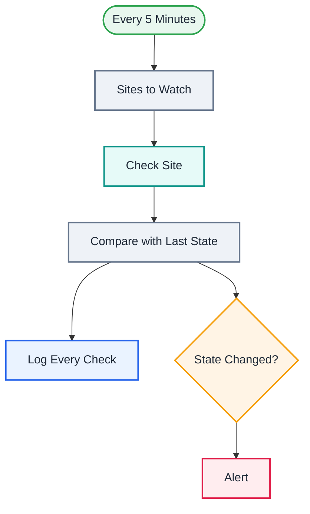

<div align="center">

# L21 · Website & API uptime monitor

   


</div>

> [!NOTE]
> **The real-world problem.** Paid uptime tools cost money, and simple ones spam you every 5 minutes while a site is down. This monitor checks your sites and APIs, logs response times, and alerts only when the state *changes*: once when a site goes down and once when it recovers.

## 🎯 What you'll learn

- HTTP Request with **Full Response + Never Error** (read status codes instead of crashing)
- **Workflow static data**: memory that survives between executions
- Alert on *change* instead of on *state*, which avoids alert fatigue
- Filter node
- Fan-out: log everything, alert on some

## 🏗️ Architecture



<details><summary>Plain-text flow</summary>

```
Schedule (5 min) → Code (site list) → HTTP (full response, never error) → Code (compare state)
   ├→ Sheets log (every check)
   └→ Filter changed → Gmail alert
```

</details>

## 🔑 Credentials

| You need | Where to get it |
|---|---|
| Gmail OAuth2 | [docs/credentials.md](../../docs/credentials.md) |
| Google Sheets OAuth2 (tab `Uptime` | time, name, url, status, code, ms, changed, since, error) |

## 🛠️ Build it step by step

> [!TIP]
> In a hurry? Import [`workflow.json`](workflow.json) (copy → paste on the n8n canvas). Learning? Build it yourself using the steps below, then compare.

1. Edit the site list in *Sites to Watch*.
2. HTTP Request: URL `{{ $json.url }}`, Options → *Response → Include full response* + *Never error*, timeout 10 s.
3. Code: read and update `$getWorkflowStaticData('global')`.
4. Filter `changed = true` → Gmail.
5. **Activate** it (static data isn't saved in manual runs).

## ✅ Test it

- [ ] The `httpstat.us/503` demo site should alert DOWN on the second automatic run.
- [ ] Replace it with `https://httpstat.us/200` and you should get an 🟢 recovery alert.

## 🧯 Troubleshooting

<details><summary><b>Alerts never fire</b></summary>

Static data only persists in *active* executions. Manual runs start fresh every time.

</details>

<details><summary><b>Every site shows DOWN</b></summary>

Check that *Never error* and *Full response* are both on, so `statusCode` exists.

</details>

## 🚀 Level up

- Add a slowness alert (ms > 3000 for 3 checks in a row).
- Weekly uptime % report from the Uptime sheet.
- Check SSL certificate expiry via an API.

---

<p align="center"><a href="../L20-subworkflows-caller/README.md">← L20 · Sub-workflows — weekly birthday & anniversary wishes</a> &nbsp;·&nbsp; <a href="../../README.md#-the-learning-path">📚 All lessons</a> &nbsp;·&nbsp; <a href="../L22-ai-lead-qualifier-router/README.md">L22 · AI lead qualifier & router →</a></p>
