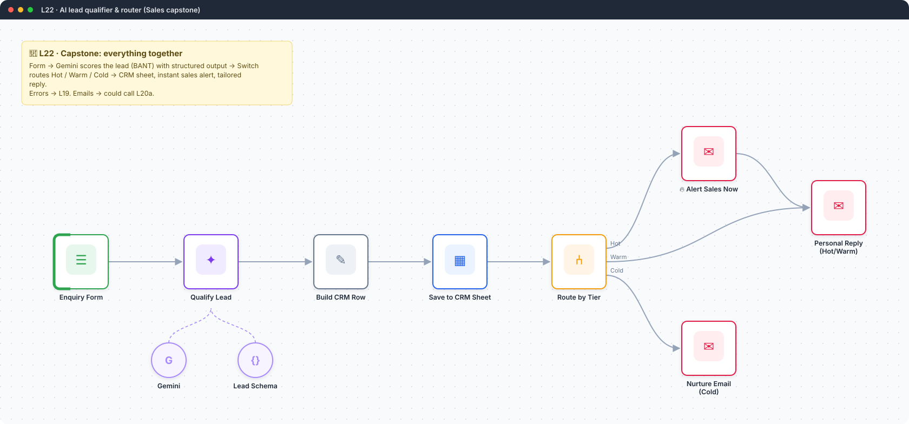
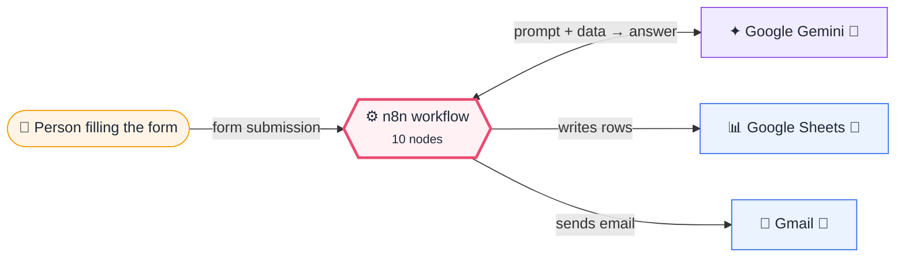
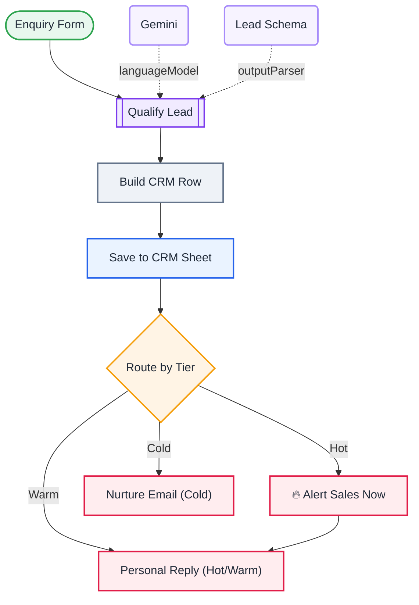

<div align="center">

# L22 · AI lead qualifier & router (capstone)

    [](https://github.com/callme-siva/n8n-knowledge/actions/workflows/validate.yml)



</div>

> [!NOTE]
> **The real-world problem.** Sales teams waste hours on tyre-kickers while hot leads go cold. This capstone scores every enquiry with AI (BANT), logs it to a CRM sheet, alerts sales straight away for hot leads, sends a personalised reply, and sends cold leads a nurture email.

## 💡 Concept first

**📌 Key idea:** Combine it all: **form → AI decision with reasons → route → store → act**.

**🧠 Mental model:** A receptionist who reads each enquiry, scores it, files it, and calls sales for the hot ones.

**🚫 When *not* to use it:** Don't let the score be a black box. Store the `reason` next to the score, so humans can audit and tune.

## 🎯 What you'll learn

- Combines **everything**: form, structured AI output, Set, Sheets, Switch routing, multiple Gmail branches
- AI as a *decision-maker* with explicit, auditable reasons
- Temperature 0 for consistent scoring
- Designing the fallback path (cold leads still get a reply)

## 🏗️ Architecture

**System context:** who and what this workflow talks to, and what crosses each boundary. 🔑 = needs a credential · 🧑 = a human decides.



<details><summary><b>Node-level flow</b> (every node and branch)</summary>



</details>

<details><summary>Plain-text flow</summary>

```
Form → LLM Chain ⇐ Gemini, ⇐ Schema → Set CRM row → Sheets → Switch
   ├ Hot  → Alert sales → Personal reply
   ├ Warm → Personal reply
   └ Cold → Nurture email
```

</details>

## 🔑 Credentials

| You need | Where to get it |
|---|---|
| Google Gemini API key | [docs/credentials.md](../../docs/credentials.md) |
| Google Sheets OAuth2 (tab `Leads` | time, name, email, company, score, tier, reason, use_case, reply) |
| Gmail OAuth2 | [docs/credentials.md](../../docs/credentials.md) |

## 📝 Before you run it

Replace these placeholder values with your own:

| Node | Field | Placeholder |
|---|---|---|
| Save to CRM Sheet | `documentId` | `PASTE_YOUR_GOOGLE_SHEET_URL` |
| 🔥 Alert Sales Now | `sendTo` | `you@example.com` |
| Personal Reply (Hot/Warm) | `message` | `<p>{{ $('Build CRM Row').item.json.reply }}</p><p>Pick a slot: https://cal.com/your-lin…` |
| Nurture Email (Cold) | `message` | `<p>Thanks for your interest! Here are 3 free guides to get started with automation: htt…` |

Nodes that need a credential selected after import: **Gmail**, **Google Gemini Chat Model**, **Google Sheets**.

### 📥 Starter files

Create each tab from its template, so column names match exactly: **Google Sheets → File → Import → Upload** the CSV → *Insert new sheet(s)*. The tab takes the file's name.

| Tab | Template | Columns |
|---|---|---|
| `Leads` | [Leads.csv](../../templates/L22-ai-lead-qualifier-router/Leads.csv) | `time`, `email`, `name`, `company`, `reason`, `reply`, `score`, `tier`, `use_case` |

<sub>Columns are generated from what this workflow actually reads and writes in the automated test, so they can't drift from the workflow.</sub>

## 🛠️ Build it step by step

> [!TIP]
> In a hurry? Import [`workflow.json`](workflow.json) (copy → paste on the n8n canvas). Learning? Build it yourself using the steps below, then compare.

1. Build it yourself using L07 + L12 + L04 as references. That is the capstone test.
2. If you get stuck, import `workflow.json` and compare node by node.
3. Set the workflow's *Error workflow* to L19.

## 🔍 Node-by-node reference

Every node in this workflow and every setting inside it, generated from [`workflow.json`](workflow.json). Click a node to expand it.

<details><summary><b>1. Enquiry Form</b> · <code>n8n Form Trigger</code> v2.2</summary>

> Hosts a web form; each submission starts one execution. Field labels become JSON keys.

| Property | Value |
|---|---|
| `formTitle` | Talk to us |
| `formDescription` | Tell us what you want to automate. |
| `formFields.values` | Name *, Work email *, Company *, Team size *, What do you want to automate? *, When do … |

</details>

<details><summary><b>2. Qualify Lead</b> · <code>Basic LLM Chain</code> v1.5</summary>

> Sends one prompt to a model and returns the answer. Simplest AI node.

| Property | Value |
|---|---|
| `promptType` | define |
| `hasOutputParser` | ✅ on |
| `text` | `Name: {{ $json.Name }} Email: {{ $json['Work email'] }} Company: {{ $json.Company }} Team size: {{ $json['Team size'] }} Timeline: {{ $json['When do you want to start?'] }} Need: {{ $json['What do you want to automate?'] }}` |
| `messages.message` | You are a B2B sales development rep for an automation consultancy. Score the lead 0-100 using BANT (Budget signals, Authority, Need clarity, Timeline). Personal email domains (gmail, yahoo) lower authority. tier = hot (&gt;=70), warm (40-69), cold (&lt;40). Be strict and explain briefly. |

</details>

<details><summary><b>3. Gemini</b> · <code>Google Gemini Chat Model</code> v1</summary>

> The language model plugged into a chain or agent.

| Property | Value |
|---|---|
| `modelName` | models/gemini-2.5-flash |
| `temperature` | 0 |

</details>

<details><summary><b>4. Lead Schema</b> · <code>Structured Output Parser</code> v1.2</summary>

> Forces the model's answer into JSON matching your schema.

| Property | Value |
|---|---|
| `jsonSchemaExample` | (JSON schema, 7 lines, shown below) |

**Schema example:**

```json
{
  "score": 78,
  "tier": "hot",
  "reason": "Clear need, 51-200 team, starting this month.",
  "use_case": "Invoice processing",
  "suggested_reply": "Hi Asha, thanks — invoice automation is a sweet spot for us..."
}
```

</details>

<details><summary><b>5. Build CRM Row</b> · <code>Edit Fields (Set)</code> v3.4</summary>

> Creates, renames or overwrites fields without code.

| Property | Value |
|---|---|
| `time` | `{{ $now.toISO() }}` |
| `name` | `{{ $('Enquiry Form').item.json.Name }}` |
| `email` | `{{ $('Enquiry Form').item.json['Work email'] }}` |
| `company` | `{{ $('Enquiry Form').item.json.Company }}` |
| `score` | `{{ $json.output.score }}` |
| `tier` | `{{ $json.output.tier }}` |
| `reason` | `{{ $json.output.reason }}` |
| `use_case` | `{{ $json.output.use_case }}` |
| `reply` | `{{ $json.output.suggested_reply }}` |

</details>

<details><summary><b>6. Save to CRM Sheet</b> · <code>Google Sheets</code> v4.5</summary>

> Reads, appends or updates rows in a spreadsheet.

| Property | Value |
|---|---|
| `operation` | append |
| `documentId` | PASTE_YOUR_GOOGLE_SHEET_URL |
| `sheetName` | Leads |
| `columns.mappingMode` | autoMapInputData |
| `⚙️ Retry on fail` | ✅ on |
| `⚙️ Max tries` | 3 |
| `⚙️ Wait between tries (ms)` | 3000 |

</details>

<details><summary><b>7. Route by Tier</b> · <code>Switch</code> v3.2</summary>

> Routes items to one of many named outputs.

| Property | Value |
|---|---|
| `rule 1.condition` | `{{ $('Build CRM Row').item.json.tier }} = hot` |
| `rule 1.renameOutput` | ✅ on |
| `rule 1.outputKey` | Hot |
| `rule 2.condition` | `{{ $('Build CRM Row').item.json.tier }} = warm` |
| `rule 2.renameOutput` | ✅ on |
| `rule 2.outputKey` | Warm |
| `fallbackOutput` | extra |
| `renameFallbackOutput` | Cold |

</details>

<details><summary><b>8. 🔥 Alert Sales Now</b> · <code>Gmail</code> v2.1</summary>

> Sends, reads or labels email. `sendAndWait` pauses the workflow for a human reply.

| Property | Value |
|---|---|
| `sendTo` | you@example.com |
| `subject` | `🔥 HOT lead ({{ $('Build CRM Row').item.json.score }}): {{ $('Build CRM Row').item.json.company }}` |
| `emailType` | html |
| `message` | `<p><b>{{ $('Build CRM Row').item.json.name }}</b> · {{ $('Build CRM Row').item.json.email }}</p><p>{{ $('Build CRM Row').item.json.reason }}</p><p>Call within 1 hour.</p>` |
| `appendAttribution` | off |
| `⚙️ Retry on fail` | ✅ on |
| `⚙️ Max tries` | 3 |
| `⚙️ Wait between tries (ms)` | 3000 |

</details>

<details><summary><b>9. Personal Reply (Hot/Warm)</b> · <code>Gmail</code> v2.1</summary>

> Sends, reads or labels email. `sendAndWait` pauses the workflow for a human reply.

| Property | Value |
|---|---|
| `sendTo` | `{{ $('Build CRM Row').item.json.email }}` |
| `subject` | `Re: automating {{ $('Build CRM Row').item.json.use_case }}` |
| `emailType` | html |
| `message` | `<p>{{ $('Build CRM Row').item.json.reply }}</p><p>Pick a slot: https://cal.com/your-link</p>` |
| `appendAttribution` | off |
| `⚙️ Retry on fail` | ✅ on |
| `⚙️ Max tries` | 3 |
| `⚙️ Wait between tries (ms)` | 3000 |

</details>

<details><summary><b>10. Nurture Email (Cold)</b> · <code>Gmail</code> v2.1</summary>

> Sends, reads or labels email. `sendAndWait` pauses the workflow for a human reply.

| Property | Value |
|---|---|
| `sendTo` | `{{ $('Build CRM Row').item.json.email }}` |
| `subject` | `Thanks for reaching out, {{ $('Build CRM Row').item.json.name }}` |
| `emailType` | html |
| `message` | `<p>Thanks for your interest! Here are 3 free guides to get started with automation: https://github.com/YOUR_USER/n8n-knowledge</p>` |
| `appendAttribution` | off |
| `⚙️ Retry on fail` | ✅ on |
| `⚙️ Max tries` | 3 |
| `⚙️ Wait between tries (ms)` | 3000 |

</details>

> [!TIP]
> ⚙️ rows come from each node's **Settings** tab, not its Parameters tab. `{{ … }}` values are **expressions** evaluated at run time. See [workflow anatomy](../../docs/workflow-anatomy.md) for what every property means.

## ✅ Test it

> [!TIP]
> **Automated end-to-end test: passed.** 7/8 nodes executed in real n8n (6 credentialed or AI nodes replaced by fixtures, so AI output itself isn't tested), 1 behaviour checks. See [tests/](../../tests/README.md).

- [ ] Submit the 3 sample leads in [docs/sample-data.md](../../docs/sample-data.md#sales-leads): one each should come out hot, warm and cold.

## 🧯 Troubleshooting

Problems specific to this workflow are below. For general ones (expressions, items, triggers, AI), see [common mistakes](../../docs/common-mistakes.md).

<details><summary><b>Every lead is 'warm'</b></summary>

Make the rubric stricter and give examples in the system prompt.

</details>

<details><summary><b>A replied lead gets 2 emails</b></summary>

Hot goes through alert → reply once. Check you didn't also wire Hot directly to *Personal Reply*.

</details>

## 🏋️ Practice

Try each challenge **before** opening the hint. Solutions show the exact expressions and code.

**⭐ Challenge 1:** Add **Budget** as a form field and let it influence the score.

<details><summary>💡 Hint</summary>

Form field + prompt mention; the schema stays the same.

</details>
<details><summary>✅ Solution</summary>

Add the dropdown *Budget* (< 1L / 1–5L / > 5L), include it in the prompt text, and add to the system message: *"budget > 5L adds up to 15 points"*. Re-test the 3 sample leads.

</details>

**⭐⭐ Challenge 2:** Add a **human approval** before the AI reply is sent to hot leads.

<details><summary>💡 Hint</summary>

Insert Send-and-Wait between the alert and the personal reply.

</details>
<details><summary>✅ Solution</summary>

Put a Gmail **Send and Wait** (response: free text) to the sales lead, showing the AI draft. Use the edited text if provided (`{{ $json.data.text || $('Build CRM Row').item.json.reply }}`).

</details>

## 🚀 Ideas to extend it

- Replace the Sheet with HubSpot / Zoho CRM nodes.
- Add an approval step (L15) before the AI reply goes out.
- Enrich with company data via an API before scoring.

---

<p align="center"><a href="../L21-website-uptime-monitor/README.md">← L21 · Website & API uptime monitor</a> &nbsp;·&nbsp; <a href="../../README.md#-the-learning-path">📚 All lessons</a> &nbsp;·&nbsp; 🏁 End of the core path</p>
