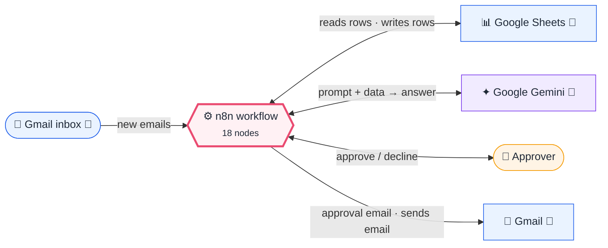
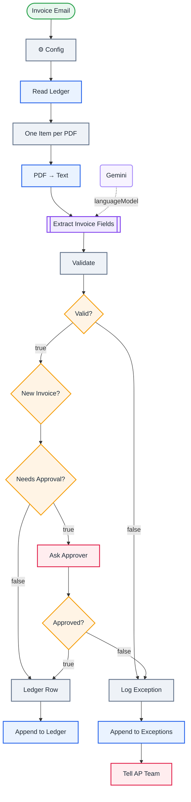

<div align="center">

# P01 · Accounts-payable invoice pipeline

    [](https://github.com/callme-siva/n8n-knowledge/actions/workflows/validate.yml)


</div>

> [!NOTE]
> **The real-world problem.** Accounts payable teams retype invoice data by hand, pay duplicates without noticing, and push large invoices through without anyone checking them. This is the most commonly automated back-office process in the world. The design principle that makes it safe: **the AI extracts, code validates, and a human approves above a threshold**.

## 💡 Concept first

**📌 Key idea:** **AI extracts, code validates, humans approve above a threshold**; bad inputs go to an exceptions queue.

**🧠 Mental model:** A junior clerk types the invoice, a calculator re-checks the maths, the manager signs the big ones.

**🚫 When *not* to use it:** Don't let the model's arithmetic or guesses reach your ledger unchecked, and don't auto-approve without a limit.

## 🎯 What you'll learn

- **Information Extractor**: typed fields from messy text
- **Never trust AI numbers**: re-check subtotal + tax = total in code
- Regex validation of Indian **GSTIN**
- **Idempotency**: the ledger itself decides what was already processed (vendor + invoice number)
- Threshold-based **human approval** with a timeout
- An **exceptions queue** so bad inputs are never silently dropped

## 🏗️ Architecture

**System context:** who and what this workflow talks to, and what crosses each boundary. 🔑 = needs a credential · 🧑 = a human decides.



<details><summary><b>Node-level flow</b> (every node and branch)</summary>



</details>

## ⚖️ Design decisions & trade-offs

Why it's built this way, and what it costs.

| Decision | Why | Trade-off / alternative |
|---|---|---|
| AI extracts fields, **code** re-checks subtotal + tax = total and GSTIN format | LLMs misread digits and do arithmetic badly; a 10-line check catches it deterministically | Adds a validation step to maintain. Alternative: OCR-specialised invoice APIs (costlier, less flexible) |
| Dedupe key = normalised vendor + invoice number, remembered across runs | Suppliers resend invoices; paying twice is the most expensive AP mistake | Same number reused by two vendors is fine; a vendor reusing numbers would be blocked (rare, shows in logs) |
| Approval only **above a threshold** | Humans approve what matters; small invoices flow straight through | The threshold must be tuned. Too low creates a bottleneck; too high adds risk |
| Bad invoices go to an **Exceptions** sheet + email, never silently dropped | Silent drops are how automations lose trust | Someone must own the exceptions queue daily |
| Gmail label `invoices` as the entry point | Lets humans control what enters the pipeline with a normal Gmail filter | Relies on the filter being right; a dedicated AP mailbox is cleaner at scale |

## 🔑 Credentials

| You need | Where to get it |
|---|---|
| Gmail OAuth2 | [docs/credentials.md](../../docs/credentials.md) |
| Google Gemini API key | paid tier for real invoices: free-tier prompts may be used by Google to improve its products |
| Google Sheets OAuth2 | tabs `Ledger` with a `dedupe_key` column, `Exceptions` |

## 📝 Before you run it

Replace these placeholder values with your own:

| Node | Field | Placeholder |
|---|---|---|
| ⚙️ Config | `approver_email` | `you@example.com` |
| ⚙️ Config | `ap_team_email` | `you@example.com` |
| Read Ledger | `documentId` | `PASTE_YOUR_GOOGLE_SHEET_URL` |
| Append to Ledger | `documentId` | `PASTE_YOUR_GOOGLE_SHEET_URL` |
| Append to Exceptions | `documentId` | `PASTE_YOUR_GOOGLE_SHEET_URL` |

Nodes that need a credential selected after import: **Gmail**, **Gmail Trigger**, **Google Gemini Chat Model**, **Google Sheets**.

### 📥 Starter files

Create each tab from its template, so column names match exactly: **Google Sheets → File → Import → Upload** the CSV → *Insert new sheet(s)*. The tab takes the file's name.

| Tab | Template | Columns |
|---|---|---|
| `Exceptions` | [Exceptions.csv](../../templates/P01-invoice-processing-pipeline/Exceptions.csv) | `invoice_no`, `logged_at`, `vendor`, `file`, `reason`, `total` |
| `Ledger` | [Ledger.csv](../../templates/P01-invoice-processing-pipeline/Ledger.csv) | `invoice_no`, `logged_at`, `vendor`, `approval`, `currency`, `dedupe_key`, `due_date`, `file`, `gstin`, `invoice_date`, `subtotal`, `tax`, `total` |

<sub>Columns are generated from what this workflow actually reads and writes in the automated test, so they can't drift from the workflow.</sub>

Sample files: [invoice-valid.pdf](../../templates/files/invoice-valid.pdf) (auto-approved → ledger) · [invoice-large.pdf](../../templates/files/invoice-large.pdf) (INR 118,000 → needs approval) · [invoice-wrong-total.pdf](../../templates/files/invoice-wrong-total.pdf) (subtotal + tax ≠ total → Exceptions)

## 🛠️ Build it step by step

> [!TIP]
> In a hurry? Import [`workflow.json`](workflow.json) (copy → paste on the n8n canvas). Learning? Build it yourself using the steps below, then compare.

1. Create a Gmail filter that labels supplier emails `invoices`.
2. Create `Ledger` and `Exceptions` tabs with headers matching the *Ledger Row* and *Log Exception* fields.
3. Import it, connect the credentials, and set approval_limit and emails in **⚙️ Config**.
4. Run it on 3 sample invoices: one normal, one above the limit, one with wrong totals (edit a PDF, or use an invoice generator).

## 🔍 Node-by-node reference

Every node in this workflow and every setting inside it, generated from [`workflow.json`](workflow.json). Click a node to expand it.

<details><summary><b>1. Invoice Email</b> · <code>Gmail Trigger</code> v1.2</summary>

> Polls Gmail on an interval and starts once per matching email.

| Property | Value |
|---|---|
| `pollTimes.item.mode` | everyX |
| `pollTimes.item.value` | 10 |
| `pollTimes.item.unit` | minutes |
| `simple` | off |
| `filters.q` | has:attachment filename:pdf label:invoices |
| `filters.readStatus` | unread |
| `downloadAttachments` | ✅ on |
| `dataPropertyAttachmentsPrefixName` | attachment_ |

</details>

<details><summary><b>2. ⚙️ Config</b> · <code>Edit Fields (Set)</code> v3.4</summary>

> Creates, renames or overwrites fields without code.

| Property | Value |
|---|---|
| `approval_limit` | 50000 |
| `approver_email` | you@example.com |
| `ap_team_email` | you@example.com |
| `includeOtherFields` | ✅ on |
| `include` | all |

</details>

<details><summary><b>3. Read Ledger</b> · <code>Google Sheets</code> v4.5</summary>

> Reads, appends or updates rows in a spreadsheet.

| Property | Value |
|---|---|
| `documentId` | PASTE_YOUR_GOOGLE_SHEET_URL |
| `sheetName` | Ledger |
| `⚙️ Retry on fail` | ✅ on |
| `⚙️ Max tries` | 3 |
| `⚙️ Wait between tries (ms)` | 3000 |
| `⚙️ Always output data` | ✅ on |
| `⚙️ Execute once` | ✅ on |

</details>

<details><summary><b>4. One Item per PDF</b> · <code>Code</code> v2</summary>

> Runs JavaScript. *Run once for all items* sees every item; *for each item* sees one at a time.

| Property | Value |
|---|---|
| `jsCode` | (JavaScript, 5 lines, shown below) |

**Code:**

```javascript
const out = [];
for (const item of $('Invoice Email').all()) for (const [k, b] of Object.entries(item.binary || {}))
  if (b.mimeType === 'application/pdf' || (b.fileName || '').toLowerCase().endsWith('.pdf'))
    out.push({ json: { file: b.fileName, from: item.json.from?.text, messageId: item.json.id }, binary: { data: b }, pairedItem: 0 });
return out;
```

</details>

<details><summary><b>5. PDF → Text</b> · <code>Extract From File</code> v1</summary>

> Pulls text or data out of a binary file (PDF, CSV, XLSX…).

| Property | Value |
|---|---|
| `operation` | pdf |
| `binaryPropertyName` | data |

</details>

<details><summary><b>6. Extract Invoice Fields</b> · <code>informationExtractor</code> v1.2</summary>


| Property | Value |
|---|---|
| `text` | `{{ $json.text }}` |
| `schemaType` | fromAttributes |
| `attributes.attributes.1.name` | vendor_name |
| `attributes.attributes.1.type` | string |
| `attributes.attributes.1.description` | Seller / supplier legal name |
| `attributes.attributes.1.required` | ✅ on |
| `attributes.attributes.2.name` | vendor_gstin |
| `attributes.attributes.2.type` | string |
| `attributes.attributes.2.description` | Seller GSTIN, 15 characters, if present |
| `attributes.attributes.3.name` | invoice_number |
| `attributes.attributes.3.type` | string |
| `attributes.attributes.3.description` | Invoice number exactly as printed |
| `attributes.attributes.3.required` | ✅ on |
| `attributes.attributes.4.name` | invoice_date |
| `attributes.attributes.4.type` | date |
| `attributes.attributes.4.description` | Invoice date |
| `attributes.attributes.4.required` | ✅ on |
| `attributes.attributes.5.name` | due_date |
| `attributes.attributes.5.type` | date |
| `attributes.attributes.5.description` | Payment due date if present |
| `attributes.attributes.6.name` | subtotal |
| `attributes.attributes.6.type` | number |
| `attributes.attributes.6.description` | Amount before tax |
| `attributes.attributes.7.name` | tax_total |
| … | 10 more in workflow.json |

</details>

<details><summary><b>7. Gemini</b> · <code>Google Gemini Chat Model</code> v1</summary>

> The language model plugged into a chain or agent.

| Property | Value |
|---|---|
| `modelName` | models/gemini-2.5-flash |
| `temperature` | 0 |

</details>

<details><summary><b>8. Validate</b> · <code>Code</code> v2</summary>

> Runs JavaScript. *Run once for all items* sees every item; *for each item* sees one at a time.

| Property | Value |
|---|---|
| `mode` | runOnceForEachItem |
| `jsCode` | (JavaScript, 14 lines, shown below) |

**Code:**

```javascript
const x = $json.output || {};
const src = $('One Item per PDF').item.json;
const errors = [];
// Idempotency: the Ledger sheet is the record of what was already processed.
const logged = new Set($('Read Ledger').all().map(i => i.json.dedupe_key).filter(Boolean));
const num = v => Number(String(v ?? '').replace(/[^0-9.-]/g, ''));
const sub = num(x.subtotal), tax = num(x.tax_total), total = num(x.grand_total);
if (!x.invoice_number) errors.push('missing invoice number');
if (!Number.isFinite(total) || total <= 0) errors.push('missing/invalid total');
if (Number.isFinite(sub) && Number.isFinite(tax) && sub > 0 && Math.abs(sub + tax - total) > 1) errors.push(`subtotal + tax (${sub + tax}) ≠ total (${total})`);
if (x.vendor_gstin && !/^[0-9]{2}[A-Z]{5}[0-9]{4}[A-Z][1-9A-Z]Z[0-9A-Z]$/.test(x.vendor_gstin)) errors.push(`GSTIN format invalid: ${x.vendor_gstin}`);
const dedupe_key = `${(x.vendor_name || '').toLowerCase().replace(/\W/g, '')}|${x.invoice_number}`;
return { json: { ...x, subtotal: sub || null, tax_total: tax || null, grand_total: total, file: src.file, from: src.from,
  dedupe_key, already_logged: logged.has(dedupe_key), valid: errors.length === 0, errors: errors.join('; ') } };
```

</details>

<details><summary><b>9. Valid?</b> · <code>If</code> v2.2</summary>

> Splits items into a **true** and a **false** branch.

| Property | Value |
|---|---|
| `condition` | `{{ $json.valid }} is true` |

</details>

<details><summary><b>10. New Invoice?</b> · <code>If</code> v2.2</summary>

> Splits items into a **true** and a **false** branch.

| Property | Value |
|---|---|
| `condition` | `{{ $json.already_logged }} is false` |

</details>

<details><summary><b>11. Needs Approval?</b> · <code>If</code> v2.2</summary>

> Splits items into a **true** and a **false** branch.

| Property | Value |
|---|---|
| `condition` | `{{ $json.grand_total }} > {{ $('⚙️ Config').item.json.approval_limit }}` |

</details>

<details><summary><b>12. Ask Approver</b> · <code>Gmail</code> v2.1</summary>

> Sends, reads or labels email. `sendAndWait` pauses the workflow for a human reply.

| Property | Value |
|---|---|
| `operation` | sendAndWait |
| `sendTo` | `{{ $('⚙️ Config').item.json.approver_email }}` |
| `subject` | `Approve {{ $json.currency \|\| '' }} {{ $json.grand_total }} invoice from {{ $json.vendor_name }}?` |
| `message` | `<p><b>{{ $json.vendor_name }}</b> · invoice {{ $json.invoice_number }} · dated {{ $json.invoice_date }}</p><p>Total <b>{{ $json.currency \|\| '' }} {{ $json.grand_total }}</b> (tax {{ $json.tax_total }}), due {{ $json.due_date }}</p>` |
| `approvalOptions.approvalType` | double |
| `limitWaitTime.limitType` | afterTimeInterval |
| `limitWaitTime.resumeAmount` | 3 |
| `limitWaitTime.resumeUnit` | days |

</details>

<details><summary><b>13. Approved?</b> · <code>If</code> v2.2</summary>

> Splits items into a **true** and a **false** branch.

| Property | Value |
|---|---|
| `condition` | `{{ $json.data.approved }} is true` |

</details>

<details><summary><b>14. Ledger Row</b> · <code>Code</code> v2</summary>

> Runs JavaScript. *Run once for all items* sees every item; *for each item* sees one at a time.

| Property | Value |
|---|---|
| `mode` | runOnceForEachItem |
| `jsCode` | (JavaScript, 4 lines, shown below) |

**Code:**

```javascript
const inv = $('Validate').item.json;
return { json: { logged_at: $now.toISO(), vendor: inv.vendor_name, gstin: inv.vendor_gstin || '', invoice_no: inv.invoice_number,
  invoice_date: inv.invoice_date, due_date: inv.due_date || '', subtotal: inv.subtotal, tax: inv.tax_total, total: inv.grand_total,
  currency: inv.currency || '', approval: $json.data ? 'approved' : 'auto (under limit)', file: inv.file, dedupe_key: inv.dedupe_key } };
```

</details>

<details><summary><b>15. Append to Ledger</b> · <code>Google Sheets</code> v4.5</summary>

> Reads, appends or updates rows in a spreadsheet.

| Property | Value |
|---|---|
| `operation` | append |
| `documentId` | PASTE_YOUR_GOOGLE_SHEET_URL |
| `sheetName` | Ledger |
| `columns.mappingMode` | autoMapInputData |
| `⚙️ Retry on fail` | ✅ on |
| `⚙️ Max tries` | 3 |
| `⚙️ Wait between tries (ms)` | 3000 |

</details>

<details><summary><b>16. Log Exception</b> · <code>Code</code> v2</summary>

> Runs JavaScript. *Run once for all items* sees every item; *for each item* sees one at a time.

| Property | Value |
|---|---|
| `mode` | runOnceForEachItem |
| `jsCode` | (JavaScript, 3 lines, shown below) |

**Code:**

```javascript
const inv = $('Validate').item.json;
const reason = $json.data && !$json.data.approved ? 'rejected by approver' : inv.errors;
return { json: { logged_at: $now.toISO(), vendor: inv.vendor_name || '', invoice_no: inv.invoice_number || '', total: inv.grand_total || '', file: inv.file, reason } };
```

</details>

<details><summary><b>17. Append to Exceptions</b> · <code>Google Sheets</code> v4.5</summary>

> Reads, appends or updates rows in a spreadsheet.

| Property | Value |
|---|---|
| `operation` | append |
| `documentId` | PASTE_YOUR_GOOGLE_SHEET_URL |
| `sheetName` | Exceptions |
| `columns.mappingMode` | autoMapInputData |
| `⚙️ Retry on fail` | ✅ on |
| `⚙️ Max tries` | 3 |
| `⚙️ Wait between tries (ms)` | 3000 |

</details>

<details><summary><b>18. Tell AP Team</b> · <code>Gmail</code> v2.1</summary>

> Sends, reads or labels email. `sendAndWait` pauses the workflow for a human reply.

| Property | Value |
|---|---|
| `sendTo` | `{{ $('⚙️ Config').item.json.ap_team_email }}` |
| `subject` | `⚠️ Invoice needs attention: {{ $json.vendor }} {{ $json.invoice_no }}` |
| `emailType` | html |
| `message` | `<p>{{ $json.file }}: {{ $json.reason }}</p>` |
| `appendAttribution` | off |
| `⚙️ Retry on fail` | ✅ on |
| `⚙️ Max tries` | 3 |
| `⚙️ Wait between tries (ms)` | 3000 |

</details>

> [!TIP]
> ⚙️ rows come from each node's **Settings** tab, not its Parameters tab. `{{ … }}` values are **expressions** evaluated at run time. See [workflow anatomy](../../docs/workflow-anatomy.md) for what every property means.

## ✅ Test it

> [!TIP]
> **Automated end-to-end test: passed.** 17/17 nodes executed in real n8n (7 credentialed or AI nodes replaced by fixtures, so AI output itself isn't tested), 8 behaviour checks. See [tests/](../../tests/README.md).

- [ ] Normal invoice → one ledger row, no approval.
- [ ] Large invoice → approval email; *Approve* → ledger, *Decline* → exception.
- [ ] Same invoice again → skipped, because its `dedupe_key` is already in the Ledger. Delete that row to process it again.
- [ ] Wrong totals → exception row + AP email with the reason.

## 🧯 Troubleshooting

Problems specific to this workflow are below. For general ones (expressions, items, triggers, AI), see [common mistakes](../../docs/common-mistakes.md).

<details><summary><b>Fields empty for scanned PDFs</b></summary>

Scans have no text layer. Add an OCR step (e.g. Google Vision or Mistral OCR via HTTP) before extraction.

</details>

<details><summary><b>Dates in odd formats</b></summary>

The extractor returns dates as strings. Normalise them with Luxon in *Validate* if your ledger needs `YYYY-MM-DD`.

</details>

## 🏋️ Practice

Try each challenge **before** opening the hint. Solutions show the exact expressions and code.

**⭐ Challenge 1:** Add **purchase order** matching: flag invoices without a known PO number.

<details><summary>💡 Hint</summary>

Extract a `po_number` attribute and look it up in a POs sheet.

</details>
<details><summary>✅ Solution</summary>

Add the attribute `po_number` to the extractor. After Validate, **Sheets → Get rows** from `POs` where `po_number` matches (alwaysOutputData on). IF nothing is found, send it to Exceptions with reason *"unknown PO"*. This is the start of a real **2-way match**.

</details>

**⭐⭐ Challenge 2:** Detect **duplicate invoices with different numbers** (same vendor, same amount, same week).

<details><summary>💡 Hint</summary>

Exact dedupe keys miss re-issued invoices. Add a fuzzy check.

</details>
<details><summary>✅ Solution</summary>

Before the ledger, read the Ledger rows for that vendor from the last 7 days and flag if any `total` equals this total. Route matches to approval with the reason *"possible duplicate of INV-…"* instead of blocking them, because humans decide ambiguous cases.

</details>

## 🚀 Ideas to extend it

- Add a 3-way match against purchase orders (P06).
- Post approved invoices to Tally, Zoho Books or QuickBooks by API.
- Weekly AP ageing report (Q05 style).

---

<p align="center"> &nbsp;·&nbsp; <a href="../../README.md#-the-learning-path">📚 All lessons</a> &nbsp;·&nbsp; <a href="../P02-support-inbox-copilot/README.md">P02 · Support inbox copilot →</a></p>
