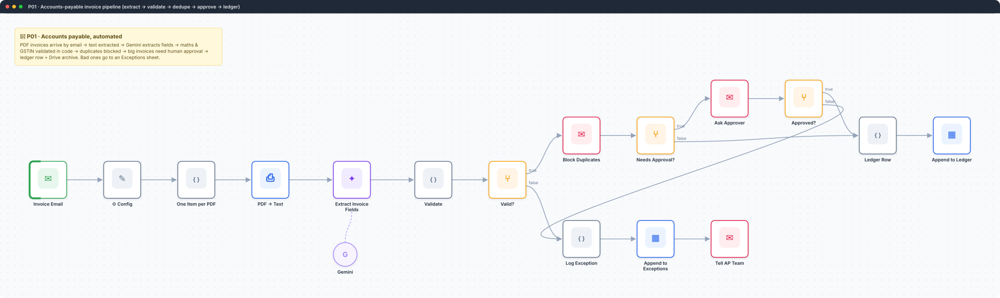
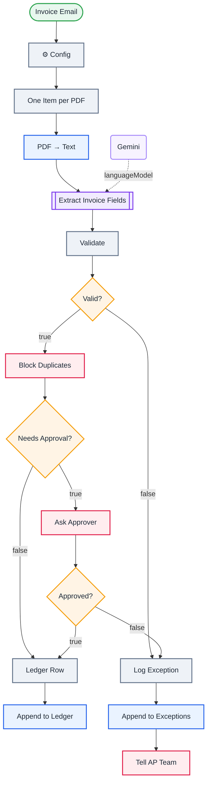

<div align="center">

# P01 · Accounts-payable invoice pipeline

   



</div>

> [!NOTE]
> **The real-world problem.** Accounts payable teams retype invoice data by hand, pay duplicates without noticing, and push large invoices through without anyone checking them. This is the most commonly automated back-office process in the world. The design principle that makes it safe: **the AI extracts, code validates, and a human approves above a threshold**.

## 🎯 What you'll learn

- **Information Extractor**: typed fields from messy text
- **Never trust AI numbers**: re-check subtotal + tax = total in code
- Regex validation of Indian **GSTIN**
- **Duplicate protection** across runs (vendor + invoice number)
- Threshold-based **human approval** with a timeout
- An **exceptions queue** so bad inputs are never silently dropped

## 🏗️ Architecture



<details><summary>Plain-text flow</summary>

```
Gmail (label:invoices, PDF) → Config → split PDFs → PDF text → Information Extractor ⇐ Gemini → Validate (maths, GSTIN)
  ├ valid → Remove duplicates → amount > limit?
  │     ├ yes → approval email ⏸ → approved? → Ledger | Exceptions
  │     └ no  → Ledger
  └ invalid → Exceptions sheet → email AP team
```

</details>

## 🔑 Credentials

| You need | Where to get it |
|---|---|
| Gmail OAuth2 | [docs/credentials.md](../../docs/credentials.md) |
| Google Gemini API key | [docs/credentials.md](../../docs/credentials.md) |
| Google Sheets OAuth2 (tabs `Ledger`, `Exceptions`) | [docs/credentials.md](../../docs/credentials.md) |

## 📝 Before you run it

Replace these placeholder values with your own:

| Node | Field | Placeholder |
|---|---|---|
| ⚙️ Config | `approver_email` | `you@example.com` |
| ⚙️ Config | `ap_team_email` | `you@example.com` |
| Append to Ledger | `documentId` | `PASTE_YOUR_GOOGLE_SHEET_URL` |
| Append to Exceptions | `documentId` | `PASTE_YOUR_GOOGLE_SHEET_URL` |

Nodes that need a credential selected after import: **Gmail**, **Gmail Trigger**, **Google Gemini Chat Model**, **Google Sheets**.

## 🛠️ Build it step by step

> [!TIP]
> In a hurry? Import [`workflow.json`](workflow.json) (copy → paste on the n8n canvas). Learning? Build it yourself using the steps below, then compare.

1. Create a Gmail filter that labels supplier emails `invoices`.
2. Create `Ledger` and `Exceptions` tabs with headers matching the *Ledger Row* and *Log Exception* fields.
3. Import it, connect the credentials, and set approval_limit and emails in **⚙️ Config**.
4. Run it on 3 sample invoices: one normal, one above the limit, one with wrong totals (edit a PDF, or use an invoice generator).

## 🔍 Node-by-node reference

Every node in this workflow and every setting inside it, generated from [`workflow.json`](workflow.json). Click a node to expand it.

<details><summary><b>1. Invoice Email</b> · <code>Gmail Trigger</code> v1.2</summary>

> Polls Gmail on an interval and starts once per matching email.

| Property | Value |
|---|---|
| `pollTimes.item.mode` | everyX |
| `pollTimes.item.value` | 10 |
| `pollTimes.item.unit` | minutes |
| `simple` | off |
| `filters.q` | has:attachment filename:pdf label:invoices |
| `filters.readStatus` | unread |
| `downloadAttachments` | ✅ on |
| `dataPropertyAttachmentsPrefixName` | attachment_ |

</details>

<details><summary><b>2. ⚙️ Config</b> · <code>Edit Fields (Set)</code> v3.4</summary>

> Creates, renames or overwrites fields without code.

| Property | Value |
|---|---|
| `approval_limit` | 50000 |
| `approver_email` | you@example.com |
| `ap_team_email` | you@example.com |
| `includeOtherFields` | ✅ on |
| `include` | all |

</details>

<details><summary><b>3. One Item per PDF</b> · <code>Code</code> v2</summary>

> Runs JavaScript. *Run once for all items* sees every item; *for each item* sees one at a time.

| Property | Value |
|---|---|
| `jsCode` | (JavaScript, 5 lines, shown below) |

**Code:**

```javascript
const out = [];
for (const item of $input.all()) for (const [k, b] of Object.entries(item.binary || {}))
  if (b.mimeType === 'application/pdf' || (b.fileName || '').toLowerCase().endsWith('.pdf'))
    out.push({ json: { file: b.fileName, from: item.json.from?.text, messageId: item.json.id }, binary: { data: b } });
return out;
```

</details>

<details><summary><b>4. PDF → Text</b> · <code>Extract From File</code> v1</summary>

> Pulls text or data out of a binary file (PDF, CSV, XLSX…).

| Property | Value |
|---|---|
| `operation` | pdf |
| `binaryPropertyName` | data |

</details>

<details><summary><b>5. Extract Invoice Fields</b> · <code>informationExtractor</code> v1.2</summary>


| Property | Value |
|---|---|
| `text` | `{{ $json.text }}` |
| `schemaType` | fromAttributes |
| `attributes.attributes.1.name` | vendor_name |
| `attributes.attributes.1.type` | string |
| `attributes.attributes.1.description` | Seller / supplier legal name |
| `attributes.attributes.1.required` | ✅ on |
| `attributes.attributes.2.name` | vendor_gstin |
| `attributes.attributes.2.type` | string |
| `attributes.attributes.2.description` | Seller GSTIN, 15 characters, if present |
| `attributes.attributes.3.name` | invoice_number |
| `attributes.attributes.3.type` | string |
| `attributes.attributes.3.description` | Invoice number exactly as printed |
| `attributes.attributes.3.required` | ✅ on |
| `attributes.attributes.4.name` | invoice_date |
| `attributes.attributes.4.type` | date |
| `attributes.attributes.4.description` | Invoice date |
| `attributes.attributes.4.required` | ✅ on |
| `attributes.attributes.5.name` | due_date |
| `attributes.attributes.5.type` | date |
| `attributes.attributes.5.description` | Payment due date if present |
| `attributes.attributes.6.name` | subtotal |
| `attributes.attributes.6.type` | number |
| `attributes.attributes.6.description` | Amount before tax |
| `attributes.attributes.7.name` | tax_total |
| … | 10 more in workflow.json |

</details>

<details><summary><b>6. Gemini</b> · <code>Google Gemini Chat Model</code> v1</summary>

> The language model plugged into a chain or agent.

| Property | Value |
|---|---|
| `modelName` | models/gemini-2.5-flash |
| `temperature` | 0 |

</details>

<details><summary><b>7. Validate</b> · <code>Code</code> v2</summary>

> Runs JavaScript. *Run once for all items* sees every item; *for each item* sees one at a time.

| Property | Value |
|---|---|
| `mode` | runOnceForEachItem |
| `jsCode` | (JavaScript, 11 lines, shown below) |

**Code:**

```javascript
const x = $json.output || {};
const src = $('One Item per PDF').item.json;
const errors = [];
const num = v => Number(String(v ?? '').replace(/[^0-9.-]/g, ''));
const sub = num(x.subtotal), tax = num(x.tax_total), total = num(x.grand_total);
if (!x.invoice_number) errors.push('missing invoice number');
if (!Number.isFinite(total) || total <= 0) errors.push('missing/invalid total');
if (Number.isFinite(sub) && Number.isFinite(tax) && sub > 0 && Math.abs(sub + tax - total) > 1) errors.push(`subtotal + tax (${sub + tax}) ≠ total (${total})`);
if (x.vendor_gstin && !/^[0-9]{2}[A-Z]{5}[0-9]{4}[A-Z][1-9A-Z]Z[0-9A-Z]$/.test(x.vendor_gstin)) errors.push(`GSTIN format invalid: ${x.vendor_gstin}`);
return { json: { ...x, subtotal: sub || null, tax_total: tax || null, grand_total: total, file: src.file, from: src.from,
  dedupe_key: `${(x.vendor_name || '').toLowerCase().replace(/\W/g, '')}|${x.invoice_number}`, valid: errors.length === 0, errors: errors.join('; ') } };
```

</details>

<details><summary><b>8. Valid?</b> · <code>If</code> v2.2</summary>

> Splits items into a **true** and a **false** branch.

| Property | Value |
|---|---|
| `condition` | `{{ $json.valid }} is true` |

</details>

<details><summary><b>9. Block Duplicates</b> · <code>removeDuplicates</code> v2</summary>


| Property | Value |
|---|---|
| `operation` | removeItemsSeenInPreviousExecutions |
| `dedupeValue` | `{{ $json.dedupe_key }}` |
| `historySize` | 100000 |

</details>

<details><summary><b>10. Needs Approval?</b> · <code>If</code> v2.2</summary>

> Splits items into a **true** and a **false** branch.

| Property | Value |
|---|---|
| `condition` | `{{ $json.grand_total }} > {{ $('⚙️ Config').item.json.approval_limit }}` |

</details>

<details><summary><b>11. Ask Approver</b> · <code>Gmail</code> v2.1</summary>

> Sends, reads or labels email. `sendAndWait` pauses the workflow for a human reply.

| Property | Value |
|---|---|
| `operation` | sendAndWait |
| `sendTo` | `{{ $('⚙️ Config').item.json.approver_email }}` |
| `subject` | `Approve ₹{{ $json.grand_total }} invoice from {{ $json.vendor_name }}?` |
| `message` | `<p><b>{{ $json.vendor_name }}</b> · invoice {{ $json.invoice_number }} · dated {{ $json.invoice_date }}</p><p>Total <b>₹{{ $json.grand_total }}</b> (tax ₹{{ $json.tax_total }}), due {{ $json.due_date }}</p>` |
| `approvalOptions.approvalType` | double |
| `limitWaitTime.limitType` | afterTimeInterval |
| `limitWaitTime.resumeAmount` | 3 |
| `limitWaitTime.resumeUnit` | days |

</details>

<details><summary><b>12. Approved?</b> · <code>If</code> v2.2</summary>

> Splits items into a **true** and a **false** branch.

| Property | Value |
|---|---|
| `condition` | `{{ $json.data.approved }} is true` |

</details>

<details><summary><b>13. Ledger Row</b> · <code>Code</code> v2</summary>

> Runs JavaScript. *Run once for all items* sees every item; *for each item* sees one at a time.

| Property | Value |
|---|---|
| `mode` | runOnceForEachItem |
| `jsCode` | (JavaScript, 4 lines, shown below) |

**Code:**

```javascript
const inv = $('Validate').item.json;
return { json: { logged_at: new Date().toISOString(), vendor: inv.vendor_name, gstin: inv.vendor_gstin || '', invoice_no: inv.invoice_number,
  invoice_date: inv.invoice_date, due_date: inv.due_date || '', subtotal: inv.subtotal, tax: inv.tax_total, total: inv.grand_total,
  currency: inv.currency || 'INR', approval: $json.data ? 'approved' : 'auto (under limit)', file: inv.file } };
```

</details>

<details><summary><b>14. Append to Ledger</b> · <code>Google Sheets</code> v4.5</summary>

> Reads, appends or updates rows in a spreadsheet.

| Property | Value |
|---|---|
| `operation` | append |
| `documentId` | PASTE_YOUR_GOOGLE_SHEET_URL |
| `sheetName` | Ledger |
| `columns.mappingMode` | autoMapInputData |

</details>

<details><summary><b>15. Log Exception</b> · <code>Code</code> v2</summary>

> Runs JavaScript. *Run once for all items* sees every item; *for each item* sees one at a time.

| Property | Value |
|---|---|
| `mode` | runOnceForEachItem |
| `jsCode` | (JavaScript, 3 lines, shown below) |

**Code:**

```javascript
const inv = $('Validate').item.json;
const reason = $json.data && !$json.data.approved ? 'rejected by approver' : inv.errors;
return { json: { logged_at: new Date().toISOString(), vendor: inv.vendor_name || '', invoice_no: inv.invoice_number || '', total: inv.grand_total || '', file: inv.file, reason } };
```

</details>

<details><summary><b>16. Append to Exceptions</b> · <code>Google Sheets</code> v4.5</summary>

> Reads, appends or updates rows in a spreadsheet.

| Property | Value |
|---|---|
| `operation` | append |
| `documentId` | PASTE_YOUR_GOOGLE_SHEET_URL |
| `sheetName` | Exceptions |
| `columns.mappingMode` | autoMapInputData |

</details>

<details><summary><b>17. Tell AP Team</b> · <code>Gmail</code> v2.1</summary>

> Sends, reads or labels email. `sendAndWait` pauses the workflow for a human reply.

| Property | Value |
|---|---|
| `sendTo` | `{{ $('⚙️ Config').item.json.ap_team_email }}` |
| `subject` | `⚠️ Invoice needs attention: {{ $json.vendor }} {{ $json.invoice_no }}` |
| `emailType` | html |
| `message` | `<p>{{ $json.file }}: {{ $json.reason }}</p>` |
| `appendAttribution` | off |

</details>

> [!TIP]
> ⚙️ rows come from each node's **Settings** tab, not its Parameters tab. `{{ … }}` values are **expressions** evaluated at run time. See [workflow anatomy](../../docs/workflow-anatomy.md) for what every property means.

## ✅ Test it

- [ ] Normal invoice → one ledger row, no approval.
- [ ] Large invoice → approval email; *Approve* → ledger, *Decline* → exception.
- [ ] Same invoice again → silently blocked as a duplicate.
- [ ] Wrong totals → exception row + AP email with the reason.

## 🧯 Troubleshooting

Problems specific to this workflow are below. For general ones (expressions, items, triggers, AI), see [common mistakes](../../docs/common-mistakes.md).

<details><summary><b>Fields empty for scanned PDFs</b></summary>

Scans have no text layer. Add an OCR step (e.g. Google Vision or Mistral OCR via HTTP) before extraction.

</details>

<details><summary><b>Dates in odd formats</b></summary>

The extractor returns dates as strings. Normalise them with Luxon in *Validate* if your ledger needs `YYYY-MM-DD`.

</details>

## 🚀 Level up

- Add a 3-way match against purchase orders (P06).
- Post approved invoices to Tally, Zoho Books or QuickBooks by API.
- Weekly AP ageing report (Q05 style).

---

<p align="center"> &nbsp;·&nbsp; <a href="../../README.md#-the-learning-path">📚 All lessons</a> &nbsp;·&nbsp; <a href="../P02-support-inbox-copilot/README.md">P02 · Support inbox copilot →</a></p>
