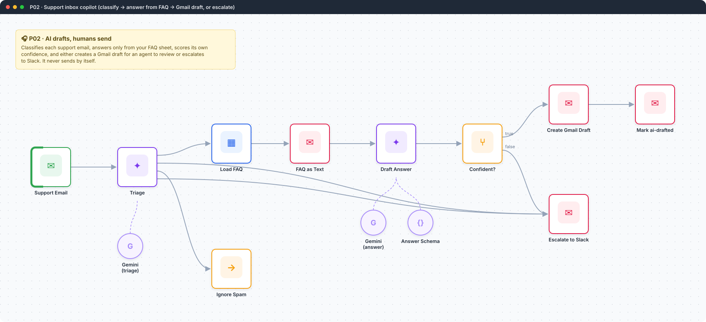
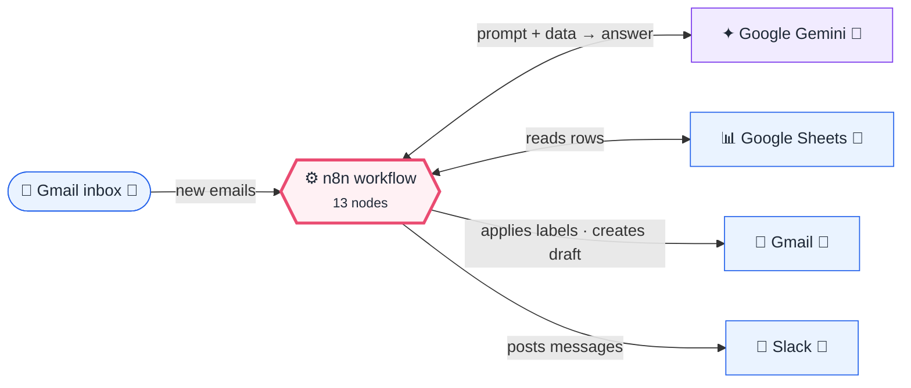
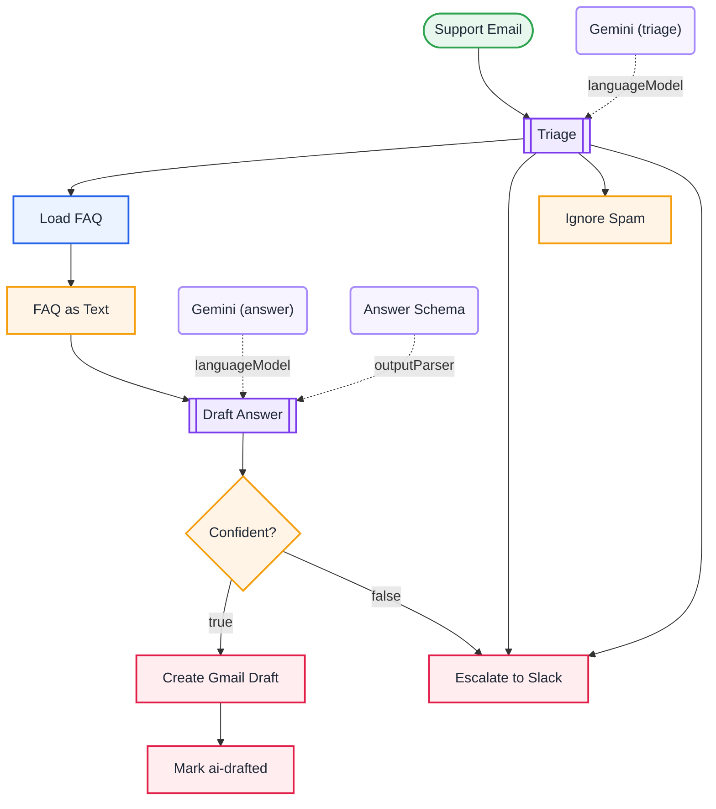

<div align="center">

# P02 · Support inbox copilot

    



</div>

> [!NOTE]
> **The real-world problem.** Support teams answer the same 30 questions all day. Fully automatic AI replies are risky (wrong answers, bad tone, hallucinated policies). The pattern that works in real companies is the **copilot**: the AI prepares a *draft* in the agent's own Gmail, grounded in an approved FAQ, with a confidence score. Anything it isn't sure about goes to a human straight away.

## 💡 Concept first

**📌 Key idea:** The **copilot pattern**: AI prepares a grounded draft with a confidence score; a human sends it.

**🧠 Mental model:** An assistant who drafts replies from the company FAQ and leaves them in your outbox, never pressing send.

**🚫 When *not* to use it:** Don't auto-send until you have weeks of accuracy data on a narrow category.

## 🎯 What you'll learn

- Two-stage AI: cheap **classification** first, answering only when it makes sense
- **Grounding** in a Google Sheet FAQ (non-technical staff can edit it)
- Self-reported **confidence** plus a `needs_human` flag, gated by an IF with two conditions
- Creating a **Gmail draft in the same thread** instead of sending
- `executeOnce` so the FAQ is loaded once per run, not once per email

## 🏗️ Architecture

**System context:** who and what this workflow talks to, and what crosses each boundary. 🔑 = needs a credential · 🧑 = a human decides.



<details><summary><b>Node-level flow</b> (every node and branch)</summary>



</details>

<details><summary>Plain-text flow</summary>

```
Gmail (to:support) → Text Classifier ⇐ Gemini
  ├ Question → load FAQ → aggregate → LLM answer (JSON) → confident?
  │                                    ├ yes → Gmail draft in thread → label ai-drafted
  │                                    └ no  → Slack escalation
  ├ Problem / Other → Slack escalation
  └ Spam → ignore
```

</details>

## ⚖️ Design decisions & trade-offs

Why it's built this way, and what it costs.

| Decision | Why | Trade-off / alternative |
|---|---|---|
| Classify first, answer only "Question" emails | Cheap triage avoids spending an LLM answer on spam or angry escalations | Two model calls per question email. Could merge into one prompt, at the cost of clarity |
| Ground answers in a **Google Sheet FAQ** | Support leads can edit answers without touching the workflow | Doesn't scale past ~100 entries in one prompt; then move to RAG (L13) |
| Create a **draft**, never send | Wrong answers never reach customers; agents stay in control | Saves less time than auto-send. That's the price of safety until accuracy is proven |
| Gate on confidence ≥ 0.75 **and** `needs_human = false` | Models are overconfident; two signals are safer than one | Threshold chosen by judgement. Tune it with real data |

## 🔑 Credentials

| You need | Where to get it |
|---|---|
| Gmail OAuth2 | [docs/credentials.md](../../docs/credentials.md) |
| Google Gemini API key | [docs/credentials.md](../../docs/credentials.md) |
| Google Sheets OAuth2 (tab `FAQ` | question, answer) |
| Slack API | [docs/credentials.md](../../docs/credentials.md) |

## 📝 Before you run it

Replace these placeholder values with your own:

| Node | Field | Placeholder |
|---|---|---|
| Load FAQ | `documentId` | `PASTE_YOUR_GOOGLE_SHEET_URL` |
| Mark ai-drafted | `labelIds` | `REPLACE_LABEL_ID_AI_DRAFTED` |

Nodes that need a credential selected after import: **Gmail**, **Gmail Trigger**, **Google Gemini Chat Model**, **Google Sheets**.

## 🛠️ Build it step by step

> [!TIP]
> In a hurry? Import [`workflow.json`](workflow.json) (copy → paste on the n8n canvas). Learning? Build it yourself using the steps below, then compare.

1. Create the `FAQ` tab with 10–30 real Q&A pairs.
2. Create the Gmail label `ai-drafted` and paste its ID.
3. Import it, connect the credentials, and invite the Slack bot to `#support`.
4. Send test emails to your support address: one answered by the FAQ, one not, one "it's broken".

## 🔍 Node-by-node reference

Every node in this workflow and every setting inside it, generated from [`workflow.json`](workflow.json). Click a node to expand it.

<details><summary><b>1. Support Email</b> · <code>Gmail Trigger</code> v1.2</summary>

> Polls Gmail on an interval and starts once per matching email.

| Property | Value |
|---|---|
| `pollTimes.item.mode` | everyX |
| `pollTimes.item.value` | 5 |
| `pollTimes.item.unit` | minutes |
| `simple` | ✅ on |
| `filters.readStatus` | unread |
| `filters.q` | to:support -label:ai-drafted |

</details>

<details><summary><b>2. Triage</b> · <code>textClassifier</code> v1.1</summary>


| Property | Value |
|---|---|
| `inputText` | `Subject: {{ $json.Subject }}  {{ $json.snippet }}` |
| `categories.categories.1.category` | Question |
| `categories.categories.1.description` | How-to, pricing, policy, account or feature questions that documentation could answer |
| `categories.categories.2.category` | Problem |
| `categories.categories.2.description` | Something is broken, an error, a failed payment or a missing order |
| `categories.categories.3.category` | Spam |
| `categories.categories.3.description` | Marketing, cold outreach, automated notifications |
| `fallback` | other |

</details>

<details><summary><b>3. Gemini (triage)</b> · <code>Google Gemini Chat Model</code> v1</summary>

> The language model plugged into a chain or agent.

| Property | Value |
|---|---|
| `modelName` | models/gemini-2.5-flash |
| `temperature` | 0 |

</details>

<details><summary><b>4. Load FAQ</b> · <code>Google Sheets</code> v4.5</summary>

> Reads, appends or updates rows in a spreadsheet.

| Property | Value |
|---|---|
| `documentId` | PASTE_YOUR_GOOGLE_SHEET_URL |
| `sheetName` | FAQ |
| `⚙️ Execute once` | ✅ on |

</details>

<details><summary><b>5. FAQ as Text</b> · <code>aggregate</code> v1</summary>


| Property | Value |
|---|---|
| `aggregate` | aggregateAllItemData |
| `destinationFieldName` | faq |

</details>

<details><summary><b>6. Draft Answer</b> · <code>Basic LLM Chain</code> v1.5</summary>

> Sends one prompt to a model and returns the answer. Simplest AI node.

| Property | Value |
|---|---|
| `promptType` | define |
| `hasOutputParser` | ✅ on |
| `text` | `FAQ (question \| answer): {{ $json.faq.map(f => `${f.question} \| ${f.answer}`).join('\n') }}  Customer email: From: {{ $('Support Email').item.json.From }} Subject: {{ $('Support Email').item.json.Subject }} {{ $('Support Email').item.json.snippet }}` |
| `messages.message` | You are a support agent. Answer ONLY using the FAQ. If the FAQ doesn't cover it, set needs_human=true. Be warm and concise (under 120 words), sign as 'Support team'. confidence is 0-1: how fully the FAQ answers the question. |

</details>

<details><summary><b>7. Gemini (answer)</b> · <code>Google Gemini Chat Model</code> v1</summary>

> The language model plugged into a chain or agent.

| Property | Value |
|---|---|
| `modelName` | models/gemini-2.5-flash |
| `temperature` | 0.2 |

</details>

<details><summary><b>8. Answer Schema</b> · <code>Structured Output Parser</code> v1.2</summary>

> Forces the model's answer into JSON matching your schema.

| Property | Value |
|---|---|
| `jsonSchemaExample` | (JSON schema, 6 lines, shown below) |

**Schema example:**

```json
{
  "reply": "Hi Priya, you can change your plan from Settings → Billing …",
  "confidence": 0.86,
  "needs_human": false,
  "faq_used": "How do I change my plan?"
}
```

</details>

<details><summary><b>9. Confident?</b> · <code>If</code> v2.2</summary>

> Splits items into a **true** and a **false** branch.

| Property | Value |
|---|---|
| `condition` | `{{ $json.output.confidence }} ≥ 0.75 AND {{ $json.output.needs_human }} is false` |

</details>

<details><summary><b>10. Create Gmail Draft</b> · <code>Gmail</code> v2.1</summary>

> Sends, reads or labels email. `sendAndWait` pauses the workflow for a human reply.

| Property | Value |
|---|---|
| `resource` | draft |
| `subject` | `Re: {{ $('Support Email').item.json.Subject }}` |
| `emailType` | text |
| `message` | `{{ $json.output.reply }}` |
| `threadId` | `{{ $('Support Email').item.json.threadId }}` |
| `sendTo` | `{{ $('Support Email').item.json.From }}` |

</details>

<details><summary><b>11. Mark ai-drafted</b> · <code>Gmail</code> v2.1</summary>

> Sends, reads or labels email. `sendAndWait` pauses the workflow for a human reply.

| Property | Value |
|---|---|
| `operation` | addLabels |
| `messageId` | `{{ $('Support Email').item.json.id }}` |
| `labelIds` | REPLACE_LABEL_ID_AI_DRAFTED |

</details>

<details><summary><b>12. Escalate to Slack</b> · <code>slack</code> v2.3</summary>


| Property | Value |
|---|---|
| `select` | channel |
| `channelId` | #support |
| `text` | `:rotating_light: *Needs a human* *From:* {{ $('Support Email').item.json.From }} *Subject:* {{ $('Support Email').item.json.Subject }} >{{ $('Support Email').item.json.snippet }}` |

</details>

<details><summary><b>13. Ignore Spam</b> · <code>No Operation</code> v1</summary>

> Does nothing. Marks a branch that intentionally ends.

*No settings. This node works with its defaults.*

</details>

> [!TIP]
> ⚙️ rows come from each node's **Settings** tab, not its Parameters tab. `{{ … }}` values are **expressions** evaluated at run time. See [workflow anatomy](../../docs/workflow-anatomy.md) for what every property means.

## ✅ Test it

> [!TIP]
> **Automated end-to-end test: passed.** 8/10 nodes executed in real n8n (7 credentialed nodes replaced by realistic mocks), 2 behaviour checks. See [tests/](../../tests/README.md).

- [ ] The FAQ question should produce a draft reply in the same Gmail thread, with confidence ≥ 0.75.
- [ ] The uncovered question should go to Slack.
- [ ] Check that nothing was **sent** automatically.

## 🧯 Troubleshooting

Problems specific to this workflow are below. For general ones (expressions, items, triggers, AI), see [common mistakes](../../docs/common-mistakes.md).

<details><summary><b>Draft not in the same thread</b></summary>

`threadId` must come from the trigger (Simplify on gives `threadId`).

</details>

<details><summary><b>Confidence always high</b></summary>

Models are overconfident. Keep the `needs_human` rule and tune the threshold with real emails.

</details>

## 🚀 Level up

- Track draft → sent edits to measure AI accuracy.
- Replace the FAQ sheet with RAG over your help centre (L13).
- Auto-send only for one very safe category after a month of review data.

---

<p align="center"><a href="../P01-invoice-processing-pipeline/README.md">← P01 · Accounts-payable invoice pipeline</a> &nbsp;·&nbsp; <a href="../../README.md#-the-learning-path">📚 All lessons</a> &nbsp;·&nbsp; <a href="../P03-incident-response-orchestrator/README.md">P03 · Incident response orchestrator →</a></p>
