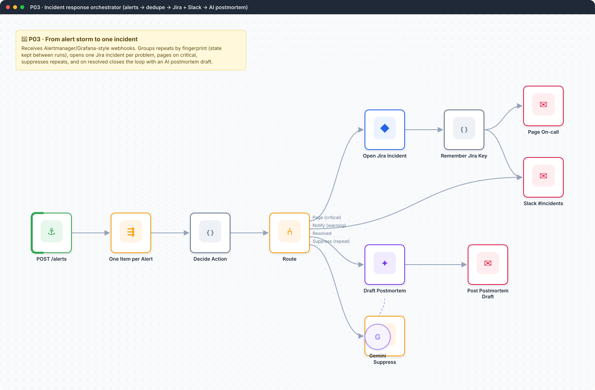
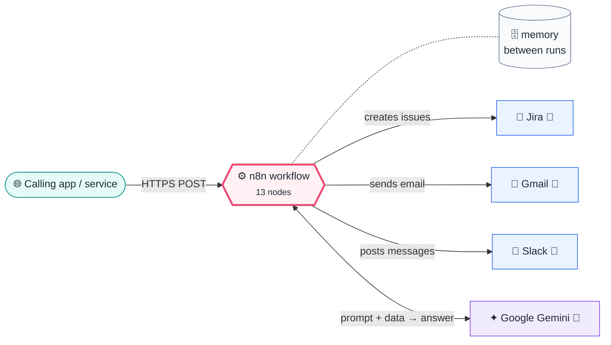
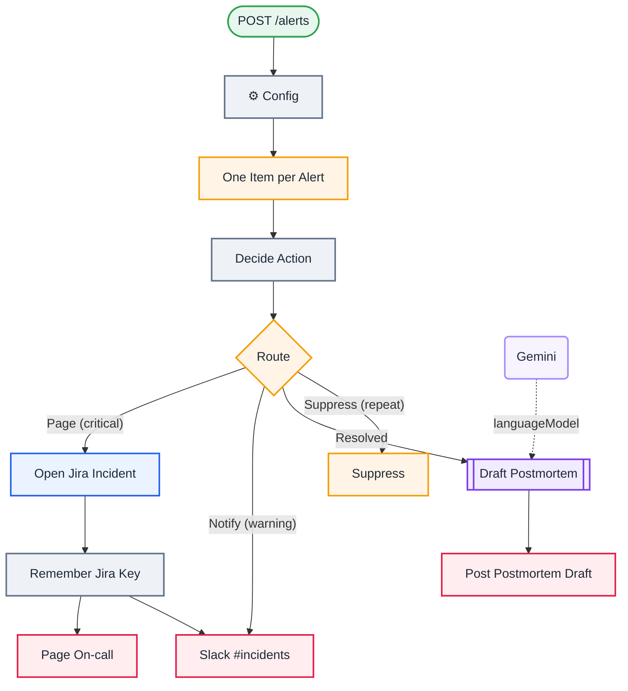

<div align="center">

# P03 · Incident response orchestrator

    [](https://github.com/callme-siva/n8n-knowledge/actions/workflows/validate.yml)



</div>

> [!NOTE]
> **The real-world problem.** When production breaks, monitoring fires the same alert every minute and on-call engineers drown in noise. Mature SRE teams use an orchestrator that **deduplicates alerts into one incident**, pages only for critical problems, keeps Slack and Jira in sync, and makes writing the postmortem easy. This is a small, understandable version of what PagerDuty and incident.io do.

## 💡 Concept first

**📌 Key idea:** Turn an **alert storm into one incident**: dedupe by fingerprint, route by severity, close the loop on resolve.

**🧠 Mental model:** A hospital triage nurse: one patient file per person, no matter how many times the alarm beeps.

**🚫 When *not* to use it:** Don't page humans for warnings. Only critical alerts should wake someone up.

## 🎯 What you'll learn

- Receiving real monitoring webhooks (Alertmanager / Grafana format) **with Header Auth**, since anyone who can post fake alerts can page your on-call
- **Split Out** a batch payload into items
- **Stateful deduplication by fingerprint** with workflow static data
- A severity-based action matrix in a Switch (page / notify / resolve / suppress)
- Storing the Jira key so the resolve event can refer back to it
- AI **postmortem draft** with strict "no invented facts" rules

## 🏗️ Architecture

**System context:** who and what this workflow talks to, and what crosses each boundary. 🔑 = needs a credential · 🧑 = a human decides.



<details><summary><b>Node-level flow</b> (every node and branch)</summary>



</details>

<details><summary>Plain-text flow</summary>

```
Webhook /alerts → Split Out alerts → Code (state by fingerprint → action) → Switch
  ├ page     → Jira incident → remember key → email on-call + Slack
  ├ notify   → Slack
  ├ resolved → LLM postmortem draft ⇐ Gemini → Slack
  └ repeat   → suppress
```

</details>

## ⚖️ Design decisions & trade-offs

Why it's built this way, and what it costs.

| Decision | Why | Trade-off / alternative |
|---|---|---|
| Dedupe by alert **fingerprint** kept in workflow static data | Monitoring re-fires every minute; one problem should be one incident | Static data is per-workflow and not shared across instances; use a DB table in HA setups |
| Severity matrix in one Switch: page / notify / resolve / suppress | The policy is visible in one place and easy to change | Doesn't cover time-based escalation (add a Wait + acknowledgement check) |
| Store the Jira key against the fingerprint | The resolve event must find the incident it belongs to | If static data is lost, resolves can't link back (they're ignored safely) |
| AI writes a postmortem **draft** with "never invent facts" | Removes the blank-page problem; humans add root cause | Draft quality depends on alert annotations. Richer alerts give better drafts |
| Header auth on the webhook | Anyone who can post alerts can page your on-call engineer | Monitoring tools must be configured with the token |

## 🔑 Credentials

| You need | Where to get it |
|---|---|
| Header Auth credential (e.g. `Authorization | Bearer <long random>`) |
| Jira Software Cloud API token | [docs/credentials.md](../../docs/credentials.md) |
| Slack API | [docs/credentials.md](../../docs/credentials.md) |
| Gmail OAuth2 | [docs/credentials.md](../../docs/credentials.md) |
| Google Gemini API key | [docs/credentials.md](../../docs/credentials.md) |

## 📝 Before you run it

Replace these placeholder values with your own:

| Node | Field | Placeholder |
|---|---|---|
| ⚙️ Config | `oncall_email` | `you@example.com` |
| ⚙️ Config | `slack_channel_id` | `REPLACE_SLACK_CHANNEL_ID` |
| Open Jira Incident | `project` | `REPLACE_PROJECT_ID` |
| Open Jira Incident | `issueType` | `REPLACE_INCIDENT_ISSUE_TYPE_ID` |

Nodes that need a credential selected after import: **Gmail**, **Google Gemini Chat Model**, **Jira Software**.

## 🛠️ Build it step by step

> [!TIP]
> In a hurry? Import [`workflow.json`](workflow.json) (copy → paste on the n8n canvas). Learning? Build it yourself using the steps below, then compare.

1. Import it and set the Jira project and issue-type IDs (an *Incident* or *Bug* type). Put the on-call email and the Slack **channel ID** (not its name, which breaks on rename) in **⚙️ Config**.
2. Create a **Header Auth** credential on the webhook. Alertmanager: `http_config.authorization.credentials`; Grafana contact point: *Authorization header*.
3. **Activate** it (static data and production webhooks need an active workflow).
4. Point Alertmanager (`webhook_configs.url`) or a Grafana contact point at `https://<n8n>/webhook/alerts`, or simulate one with curl (below).

## 🔍 Node-by-node reference

Every node in this workflow and every setting inside it, generated from [`workflow.json`](workflow.json). Click a node to expand it.

<details><summary><b>1. POST /alerts</b> · <code>Webhook</code> v2</summary>

> Gives the workflow its own URL. Any HTTP call to it starts an execution.

| Property | Value |
|---|---|
| `httpMethod` | POST |
| `path` | alerts |
| `authentication` | headerAuth |
| `responseMode` | onReceived |

</details>

<details><summary><b>2. ⚙️ Config</b> · <code>Edit Fields (Set)</code> v3.4</summary>

> Creates, renames or overwrites fields without code.

| Property | Value |
|---|---|
| `oncall_email` | you@example.com |
| `slack_channel_id` | REPLACE_SLACK_CHANNEL_ID |
| `includeOtherFields` | ✅ on |
| `include` | all |

</details>

<details><summary><b>3. One Item per Alert</b> · <code>Split Out</code> v1</summary>

> Turns one item holding an array into one item per array element.

| Property | Value |
|---|---|
| `fieldToSplitOut` | body.alerts |

</details>

<details><summary><b>4. Decide Action</b> · <code>Code</code> v2</summary>

> Runs JavaScript. *Run once for all items* sees every item; *for each item* sees one at a time.

| Property | Value |
|---|---|
| `jsCode` | (JavaScript, 17 lines, shown below) |

**Code:**

```javascript
// Alertmanager payload: alerts[] { status, fingerprint, labels{alertname,severity,service}, annotations{summary,description}, startsAt, endsAt }
const state = $getWorkflowStaticData('global'); state.open ??= {};
return $input.all().map(({ json: a }) => {
  const fp = a.fingerprint || `${a.labels?.alertname}|${a.labels?.service}`;
  const known = state.open[fp];
  const sev = (a.labels?.severity || 'warning').toLowerCase();
  let action;
  if (a.status === 'resolved') action = known ? 'resolve' : 'ignore';
  else if (known && !known.jira_key && known.sev === 'critical') { known.count++; action = 'page'; }  // last Jira create failed: try again
  else if (known) { known.count++; action = 'repeat'; }
  else { state.open[fp] = { since: a.startsAt || new Date().toISOString(), count: 1, sev }; action = sev === 'critical' ? 'page' : 'notify'; }
  const rec = state.open[fp] || {};
  const out = { action, fp, sev, name: a.labels?.alertname, service: a.labels?.service || 'unknown', summary: a.annotations?.summary || '', description: a.annotations?.description || '',
    since: rec.since, repeats: rec.count, jira_key: rec.jira_key || null, duration_min: a.endsAt && rec.since ? Math.round((Date.parse(a.endsAt) - Date.parse(rec.since)) / 60000) : null };
  if (action === 'resolve') delete state.open[fp];
  return { json: out };
});
```

</details>

<details><summary><b>5. Route</b> · <code>Switch</code> v3.2</summary>

> Routes items to one of many named outputs.

| Property | Value |
|---|---|
| `rule 1.condition` | `{{ $json.action }} = page` |
| `rule 1.renameOutput` | ✅ on |
| `rule 1.outputKey` | Page (critical) |
| `rule 2.condition` | `{{ $json.action }} = notify` |
| `rule 2.renameOutput` | ✅ on |
| `rule 2.outputKey` | Notify (warning) |
| `rule 3.condition` | `{{ $json.action }} = resolve` |
| `rule 3.renameOutput` | ✅ on |
| `rule 3.outputKey` | Resolved |
| `fallbackOutput` | extra |
| `renameFallbackOutput` | Suppress (repeat) |

</details>

<details><summary><b>6. Open Jira Incident</b> · <code>Jira Software</code> v1</summary>

> Creates, searches or updates Jira issues.

| Property | Value |
|---|---|
| `project` | REPLACE_PROJECT_ID |
| `issueType` | REPLACE_INCIDENT_ISSUE_TYPE_ID |
| `summary` | `[P1] {{ $json.service }}: {{ $json.name }}` |
| `additionalFields.description` | `{{ $json.summary }}  {{ $json.description }}  Fingerprint: {{ $json.fp }} Started: {{ $…` |
| `additionalFields.labels` | incident, auto |
| `⚙️ Retry on fail` | ✅ on |
| `⚙️ Max tries` | 3 |
| `⚙️ Wait between tries (ms)` | 3000 |

</details>

<details><summary><b>7. Remember Jira Key</b> · <code>Code</code> v2</summary>

> Runs JavaScript. *Run once for all items* sees every item; *for each item* sees one at a time.

| Property | Value |
|---|---|
| `mode` | runOnceForEachItem |
| `jsCode` | (JavaScript, 5 lines, shown below) |

**Code:**

```javascript
// Store the new Jira key against the alert fingerprint so repeats and the resolve event can find it.
const state = $getWorkflowStaticData('global');
const a = $('Route').item.json;
if (state.open[a.fp]) state.open[a.fp].jira_key = $json.key;
return { json: { ...a, jira_key: $json.key } };
```

</details>

<details><summary><b>8. Page On-call</b> · <code>Gmail</code> v2.1</summary>

> Sends, reads or labels email. `sendAndWait` pauses the workflow for a human reply.

| Property | Value |
|---|---|
| `sendTo` | `{{ $('⚙️ Config').first().json.oncall_email }}` |
| `subject` | `🔴 P1 {{ $json.service }}: {{ $json.name }} ({{ $json.jira_key }})` |
| `emailType` | html |
| `message` | `<p>{{ $json.summary }}</p><p>Jira: {{ $json.jira_key }}</p>` |
| `appendAttribution` | off |
| `⚙️ Retry on fail` | ✅ on |
| `⚙️ Max tries` | 3 |
| `⚙️ Wait between tries (ms)` | 3000 |

</details>

<details><summary><b>9. Slack #incidents</b> · <code>slack</code> v2.3</summary>


| Property | Value |
|---|---|
| `select` | channel |
| `channelId` | `{{ $('⚙️ Config').first().json.slack_channel_id }}` |
| `text` | `:red_circle: *{{ $json.sev.toUpperCase() }}* {{ $json.service }}: {{ $json.name }} {{ $json.summary }}{{ $json.jira_key ? '\nJira: ' + $json.jira_key : '' }}` |
| `⚙️ Retry on fail` | ✅ on |
| `⚙️ Max tries` | 3 |
| `⚙️ Wait between tries (ms)` | 3000 |

</details>

<details><summary><b>10. Suppress</b> · <code>No Operation</code> v1</summary>

> Does nothing. Marks a branch that intentionally ends.

*No settings. This node works with its defaults.*

</details>

<details><summary><b>11. Draft Postmortem</b> · <code>Basic LLM Chain</code> v1.5</summary>

> Sends one prompt to a model and returns the answer. Simplest AI node.

| Property | Value |
|---|---|
| `promptType` | define |
| `text` | `Incident resolved. Service: {{ $json.service }} Alert: {{ $json.name }} Severity: {{ $json.sev }} Started: {{ $json.since }} Duration: {{ $json.duration_min }} minutes Repeated alerts: {{ $json.repeats }} Summary: {{ $json.summary }} Details: {{ $json.description }}` |
| `messages.message` | Write a blameless postmortem DRAFT in Markdown with sections: Summary, Impact, Timeline (only known facts), Probable cause (clearly marked as hypothesis), Follow-up actions (3 max), Open questions. Never invent facts; write 'unknown' where data is missing. |

</details>

<details><summary><b>12. Gemini</b> · <code>Google Gemini Chat Model</code> v1</summary>

> The language model plugged into a chain or agent.

| Property | Value |
|---|---|
| `modelName` | models/gemini-2.5-flash |
| `temperature` | 0.2 |

</details>

<details><summary><b>13. Post Postmortem Draft</b> · <code>slack</code> v2.3</summary>


| Property | Value |
|---|---|
| `select` | channel |
| `channelId` | `{{ $('⚙️ Config').first().json.slack_channel_id }}` |
| `text` | `:large_green_circle: *Resolved* {{ $('Route').item.json.service }}: {{ $('Route').item.json.name }} after {{ $('Route').item.json.duration_min }} min  *Postmortem draft:* {{ $json.text }}` |
| `⚙️ Retry on fail` | ✅ on |
| `⚙️ Max tries` | 3 |
| `⚙️ Wait between tries (ms)` | 3000 |

</details>

> [!TIP]
> ⚙️ rows come from each node's **Settings** tab, not its Parameters tab. `{{ … }}` values are **expressions** evaluated at run time. See [workflow anatomy](../../docs/workflow-anatomy.md) for what every property means.

## ✅ Test it

> [!TIP]
> **Automated end-to-end test: passed.** 10/12 nodes executed in real n8n (6 credentialed or AI nodes replaced by fixtures, so AI output itself isn't tested), 4 behaviour checks. See [tests/](../../tests/README.md).

- [ ] ```bash
curl -X POST https://<n8n>/webhook/alerts -H 'Authorization: Bearer <token>' -H 'Content-Type: application/json' -d '{"alerts":[{"status":"firing","fingerprint":"abc","labels":{"alertname":"HighErrorRate","severity":"critical","service":"payments"},"annotations":{"summary":"5xx > 5% for 5m"},"startsAt":"2026-09-23T10:00:00Z"}]}'
```
- [ ] Send the same payload 3 times: only **one** Jira issue and one page.
- [ ] Send it again with `"status":"resolved"` and `"endsAt"`: you should get a postmortem draft in Slack.

## 🧯 Troubleshooting

Problems specific to this workflow are below. For general ones (expressions, items, triggers, AI), see [common mistakes](../../docs/common-mistakes.md).

<details><summary><b>Every alert creates a new incident</b></summary>

The workflow isn't active (static data isn't saved in manual runs), or the fingerprint changes between sends.

</details>

<details><summary><b>State lost after a restart</b></summary>

Static data survives restarts but not re-imports. For production, keep state in a DB table instead.

</details>

<details><summary><b>Two incidents for one alert storm</b></summary>

Static data is saved when an execution ends, so two webhook calls running at the same moment (burst alerts, queue mode) can both see the fingerprint as new. For high volume, keep state in Postgres/Redis with a unique key on the fingerprint.

</details>

<details><summary><b>Jira was down during a critical alert</b></summary>

*Open Jira Incident* retries 3 times. If it still fails, the fingerprint has no Jira key, so the next repeat of that critical alert tries to open the incident again instead of being suppressed.

</details>

## 🏋️ Practice

Try each challenge **before** opening the hint. Solutions show the exact expressions and code.

**⭐ Challenge 1:** Include a **runbook link** per alert name in the Slack message.

<details><summary>💡 Hint</summary>

A small lookup table in code.

</details>
<details><summary>✅ Solution</summary>

In *Decide Action*: `const RUNBOOKS = { HighErrorRate: 'https://wiki/runbooks/5xx', DiskFilling: 'https://wiki/runbooks/disk' };` and add `runbook: RUNBOOKS[a.labels?.alertname] || ''` to the output. Show it in Slack.

</details>

**⭐⭐ Challenge 2:** **Escalate** if nobody acknowledges a P1 within 10 minutes.

<details><summary>💡 Hint</summary>

Wait, then check an acknowledgement flag.

</details>
<details><summary>✅ Solution</summary>

After paging, add **Wait 10 min** → Jira *Get issue* → IF the status is still *Open* (nobody picked it up), page the secondary on-call and post *"Escalated"* in Slack. For a real ack button, use Slack **Send and Wait** as the page.

</details>

## 🚀 Ideas to extend it

- Add an escalation Wait: if not acknowledged in 10 min, page the secondary on-call.
- Update a public status page via API.
- Attach recent logs to the postmortem prompt.

---

<p align="center"><a href="../P02-support-inbox-copilot/README.md">← P02 · Support inbox copilot</a> &nbsp;·&nbsp; <a href="../../README.md#-the-learning-path">📚 All lessons</a> &nbsp;·&nbsp; <a href="../P04-sales-followup-sequence/README.md">P04 · Multi-touch sales follow-up sequence →</a></p>
