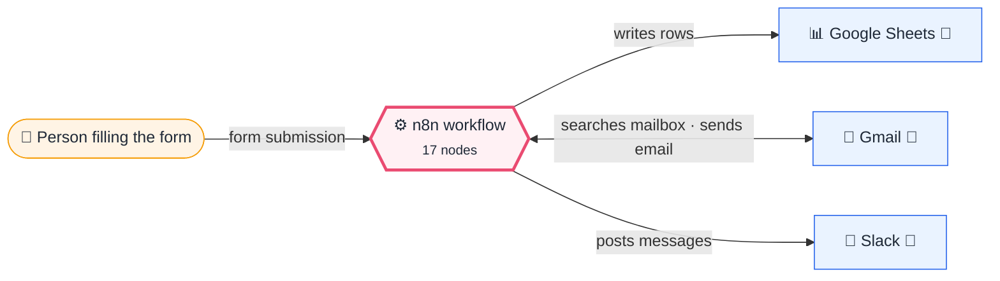
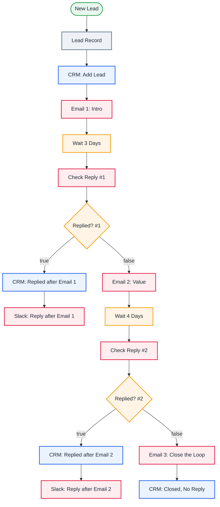

<div align="center">

# P04 · Multi-touch sales follow-up sequence

    [](https://github.com/callme-siva/n8n-knowledge/actions/workflows/validate.yml)


</div>

> [!NOTE]
> **The real-world problem.** 80% of sales need 5+ touches, but most people follow up once and give up, or keep emailing people who already replied (which is embarrassing). Tools like Outreach and Apollo charge per seat for this. With **Wait nodes** and **reply detection**, n8n runs the whole sequence per lead and stops the moment they reply.

## 💡 Concept first

**📌 Key idea:** **Long-running executions**: Wait nodes pause one lead's journey for days; stop as soon as they reply.

**🧠 Mental model:** A patient salesperson with a follow-up diary who crosses a name off the moment the customer calls back.

**🚫 When *not* to use it:** Don't run multi-day waits on a laptop or SQLite. Use an always-on server with Postgres.

## 🎯 What you'll learn

- **Wait** node: pausing one execution for days
- Reply detection with a Gmail search (`from:x after:date`)
- `alwaysOutputData` + `exists` check to branch on "found nothing"
- Keeping a CRM row in sync with **append or update** by email
- Operational reality: long waits need Postgres and an always-on instance

## 🏗️ Architecture

**System context:** who and what this workflow talks to, and what crosses each boundary. 🔑 = needs a credential · 🧑 = a human decides.



<details><summary><b>Node-level flow</b> (every node and branch)</summary>



</details>

<details><summary>Plain-text flow</summary>

```
Form → Set lead → CRM add → Email 1 → ⏸ 3 days → reply? ─ yes → CRM replied_after_email_1 → Slack
                                                   └ no  → Email 2 → ⏸ 4 days → reply? ─ yes → CRM replied_after_email_2 → Slack
                                                                                   └ no  → Email 3 → CRM no_reply_closed
```

</details>

## ⚖️ Design decisions & trade-offs

Why it's built this way, and what it costs.

| Decision | Why | Trade-off / alternative |
|---|---|---|
| One long-running execution per lead, using **Wait** nodes | The whole sequence is readable in one place; state lives in the execution | Needs Postgres + an always-on instance; thousands of waiting executions use DB space |
| Reply detection by Gmail search (`from:lead after:start`) | No extra tools or tracking pixels needed | Only sees replies to the sending mailbox; misses replies from colleagues' addresses |
| Separate short branch per stage (`replied_after_email_N`) | No crossing flows, plus you learn which email converts | Slight duplication of the CRM + Slack pair per stage |
| CRM updates map values inline (append-or-update by email) | Fewer nodes; the row key is explicit | Column names must match the sheet exactly |

## 🔑 Credentials

| You need | Where to get it |
|---|---|
| Gmail OAuth2 | [docs/credentials.md](../../docs/credentials.md) |
| Google Sheets OAuth2 (tab `Leads` | email, name, company, need, status, started, updated) |
| Slack API | [docs/credentials.md](../../docs/credentials.md) |

## 📝 Before you run it

Replace these placeholder values with your own:

| Node | Field | Placeholder |
|---|---|---|
| CRM: Add Lead | `documentId` | `PASTE_YOUR_GOOGLE_SHEET_URL` |
| Email 1: Intro | `message` | `<p>Hi {{ $('Lead Record').item.json.name }},</p><p>Thanks for reaching out about <i>{{ …` |
| CRM: Replied after Email 1 | `documentId` | `PASTE_YOUR_GOOGLE_SHEET_URL` |
| CRM: Replied after Email 2 | `documentId` | `PASTE_YOUR_GOOGLE_SHEET_URL` |
| CRM: Closed, No Reply | `documentId` | `PASTE_YOUR_GOOGLE_SHEET_URL` |

Nodes that need a credential selected after import: **Gmail**, **Google Sheets**.

### 📥 Starter files

Create each tab from its template, so column names match exactly: **Google Sheets → File → Import → Upload** the CSV → *Insert new sheet(s)*. The tab takes the file's name.

| Tab | Template | Columns |
|---|---|---|
| `Leads` | [Leads.csv](../../templates/P04-sales-followup-sequence/Leads.csv) | `email`, `name`, `company`, `need`, `started`, `status`, `updated` |

<sub>Columns are generated from what this workflow actually reads and writes in the automated test, so they can't drift from the workflow.</sub>

## 🛠️ Build it step by step

> [!TIP]
> In a hurry? Import [`workflow.json`](workflow.json) (copy → paste on the n8n canvas). Learning? Build it yourself using the steps below, then compare.

1. Create the `Leads` tab.
2. Import it and connect the credentials.
3. **For testing**, change both Wait nodes to *minutes* (e.g. 2 and 2).
4. Submit the form with an email you control. Reply to Email 1 from that address before the wait ends.

## 🔍 Node-by-node reference

Every node in this workflow and every setting inside it, generated from [`workflow.json`](workflow.json). Click a node to expand it.

<details><summary><b>1. New Lead</b> · <code>n8n Form Trigger</code> v2.2</summary>

> Hosts a web form; each submission starts one execution. Field labels become JSON keys.

| Property | Value |
|---|---|
| `formTitle` | Request a callback |
| `formFields.values` | Name *, Email *, Company, What do you need? |

</details>

<details><summary><b>2. Lead Record</b> · <code>Edit Fields (Set)</code> v3.4</summary>

> Creates, renames or overwrites fields without code.

| Property | Value |
|---|---|
| `email` | `{{ $json.Email.toLowerCase() }}` |
| `name` | `{{ $json.Name }}` |
| `company` | `{{ $json.Company \|\| '' }}` |
| `need` | `{{ $json['What do you need?'] \|\| '' }}` |
| `status` | email_1_sent |
| `started` | `{{ $now.toISO() }}` |

</details>

<details><summary><b>3. CRM: Add Lead</b> · <code>Google Sheets</code> v4.5</summary>

> Reads, appends or updates rows in a spreadsheet.

| Property | Value |
|---|---|
| `operation` | appendOrUpdate |
| `documentId` | PASTE_YOUR_GOOGLE_SHEET_URL |
| `sheetName` | Leads |
| `columns.mappingMode` | autoMapInputData |
| `columns.matchingColumns` | email |
| `⚙️ Retry on fail` | ✅ on |
| `⚙️ Max tries` | 3 |
| `⚙️ Wait between tries (ms)` | 3000 |

</details>

<details><summary><b>4. Email 1: Intro</b> · <code>Gmail</code> v2.1</summary>

> Sends, reads or labels email. `sendAndWait` pauses the workflow for a human reply.

| Property | Value |
|---|---|
| `sendTo` | `{{ $('Lead Record').item.json.email }}` |
| `subject` | `Quick question about {{ $('Lead Record').item.json.company \|\| 'your team' }}` |
| `emailType` | html |
| `message` | `<p>Hi {{ $('Lead Record').item.json.name }},</p><p>Thanks for reaching out about <i>{{ $('Lead Record').item.json.need }}</i>. Would a 20-minute call this week help? Here's my calendar: https://cal.com/your-link</p>` |
| `appendAttribution` | off |
| `⚙️ Retry on fail` | ✅ on |
| `⚙️ Max tries` | 3 |
| `⚙️ Wait between tries (ms)` | 3000 |

</details>

<details><summary><b>5. Wait 3 Days</b> · <code>wait</code> v1.1</summary>


| Property | Value |
|---|---|
| `resume` | timeInterval |
| `amount` | 3 |
| `unit` | days |

</details>

<details><summary><b>6. Check Reply #1</b> · <code>Gmail</code> v2.1</summary>

> Sends, reads or labels email. `sendAndWait` pauses the workflow for a human reply.

| Property | Value |
|---|---|
| `operation` | getAll |
| `limit` | 5 |
| `simple` | ✅ on |
| `filters.q` | `from:{{ $('Lead Record').item.json.email }} after:{{ DateTime.fromISO($('Lead Record').…` |
| `⚙️ Retry on fail` | ✅ on |
| `⚙️ Max tries` | 3 |
| `⚙️ Wait between tries (ms)` | 3000 |
| `⚙️ Always output data` | ✅ on |

</details>

<details><summary><b>7. Replied? #1</b> · <code>If</code> v2.2</summary>

> Splits items into a **true** and a **false** branch.

| Property | Value |
|---|---|
| `condition` | `{{ $json.id }} exists` |

</details>

<details><summary><b>8. CRM: Replied after Email 1</b> · <code>Google Sheets</code> v4.5</summary>

> Reads, appends or updates rows in a spreadsheet.

| Property | Value |
|---|---|
| `operation` | appendOrUpdate |
| `documentId` | PASTE_YOUR_GOOGLE_SHEET_URL |
| `sheetName` | Leads |
| `columns.mappingMode` | defineBelow |
| `columns.email` | `{{ $('Lead Record').item.json.email }}` |
| `columns.status` | replied_after_email_1 |
| `columns.updated` | `{{ $now.toISO() }}` |
| `columns.matchingColumns` | email |
| `columns.schema.1.displayName` | email |
| `columns.schema.1.type` | string |
| `columns.schema.1.required` | off |
| `columns.schema.1.display` | ✅ on |
| `columns.schema.1.canBeUsedToMatch` | ✅ on |
| `columns.schema.1.defaultMatch` | off |
| `columns.schema.1.removed` | off |
| `columns.schema.2.displayName` | status |
| `columns.schema.2.type` | string |
| `columns.schema.2.required` | off |
| `columns.schema.2.display` | ✅ on |
| `columns.schema.2.canBeUsedToMatch` | ✅ on |
| `columns.schema.2.defaultMatch` | off |
| `columns.schema.2.removed` | off |
| `columns.schema.3.displayName` | updated |
| `columns.schema.3.type` | string |
| … | 8 more in workflow.json |

</details>

<details><summary><b>9. Slack: Reply after Email 1</b> · <code>slack</code> v2.3</summary>


| Property | Value |
|---|---|
| `select` | channel |
| `channelId` | #sales |
| `text` | `:tada: {{ $('Lead Record').item.json.name }} ({{ $('Lead Record').item.json.email }}) replied after email 1. Take it from here.` |
| `⚙️ Retry on fail` | ✅ on |
| `⚙️ Max tries` | 3 |
| `⚙️ Wait between tries (ms)` | 3000 |

</details>

<details><summary><b>10. Email 2: Value</b> · <code>Gmail</code> v2.1</summary>

> Sends, reads or labels email. `sendAndWait` pauses the workflow for a human reply.

| Property | Value |
|---|---|
| `sendTo` | `{{ $('Lead Record').item.json.email }}` |
| `subject` | `A 2-minute idea for {{ $('Lead Record').item.json.company \|\| 'you' }}` |
| `emailType` | html |
| `message` | `<p>Hi {{ $('Lead Record').item.json.name }},</p><p>Teams like yours usually save 5–10 hours a week by automating the first step of <i>{{ $('Lead Record').item.json.need }}</i>. Happy to show you how. Just reply 'yes'.</p>` |
| `appendAttribution` | off |
| `⚙️ Retry on fail` | ✅ on |
| `⚙️ Max tries` | 3 |
| `⚙️ Wait between tries (ms)` | 3000 |

</details>

<details><summary><b>11. Wait 4 Days</b> · <code>wait</code> v1.1</summary>


| Property | Value |
|---|---|
| `resume` | timeInterval |
| `amount` | 4 |
| `unit` | days |

</details>

<details><summary><b>12. Check Reply #2</b> · <code>Gmail</code> v2.1</summary>

> Sends, reads or labels email. `sendAndWait` pauses the workflow for a human reply.

| Property | Value |
|---|---|
| `operation` | getAll |
| `limit` | 5 |
| `simple` | ✅ on |
| `filters.q` | `from:{{ $('Lead Record').item.json.email }} after:{{ DateTime.fromISO($('Lead Record').…` |
| `⚙️ Retry on fail` | ✅ on |
| `⚙️ Max tries` | 3 |
| `⚙️ Wait between tries (ms)` | 3000 |
| `⚙️ Always output data` | ✅ on |

</details>

<details><summary><b>13. Replied? #2</b> · <code>If</code> v2.2</summary>

> Splits items into a **true** and a **false** branch.

| Property | Value |
|---|---|
| `condition` | `{{ $json.id }} exists` |

</details>

<details><summary><b>14. CRM: Replied after Email 2</b> · <code>Google Sheets</code> v4.5</summary>

> Reads, appends or updates rows in a spreadsheet.

| Property | Value |
|---|---|
| `operation` | appendOrUpdate |
| `documentId` | PASTE_YOUR_GOOGLE_SHEET_URL |
| `sheetName` | Leads |
| `columns.mappingMode` | defineBelow |
| `columns.email` | `{{ $('Lead Record').item.json.email }}` |
| `columns.status` | replied_after_email_2 |
| `columns.updated` | `{{ $now.toISO() }}` |
| `columns.matchingColumns` | email |
| `columns.schema.1.displayName` | email |
| `columns.schema.1.type` | string |
| `columns.schema.1.required` | off |
| `columns.schema.1.display` | ✅ on |
| `columns.schema.1.canBeUsedToMatch` | ✅ on |
| `columns.schema.1.defaultMatch` | off |
| `columns.schema.1.removed` | off |
| `columns.schema.2.displayName` | status |
| `columns.schema.2.type` | string |
| `columns.schema.2.required` | off |
| `columns.schema.2.display` | ✅ on |
| `columns.schema.2.canBeUsedToMatch` | ✅ on |
| `columns.schema.2.defaultMatch` | off |
| `columns.schema.2.removed` | off |
| `columns.schema.3.displayName` | updated |
| `columns.schema.3.type` | string |
| … | 8 more in workflow.json |

</details>

<details><summary><b>15. Slack: Reply after Email 2</b> · <code>slack</code> v2.3</summary>


| Property | Value |
|---|---|
| `select` | channel |
| `channelId` | #sales |
| `text` | `:tada: {{ $('Lead Record').item.json.name }} ({{ $('Lead Record').item.json.email }}) replied after email 2. Take it from here.` |
| `⚙️ Retry on fail` | ✅ on |
| `⚙️ Max tries` | 3 |
| `⚙️ Wait between tries (ms)` | 3000 |

</details>

<details><summary><b>16. Email 3: Close the Loop</b> · <code>Gmail</code> v2.1</summary>

> Sends, reads or labels email. `sendAndWait` pauses the workflow for a human reply.

| Property | Value |
|---|---|
| `sendTo` | `{{ $('Lead Record').item.json.email }}` |
| `subject` | `Should I close your file?` |
| `emailType` | html |
| `message` | `<p>Hi {{ $('Lead Record').item.json.name }}, I haven't heard back, so I'll assume the timing isn't right. If that changes, just reply to this email. All the best!</p>` |
| `appendAttribution` | off |
| `⚙️ Retry on fail` | ✅ on |
| `⚙️ Max tries` | 3 |
| `⚙️ Wait between tries (ms)` | 3000 |

</details>

<details><summary><b>17. CRM: Closed, No Reply</b> · <code>Google Sheets</code> v4.5</summary>

> Reads, appends or updates rows in a spreadsheet.

| Property | Value |
|---|---|
| `operation` | appendOrUpdate |
| `documentId` | PASTE_YOUR_GOOGLE_SHEET_URL |
| `sheetName` | Leads |
| `columns.mappingMode` | defineBelow |
| `columns.email` | `{{ $('Lead Record').item.json.email }}` |
| `columns.status` | no_reply_closed |
| `columns.updated` | `{{ $now.toISO() }}` |
| `columns.matchingColumns` | email |
| `columns.schema.1.displayName` | email |
| `columns.schema.1.type` | string |
| `columns.schema.1.required` | off |
| `columns.schema.1.display` | ✅ on |
| `columns.schema.1.canBeUsedToMatch` | ✅ on |
| `columns.schema.1.defaultMatch` | off |
| `columns.schema.1.removed` | off |
| `columns.schema.2.displayName` | status |
| `columns.schema.2.type` | string |
| `columns.schema.2.required` | off |
| `columns.schema.2.display` | ✅ on |
| `columns.schema.2.canBeUsedToMatch` | ✅ on |
| `columns.schema.2.defaultMatch` | off |
| `columns.schema.2.removed` | off |
| `columns.schema.3.displayName` | updated |
| `columns.schema.3.type` | string |
| … | 8 more in workflow.json |

</details>

> [!TIP]
> ⚙️ rows come from each node's **Settings** tab, not its Parameters tab. `{{ … }}` values are **expressions** evaluated at run time. See [workflow anatomy](../../docs/workflow-anatomy.md) for what every property means.

## ✅ Test it

> [!TIP]
> **Automated end-to-end test: passed.** 13/17 nodes executed in real n8n (12 credentialed or AI nodes replaced by fixtures, so AI output itself isn't tested), 3 behaviour checks. See [tests/](../../tests/README.md).

- [ ] Reply → no Email 2, the row shows `replied_after_email_1`, and there's a Slack alert.
- [ ] Don't reply → you get Email 2, then Email 3, and the row shows `no_reply_closed`.
- [ ] Open **Executions**: a waiting execution shows as *Waiting*.

## 🧯 Troubleshooting

Problems specific to this workflow are below. For general ones (expressions, items, triggers, AI), see [common mistakes](../../docs/common-mistakes.md).

<details><summary><b>Waits over ~65 s never resume</b></summary>

They're saved to the database and need the instance running when they're due. Laptops that sleep miss them, so use a server.

</details>

<details><summary><b>Replies not detected</b></summary>

The Gmail search runs on *your* mailbox, so the lead must reply to the same account that sent the email.

</details>

## 🏋️ Practice

Try each challenge **before** opening the hint. Solutions show the exact expressions and code.

**⭐ Challenge 1:** Skip weekends: never send follow-ups on Saturday or Sunday.

<details><summary>💡 Hint</summary>

Use *Wait → At specified time* with a computed date.

</details>
<details><summary>✅ Solution</summary>

Replace *Wait 3 Days* with **Wait → At specified time**: `{{ (d => d.weekday > 5 ? d.plus({ days: 8 - d.weekday }) : d)($now.plus({ days: 3 }).set({ hour: 10, minute: 0 })) }}`. This moves Saturday or Sunday to Monday 10:00.

</details>

**⭐⭐ Challenge 2:** Personalise email 2 using the lead's **company website**.

<details><summary>💡 Hint</summary>

Fetch the homepage, extract text, let AI write one relevant sentence.

</details>
<details><summary>✅ Solution</summary>

Before Email 2: HTTP GET `https://{{ $('Lead Record').item.json.email.split('@')[1] }}` (On Error → Continue) → HTML extract `body` text → LLM chain: *"One sentence connecting their business to automating {{ need }}"*. Insert it into Email 2.

</details>

## 🚀 Ideas to extend it

- Personalise emails with AI using the lead's company website.
- Skip weekends: calculate the resume time with *Wait → At specified time*.
- A/B test subject lines and log opens and replies.

---

<p align="center"><a href="../P03-incident-response-orchestrator/README.md">← P03 · Incident response orchestrator</a> &nbsp;·&nbsp; <a href="../../README.md#-the-learning-path">📚 All lessons</a> &nbsp;·&nbsp; <a href="../P05-bulk-ai-enrichment-checkpointed/README.md">P05 · Bulk AI enrichment of 1,000s of rows →</a></p>
