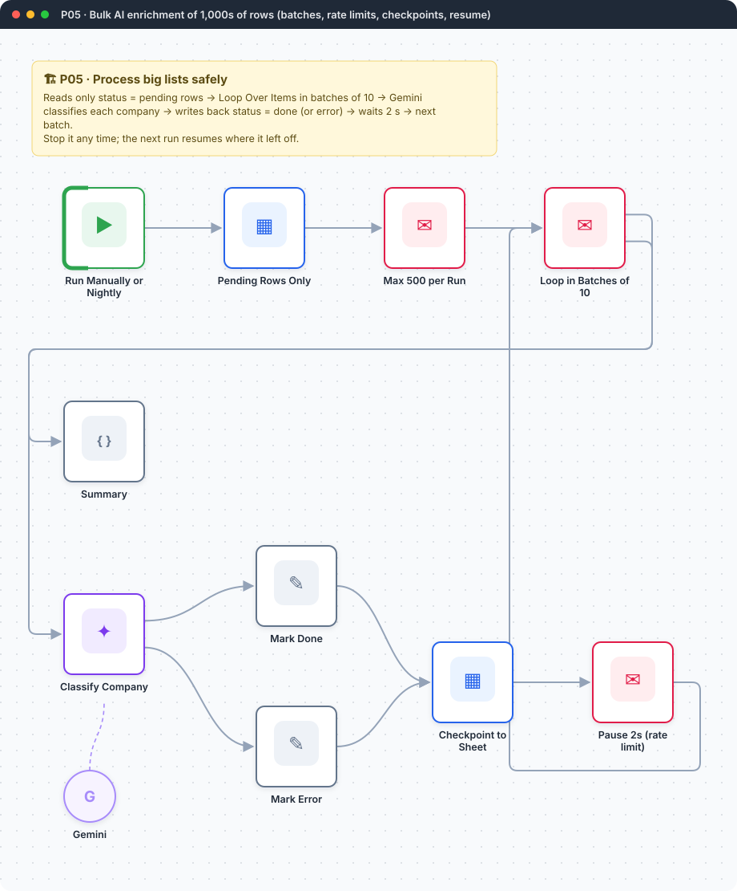
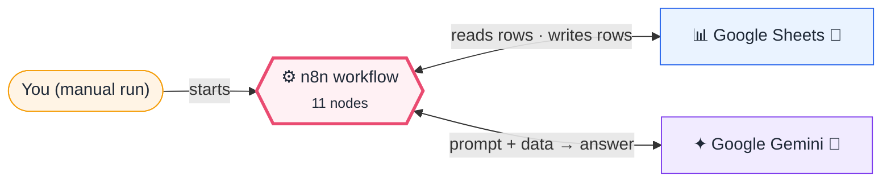
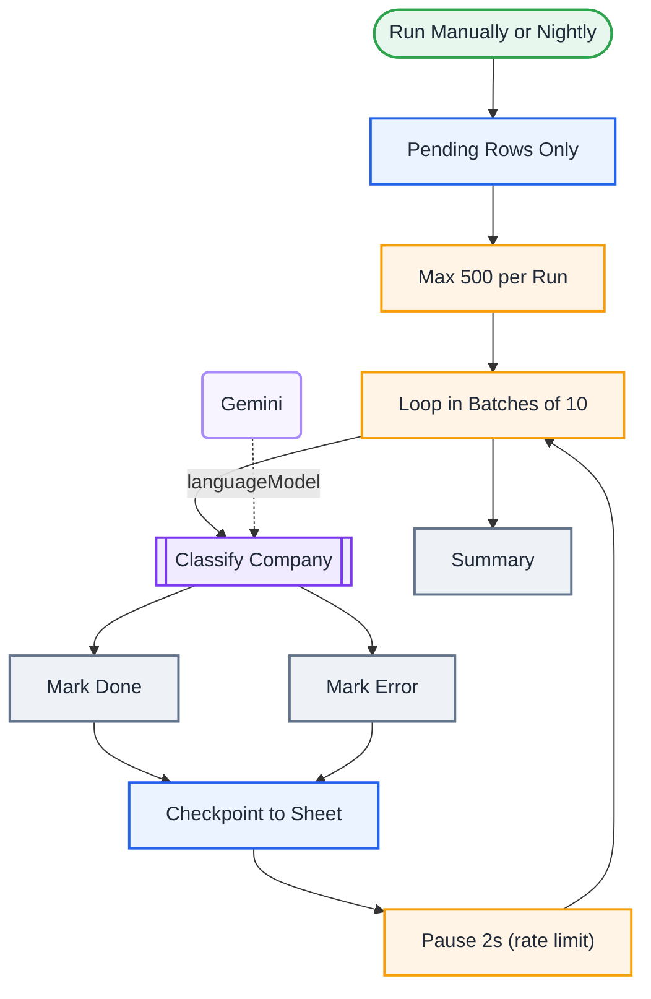

<div align="center">

# P05 · Bulk AI enrichment with batches and checkpoints

    [](https://github.com/callme-siva/n8n-knowledge/actions/workflows/validate.yml)



</div>

> [!NOTE]
> **The real-world problem.** Real data jobs are big: 5,000 leads to score, 20,000 products to categorise, 3,000 tickets to tag. Beginners send them all at once, hit rate limits, crash halfway, and can't tell which rows were done. Professionals use **batches, a pause between them, per-row error handling and a status column as a checkpoint**, so a run can stop at any point and resume safely.

## 💡 Concept first

**📌 Key idea:** Process big lists with **batches + checkpoints + rate limits**, so any run can stop and resume safely.

**🧠 Mental model:** Marking exam papers in piles of ten, ticking each one, so a fire drill doesn't make you start over.

**🚫 When *not* to use it:** Don't read the summary from `$('node').all()` inside loops (it's the last batch only). Use the loop's done output.

## 🎯 What you'll learn

- **Loop Over Items** (Split in Batches v3): the *loop* and *done* outputs
- **Checkpointing**: `status = pending → done / error` written after every batch
- Node-level **error output** (`continueErrorOutput`) for per-row failures
- Rate limiting with a short Wait inside the loop
- **Limit** per run to cap cost and runtime
- Idempotent re-runs: only pending rows are read

## 🏗️ Architecture

**System context:** who and what this workflow talks to, and what crosses each boundary. 🔑 = needs a credential · 🧑 = a human decides.



<details><summary><b>Node-level flow</b> (every node and branch)</summary>



</details>

## ⚖️ Design decisions & trade-offs

Why it's built this way, and what it costs.

| Decision | Why | Trade-off / alternative |
|---|---|---|
| Read only `status = pending` rows | Makes every run **resumable** and idempotent | The status column is critical; protect it from manual edits |
| Batches of 10 + a 2 s wait | Stays under API rate limits and keeps memory flat | Slower than full speed. Tune the batch size to your API tier |
| Per-row error output → `status = error` with reason | One bad row never stops the other 999 | Errors need a periodic review and re-queue |
| Limit 500 per run | Caps cost and runtime of a single execution | Big lists take several runs (schedule it nightly) |
| Summary counts from the loop's **done** output | `$('node').all()` inside a loop returns only the last batch (a real bug we caught in testing) | None; this is simply the correct way |

## 🔑 Credentials

| You need | Where to get it |
|---|---|
| Google Sheets OAuth2 | tab `Companies`: row_id, company, website, description, status, industry, b2b, icp_score, reason, processed_at |
| Google Gemini API key | [docs/credentials.md](../../docs/credentials.md) |

## 📝 Before you run it

Replace these placeholder values with your own:

| Node | Field | Placeholder |
|---|---|---|
| Pending Rows Only | `documentId` | `PASTE_YOUR_GOOGLE_SHEET_URL` |
| Checkpoint to Sheet | `documentId` | `PASTE_YOUR_GOOGLE_SHEET_URL` |

Nodes that need a credential selected after import: **Google Gemini Chat Model**, **Google Sheets**.

### 📥 Starter files

Create each tab from its template, so column names match exactly: **Google Sheets → File → Import → Upload** the CSV → *Insert new sheet(s)*. The tab takes the file's name.

| Tab | Template | Columns |
|---|---|---|
| `Companies` | [Companies.csv](../../templates/P05-bulk-ai-enrichment-checkpointed/Companies.csv) | `row_id`, `company`, `description`, `status`, `website`, `b2b`, `icp_score`, `industry`, `processed_at`, `reason` |

<sub>Columns are generated from what this workflow actually reads and writes in the automated test, so they can't drift from the workflow.</sub>

## 🛠️ Build it step by step

> [!TIP]
> In a hurry? Import [`workflow.json`](workflow.json) (copy → paste on the n8n canvas). Learning? Build it yourself using the steps below, then compare.

1. Create `Companies` with 50+ rows and `status = pending` (a unique `row_id` per row, e.g. `=ROW()` pasted as values).
2. Import it and connect the credentials.
3. Run it. Watch the sheet fill in batch by batch.
4. Stop the execution halfway, then run again. It continues with the remaining pending rows only.
5. Check the *Summary* node: `processed`, `done` and `errors` should add up to the rows you fed in.

## 🔍 Node-by-node reference

Every node in this workflow and every setting inside it, generated from [`workflow.json`](workflow.json). Click a node to expand it.

<details><summary><b>1. Run Manually or Nightly</b> · <code>Manual Trigger</code> v1</summary>

> Starts the workflow when you click *Execute workflow*. For testing only.

*No settings. This node works with its defaults.*

</details>

<details><summary><b>2. Pending Rows Only</b> · <code>Google Sheets</code> v4.5</summary>

> Reads, appends or updates rows in a spreadsheet.

| Property | Value |
|---|---|
| `documentId` | PASTE_YOUR_GOOGLE_SHEET_URL |
| `sheetName` | Companies |
| `filtersUI.lookupColumn` | status |
| `filtersUI.lookupValue` | pending |
| `⚙️ Retry on fail` | ✅ on |
| `⚙️ Max tries` | 3 |
| `⚙️ Wait between tries (ms)` | 3000 |

</details>

<details><summary><b>3. Max 500 per Run</b> · <code>limit</code> v1</summary>


| Property | Value |
|---|---|
| `maxItems` | 500 |

</details>

<details><summary><b>4. Loop in Batches of 10</b> · <code>splitInBatches</code> v3</summary>


| Property | Value |
|---|---|
| `batchSize` | 10 |

</details>

<details><summary><b>5. Classify Company</b> · <code>informationExtractor</code> v1.2</summary>


| Property | Value |
|---|---|
| `text` | `Company: {{ $json.company }} Website: {{ $json.website }} Description: {{ $json.description }}` |
| `schemaType` | fromAttributes |
| `attributes.attributes.1.name` | industry |
| `attributes.attributes.1.type` | string |
| `attributes.attributes.1.description` | One of: SaaS, E-commerce, Fintech, Healthcare, Education, Manufacturing, Services, Other |
| `attributes.attributes.1.required` | ✅ on |
| `attributes.attributes.2.name` | b2b |
| `attributes.attributes.2.type` | boolean |
| `attributes.attributes.2.description` | true if they mainly sell to businesses |
| `attributes.attributes.2.required` | ✅ on |
| `attributes.attributes.3.name` | icp_score |
| `attributes.attributes.3.type` | number |
| `attributes.attributes.3.description` | 0-100 fit for a workflow-automation consultancy (needs many repetitive processes, 20-50… |
| `attributes.attributes.3.required` | ✅ on |
| `attributes.attributes.4.name` | reason |
| `attributes.attributes.4.type` | string |
| `attributes.attributes.4.description` | One short sentence explaining the score |
| `attributes.attributes.4.required` | ✅ on |
| `⚙️ Retry on fail` | ✅ on |
| `⚙️ Max tries` | 3 |
| `⚙️ Wait between tries (ms)` | 5000 |
| `⚙️ On error` | Continue (error output) |

</details>

<details><summary><b>6. Gemini</b> · <code>Google Gemini Chat Model</code> v1</summary>

> The language model plugged into a chain or agent.

| Property | Value |
|---|---|
| `modelName` | models/gemini-2.5-flash |
| `temperature` | 0 |

</details>

<details><summary><b>7. Mark Done</b> · <code>Edit Fields (Set)</code> v3.4</summary>

> Creates, renames or overwrites fields without code.

| Property | Value |
|---|---|
| `row_id` | `{{ $('Loop in Batches of 10').item.json.row_id }}` |
| `industry` | `{{ $json.output.industry }}` |
| `b2b` | `{{ $json.output.b2b }}` |
| `icp_score` | `{{ $json.output.icp_score }}` |
| `reason` | `{{ $json.output.reason }}` |
| `status` | done |
| `processed_at` | `{{ $now.toISO() }}` |

</details>

<details><summary><b>8. Mark Error</b> · <code>Edit Fields (Set)</code> v3.4</summary>

> Creates, renames or overwrites fields without code.

| Property | Value |
|---|---|
| `row_id` | `{{ $('Loop in Batches of 10').item.json.row_id }}` |
| `status` | error |
| `reason` | `{{ $json.error?.message \|\| 'unknown error' }}` |
| `processed_at` | `{{ $now.toISO() }}` |

</details>

<details><summary><b>9. Checkpoint to Sheet</b> · <code>Google Sheets</code> v4.5</summary>

> Reads, appends or updates rows in a spreadsheet.

| Property | Value |
|---|---|
| `operation` | appendOrUpdate |
| `documentId` | PASTE_YOUR_GOOGLE_SHEET_URL |
| `sheetName` | Companies |
| `columns.mappingMode` | autoMapInputData |
| `columns.matchingColumns` | row_id |
| `⚙️ Retry on fail` | ✅ on |
| `⚙️ Max tries` | 3 |
| `⚙️ Wait between tries (ms)` | 3000 |

</details>

<details><summary><b>10. Pause 2s (rate limit)</b> · <code>wait</code> v1.1</summary>


| Property | Value |
|---|---|
| `resume` | timeInterval |
| `amount` | 2 |
| `unit` | seconds |

</details>

<details><summary><b>11. Summary</b> · <code>Code</code> v2</summary>

> Runs JavaScript. *Run once for all items* sees every item; *for each item* sees one at a time.

| Property | Value |
|---|---|
| `jsCode` | (JavaScript, 5 lines, shown below) |

**Code:**

```javascript
// The loop's *done* output carries every item from every batch.
// (Careful: $('Checkpoint to Sheet').all() would only return the LAST batch.)
const rows = $input.all().map(i => i.json);
const errors = rows.filter(r => r.status === 'error').length;
return [{ json: { processed: rows.length, done: rows.length - errors, errors, finished_at: $now.toISO(), note: 'Re-run to continue with remaining pending rows.' } }];
```

</details>

> [!TIP]
> ⚙️ rows come from each node's **Settings** tab, not its Parameters tab. `{{ … }}` values are **expressions** evaluated at run time. See [workflow anatomy](../../docs/workflow-anatomy.md) for what every property means.

## ✅ Test it

> [!TIP]
> **Automated end-to-end test: passed.** 9/10 nodes executed in real n8n (3 credentialed or AI nodes replaced by fixtures, so AI output itself isn't tested), 3 behaviour checks. See [tests/](../../tests/README.md).

- [ ] Break one row on purpose (empty description) → `status = error` with a reason, and the rest continue.

## 🧯 Troubleshooting

Problems specific to this workflow are below. For general ones (expressions, items, triggers, AI), see [common mistakes](../../docs/common-mistakes.md).

<details><summary><b>Summary shows only the last batch's count</b></summary>

Inside loops, `$('Node').all()` returns the node's **last run** only. Count from the loop's *done* output (`$input.all()`), as this workflow does.

</details>

<details><summary><b>Loop runs forever</b></summary>

The last node must connect back into **Loop Over Items**, and *Pending Rows Only* must not be inside the loop.

</details>

<details><summary><b>429 errors from Gemini</b></summary>

Increase the Wait, lower the batch size, or use a paid tier. Retries (3 × 5 s) are already on.

</details>

<details><summary><b>Wrong rows updated</b></summary>

`row_id` must be unique and must be the upsert *matching column*.

</details>

## 🏋️ Practice

Try each challenge **before** opening the hint. Solutions show the exact expressions and code.

**⭐ Challenge 1:** Re-queue failed rows automatically once, before giving up.

<details><summary>💡 Hint</summary>

Track `attempts` in the sheet.

</details>
<details><summary>✅ Solution</summary>

In *Mark Error*, add `attempts = {{ (Number($('Loop in Batches of 10').item.json.attempts) || 0) + 1 }}` and change `status` to `{{ (Number($('Loop in Batches of 10').item.json.attempts) || 0) + 1 < 2 ? 'pending' : 'error' }}`. (A Set node can't read a field it's setting in the same step, so compute it again.) Add an `attempts` column to the sheet. The next run retries failed rows once.

</details>

**⭐⭐ Challenge 2:** Send a **Slack summary** only when the whole list is finished.

<details><summary>💡 Hint</summary>

Check whether any pending rows remain after the run.

</details>
<details><summary>✅ Solution</summary>

After *Summary*, **Sheets → Get rows** `status = pending` (alwaysOutputData) → IF none are left, post to Slack *"Enrichment complete: X done, Y errors"*. Schedule the workflow hourly until that fires.

</details>

## 🚀 Ideas to extend it

- Run it nightly with a Schedule Trigger.
- Send a Slack summary when all rows are done.
- Swap the sheet for Postgres for 100k+ rows.

---

<p align="center"><a href="../P04-sales-followup-sequence/README.md">← P04 · Multi-touch sales follow-up sequence</a> &nbsp;·&nbsp; <a href="../../README.md#-the-learning-path">📚 All lessons</a> &nbsp;·&nbsp; <a href="../P06-purchase-approval-multilevel/README.md">P06 · Purchase request with multi-level approval, timeouts and audit trail →</a></p>
