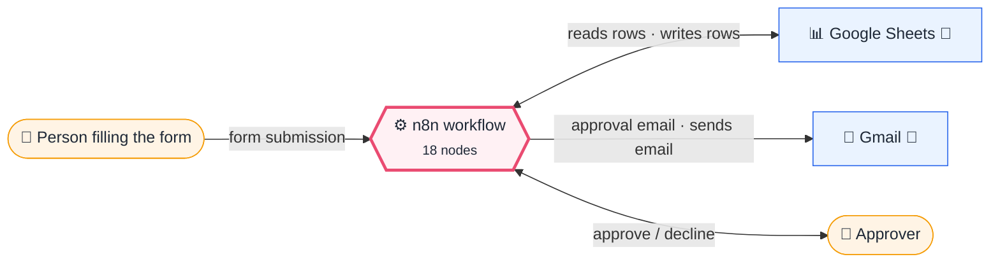
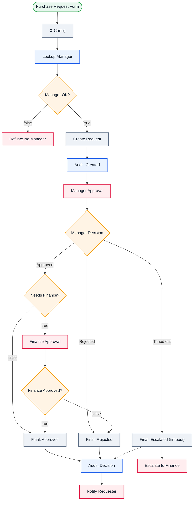

<div align="center">

# P06 · Purchase request with multi-level approval

    [](https://github.com/callme-siva/n8n-knowledge/actions/workflows/validate.yml)


</div>

> [!NOTE]
> **The real-world problem.** Every company has approval flows: purchases, leave, discounts, travel, contract exceptions. They usually run on email threads that get lost, and nobody can later say who approved what. This workflow gives you **routing by amount, timeouts with escalation, notifications and a full audit trail** without buying an approvals tool.

## 💡 Concept first

**📌 Key idea:** **Routing rules + timeouts + audit trail** make approvals trustworthy without an approvals product.

**🧠 Mental model:** A relay race: the baton (request) passes manager → finance, with a referee (timeout) and a scoreboard (audit sheet).

**🚫 When *not* to use it:** Don't model every exception as a new branch. Keep rules few and visible in the Config node.

## 🎯 What you'll learn

- Chained **Send and Wait** approvals with time limits
- A 3-way **Switch** on approved / rejected / **timed out** (missing response)
- Routing by business rule (amount > threshold → second approver)
- **Approver lookup** from a Team sheet, so requesters can't pick (or be) their own approver
- Collision-free request IDs from `$execution.id`
- An **audit trail**: upsert the same row as the status changes

## 🏗️ Architecture

**System context:** who and what this workflow talks to, and what crosses each boundary. 🔑 = needs a credential · 🧑 = a human decides.



<details><summary><b>Node-level flow</b> (every node and branch)</summary>



</details>

## ⚖️ Design decisions & trade-offs

Why it's built this way, and what it costs.

| Decision | Why | Trade-off / alternative |
|---|---|---|
| Chained Send-and-Wait approvals with **3-day limits** | Approvals can't hang forever; timeouts escalate | Email-based approvals depend on a reachable n8n (`WEBHOOK_URL`) |
| Switch on approved / rejected / **missing** decision | A timeout is a distinct outcome and must not be read as "rejected" | One more branch to design and test |
| Threshold rule in the Config node | Finance can change the policy without editing logic | More complex rule sets (per cost centre) outgrow a Set node; use a lookup sheet |
| Upsert the same audit row as status changes | One row per request = an easy audit trail and reporting | No history of intermediate states; add an append-only log if auditors need it |

## 🔑 Credentials

| You need | Where to get it |
|---|---|
| Gmail OAuth2 | [docs/credentials.md](../../docs/credentials.md) |
| Google Sheets OAuth2 | tab `Team`: email, manager_email; tab `Requests`: request_id, requester, manager, item, amount, cost_centre, justification, status, created, decided |

## 📝 Before you run it

Replace these placeholder values with your own:

| Node | Field | Placeholder |
|---|---|---|
| ⚙️ Config | `finance_email` | `you@example.com` |
| Lookup Manager | `documentId` | `PASTE_YOUR_GOOGLE_SHEET_URL` |
| Audit: Created | `documentId` | `PASTE_YOUR_GOOGLE_SHEET_URL` |
| Audit: Decision | `documentId` | `PASTE_YOUR_GOOGLE_SHEET_URL` |

Nodes that need a credential selected after import: **Gmail**, **Google Sheets**.

### 📥 Starter files

Create each tab from its template, so column names match exactly: **Google Sheets → File → Import → Upload** the CSV → *Insert new sheet(s)*. The tab takes the file's name.

| Tab | Template | Columns |
|---|---|---|
| `Requests` | [Requests.csv](../../templates/P06-purchase-approval-multilevel/Requests.csv) | `request_id`, `amount`, `cost_centre`, `created`, `item`, `justification`, `manager`, `requester`, `status`, `decided` |
| `Team` | [Team.csv](../../templates/P06-purchase-approval-multilevel/Team.csv) | `email`, `manager_email` |

<sub>Columns are generated from what this workflow actually reads and writes in the automated test, so they can't drift from the workflow.</sub>

## 🛠️ Build it step by step

> [!TIP]
> In a hurry? Import [`workflow.json`](workflow.json) (copy → paste on the n8n canvas). Learning? Build it yourself using the steps below, then compare.

1. Create the `Team` tab (one row per employee: `email`, `manager_email`) and the `Requests` tab.
2. Import it, set the finance email and threshold in Config.
3. For testing, set both approval time limits to a few minutes (Options → *Limit wait time*).
4. Submit 3 requests: $500 (manager only), $3,000 (manager + finance), one you ignore (timeout).

## 🔍 Node-by-node reference

Every node in this workflow and every setting inside it, generated from [`workflow.json`](workflow.json). Click a node to expand it.

<details><summary><b>1. Purchase Request Form</b> · <code>n8n Form Trigger</code> v2.2</summary>

> Hosts a web form; each submission starts one execution. Field labels become JSON keys.

| Property | Value |
|---|---|
| `formTitle` | Purchase request |
| `formFields.values` | Your email *, Item / service *, Amount (USD) *, Cost centre *, Justification * |

</details>

<details><summary><b>2. ⚙️ Config</b> · <code>Edit Fields (Set)</code> v3.4</summary>

> Creates, renames or overwrites fields without code.

| Property | Value |
|---|---|
| `finance_email` | you@example.com |
| `finance_threshold` | 2000 |

</details>

<details><summary><b>3. Lookup Manager</b> · <code>Google Sheets</code> v4.5</summary>

> Reads, appends or updates rows in a spreadsheet.

| Property | Value |
|---|---|
| `documentId` | PASTE_YOUR_GOOGLE_SHEET_URL |
| `sheetName` | Team |
| `filtersUI.lookupColumn` | email |
| `filtersUI.lookupValue` | `{{ $('Purchase Request Form').item.json['Your email'].trim().toLowerCase() }}` |
| `⚙️ Retry on fail` | ✅ on |
| `⚙️ Max tries` | 3 |
| `⚙️ Wait between tries (ms)` | 3000 |
| `⚙️ Always output data` | ✅ on |

</details>

<details><summary><b>4. Manager OK?</b> · <code>If</code> v2.2</summary>

> Splits items into a **true** and a **false** branch.

| Property | Value |
|---|---|
| `condition` | `{{ ($json.manager_email \|\| '').trim() }} is not empty AND {{ ($json.manager_email \|\…` |

</details>

<details><summary><b>5. Refuse: No Manager</b> · <code>Gmail</code> v2.1</summary>

> Sends, reads or labels email. `sendAndWait` pauses the workflow for a human reply.

| Property | Value |
|---|---|
| `sendTo` | `{{ $('Purchase Request Form').item.json['Your email'] }}` |
| `subject` | Purchase request not submitted |
| `emailType` | html |
| `message` | `<p>We couldn't find a manager for <b>{{ $('Purchase Request Form').item.json['Your email'] }}</b> in the Team sheet, so this request for {{ $('Purchase Request Form').item.json['Item / service'] }} was not sent for approval.</p><p>Please contact finance.</p>` |
| `appendAttribution` | off |
| `⚙️ Retry on fail` | ✅ on |
| `⚙️ Max tries` | 3 |
| `⚙️ Wait between tries (ms)` | 3000 |

</details>

<details><summary><b>6. Create Request</b> · <code>Code</code> v2</summary>

> Runs JavaScript. *Run once for all items* sees every item; *for each item* sees one at a time.

| Property | Value |
|---|---|
| `mode` | runOnceForEachItem |
| `jsCode` | (JavaScript, 5 lines, shown below) |

**Code:**

```javascript
const f = $('Purchase Request Form').item.json;
// $execution.id is unique and increasing, so IDs never collide and sort in order.
const id = 'PR-' + $now.toFormat('yyMMdd') + '-' + $execution.id;
return { json: { request_id: id, requester: f['Your email'].trim().toLowerCase(), manager: $json.manager_email.trim().toLowerCase(), item: f['Item / service'], amount: Number(f['Amount (USD)']),
  cost_centre: f['Cost centre'], justification: f['Justification'], status: 'pending_manager', created: $now.toISO() } };
```

</details>

<details><summary><b>7. Audit: Created</b> · <code>Google Sheets</code> v4.5</summary>

> Reads, appends or updates rows in a spreadsheet.

| Property | Value |
|---|---|
| `operation` | appendOrUpdate |
| `documentId` | PASTE_YOUR_GOOGLE_SHEET_URL |
| `sheetName` | Requests |
| `columns.mappingMode` | autoMapInputData |
| `columns.matchingColumns` | request_id |
| `⚙️ Retry on fail` | ✅ on |
| `⚙️ Max tries` | 3 |
| `⚙️ Wait between tries (ms)` | 3000 |

</details>

<details><summary><b>8. Manager Approval</b> · <code>Gmail</code> v2.1</summary>

> Sends, reads or labels email. `sendAndWait` pauses the workflow for a human reply.

| Property | Value |
|---|---|
| `operation` | sendAndWait |
| `sendTo` | `{{ $('Create Request').item.json.manager }}` |
| `subject` | `Approve {{ $('Create Request').item.json.request_id }} (${{ $('Create Request').item.json.amount }})?` |
| `message` | `<p><b>{{ $('Create Request').item.json.request_id }}</b>: {{ $('Create Request').item.json.item }}</p><p>Amount: <b>${{ $('Create Request').item.json.amount.toLocaleString('en-US') }}</b> · {{ $('Create Request').item.json.cost_centre }}</p><p>Requested by {{ $('Create Request').item.json.requester }}</p><blockquote>{{ $('Create Request').item.json.justification }}</blockquote>` |
| `approvalOptions.approvalType` | double |
| `limitWaitTime.limitType` | afterTimeInterval |
| `limitWaitTime.resumeAmount` | 3 |
| `limitWaitTime.resumeUnit` | days |

</details>

<details><summary><b>9. Manager Decision</b> · <code>Switch</code> v3.2</summary>

> Routes items to one of many named outputs.

| Property | Value |
|---|---|
| `rule 1.condition` | `{{ $json.data?.approved }} is true` |
| `rule 1.renameOutput` | ✅ on |
| `rule 1.outputKey` | Approved |
| `rule 2.condition` | `{{ $json.data?.approved }} is false` |
| `rule 2.renameOutput` | ✅ on |
| `rule 2.outputKey` | Rejected |
| `fallbackOutput` | extra |
| `renameFallbackOutput` | Timed out |

</details>

<details><summary><b>10. Needs Finance?</b> · <code>If</code> v2.2</summary>

> Splits items into a **true** and a **false** branch.

| Property | Value |
|---|---|
| `condition` | `{{ $('Create Request').item.json.amount }} > {{ $('⚙️ Config').item.json.finance_thresh…` |

</details>

<details><summary><b>11. Finance Approval</b> · <code>Gmail</code> v2.1</summary>

> Sends, reads or labels email. `sendAndWait` pauses the workflow for a human reply.

| Property | Value |
|---|---|
| `operation` | sendAndWait |
| `sendTo` | `{{ $('⚙️ Config').item.json.finance_email }}` |
| `subject` | `Finance approval: {{ $('Create Request').item.json.request_id }} (${{ $('Create Request').item.json.amount }})` |
| `message` | `<p><b>{{ $('Create Request').item.json.request_id }}</b>: {{ $('Create Request').item.json.item }}</p><p>Amount: <b>${{ $('Create Request').item.json.amount.toLocaleString('en-US') }}</b> · {{ $('Create Request').item.json.cost_centre }}</p><p>Requested by {{ $('Create Request').item.json.requester }}</p><blockquote>{{ $('Create Request').item.json.justification }}</blockquote><p>✅ Manager approved.</p>` |
| `approvalOptions.approvalType` | double |
| `limitWaitTime.limitType` | afterTimeInterval |
| `limitWaitTime.resumeAmount` | 3 |
| `limitWaitTime.resumeUnit` | days |

</details>

<details><summary><b>12. Finance Approved?</b> · <code>If</code> v2.2</summary>

> Splits items into a **true** and a **false** branch.

| Property | Value |
|---|---|
| `condition` | `{{ $json.data?.approved }} is true` |

</details>

<details><summary><b>13. Final: Approved</b> · <code>Edit Fields (Set)</code> v3.4</summary>

> Creates, renames or overwrites fields without code.

| Property | Value |
|---|---|
| `request_id` | `{{ $('Create Request').item.json.request_id }}` |
| `requester` | `{{ $('Create Request').item.json.requester }}` |
| `status` | approved |
| `decided` | `{{ $now.toISO() }}` |

</details>

<details><summary><b>14. Final: Rejected</b> · <code>Edit Fields (Set)</code> v3.4</summary>

> Creates, renames or overwrites fields without code.

| Property | Value |
|---|---|
| `request_id` | `{{ $('Create Request').item.json.request_id }}` |
| `requester` | `{{ $('Create Request').item.json.requester }}` |
| `status` | rejected |
| `decided` | `{{ $now.toISO() }}` |

</details>

<details><summary><b>15. Final: Escalated (timeout)</b> · <code>Edit Fields (Set)</code> v3.4</summary>

> Creates, renames or overwrites fields without code.

| Property | Value |
|---|---|
| `request_id` | `{{ $('Create Request').item.json.request_id }}` |
| `requester` | `{{ $('Create Request').item.json.requester }}` |
| `status` | timed_out |
| `decided` | `{{ $now.toISO() }}` |

</details>

<details><summary><b>16. Audit: Decision</b> · <code>Google Sheets</code> v4.5</summary>

> Reads, appends or updates rows in a spreadsheet.

| Property | Value |
|---|---|
| `operation` | appendOrUpdate |
| `documentId` | PASTE_YOUR_GOOGLE_SHEET_URL |
| `sheetName` | Requests |
| `columns.mappingMode` | autoMapInputData |
| `columns.matchingColumns` | request_id |
| `⚙️ Retry on fail` | ✅ on |
| `⚙️ Max tries` | 3 |
| `⚙️ Wait between tries (ms)` | 3000 |

</details>

<details><summary><b>17. Notify Requester</b> · <code>Gmail</code> v2.1</summary>

> Sends, reads or labels email. `sendAndWait` pauses the workflow for a human reply.

| Property | Value |
|---|---|
| `sendTo` | `{{ $('Create Request').item.json.requester }}` |
| `subject` | `{{ $('Create Request').item.json.request_id }}: {{ $json.status.replace('_', ' ') }}` |
| `emailType` | html |
| `message` | `<p>Your purchase request <b>{{ $('Create Request').item.json.request_id }}</b> for {{ $('Create Request').item.json.item }} is now <b>{{ $json.status.replace('_', ' ') }}</b>.</p>{{ $json.status === 'timed_out' ? '<p>Your manager did not respond in 3 days, so this has been escalated to finance.</p>' : '' }}` |
| `appendAttribution` | off |
| `⚙️ Retry on fail` | ✅ on |
| `⚙️ Max tries` | 3 |
| `⚙️ Wait between tries (ms)` | 3000 |

</details>

<details><summary><b>18. Escalate to Finance</b> · <code>Gmail</code> v2.1</summary>

> Sends, reads or labels email. `sendAndWait` pauses the workflow for a human reply.

| Property | Value |
|---|---|
| `sendTo` | `{{ $('⚙️ Config').item.json.finance_email }}` |
| `subject` | `⏰ No manager response on {{ $('Create Request').item.json.request_id }}` |
| `emailType` | html |
| `message` | `<p>Manager {{ $('Create Request').item.json.manager }} didn't respond in 3 days.</p>` |
| `appendAttribution` | off |
| `⚙️ Retry on fail` | ✅ on |
| `⚙️ Max tries` | 3 |
| `⚙️ Wait between tries (ms)` | 3000 |

</details>

> [!TIP]
> ⚙️ rows come from each node's **Settings** tab, not its Parameters tab. `{{ … }}` values are **expressions** evaluated at run time. See [workflow anatomy](../../docs/workflow-anatomy.md) for what every property means.

## ✅ Test it

> [!TIP]
> **Automated end-to-end test: passed.** 14/18 nodes executed in real n8n (9 credentialed or AI nodes replaced by fixtures, so AI output itself isn't tested), 4 behaviour checks. See [tests/](../../tests/README.md).

- [ ] Submit from an email that isn't in `Team`, or whose manager_email is itself: the request is refused, no approval is sent.
- [ ] Each request's row goes from `pending_manager` to its final status.
- [ ] The requester gets exactly one final email.

## 🧯 Troubleshooting

Problems specific to this workflow are below. For general ones (expressions, items, triggers, AI), see [common mistakes](../../docs/common-mistakes.md).

<details><summary><b>Buttons in the email show an error page</b></summary>

Approval links call your n8n. It must be reachable (set `WEBHOOK_URL`).

</details>

<details><summary><b>Timeout path never runs</b></summary>

It only runs after the wait limit. Check *Limit wait time* is on for both approvals.

</details>

## 🏋️ Practice

Try each challenge **before** opening the hint. Solutions show the exact expressions and code.

**⭐ Challenge 1:** Make the finance threshold depend on the **cost centre**.

<details><summary>💡 Hint</summary>

Replace the single number with a lookup.

</details>
<details><summary>✅ Solution</summary>

In ⚙️ Config, store `thresholds = {"Engineering": 200000, "Sales": 50000, "default": 100000}` (type Object). IF: `{{ amount > ($('⚙️ Config').item.json.thresholds[cost_centre] ?? $('⚙️ Config').item.json.thresholds.default) }}`.

</details>

**⭐⭐ Challenge 2:** Add a **reason** field when someone rejects.

<details><summary>💡 Hint</summary>

Use a custom-form response in Send and Wait.

</details>
<details><summary>✅ Solution</summary>

Change the approvals to **Response type: Custom form** with a dropdown (Approve / Reject) and a textarea *Reason*. Route on the dropdown value, write `reason` to the audit row, and include it in the requester's email.

</details>

## 🚀 Ideas to extend it

- Use Slack *Send and wait* instead of email for faster approvals.
- Create the PO in your ERP on approval.
- A weekly report of pending requests older than 5 days.

---

<p align="center"><a href="../P05-bulk-ai-enrichment-checkpointed/README.md">← P05 · Bulk AI enrichment of 1,000s of rows</a> &nbsp;·&nbsp; <a href="../../README.md#-the-learning-path">📚 All lessons</a> &nbsp;·&nbsp; <a href="../P07-employee-onboarding-orchestrator/README.md">P07 · Employee onboarding orchestrator →</a></p>
