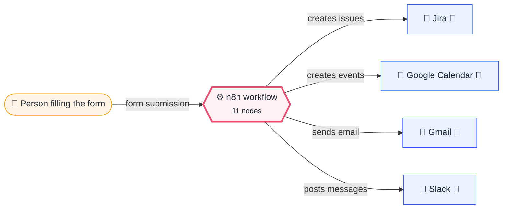
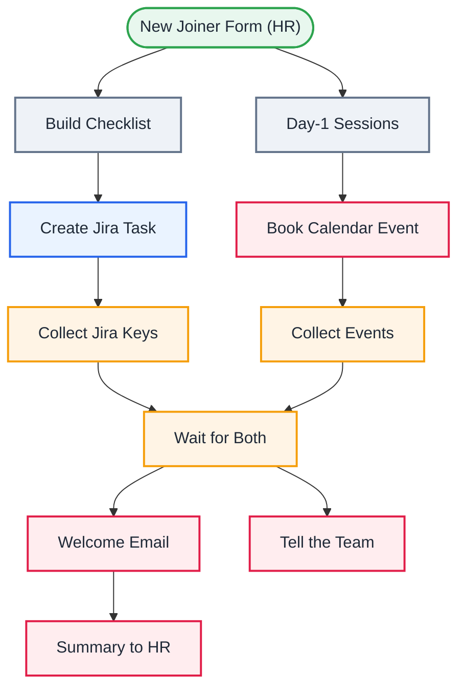

<div align="center">

# P07 · Employee onboarding orchestrator

    [](https://github.com/callme-siva/n8n-knowledge/actions/workflows/validate.yml)


</div>

> [!NOTE]
> **The real-world problem.** A bad first day (no laptop, no accounts, nobody expecting you) is the number-one cause of early attrition. Onboarding touches HR, IT, the manager and the team, so it's a classic **orchestration** problem: one trigger fans out to many systems, and a summary brings it back together.

## 💡 Concept first

**📌 Key idea:** **Fan-out / fan-in**: one trigger starts parallel branches; Merge waits for all of them before the summary.

**🧠 Mental model:** A wedding planner who calls caterer, florist and venue in parallel, then confirms with the couple once all say yes.

**🚫 When *not* to use it:** Don't Merge branches that may produce 0 items. Aggregate first, so each branch returns exactly one item.

## 🎯 What you'll learn

- **Fan-out / fan-in**: two parallel branches joined by **Merge** (combine by position)
- Role-specific checklists generated from data
- **Aggregate** many created items back into one list of keys/links
- Google Calendar *create event* with attendees
- Referring to the trigger from anywhere with `$('…').first()`

## 🏗️ Architecture

**System context:** who and what this workflow talks to, and what crosses each boundary. 🔑 = needs a credential · 🧑 = a human decides.



<details><summary><b>Node-level flow</b> (every node and branch)</summary>



</details>

<details><summary>Plain-text flow</summary>

```
HR form ─┬→ Build checklist (role-based) → Jira create ×N → aggregate keys ─┐
          └→ Day-1 sessions → Calendar create ×4 → aggregate links ──────┴→ Merge → Welcome email → HR summary
                                                                                  └→ Slack announcement
```

</details>

## ⚖️ Design decisions & trade-offs

Why it's built this way, and what it costs.

| Decision | Why | Trade-off / alternative |
|---|---|---|
| Checklist generated from data (common + per-role tasks) | HR edits a list, not a workflow; new roles are one line | Lives in code for now; a sheet makes it fully no-code |
| Two parallel branches joined by Merge (combine by position) | Jira and Calendar don't depend on each other, so run them in parallel | Each branch must output exactly one item (hence Aggregate) |
| Welcome email **after** tasks and events exist | The summary can include real links, and nothing is announced that failed | If Jira is down, the welcome waits. Add Retry on Fail and the error workflow |
| Session times built in the workflow timezone | 10:00 must mean 10:00 for the team, not UTC | Distributed teams need per-person timezones |

## 🔑 Credentials

| You need | Where to get it |
|---|---|
| Jira Software Cloud API token | [docs/credentials.md](../../docs/credentials.md) |
| Google Calendar OAuth2 | [docs/credentials.md](../../docs/credentials.md) |
| Gmail OAuth2 | [docs/credentials.md](../../docs/credentials.md) |
| Slack API | [docs/credentials.md](../../docs/credentials.md) |

## 📝 Before you run it

Replace these placeholder values with your own:

| Node | Field | Placeholder |
|---|---|---|
| Create Jira Task | `project` | `REPLACE_PROJECT_ID` |
| Create Jira Task | `issueType` | `REPLACE_TASK_ISSUE_TYPE_ID` |
| Summary to HR | `sendTo` | `you@example.com` |

Nodes that need a credential selected after import: **Gmail**, **Jira Software**.

## 🛠️ Build it step by step

> [!TIP]
> In a hurry? Import [`workflow.json`](workflow.json) (copy → paste on the n8n canvas). Learning? Build it yourself using the steps below, then compare.

1. Set the Jira project/issue type IDs.
2. Connect the credentials. The calendar is `primary` of the HR account.
3. Submit the form with **your own** email as the personal and manager emails, and a start date next week.

## 🔍 Node-by-node reference

Every node in this workflow and every setting inside it, generated from [`workflow.json`](workflow.json). Click a node to expand it.

<details><summary><b>1. New Joiner Form (HR)</b> · <code>n8n Form Trigger</code> v2.2</summary>

> Hosts a web form; each submission starts one execution. Field labels become JSON keys.

| Property | Value |
|---|---|
| `formTitle` | New joiner |
| `formFields.values` | Full name *, Personal email *, Role *, Start date *, Manager email *, Team Slack channel |

</details>

<details><summary><b>2. Build Checklist</b> · <code>Code</code> v2</summary>

> Runs JavaScript. *Run once for all items* sees every item; *for each item* sees one at a time.

| Property | Value |
|---|---|
| `jsCode` | (JavaScript, 4 lines, shown below) |

**Code:**

```javascript
const f = $input.first().json;
const common = [['IT', 'Laptop + accessories ready'], ['IT', 'Google Workspace account + 2FA'], ['HR', 'Offer letter, NDA, PF/ESI forms signed'], ['Manager', 'Assign onboarding buddy'], ['Manager', '30-60-90 day plan shared']];
const byRole = { Engineer: [['IT', 'GitHub org + SSO access'], ['Manager', 'First good-first-issue ticket']], Sales: [['IT', 'CRM seat'], ['Manager', 'Shadow 3 customer calls']], Designer: [['IT', 'Figma seat'], ['Manager', 'Design system walkthrough']], Operations: [['IT', 'ERP access'], ['Manager', 'Process docs walkthrough']] };
return [...common, ...(byRole[f.Role] || [])].map(([owner, task]) => ({ json: { owner, task, name: f['Full name'], role: f.Role, start: f['Start date'] } }));
```

</details>

<details><summary><b>3. Create Jira Task</b> · <code>Jira Software</code> v1</summary>

> Creates, searches or updates Jira issues.

| Property | Value |
|---|---|
| `project` | REPLACE_PROJECT_ID |
| `issueType` | REPLACE_TASK_ISSUE_TYPE_ID |
| `summary` | `[Onboarding · {{ $json.name }}] {{ $json.owner }}: {{ $json.task }}` |
| `additionalFields.description` | `New joiner {{ $json.name }} ({{ $json.role }}) starts {{ $json.start }}. Please complet…` |
| `additionalFields.labels` | onboarding |
| `⚙️ Retry on fail` | ✅ on |

</details>

<details><summary><b>4. Collect Jira Keys</b> · <code>aggregate</code> v1</summary>


| Property | Value |
|---|---|
| `aggregate` | aggregateIndividualFields |
| `fieldsToAggregate.fieldToAggregate.fieldToAggregate` | key |

</details>

<details><summary><b>5. Day-1 Sessions</b> · <code>Code</code> v2</summary>

> Runs JavaScript. *Run once for all items* sees every item; *for each item* sees one at a time.

| Property | Value |
|---|---|
| `jsCode` | (JavaScript, 5 lines, shown below) |

**Code:**

```javascript
const f = $('New Joiner Form (HR)').first().json;
// Build times in the workflow timezone so a 10:00 session is 10:00 for the team, not 10:00 UTC.
const at = (h, m) => DateTime.fromISO(String(f['Start date']).slice(0, 10), { zone: $now.zoneName }).set({ hour: h, minute: m }).toISO();
return [['Welcome & company intro', 10, 0, 45], ['IT setup', 11, 0, 60], ['Lunch with the team', 13, 0, 60], ['1:1 with manager', 16, 0, 30]]
  .map(([t, h, m, dur]) => ({ json: { title: `${t}: ${f['Full name']}`, start: at(h, m), end: DateTime.fromISO(at(h, m)).plus({ minutes: dur }).toISO(), attendee: f['Manager email'] } }));
```

</details>

<details><summary><b>6. Book Calendar Event</b> · <code>googleCalendar</code> v1.3</summary>


| Property | Value |
|---|---|
| `calendar` | primary |
| `start` | `{{ $json.start }}` |
| `end` | `{{ $json.end }}` |
| `additionalFields.summary` | `{{ $json.title }}` |
| `additionalFields.attendees` | `{{ $json.attendee }}` |
| `⚙️ Retry on fail` | ✅ on |
| `⚙️ Max tries` | 3 |
| `⚙️ Wait between tries (ms)` | 3000 |

</details>

<details><summary><b>7. Collect Events</b> · <code>aggregate</code> v1</summary>


| Property | Value |
|---|---|
| `aggregate` | aggregateIndividualFields |
| `fieldsToAggregate.fieldToAggregate.fieldToAggregate` | htmlLink |

</details>

<details><summary><b>8. Wait for Both</b> · <code>Merge</code> v3</summary>

> Waits for several inputs and combines them into one stream.

| Property | Value |
|---|---|
| `mode` | combine |
| `combineBy` | combineByPosition |

</details>

<details><summary><b>9. Welcome Email</b> · <code>Gmail</code> v2.1</summary>

> Sends, reads or labels email. `sendAndWait` pauses the workflow for a human reply.

| Property | Value |
|---|---|
| `sendTo` | `{{ $('New Joiner Form (HR)').first().json['Personal email'] }}` |
| `subject` | `Welcome aboard, {{ $('New Joiner Form (HR)').first().json['Full name'].split(' ')[0] }}! 🎉` |
| `emailType` | html |
| `message` | `<p>We're thrilled you're joining us on <b>{{ $('New Joiner Form (HR)').first().json['Start date'] }}</b>.</p><p>Day 1: 10:00 welcome, 11:00 IT setup, 13:00 team lunch, 16:00 1:1 with your manager.</p><p>Bring a government ID and your bank details for payroll. See you soon!</p>` |
| `appendAttribution` | off |
| `⚙️ Retry on fail` | ✅ on |
| `⚙️ Max tries` | 3 |
| `⚙️ Wait between tries (ms)` | 3000 |

</details>

<details><summary><b>10. Tell the Team</b> · <code>slack</code> v2.3</summary>


| Property | Value |
|---|---|
| `select` | channel |
| `channelId` | `{{ $('New Joiner Form (HR)').first().json['Team Slack channel'] \|\| '#general' }}` |
| `text` | `:wave: Please welcome *{{ $('New Joiner Form (HR)').first().json['Full name'] }}* ({{ $('New Joiner Form (HR)').first().json.Role }}) joining on {{ $('New Joiner Form (HR)').first().json['Start date'] }}!` |
| `⚙️ Retry on fail` | ✅ on |
| `⚙️ Max tries` | 3 |
| `⚙️ Wait between tries (ms)` | 3000 |

</details>

<details><summary><b>11. Summary to HR</b> · <code>Gmail</code> v2.1</summary>

> Sends, reads or labels email. `sendAndWait` pauses the workflow for a human reply.

| Property | Value |
|---|---|
| `sendTo` | you@example.com |
| `subject` | `Onboarding ready: {{ $('New Joiner Form (HR)').first().json['Full name'] }}` |
| `emailType` | html |
| `message` | `<p>Jira tasks: {{ $('Wait for Both').first().json.key.join(', ') }}</p><p>Calendar: {{ $('Wait for Both').first().json.htmlLink.length }} events booked.</p>` |
| `appendAttribution` | off |
| `⚙️ Retry on fail` | ✅ on |
| `⚙️ Max tries` | 3 |
| `⚙️ Wait between tries (ms)` | 3000 |

</details>

> [!TIP]
> ⚙️ rows come from each node's **Settings** tab, not its Parameters tab. `{{ … }}` values are **expressions** evaluated at run time. See [workflow anatomy](../../docs/workflow-anatomy.md) for what every property means.

## ✅ Test it

> [!TIP]
> **Automated end-to-end test: passed.** 11/11 nodes executed in real n8n (6 credentialed or AI nodes replaced by fixtures, so AI output itself isn't tested), 3 behaviour checks. See [tests/](../../tests/README.md).

- [ ] 7 Jira tasks, 4 calendar events, a welcome email, a Slack post and an HR summary.
- [ ] Try each role and check the checklists differ.

## 🧯 Troubleshooting

Problems specific to this workflow are below. For general ones (expressions, items, triggers, AI), see [common mistakes](../../docs/common-mistakes.md).

<details><summary><b>Merge outputs nothing</b></summary>

Both branches must produce exactly one item (that's what the Aggregate nodes are for).

</details>

<details><summary><b>Calendar times wrong</b></summary>

Set the workflow timezone; the Code builds times in the server's timezone.

</details>

## 🏋️ Practice

Try each challenge **before** opening the hint. Solutions show the exact expressions and code.

**⭐ Challenge 1:** Add a **Designer** checklist item: *"Invite to design critique"*.

<details><summary>💡 Hint</summary>

The checklist is data inside *Build Checklist*.

</details>
<details><summary>✅ Solution</summary>

Add `['Manager', 'Invite to design critique']` to `byRole.Designer`. No wiring changes: the Jira and aggregation steps adapt to any count.

</details>

**⭐⭐ Challenge 2:** Send a **day-30 check-in survey** to the new joiner.

<details><summary>💡 Hint</summary>

Long wait → form link.

</details>
<details><summary>✅ Solution</summary>

After *Summary to HR*, add **Wait → At specified time**: `{{ DateTime.fromISO($('New Joiner Form (HR)').first().json['Start date']).plus({ days: 30 }).set({ hour: 10 }) }}` → Gmail with a link to an n8n Form (*"How's it going?"*) that writes to a sheet.

</details>

## 🚀 Ideas to extend it

- Offboarding mirror workflow (revoke access, collect laptop).
- Day-30 check-in survey with a Wait node.
- Create the Google Workspace account via the Admin API.

---

<p align="center"><a href="../P06-purchase-approval-multilevel/README.md">← P06 · Purchase request with multi-level approval, timeouts and audit trail</a> &nbsp;·&nbsp; <a href="../../README.md#-the-learning-path">📚 All lessons</a> &nbsp;·&nbsp; <a href="../P08-sheets-jira-sync-hashing/README.md">P08 · Two-system sync: Google Sheets backlog → Jira →</a></p>
