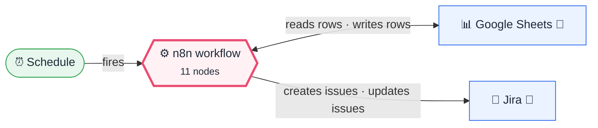
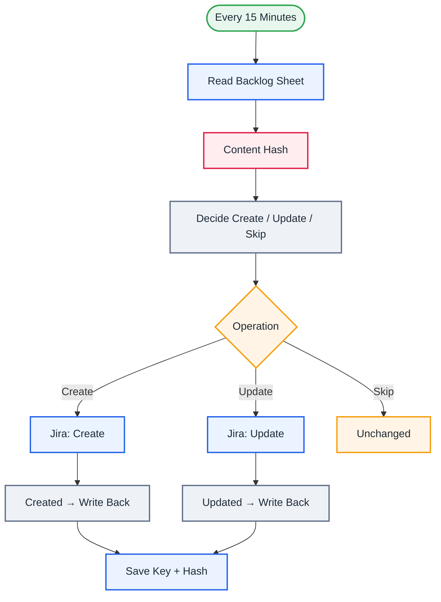

<div align="center">

# P08 · Sheets → Jira sync with change detection

    [](https://github.com/callme-siva/n8n-knowledge/actions/workflows/validate.yml)


</div>

> [!NOTE]
> **The real-world problem.** Product owners and business stakeholders live in spreadsheets; engineering lives in Jira. Copying between them by hand causes drift and duplicates. A proper **sync** needs three things beginners miss: a stable ID for each row, writing the created ID back, and **change detection** so unchanged rows aren't hammered every 15 minutes.

## 💡 Concept first

**📌 Key idea:** **Idempotent one-way sync**: create when there's no key, update when the hash changed, otherwise skip, and write the key back.

**🧠 Mental model:** A librarian who stamps each book with a catalogue number and only re-files books whose cover changed.

**🚫 When *not* to use it:** Don't start with two-way sync. Conflicts (both sides edited) need rules you must design first.

## 🎯 What you'll learn

- **Idempotent sync** design: create when there's no key, update when the content changed, otherwise skip
- **Crypto → SHA-256** content hash as a cheap change detector
- Writing external IDs back to the source (upsert by `row_id`)
- Jira *update issue*
- Why syncing one way is far simpler than two-way (and what two-way needs)

## 🏗️ Architecture

**System context:** who and what this workflow talks to, and what crosses each boundary. 🔑 = needs a credential · 🧑 = a human decides.



<details><summary><b>Node-level flow</b> (every node and branch)</summary>



</details>

<details><summary>Plain-text flow</summary>

```
Schedule 15m → Sheets read → SHA-256(summary, description, priority) → Code op → Switch
  ├ create → Jira create → set key+hash ┐
  ├ update → Jira update → set key+hash ┴→ Sheets upsert by row_id
  └ skip
```

</details>

## ⚖️ Design decisions & trade-offs

Why it's built this way, and what it costs.

| Decision | Why | Trade-off / alternative |
|---|---|---|
| One-way sync (Sheet → Jira) | One source of truth avoids conflict resolution entirely | Edits made in Jira are overwritten on the next change in the sheet |
| SHA-256 hash of business fields as change detector | Cheap, deterministic, no timestamps or history needed | Hash only business fields; including volatile ones causes endless updates |
| Write `jira_key` + `sync_hash` back to the sheet | Makes the sync idempotent and restartable | Users can break it by deleting the key. Protect those columns |
| Stable `row_id` as the upsert key | Row numbers shift when people sort; IDs don't | Someone must create IDs (a formula or a form) |

## 🔑 Credentials

| You need | Where to get it |
|---|---|
| Google Sheets OAuth2 (tab `Backlog` | row_id, summary, description, priority, jira_key, sync_hash, synced_at) |
| Jira Software Cloud API token | [docs/credentials.md](../../docs/credentials.md) |

## 📝 Before you run it

Replace these placeholder values with your own:

| Node | Field | Placeholder |
|---|---|---|
| Read Backlog Sheet | `documentId` | `PASTE_YOUR_GOOGLE_SHEET_URL` |
| Jira: Create | `project` | `REPLACE_PROJECT_ID` |
| Jira: Create | `issueType` | `REPLACE_STORY_ISSUE_TYPE_ID` |
| Save Key + Hash | `documentId` | `PASTE_YOUR_GOOGLE_SHEET_URL` |

Nodes that need a credential selected after import: **Google Sheets**, **Jira Software**.

### 📥 Starter files

Create each tab from its template, so column names match exactly: **Google Sheets → File → Import → Upload** the CSV → *Insert new sheet(s)*. The tab takes the file's name.

| Tab | Template | Columns |
|---|---|---|
| `Backlog` | [Backlog.csv](../../templates/P08-sheets-jira-sync-hashing/Backlog.csv) | `row_id`, `description`, `jira_key`, `priority`, `summary`, `sync_hash`, `synced_at` |

<sub>Columns are generated from what this workflow actually reads and writes in the automated test, so they can't drift from the workflow.</sub>

## 🛠️ Build it step by step

> [!TIP]
> In a hurry? Import [`workflow.json`](workflow.json) (copy → paste on the n8n canvas). Learning? Build it yourself using the steps below, then compare.

1. Create the `Backlog` tab with 5 rows (unique `row_id`s, empty `jira_key`).
2. Set the Jira IDs, then run it. 5 issues are created and their keys written back.
3. Edit one row's description and run again: exactly **one** update.
4. Run again with no edits: nothing happens.

## 🔍 Node-by-node reference

Every node in this workflow and every setting inside it, generated from [`workflow.json`](workflow.json). Click a node to expand it.

<details><summary><b>1. Every 15 Minutes</b> · <code>Schedule Trigger</code> v1.2</summary>

> Starts the workflow on a timer or cron expression. Only fires when the workflow is **active**.

| Property | Value |
|---|---|
| `rule.interval.field` | minutes |
| `rule.interval.minutesInterval` | 15 |

</details>

<details><summary><b>2. Read Backlog Sheet</b> · <code>Google Sheets</code> v4.5</summary>

> Reads, appends or updates rows in a spreadsheet.

| Property | Value |
|---|---|
| `documentId` | PASTE_YOUR_GOOGLE_SHEET_URL |
| `sheetName` | Backlog |
| `⚙️ Retry on fail` | ✅ on |
| `⚙️ Max tries` | 3 |
| `⚙️ Wait between tries (ms)` | 3000 |

</details>

<details><summary><b>3. Content Hash</b> · <code>crypto</code> v2</summary>


| Property | Value |
|---|---|
| `action` | hash |
| `type` | SHA256 |
| `value` | `{{ JSON.stringify([$json.summary, $json.description, $json.priority]) }}` |
| `dataPropertyName` | new_hash |

</details>

<details><summary><b>4. Decide Create / Update / Skip</b> · <code>Code</code> v2</summary>

> Runs JavaScript. *Run once for all items* sees every item; *for each item* sees one at a time.

| Property | Value |
|---|---|
| `mode` | runOnceForEachItem |
| `jsCode` | (JavaScript, 4 lines, shown below) |

**Code:**

```javascript
// Sheet columns: row_id | summary | description | priority | jira_key | sync_hash | synced_at
const r = $json;
const op = !r.summary ? 'skip' : !r.jira_key ? 'create' : r.sync_hash !== r.new_hash ? 'update' : 'skip';
return { json: { ...r, op } };
```

</details>

<details><summary><b>5. Operation</b> · <code>Switch</code> v3.2</summary>

> Routes items to one of many named outputs.

| Property | Value |
|---|---|
| `rule 1.condition` | `{{ $json.op }} = create` |
| `rule 1.renameOutput` | ✅ on |
| `rule 1.outputKey` | Create |
| `rule 2.condition` | `{{ $json.op }} = update` |
| `rule 2.renameOutput` | ✅ on |
| `rule 2.outputKey` | Update |
| `fallbackOutput` | extra |
| `renameFallbackOutput` | Skip |

</details>

<details><summary><b>6. Jira: Create</b> · <code>Jira Software</code> v1</summary>

> Creates, searches or updates Jira issues.

| Property | Value |
|---|---|
| `project` | REPLACE_PROJECT_ID |
| `issueType` | REPLACE_STORY_ISSUE_TYPE_ID |
| `summary` | `{{ $json.summary }}` |
| `additionalFields.description` | `{{ $json.description }}  (synced from planning sheet, row {{ $json.row_id }})` |
| `additionalFields.labels` | from-sheet |
| `⚙️ Retry on fail` | ✅ on |

</details>

<details><summary><b>7. Jira: Update</b> · <code>Jira Software</code> v1</summary>

> Creates, searches or updates Jira issues.

| Property | Value |
|---|---|
| `operation` | update |
| `issueKey` | `{{ $json.jira_key }}` |
| `updateFields.summary` | `{{ $json.summary }}` |
| `updateFields.description` | `{{ $json.description }}  (synced from planning sheet, row {{ $json.row_id }})` |
| `⚙️ Retry on fail` | ✅ on |

</details>

<details><summary><b>8. Created → Write Back</b> · <code>Edit Fields (Set)</code> v3.4</summary>

> Creates, renames or overwrites fields without code.

| Property | Value |
|---|---|
| `row_id` | `{{ $('Operation').item.json.row_id }}` |
| `jira_key` | `{{ $json.key }}` |
| `sync_hash` | `{{ $('Operation').item.json.new_hash }}` |
| `synced_at` | `{{ $now.toISO() }}` |

</details>

<details><summary><b>9. Updated → Write Back</b> · <code>Edit Fields (Set)</code> v3.4</summary>

> Creates, renames or overwrites fields without code.

| Property | Value |
|---|---|
| `row_id` | `{{ $('Operation').item.json.row_id }}` |
| `jira_key` | `{{ $('Operation').item.json.jira_key }}` |
| `sync_hash` | `{{ $('Operation').item.json.new_hash }}` |
| `synced_at` | `{{ $now.toISO() }}` |

</details>

<details><summary><b>10. Save Key + Hash</b> · <code>Google Sheets</code> v4.5</summary>

> Reads, appends or updates rows in a spreadsheet.

| Property | Value |
|---|---|
| `operation` | appendOrUpdate |
| `documentId` | PASTE_YOUR_GOOGLE_SHEET_URL |
| `sheetName` | Backlog |
| `columns.mappingMode` | autoMapInputData |
| `columns.matchingColumns` | row_id |
| `⚙️ Retry on fail` | ✅ on |
| `⚙️ Max tries` | 3 |
| `⚙️ Wait between tries (ms)` | 3000 |

</details>

<details><summary><b>11. Unchanged</b> · <code>No Operation</code> v1</summary>

> Does nothing. Marks a branch that intentionally ends.

*No settings. This node works with its defaults.*

</details>

> [!TIP]
> ⚙️ rows come from each node's **Settings** tab, not its Parameters tab. `{{ … }}` values are **expressions** evaluated at run time. See [workflow anatomy](../../docs/workflow-anatomy.md) for what every property means.

## ✅ Test it

> [!TIP]
> **Automated end-to-end test: passed.** 11/11 nodes executed in real n8n (4 credentialed or AI nodes replaced by fixtures, so AI output itself isn't tested), 3 behaviour checks. See [tests/](../../tests/README.md).

- [ ] Delete a `jira_key` cell → it creates a new issue. Explain to your team why the key column must be protected (lock it in Sheets).

## 🧯 Troubleshooting

Problems specific to this workflow are below. For general ones (expressions, items, triggers, AI), see [common mistakes](../../docs/common-mistakes.md).

<details><summary><b>Duplicates on every run</b></summary>

The upsert matching column isn't `row_id`, or `row_id` isn't unique.

</details>

<details><summary><b>Updates every run</b></summary>

The hash inputs include a changing value (like a timestamp). Hash only the business fields.

</details>

## 🏋️ Practice

Try each challenge **before** opening the hint. Solutions show the exact expressions and code.

**⭐ Challenge 1:** Sync the **priority** field to Jira too.

<details><summary>💡 Hint</summary>

Jira priorities are objects; map names to IDs.

</details>
<details><summary>✅ Solution</summary>

Add to Jira create/update: *Priority* = a lookup `{"High": "2", "Medium": "3", "Low": "4"}[$json.priority]` (check your Jira's priority IDs via *Get priorities*). The hash already includes priority, so changes trigger updates.

</details>

**⭐⭐ Challenge 2:** Pull the **Jira status** back into a read-only sheet column.

<details><summary>💡 Hint</summary>

One-way sync in the other direction, for one field.

</details>
<details><summary>✅ Solution</summary>

Add a second schedule: Sheets read rows with `jira_key` → Jira *Get issue* per row → Set `{row_id, jira_status}` → Sheets upsert by `row_id`. Don't include `jira_status` in the hash, or you'll create an update loop.

</details>

## 🚀 Ideas to extend it

- Pull Jira status back into the sheet (read-only column).
- Make it two-way with *last-writer-wins* on `updated` timestamps. Understand the conflict cases first.

---

<p align="center"><a href="../P07-employee-onboarding-orchestrator/README.md">← P07 · Employee onboarding orchestrator</a> &nbsp;·&nbsp; <a href="../../README.md#-the-learning-path">📚 All lessons</a> &nbsp;·&nbsp; <a href="../P09-deep-research-agent/README.md">P09 · Deep research agent →</a></p>
