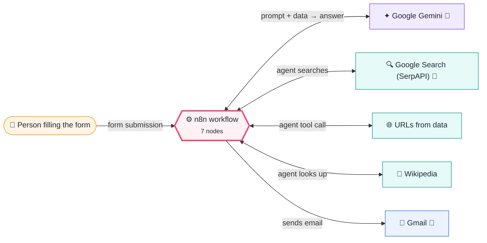
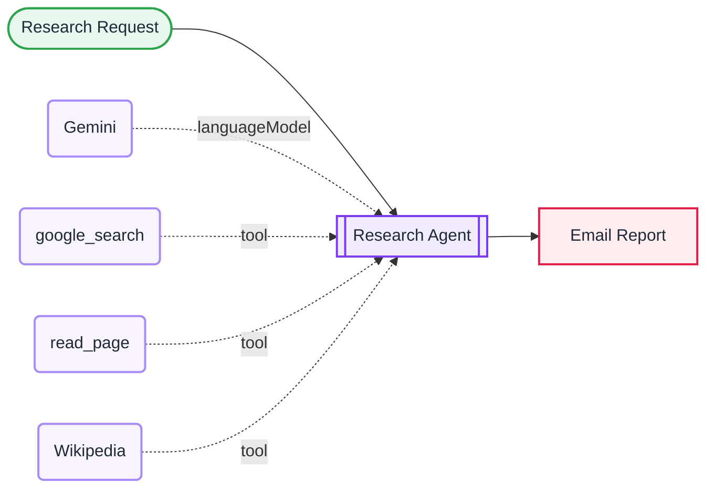

<div align="center">

# P09 · Deep research agent

    


</div>

> [!NOTE]
> **The real-world problem.** Market scans, competitor comparisons and vendor shortlists take analysts hours of searching and reading. A research agent does the first 80%: it plans sub-questions, searches, **reads the actual pages** (not just snippets), cross-checks, and writes a cited report you can verify quickly.

## 💡 Concept first

**📌 Key idea:** A research agent should **plan → search → read → cross-check → cite**, and say "not found" instead of guessing.

**🧠 Mental model:** A junior analyst who shows their sources in footnotes.

**🚫 When *not* to use it:** Don't treat the report as final. It's a first draft that saves 80% of the time, and a human checks key facts.

## 🎯 What you'll learn

- Agent planning via the system prompt (decompose → search → read → cross-check → write)
- **SerpAPI tool** for live Google results
- **HTTP Request tool** in HTML mode with `optimizeResponse` to read pages cheaply
- Citation discipline: numbered sources, "not found" instead of guessing
- `maxIterations` as a cost and loop guard

## 🏗️ Architecture

**System context:** who and what this workflow talks to, and what crosses each boundary. 🔑 = needs a credential · 🧑 = a human decides.



<details><summary><b>Node-level flow</b> (every node and branch)</summary>



</details>

<details><summary>Plain-text flow</summary>

```
Form → AI Agent ⇐ Gemini, ⇐ google_search (SerpAPI), ⇐ read_page (HTTP), ⇐ Wikipedia → Gmail report
```

</details>

## ⚖️ Design decisions & trade-offs

Why it's built this way, and what it costs.

| Decision | Why | Trade-off / alternative |
|---|---|---|
| Plan → search → read → cross-check → cite, spelled out in the system prompt | Agents perform much better with an explicit procedure | Longer prompt, more tokens per run |
| A `read_page` tool (not just search snippets) | Snippets are too thin to cite; pages carry the facts | Page reads are the main cost; capped by `maxLength` and `maxIterations` |
| "Not found" is an acceptable answer | Hallucinated sources destroy trust in the whole report | Reports can look incomplete. That's honest, and the right trade |
| Email a draft labelled "verify key facts" | Sets expectations: the agent saves time, humans stay accountable | Needs a human reviewer for anything decision-critical |

## 🔑 Credentials

| You need | Where to get it |
|---|---|
| Google Gemini API key | [docs/credentials.md](../../docs/credentials.md) |
| SerpAPI key (100 free searches a month) | [docs/credentials.md](../../docs/credentials.md) |
| Gmail OAuth2 | [docs/credentials.md](../../docs/credentials.md) |

## 📝 Before you run it

No placeholder values. It runs as-is once the credentials are connected.

Nodes that need a credential selected after import: **Gmail**, **Google Gemini Chat Model**.

## 🛠️ Build it step by step

> [!TIP]
> In a hurry? Import [`workflow.json`](workflow.json) (copy → paste on the n8n canvas). Learning? Build it yourself using the steps below, then compare.

1. Connect the Gemini, SerpAPI and Gmail credentials.
2. Open the form and ask a real question from your work.
3. Open the agent's **Logs** to watch each search and page read.

## 🔍 Node-by-node reference

Every node in this workflow and every setting inside it, generated from [`workflow.json`](workflow.json). Click a node to expand it.

<details><summary><b>1. Research Request</b> · <code>n8n Form Trigger</code> v2.2</summary>

> Hosts a web form; each submission starts one execution. Field labels become JSON keys.

| Property | Value |
|---|---|
| `formTitle` | Research request |
| `formFields.values` | Question *, Audience *, Send report to * |

</details>

<details><summary><b>2. Research Agent</b> · <code>AI Agent</code> v2.2</summary>

> An LLM that can call tools, use memory and loop until it has an answer.

| Property | Value |
|---|---|
| `promptType` | define |
| `text` | `Question: {{ $json.Question }} Audience: {{ $json.Audience }}` |
| `maxIterations` | 15 |
| `systemMessage` | `You are a meticulous research analyst. Today is {{ $now.toFormat('dd LLL yyyy') }}. Process: 1) Break the question into 3-5 sub-questions. 2) Use google_search for each. 3) Use read_page on the 3-6 most authoritative results (official sites, docs, reputable media). 4) Cross-check claims across at least two sources; note disagreements. 5) Write the report. Report format (HTML): <h2>Answer in brief</h2> 3-5 bullets · <h2>Details</h2> with sub-headings · <h2>Comparison</h2> table if relevant · <h2>Caveats</h2> · <h2>Sources</h2> numbered list of URLs. Cite inline like [1]. Never invent sources or numbers; say 'not found' instead.` |

</details>

<details><summary><b>3. Gemini</b> · <code>Google Gemini Chat Model</code> v1</summary>

> The language model plugged into a chain or agent.

| Property | Value |
|---|---|
| `modelName` | models/gemini-2.5-flash |
| `temperature` | 0.2 |

</details>

<details><summary><b>4. google_search</b> · <code>toolSerpApi</code> v1</summary>


| Property | Value |
|---|---|
| `gl` | in |
| `hl` | en |

</details>

<details><summary><b>5. read_page</b> · <code>HTTP Request Tool</code> v1.1</summary>

> Lets an agent call an API. `{placeholders}` in the URL are filled in by the model.

| Property | Value |
|---|---|
| `toolDescription` | Fetch a web page and return its readable text. Input: a full https URL from search results. |
| `url` | {url} |
| `placeholderDefinitions.name` | url |
| `placeholderDefinitions.description` | Full https URL of the page to read |
| `placeholderDefinitions.type` | string |
| `optimizeResponse` | ✅ on |
| `responseType` | html |
| `cssSelector` | body |
| `onlyContent` | ✅ on |
| `maxLength` | 6000 |

</details>

<details><summary><b>6. Wikipedia</b> · <code>Wikipedia Tool</code> v1</summary>

> Lets an agent look things up on Wikipedia.

*No settings. This node works with its defaults.*

</details>

<details><summary><b>7. Email Report</b> · <code>Gmail</code> v2.1</summary>

> Sends, reads or labels email. `sendAndWait` pauses the workflow for a human reply.

| Property | Value |
|---|---|
| `sendTo` | `{{ $('Research Request').item.json['Send report to'] }}` |
| `subject` | `Research: {{ $('Research Request').item.json.Question.slice(0, 80) }}` |
| `emailType` | html |
| `message` | `<p><i>Automated research draft. Verify key facts before acting on them.</i></p>{{ $json.output }}` |
| `appendAttribution` | off |

</details>

> [!TIP]
> ⚙️ rows come from each node's **Settings** tab, not its Parameters tab. `{{ … }}` values are **expressions** evaluated at run time. See [workflow anatomy](../../docs/workflow-anatomy.md) for what every property means.

## ✅ Test it

> [!TIP]
> **Automated end-to-end test: passed.** 3/3 nodes executed in real n8n (3 credentialed nodes replaced by realistic mocks), 0 behaviour checks. See [tests/](../../tests/README.md).

- [ ] Check 3 cited facts against their sources.
- [ ] Ask something obscure → it should say "not found" rather than invent.

## 🧯 Troubleshooting

Problems specific to this workflow are below. For general ones (expressions, items, triggers, AI), see [common mistakes](../../docs/common-mistakes.md).

<details><summary><b>Report cites pages it didn't read</b></summary>

Strengthen the rule "only cite URLs you opened with read_page" and lower the temperature.

</details>

<details><summary><b>Token limit errors</b></summary>

Lower `maxLength` in read_page (e.g. 4000) or limit it to 4 pages.

</details>

## 🏋️ Practice

Try each challenge **before** opening the hint. Solutions show the exact expressions and code.

**⭐ Challenge 1:** Force **at least 4 distinct sources** before writing.

<details><summary>💡 Hint</summary>

Make it a rule in the system prompt and check it in code.

</details>
<details><summary>✅ Solution</summary>

Prompt: *"Do not write the report until you've read at least 4 pages from different domains."* After the agent, add a Code node that counts unique domains in the Sources list; if fewer than 4, prepend a warning to the email.

</details>

**⭐⭐ Challenge 2:** Add a **critic** agent that reviews the report before it's sent.

<details><summary>💡 Hint</summary>

A second LLM that only checks claims against the cited sources.

</details>
<details><summary>✅ Solution</summary>

After the Research Agent, add a Basic LLM Chain: *"List any sentence whose claim isn't supported by the cited URL text. Output JSON {issues: [...]}"*. Append the issues to the email as "⚠️ Reviewer notes".

</details>

## 🚀 Ideas to extend it

- Save reports to Google Docs or Notion.
- Schedule a weekly competitor scan with a fixed question list.
- Add a *critic* agent that reviews the report before sending.

---

<p align="center"><a href="../P08-sheets-jira-sync-hashing/README.md">← P08 · Two-system sync: Google Sheets backlog → Jira</a> &nbsp;·&nbsp; <a href="../../README.md#-the-learning-path">📚 All lessons</a> &nbsp;·&nbsp; <a href="../P10-mcp-server-business-tools/README.md">P10 · MCP server: expose company tools to Claude, ChatGPT & IDE agents →</a></p>
