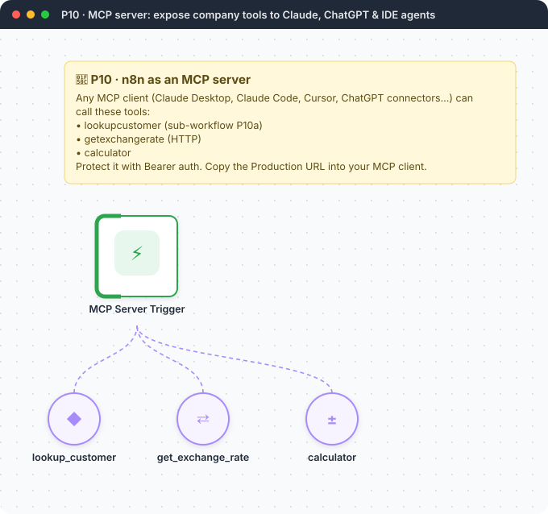
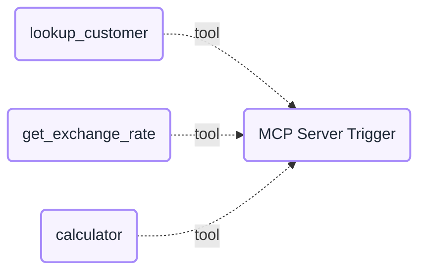

<div align="center">

# P10 · MCP server for company tools

   



</div>

> [!NOTE]
> **The real-world problem.** The **Model Context Protocol (MCP)** is how AI assistants (Claude, ChatGPT, Cursor, IDE agents) call external tools. Every company now wants its assistants to answer "what plan is this customer on?" or "raise a ticket" safely. With n8n's **MCP Server Trigger**, any workflow becomes a governed tool: authenticated, logged in Executions, and built by the ops team without a backend developer.

## 🎯 What you'll learn

- **MCP Server Trigger** with bearer authentication
- Sub-workflows as tools (**Call n8n Workflow tool**) with `$fromAI()` parameters
- Writing tool descriptions that AI clients choose correctly
- Governance: auth, least-privilege tools, and read-only by default

## 🏗️ Architecture



<details><summary>Plain-text flow</summary>

```
MCP client (Claude / Cursor / ChatGPT) ⇄ MCP Server Trigger /mcp/business-tools
    ⇐ lookup_customer → sub-workflow P10a → Sheets
    ⇐ get_exchange_rate → HTTP
    ⇐ calculator
```

</details>

## 🔑 Credentials

| You need | Where to get it |
|---|---|
| Bearer auth credential (make a long random token) | [docs/credentials.md](../../docs/credentials.md) |
| Google Sheets OAuth2 (for P10a) | [docs/credentials.md](../../docs/credentials.md) |

## 📝 Before you run it

Replace these placeholder values with your own:

| Node | Field | Placeholder |
|---|---|---|
| lookup_customer | `workflowId` | `REPLACE_WITH_P10a_WORKFLOW_ID` |

## 🛠️ Build it step by step

> [!TIP]
> In a hurry? Import [`workflow.json`](workflow.json) (copy → paste on the n8n canvas). Learning? Build it yourself using the steps below, then compare.

1. Import **P10a** first, save it, and copy its ID into *lookup_customer*.
2. Create the `Customers` tab with a few rows (use the sample leads).
3. In the MCP Server Trigger, create a **Bearer Auth** credential with a long random token.
4. **Activate** P10 and copy the *Production URL*.
5. Add it to your MCP client. Claude Code: `claude mcp add --transport http business-tools <URL> --header "Authorization: Bearer <token>"`.

## 🔍 Node-by-node reference

Every node in this workflow and every setting inside it, generated from [`workflow.json`](workflow.json). Click a node to expand it.

<details><summary><b>1. MCP Server Trigger</b> · <code>mcpTrigger</code> v2.1</summary>


| Property | Value |
|---|---|
| `authentication` | bearerAuth |
| `path` | business-tools |
| `instructions` | Company tools. Use lookup_customer for any question about a customer's plan, billing st… |

</details>

<details><summary><b>2. lookup_customer</b> · <code>toolWorkflow</code> v2.2</summary>


| Property | Value |
|---|---|
| `description` | Look up a customer by email. Returns plan, MRR, status and last ticket, or found=false. |
| `source` | database |
| `workflowId` | REPLACE_WITH_P10a_WORKFLOW_ID |
| `workflowInputs.mappingMode` | defineBelow |
| `workflowInputs.email` | `{{ $fromAI('email', 'Customer email address', 'string') }}` |
| `workflowInputs.schema.displayName` | email |
| `workflowInputs.schema.type` | string |
| `workflowInputs.schema.required` | off |
| `workflowInputs.schema.display` | ✅ on |
| `workflowInputs.schema.canBeUsedToMatch` | ✅ on |
| `workflowInputs.schema.defaultMatch` | off |
| `workflowInputs.schema.removed` | off |

</details>

<details><summary><b>3. get_exchange_rate</b> · <code>HTTP Request Tool</code> v1.1</summary>

> Lets an agent call an API. `{placeholders}` in the URL are filled in by the model.

| Property | Value |
|---|---|
| `toolDescription` | Latest exchange rates for a base currency (e.g. USD). Returns a map of currency → rate. |
| `url` | https://open.er-api.com/v6/latest/{base} |
| `placeholderDefinitions.name` | base |
| `placeholderDefinitions.description` | 3-letter ISO currency code |
| `placeholderDefinitions.type` | string |
| `optimizeResponse` | ✅ on |
| `dataField` | rates |
| `fieldsToInclude` | all |

</details>

<details><summary><b>4. calculator</b> · <code>Calculator Tool</code> v1</summary>

> Lets an agent do exact arithmetic.

*No settings. This node works with its defaults.*

</details>

> [!TIP]
> ⚙️ rows come from each node's **Settings** tab, not its Parameters tab. `{{ … }}` values are **expressions** evaluated at run time. See [workflow anatomy](../../docs/workflow-anatomy.md) for what every property means.

## ✅ Test it

- [ ] In your AI client: *"What plan is asha@finlytics.example.com on, and what's their MRR in USD?"* It should call lookup_customer, then get_exchange_rate and calculator.
- [ ] Check n8n **Executions**: each tool call is logged.

## 🧯 Troubleshooting

Problems specific to this workflow are below. For general ones (expressions, items, triggers, AI), see [common mistakes](../../docs/common-mistakes.md).

<details><summary><b>Client can't connect</b></summary>

The workflow must be active, and your client needs the **production** URL over HTTPS.

</details>

<details><summary><b>401 Unauthorized</b></summary>

The bearer token in the client must match the credential exactly.

</details>

## 🚀 Level up

- Add a `create_ticket` tool that needs human approval (L15 pattern).
- Separate read-only and write MCP servers with different tokens.
- Log every tool call to a sheet for audit.

---

<p align="center"><a href="../P09-deep-research-agent/README.md">← P09 · Deep research agent</a> &nbsp;·&nbsp; <a href="../../README.md#-the-learning-path">📚 All lessons</a> &nbsp;·&nbsp; <a href="../P11-pii-safe-ai-gateway/README.md">P11 · PII-safe AI gateway →</a></p>
